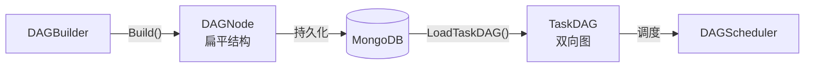

# DAG构建器设计

## 一、概述

根据子任务列表构建 DAG 图，定义节点依赖关系。

**职责边界**：
- 只关注依赖定义，不关注子任务创建（由 TaskSplitter 处理）
- 不关注存储和事件发布（由 TaskManager 处理）
- 输出的 DAGNode 结构面向持久化存储（扁平结构）

---

## 二、结构与数据模型

### 2.1 DAGNode（存储层）

DAGNode 是持久化到 MongoDB 的扁平结构，每个节点独立存储。

```go
// DAGNode 存储层结构
// MongoDB 字段映射：node_id, task_id, node_type, sub_task_ids, dependencies, status
type DAGNode struct {
    NodeId        string    // 节点唯一标识
    TaskId        string    // 所属任务ID
    NodeType      string    // 节点类型（synthesis/case/report）
    SubTaskIds    []string  // 包含的子任务ID列表
    Dependencies  []string  // 依赖的上游节点ID列表（单向引用）
    Status        int       // 节点状态（枚举值）
    CreatedAt     time.Time
    UpdatedAt     time.Time
}
```

**特点**：依赖关系通过 `Dependencies` 字段单向存储，查询下游节点需要扫描全表。

> MongoDB 表结构详见 [数据模型设计文档](../数据模型设计文档.md) dag_nodes 表。

### 2.2 BuildStrategy（策略接口）

```go
// BuildStrategy 构建策略接口
type BuildStrategy interface {
    Build(task *Task, subTasks []*SubTask) ([]*DAGNode, error)
}
```

### 2.3 DAGBuilder（构建器）

```go
type DAGBuilder struct {
    strategies map[string]BuildStrategy  // taskType → 策略
    logger     *zap.Logger
}
```

| 方法 | 说明 |
|------|------|
| RegisterStrategy(taskType, strategy) | 注册构建策略 |
| Build(task, subTasks) ([]*DAGNode, error) | 构建 DAG |

---

## 三、核心逻辑

### 3.1 Build 主流程

```go
func (b *DAGBuilder) Build(task *Task, subTasks []*SubTask) ([]*DAGNode, error) {
    // 1. 根据 task.Type 获取策略
    strategy := b.strategies[task.Type]

    // 2. 调用策略构建 DAGNode
    dagNodes := strategy.Build(task, subTasks)

    // 3. 设置节点的 taskId
    for _, node := range dagNodes {
        node.TaskId = task.TaskId
    }

    return dagNodes, nil
}
```

### 3.2 createNode（辅助方法）

```go
func createNode(nodeType string, subTaskIds []string, dependencies []string) *DAGNode {
    return &DAGNode{
        NodeId:       generateNodeId(),
        NodeType:     nodeType,
        SubTaskIds:   subTaskIds,
        Dependencies: dependencies,
        Status:       Blocked,
    }
}
```

---

## 四、扩展与集成

### 4.1 内置策略

| 任务类型 | 策略 | DAG 结构 |
|----------|------|----------|
| agent_eval | AgentEvalBuildStrategy | synthesis → case₁...caseₙ → report |
| model_eval | ModelEvalBuildStrategy | case₁...caseₙ（并行）→ report |

**AgentEval DAG 图**：

```
synthesis ──┬── case_1 ──┬── report
            ├── case_2 ──┤
            └── case_3 ──┘
```

**ModelEval DAG 图**：

```
case_1 ──┬── report
case_2 ──┤
case_3 ──┘
```

### 4.2 扩展方式

新增任务类型的步骤：

```go
// 1. 定义策略
type SafetyEvalBuildStrategy struct{}

func (s *SafetyEvalBuildStrategy) Build(task *Task, subTasks []*SubTask) ([]*DAGNode, error) {
    // 实现构建逻辑
}

// 2. 注册
builder.RegisterStrategy("safety_eval", &SafetyEvalBuildStrategy{})
```

### 4.3 与 DAGScheduler 协作



| 步骤 | 说明 | 负责模块 |
|------|------|----------|
| Build | 构建 DAGNode（扁平结构） | DAGBuilder |
| Persist | 持久化到 MongoDB | TaskManager |
| Load | 加载并构建 TaskDAG（双向图） | DAGScheduler |

---

## 五、相关文档

- [DAG调度器设计](DAG调度器设计.md) - TaskDAG 内存结构与调度
- [任务拆分器设计](任务拆分器设计.md) - 子任务创建
- [数据模型设计文档](../数据模型设计文档.md) - dag_nodes 表