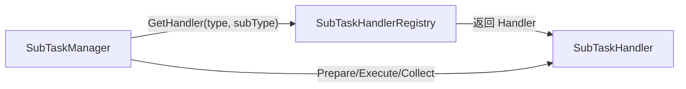
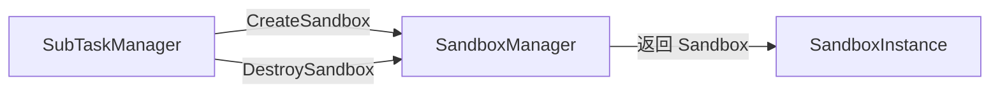
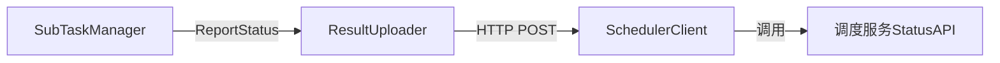

# SubTaskManager设计

## 一、概述

子任务生命周期管理，包括接收、入队、执行调度、取消处理、并发控制。

**职责边界**：
- 接收调度服务分发的子任务，入队后异步执行
- 通过 Registry 获取对应的 Handler 执行
- 不关注沙箱创建细节（由 SandboxManager 处理）
- 不关注 Handler 内部逻辑（由各 Handler 实现）

---

## 二、结构与数据模型

### 2.1 SubTaskQueue（执行队列）

```go
type SubTaskQueue struct {
    items    []*QueueItem         // 队列元素
    mutex    sync.Mutex           // 队列锁
    notEmpty chan struct{}        // 非空通知
}

type QueueItem struct {
    SubTaskId   string            // 子任务ID
    TaskId      string            // 任务ID
    Type        string            // 任务类型
    SubType     string            // 子任务类型
    Input       map[string]interface{} // 输入参数
    Extra       map[string]interface{} // 扩展字段
    SubmitTime  time.Time         // 入队时间
}
```

| 方法 | 说明 |
|------|------|
| Enqueue(item) | 入队 |
| Dequeue() (*QueueItem, error) | 出队（阻塞等待） |
| Remove(subTaskId) | 移除指定项（用于取消） |
| Size() int | 队列长度 |

### 2.2 ActiveTaskTracker（活跃任务追踪）

```go
type ActiveTaskTracker struct {
    tasks   map[string]*ActiveTask  // subTaskId → ActiveTask
    mutex   sync.RWMutex
}

type ActiveTask struct {
    SubTaskId   string
    SandboxId   string              // 当前绑定的沙箱
    CancelFunc  context.CancelFunc  // 取消函数
    StartTime   time.Time
}
```

| 方法 | 说明 |
|------|------|
| Track(subTaskId, sandboxId, cancelFunc) | 开始追踪 |
| Untrack(subTaskId) | 结束追踪 |
| Get(subTaskId) (*ActiveTask, error) | 获取活跃任务 |
| GetAll() []*ActiveTask | 获取所有活跃任务 |

### 2.3 SubTaskManager

```go
type SubTaskManager struct {
    queue             *SubTaskQueue
    registry          *SubTaskHandlerRegistry
    sandboxManager    *SandboxManager
    resultUploader    *ResultUploader

    tracker           *ActiveTaskTracker

    maxConcurrent     int               // 最大并发数
    activeCount       int32             // 当前活跃数（atomic）
    workers           int               // worker数量

    logger            *zap.Logger
    stopCh            chan struct{}
}
```

| 方法 | 说明 |
|------|------|
| ReceiveSubTask(ctx, req) error | 接收子任务入队 |
| Start(ctx) | 启动执行循环（启动多个worker） |
| Stop() | 停止执行循环 |
| ExecuteSubTask(ctx, item) error | 执行单个子任务 |
| CancelSubTask(ctx, subTaskId) error | 取消子任务 |
| GetStatus() *ManagerStatus | 获取管理器状态 |

---

## 三、核心逻辑

### 3.1 ReceiveSubTask（接收子任务）

```go
func (m *SubTaskManager) ReceiveSubTask(ctx context.Context, req *DispatchRequest) error {
    // 1. 构造队列项
    item := &QueueItem{
        SubTaskId:  req.SubTaskId,
        TaskId:     req.TaskId,
        Type:       req.Type,
        SubType:    req.SubType,
        Input:      req.Input,
        Extra:      req.Extra,
        SubmitTime: time.Now(),
    }

    // 2. 入队
    m.queue.Enqueue(item)

    // 3. 更新活跃计数（入队但未执行）
    atomic.AddInt32(&m.activeCount, 1)

    return nil
}
```

### 3.2 Start（启动执行循环）

```go
func (m *SubTaskManager) Start(ctx context.Context) {
    // 启动多个 worker goroutine
    for i := 0; i < m.workers; i++ {
        go m.workerLoop(ctx)
    }
}

func (m *SubTaskManager) workerLoop(ctx context.Context) {
    for {
        select {
        case <-m.stopCh:
            return
        case <-ctx.Done():
            return
        default:
            // 等待并发槽位
            if atomic.LoadInt32(&m.activeCount) >= int32(m.maxConcurrent) {
                time.Sleep(100 * time.Millisecond)
                continue
            }

            // 从队列获取任务
            item, err := m.queue.Dequeue()
            if err != nil {
                continue
            }

            // 执行任务
            m.ExecuteSubTask(ctx, item)
        }
    }
}
```

### 3.3 ExecuteSubTask（执行子任务）

```go
func (m *SubTaskManager) ExecuteSubTask(ctx context.Context, item *QueueItem) error {
    // 1. 创建带取消的上下文
    execCtx, cancelFunc := context.WithTimeout(ctx, m.getTimeout(item))
    defer cancelFunc()

    // 2. 创建沙箱
    sandbox, err := m.sandboxManager.CreateSandbox(execCtx, item.SubTaskId)
    if err != nil {
        m.resultUploader.ReportStatus(execCtx, item, Failed, err.Error())
        return err
    }

    // 3. 开始追踪（用于取消）
    m.tracker.Track(item.SubTaskId, sandbox.SandboxId, cancelFunc)

    // 4. 获取 Handler
    handler, err := m.registry.GetHandler(item.Type, item.SubType)
    if err != nil {
        m.sandboxManager.DestroySandbox(execCtx, sandbox)
        m.tracker.Untrack(item.SubTaskId)
        m.resultUploader.ReportStatus(execCtx, item, Failed, err.Error())
        return err
    }

    // 5. 构造 SubTask 对象
    subTask := &SubTask{
        SubTaskId: item.SubTaskId,
        TaskId:    item.TaskId,
        Type:      item.Type,
        SubType:   item.SubType,
        Input:     item.Input,
        Extra:     item.Extra,
    }

    // 6. Prepare
    if err := handler.Prepare(execCtx, sandbox, subTask); err != nil {
        m.sandboxManager.DestroySandbox(execCtx, sandbox)
        m.tracker.Untrack(item.SubTaskId)
        m.resultUploader.ReportStatus(execCtx, item, Failed, err.Error())
        return err
    }

    // 7. Execute
    execResult, err := handler.Execute(execCtx, sandbox, subTask)
    if err != nil {
        m.sandboxManager.DestroySandbox(execCtx, sandbox)
        m.tracker.Untrack(item.SubTaskId)
        m.resultUploader.ReportStatus(execCtx, item, Failed, err.Error())
        return err
    }

    // 8. Collect
    result, err := handler.Collect(execCtx, sandbox, subTask)
    if err != nil {
        m.sandboxManager.DestroySandbox(execCtx, sandbox)
        m.tracker.Untrack(item.SubTaskId)
        m.resultUploader.ReportStatus(execCtx, item, Failed, err.Error())
        return err
    }

    // 9. 上报结果
    m.resultUploader.ReportStatus(execCtx, item, Finished, result)

    // 10. 销毁沙箱
    m.sandboxManager.DestroySandbox(execCtx, sandbox)

    // 11. 结束追踪
    m.tracker.Untrack(item.SubTaskId)

    // 12. 更新活跃计数
    atomic.AddInt32(&m.activeCount, -1)

    return nil
}
```

### 3.4 CancelSubTask（取消子任务）

```go
func (m *SubTaskManager) CancelSubTask(ctx context.Context, subTaskId string) error {
    // 1. 检查是否在队列中（尚未执行）
    if m.queue.Remove(subTaskId) {
        atomic.AddInt32(&m.activeCount, -1)
        return nil
    }

    // 2. 检查是否正在执行
    activeTask, err := m.tracker.Get(subTaskId)
    if err != nil {
        return errors.New("subtask not found")
    }

    // 3. 调用取消函数
    activeTask.CancelFunc()

    // 4. 销毁沙箱
    sandbox := m.sandboxManager.GetSandbox(activeTask.SandboxId)
    if sandbox != nil {
        m.sandboxManager.DestroySandbox(ctx, sandbox)
    }

    // 5. 结束追踪
    m.tracker.Untrack(subTaskId)

    // 6. 上报取消状态
    m.resultUploader.ReportStatus(ctx, &QueueItem{SubTaskId: subTaskId}, Cancelled, "")

    // 7. 更新活跃计数
    atomic.AddInt32(&m.activeCount, -1)

    return nil
}
```

### 3.5 getTimeout（获取超时时间）

```go
func (m *SubTaskManager) getTimeout(item *QueueItem) time.Duration {
    handler, err := m.registry.GetHandler(item.Type, item.SubType)
    if err != nil {
        return 30 * time.Minute  // 默认超时
    }
    return handler.GetTimeout()
}
```

---

## 四、扩展与集成

### 4.1 与 Registry 协作



### 4.2 与 SandboxManager 协作



### 4.3 与 ResultUploader 协作



### 4.4 并发控制示意

```
maxConcurrent = 10
workers = 3

Worker-1 ──┐
Worker-2 ──┼── 共享 activeCount（atomic）
Worker-3 ──┘

流程：
1. Worker 从队列 Dequeue
2. 检查 activeCount < maxConcurrent
3. 执行任务，activeCount++
4. 任务完成，activeCount--
```

### 4.5 取消处理流程

```mermaid
flowchart TB
    CancelAPI[CancelAPI] -->|"CancelSubTask"| Manager[SubTaskManager]
    Manager -->|"检查队列"| Queue[SubTaskQueue]
    alt 在队列中
        Manager -->|"Remove"| Queue
        Manager -->|"activeCount--"| Done[完成]
    else 正在执行
        Manager -->|"Get"| Tracker[ActiveTaskTracker]
        Manager -->|"CancelFunc"| Cancel[取消上下文]
        Manager -->|"DestroySandbox"| Sandbox[SandboxManager]
        Manager -->|"Untrack"| Tracker
        Manager -->|"ReportStatus"| Upload[ResultUploader]
    end
```

---

## 五、相关文档

- [模块设计文档](../../模块设计文档.md) - SubTaskManager 职责
- [子任务处理器设计](子任务处理器设计.md) - SubTaskHandler 接口与实现
- [沙箱管理器设计](沙箱管理器设计.md) - 沙箱生命周期管理
- [结果上报器设计](结果上报器设计.md) - 结果上报逻辑