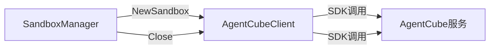
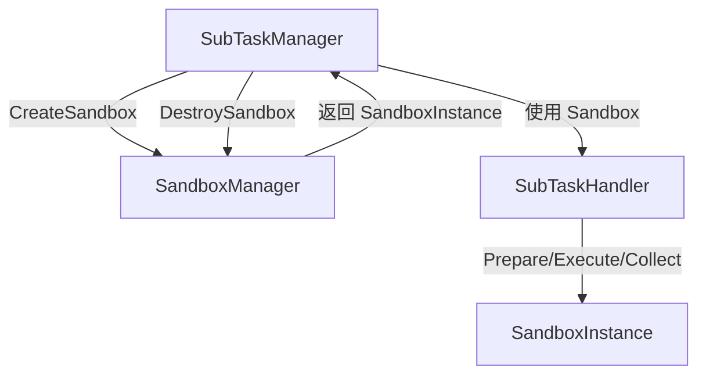
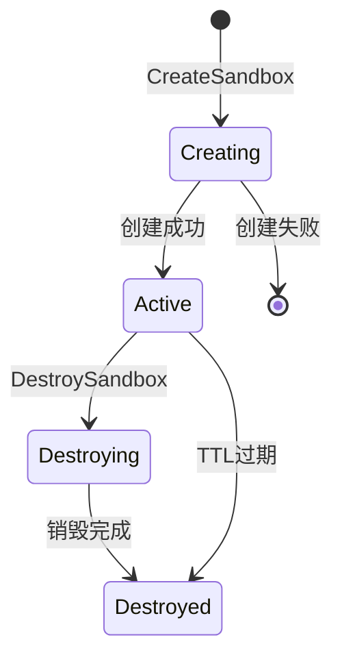

# 沙箱管理器设计

## 一、概述

管理沙箱实例的生命周期，包括创建、销毁、TTL计算、状态追踪。

**职责边界**：
- 封装 AgentCube SDK 调用，提供统一的沙箱管理接口
- 不关注命令执行、资源上传（由 SubTaskHandler 处理）
- 不关注子任务调度（由 SubTaskManager 处理）

---

## 二、结构与数据模型

### 2.1 SandboxInstance（沙箱实例）

```go
type SandboxInstance struct {
    SandboxId     string            // 沙箱唯一标识（内部为SessionID）
    SubTaskId     string            // 绑定的子任务ID
    TaskId        string            // 所属任务ID

    Sandbox       *agentcube.Sandbox // AgentCube沙箱对象
    TTL           time.Duration     // 过期时间
    CreatedAt     time.Time         // 创建时间
    Status        SandboxStatus     // 沙箱状态
}

type SandboxStatus int

const (
    SandboxCreating   = 0  // 创建中
    SandboxActive     = 1  // 活跃可用
    SandboxDestroying = 2  // 销毁中
    SandboxDestroyed  = 3  // 已销毁
)
```

### 2.2 SandboxManager

```go
type SandboxManager struct {
    client          *AgentCubeClient     // AgentCube客户端

    activeSandboxes map[string]*SandboxInstance  // sandboxId → Instance
    mutex           sync.RWMutex

    defaultTTL      time.Duration        // 默认TTL
    createTimeout   time.Duration        // 创建超时

    logger          *zap.Logger
}
```

| 方法 | 说明 |
|------|------|
| CreateSandbox(ctx, subTask) (*SandboxInstance, error) | 创建沙箱实例 |
| DestroySandbox(ctx, sandbox) error | 销毁沙箱实例 |
| GetSandbox(sandboxId) (*SandboxInstance, error) | 获取沙箱实例 |
| ListActiveSandboxes() []*SandboxInstance | 获取所有活跃沙箱 |
| calculateTTL(subTask) time.Duration | 计算沙箱TTL |

---

## 三、核心逻辑

### 3.1 CreateSandbox（创建沙箱）

```go
func (m *SandboxManager) CreateSandbox(ctx context.Context, subTask *SubTask) (*SandboxInstance, error) {
    // 1. 计算TTL
    ttl := m.calculateTTL(subTask)

    // 2. 构造沙箱选项
    opts := agentcube.SandboxOptions{
        TTL:            ttl,
        ConnectTimeout: m.createTimeout,
        Verbose:        false,
    }

    // 3. 创建沙箱（调用AgentCube SDK）
    sandbox, err := m.client.NewSandbox(ctx, opts)
    if err != nil {
        return nil, err
    }

    // 4. 构造实例对象
    instance := &SandboxInstance{
        SandboxId:  sandbox.SessionID,
        SubTaskId:  subTask.SubTaskId,
        TaskId:     subTask.TaskId,
        Sandbox:    sandbox,
        TTL:        ttl,
        CreatedAt:  time.Now(),
        Status:     SandboxActive,
    }

    // 5. 加入活跃追踪
    m.mutex.Lock()
    m.activeSandboxes[instance.SandboxId] = instance
    m.mutex.Unlock()

    return instance, nil
}
```

### 3.2 DestroySandbox（销毁沙箱）

```go
func (m *SandboxManager) DestroySandbox(ctx context.Context, sandbox *SandboxInstance) error {
    // 1. 更新状态为销毁中
    sandbox.Status = SandboxDestroying

    // 2. 调用AgentCube Close
    err := m.client.Close(ctx, sandbox.Sandbox)
    if err != nil {
        // 记录错误但继续清理
        m.logger.Warn("sandbox close failed", 
            zap.String("sandboxId", sandbox.SandboxId),
            zap.Error(err))
    }

    // 3. 更新状态为已销毁
    sandbox.Status = SandboxDestroyed

    // 4. 从活跃追踪中移除
    m.mutex.Lock()
    delete(m.activeSandboxes, sandbox.SandboxId)
    m.mutex.Unlock()

    return err
}
```

### 3.3 calculateTTL（计算TTL）

```go
func (m *SandboxManager) calculateTTL(subTask *SubTask) time.Duration {
    // 根据子任务类型确定TTL
    switch subTask.SubType {
    case "synthesis":
        return 30 * time.Minute   // 评测集合成时间较短
    case "inference":
        return 2 * time.Hour      // Agent推理执行时间较长
    case "eval":
        return 30 * time.Minute   // 评测执行时间中等
    case "report":
        return 15 * time.Minute   // 报告生成时间最短
    default:
        return m.defaultTTL       // 默认值
    }
}
```

### 3.4 GetSandbox（获取沙箱）

```go
func (m *SandboxManager) GetSandbox(sandboxId string) (*SandboxInstance, error) {
    m.mutex.RLock()
    defer m.mutex.RUnlock()

    instance, exists := m.activeSandboxes[sandboxId]
    if !exists {
        return nil, errors.New("sandbox not found")
    }
    return instance, nil
}
```

### 3.5 ListActiveSandboxes（列出活跃沙箱）

```go
func (m *SandboxManager) ListActiveSandboxes() []*SandboxInstance {
    m.mutex.RLock()
    defer m.mutex.RUnlock()

    result := make([]*SandboxInstance, 0, len(m.activeSandboxes))
    for _, instance := range m.activeSandboxes {
        if instance.Status == SandboxActive {
            result = append(result, instance)
        }
    }
    return result
}
```

---

## 四、扩展与集成

### 4.1 与 AgentCubeClient 协作



### 4.2 与 SubTaskManager 协作



### 4.3 TTL 配置策略

| 子任务类型 | 默认TTL | 理由 |
|-----------|---------|------|
| synthesis | 30min | 评测集合成相对快速 |
| inference | 2h | Agent推理可能涉及多轮交互 |
| eval | 30min | 评测计算相对固定 |
| report | 15min | 报告生成逻辑简单 |

### 4.4 错误处理策略

| 错误场景 | 处理方式 |
|---------|---------|
| 创建超时 | 返回错误，SubTaskManager上报失败 |
| 创建失败 | 返回错误，SubTaskManager上报失败 |
| 销毁失败 | 记录日志，继续清理本地状态（沙箱有TTL自动过期） |
| 沙箱不存在 | 返回错误，调用方处理 |

### 4.5 沙箱状态流转



---

## 五、相关文档

- [模块设计文档](../../模块设计文档.md) - SandboxManager 职责
- [子任务管理器设计](子任务管理器设计.md) - SubTaskManager 与 SandboxManager 协作
- [AgentCube使用说明](../../../dependencies/AgentCube使用说明.md) - AgentCube SDK 详细用法