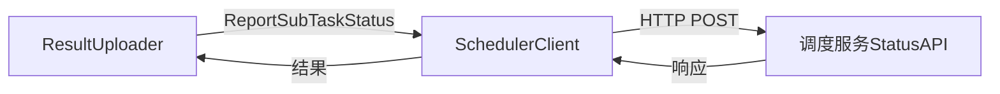

# 结果上报器设计

## 一、概述

收集子任务执行结果并上报到调度服务，支持重试策略。

**职责边界**：
- 接收 SubTaskManager 的上报请求，调用调度服务 StatusAPI
- 不关注结果文件读取细节（由 SubTaskHandler.Collect 处理）
- 不关注调度服务内部状态更新逻辑

---

## 二、结构与数据模型

### 2.1 ReportRequest（上报请求）

```go
type ReportRequest struct {
    TaskId      string           // 所属任务ID
    SubTaskId   string           // 子任务ID
    Status      int              // 子任务状态码
    Result      *SubTaskResult   // 执行结果（可选）
    RetryCount  int              // 当前重试次数
}
```

### 2.2 SubTaskResult（子任务结果）

```go
type SubTaskResult struct {
    Success     int              // 1成功 / -1失败
    Message     string           // 执行消息
    Progress    int              // 进度 0-100
    ReportURL   string           // 报告URL（可选）
    Usages      []*ModelUsage    // Token消耗统计
    OutputFiles []string         // 输出文件URL列表
}

type ModelUsage struct {
    ModelId       string         // 模型ID
    InputTokens   int64          // 输入Token数
    OutputTokens  int64          // 输出Token数
}
```

### 2.3 ResultUploader

```go
type ResultUploader struct {
    schedulerClient *SchedulerClient    // 调度服务客户端
    evalDataClient  *EvalDataClient     // 数据管理服务客户端（可选）

    maxRetry        int                 // 最大重试次数
    retryInterval   time.Duration       // 重试间隔

    logger          *zap.Logger
}
```

| 方法 | 说明 |
|------|------|
| ReportStatus(ctx, req) error | 上报子任务状态 |
| ReportSuccess(ctx, item, result) error | 上报成功状态 |
| ReportFailure(ctx, item, errMsg) error | 上报失败状态 |
| ReportCancelled(ctx, item) error | 上报取消状态 |
| retryReport(ctx, req) error | 重试上报 |

---

## 三、核心逻辑

### 3.1 ReportStatus（上报状态）

```go
func (u *ResultUploader) ReportStatus(ctx context.Context, req *ReportRequest) error {
    // 构造上报请求体
    body := map[string]interface{}{
        "task_id":     req.TaskId,
        "sub_task_id": req.SubTaskId,
        "status":      req.Status,
    }

    // 如果有结果，添加 result 字段
    if req.Result != nil {
        body["result"] = req.Result
    }

    // 调用调度服务 API
    err := u.schedulerClient.ReportSubTaskStatus(ctx, body)
    if err != nil {
        // 上报失败，尝试重试
        return u.retryReport(ctx, req)
    }

    return nil
}
```

### 3.2 ReportSuccess（上报成功）

```go
func (u *ResultUploader) ReportSuccess(ctx context.Context, item *QueueItem, result *SubTaskResult) error {
    req := &ReportRequest{
        TaskId:     item.TaskId,
        SubTaskId:  item.SubTaskId,
        Status:     SubTaskFinished,  // 状态码：已完成
        Result:     result,
        RetryCount: 0,
    }
    return u.ReportStatus(ctx, req)
}
```

### 3.3 ReportFailure（上报失败）

```go
func (u *ResultUploader) ReportFailure(ctx context.Context, item *QueueItem, errMsg string) error {
    req := &ReportRequest{
        TaskId:     item.TaskId,
        SubTaskId:  item.SubTaskId,
        Status:     SubTaskFailed,  // 状态码：失败
        Result: &SubTaskResult{
            Success:  -1,
            Message:  errMsg,
            Progress: 0,
        },
        RetryCount: 0,
    }
    return u.ReportStatus(ctx, req)
}
```

### 3.4 ReportCancelled（上报取消）

```go
func (u *ResultUploader) ReportCancelled(ctx context.Context, item *QueueItem) error {
    req := &ReportRequest{
        TaskId:     item.TaskId,
        SubTaskId:  item.SubTaskId,
        Status:     SubTaskCancelled,  // 状态码：已取消
        Result:     nil,
        RetryCount: 0,
    }
    return u.ReportStatus(ctx, req)
}
```

### 3.5 retryReport（重试上报）

```go
func (u *ResultUploader) retryReport(ctx context.Context, req *ReportRequest) error {
    for i := 0; i < u.maxRetry; i++ {
        req.RetryCount = i + 1

        // 等待重试间隔
        time.Sleep(u.retryInterval * time.Duration(i+1))

        // 再次尝试上报
        err := u.schedulerClient.ReportSubTaskStatus(ctx, u.buildRequestBody(req))
        if err == nil {
            return nil
        }

        u.logger.Warn("report retry failed",
            zap.String("subTaskId", req.SubTaskId),
            zap.Int("retryCount", req.RetryCount),
            zap.Error(err))
    }

    // 重试次数耗尽
    return errors.New("report failed after max retries")
}
```

### 3.6 buildRequestBody（构造请求体）

```go
func (u *ResultUploader) buildRequestBody(req *ReportRequest) map[string]interface{} {
    body := map[string]interface{}{
        "task_id":     req.TaskId,
        "sub_task_id": req.SubTaskId,
        "status":      req.Status,
    }

    if req.Result != nil {
        body["result"] = req.Result
    }

    return body
}
```

---

## 四、扩展与集成

### 4.1 与 SchedulerClient 协作



### 4.2 上报流程

```mermaid
flowchart TB
    Manager[SubTaskManager] -->|"ReportSuccess/Failure/Cancelled"| Uploader[ResultUploader]
    Uploader -->|"构造请求"| Request[ReportRequest]
    Request -->|"调用"| Client[SchedulerClient]
    Client -->|"上报"| StatusAPI[StatusAPI]

    alt 上报成功
        StatusAPI -->|"success"| Done[完成]
    else 上报失败
        Client -->|"error"| Uploader
        Uploader -->|"重试"| Client
    end
```

### 4.3 重试策略

| 参数 | 默认值 | 说明 |
|------|--------|------|
| maxRetry | 3 | 最大重试次数 |
| retryInterval | 5s | 重试间隔基数（指数退避） |

**指数退避策略**：

```
重试1: 5s
重试2: 10s
重试3: 15s
```

### 4.4 状态码映射

| 场景 | 方法 | 状态码 |
|------|------|--------|
| 执行成功 | ReportSuccess | SubTaskFinished (3) |
| 执行失败 | ReportFailure | SubTaskFailed (4) |
| 用户取消 | ReportCancelled | SubTaskCancelled (5) |
| 异常中断 | ReportFailure | SubTaskException (6) |

> 状态码定义详见 [数据模型设计文档](../../数据模型设计文档.md)

### 4.5 与 EvalDataClient 协作（可选）

某些场景可能需要将输出文件上传到数据管理服务：

```go
// 上传评测记录到数据管理服务
func (u *ResultUploader) UploadRecords(ctx context.Context, taskId string, records []*RecordItem) error {
    return u.evalDataClient.UploadRecord(ctx, taskId, records)
}
```

---

## 五、相关文档

- [模块设计文档](../../模块设计文档.md) - ResultUploader 职责
- [子任务管理器设计](子任务管理器设计.md) - SubTaskManager 与 ResultUploader 协作
- [API接口设计文档](../../API接口设计文档.md) - StatusAPI 接口定义
- [数据模型设计文档](../../数据模型设计文档.md) - SubTaskResult 结构定义