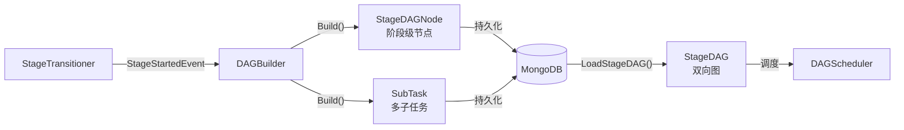
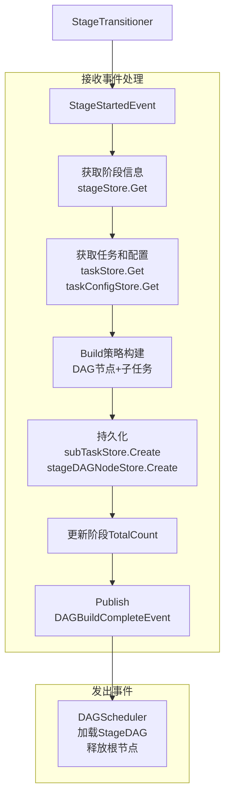

# DAG构建器设计

## 一、概述

根据阶段配置构建阶段内 DAG 图，拆分子任务，定义节点依赖关系。

**职责边界**：
- 订阅 StageStartedEvent，触发构建
- 查询任务配置，拆分子任务
- 构建阶段内 DAG 图，定义节点依赖
- 持久化 StageDAGNode 和 SubTask 到存储
- 发布 DAGBuildCompleteEvent
- 不关注阶段转换逻辑（由 StageTransitioner 处理）
- 不关注 DAG 调度细节（由 DAGScheduler 处理）

---

## 二、结构与数据模型

### 2.1 StageDAGNode（存储层）

StageDAGNode 是持久化到 MongoDB 的扁平结构，每个节点独立存储。

```go
// StageDAGNode 存储层结构
// MongoDB 字段映射：node_id, task_id, stage_id, node_type, subtask_ids, dependencies, status
type StageDAGNode struct {
    NodeId        string    // 节点唯一标识
    TaskId        string    // 所属任务ID
    StageId       int       // 所属阶段ID（任务内从1开始递增）
    NodeType      string    // 节点类型（synthesis/case/report）
    SubTaskIds    []string  // 包含的子任务ID列表
    Dependencies  []string  // 依赖的上游节点ID列表（未来扩展预留）
    Status        int       // 节点状态（枚举值）
    CreatedAt     time.Time
    UpdatedAt     time.Time
}
```

**特点**：
- 当前实现：每个阶段对应一个 StageDAGNode
- `Dependencies` 字段为未来扩展预留（阶段内多节点依赖）
- 关联 `TaskId + StageId(int)`，支持按任务和阶段查询
- 节点ID格式：`{taskId}-{stageId}-{nodeType}`

> MongoDB 表结构详见 [数据模型设计文档](../../数据模型设计文档.md) stage_dag_nodes 表。

### 2.2 BuildStrategy（策略接口）

```go
// BuildStrategy 构建策略接口
// 负责构建 StageDAGNode 并拆分子任务，两者在同一次调用中完成
type BuildStrategy interface {
    // Build 构建 DAG 并拆分子任务
    // 子任务数量和内容由 TaskConfig 决定
    Build(taskId string, stageId int, task *Task, config *TaskConfig) (*BuildResult, error)
}

type BuildResult struct {
    DAGNodes  []*StageDAGNode   // DAG 节点列表（每个阶段 1 个或若干个节点）
    SubTasks  []*SubTask        // 子任务列表（1 个节点包含多个子任务）
}
```

### 2.3 DAGBuilder（构建器）

```go
type DAGBuilder struct {
    buildStrategies   map[string]BuildStrategy   // (taskType, stageType) → 构建策略
    taskStore         TaskStore
    taskConfigStore   TaskConfigStore
    stageStore        StageStore
    subTaskStore      SubTaskStore
    stageDAGNodeStore StageDAGNodeStore          // 阶段级 DAG 节点存储
    eventBus          EventBus
    logger            *zap.Logger
}
```

| 方法 | 说明 |
|------|------|
| RegisterBuildStrategy(key, strategy) | 注册构建策略 |
| Receive(event) error | 接收事件（EventHandler接口） |
| handleStageStarted(event) error | 处理阶段启动事件 → 构建 DAG + 拆分子任务 |
| Build(taskId, stageId) (*BuildResult, error) | 构建 DAG 并拆分子任务 |

---

## 三、核心逻辑

### 3.1 事件处理

```go
func (b *DAGBuilder) Receive(event *Event) error {
    switch event.Type {
    case StageStartedEvent:
        return b.handleStageStarted(event)
    }
    return nil
}

func (b *DAGBuilder) handleStageStarted(event *Event) error {
    content := event.Content.(*StageStartedEventContent)
    taskId := content.TaskId
    stageId := content.StageId

    // 构建 DAG 并拆分子任务
    result, err := b.Build(taskId, stageId)
    if err != nil {
        b.logger.Error("dag build failed",
            zap.String("taskId", taskId),
            zap.Int("stageId", stageId),
            zap.Error(err))
        return err
    }

    // 发布 DAGBuildCompleteEvent
    b.eventBus.Publish(&Event{
        Type: DAGBuildCompleteEvent,
        Content: &DAGBuildCompleteEventContent{
            TaskId:     taskId,
            StageId:    stageId,
            NodeIds:    extractNodeIds(result.DAGNodes),
            SubTaskIds: extractSubTaskIds(result.SubTasks),
        },
    })

    b.logger.Info("dag build completed",
        zap.String("taskId", taskId),
        zap.Int("stageId", stageId),
        zap.Int("nodeCount", len(result.DAGNodes)),
        zap.Int("subTaskCount", len(result.SubTasks)))

    return nil
}
```

### 3.2 Build 主流程

```go
func (b *DAGBuilder) Build(taskId string, stageId int) (*BuildResult, error) {
    // 1. 获取阶段信息
    stage, err := b.stageStore.Get(taskId, stageId)
    if err != nil {
        return nil, err
    }

    // 2. 获取任务和配置
    task, err := b.taskStore.Get(taskId)
    if err != nil {
        return nil, err
    }

    config, err := b.taskConfigStore.Get(taskId)
    if err != nil {
        return nil, err
    }

    // 3. 根据 (taskType, stageType) 获取构建策略
    key := fmt.Sprintf("%s-%s", task.Type, stage.StageType)
    buildStrategy := b.buildStrategies[key]

    // 4. 构建 DAG 并拆分子任务
    result, err := buildStrategy.Build(taskId, stageId, task, config)
    if err != nil {
        return nil, err
    }

    // 5. 持久化 SubTask 和 StageDAGNode
    for _, subTask := range result.SubTasks {
        b.subTaskStore.Create(subTask)
    }
    for _, dagNode := range result.DAGNodes {
        b.stageDAGNodeStore.Create(dagNode)
    }

    // 6. 更新阶段统计
    stage.TotalCount = len(result.SubTasks)
    b.stageStore.Update(stage)

    return result, nil
}
```

### 3.3 createNode（辅助方法）

```go
func createNode(taskId string, stageId int, nodeType string, subTaskIds []string, dependencies []string) *StageDAGNode {
    return &StageDAGNode{
        NodeId:       generateNodeId(taskId, stageId, nodeType),
        TaskId:       taskId,
        StageId:      stageId,
        NodeType:     nodeType,
        SubTaskIds:   subTaskIds,
        Dependencies: dependencies,
        Status:       Blocked,
        CreatedAt:    time.Now(),
        UpdatedAt:    time.Now(),
    }
}

func generateNodeId(taskId string, stageId int, nodeType string) string {
    return fmt.Sprintf("%s-%d-%s", taskId, stageId, nodeType)
}
```

---

## 四、扩展与集成

### 4.1 内置构建策略

| 任务类型 | 阶段类型 | 策略 | 子任务数量 |
|----------|----------|------|------------|
| agent_eval | synthesis | SynthesisBuildStrategy | 1 |
| agent_eval | inference | InferenceBuildStrategy | M × N（评测集数量 × 变化维度数量） |
| agent_eval | eval | EvalBuildStrategy | M × N（评测集数量 × 变化维度数量） |
| agent_eval | report | ReportBuildStrategy | 1 |
| model_eval | inference | ModelInferenceBuildStrategy | M（评测集数量） |
| model_eval | eval | ModelEvalBuildStrategy | M（评测集数量） |
| model_eval | report | ModelReportBuildStrategy | 1 |

**阶段内 DAG 结构**：

一个阶段下可以有 **1 个或若干个 StageDAGNode**。StageDAGNode 作为调度单位，用于：
- 状态汇总（汇总其下属 SubTask 的整体状态）
- 扩展依赖定义（预留 `Dependencies` 字段支持后续扩展）

**当前应用评测任务的阶段结构**（每个阶段 1 个节点）：

```
synthesis 阶段：
    Stage
      └── StageDAGNode (synthesis-node)
            └── SubTask-001

inference 阶段：
    Stage
      └── StageDAGNode (inference-node)
            ├── SubTask-001
            ├── SubTask-002
            ├── SubTask-003
            └── ...

eval 阶段：
    Stage
      └── StageDAGNode (eval-node)
            ├── SubTask-001
            ├── SubTask-002
            ├── SubTask-003
            └── ...

report 阶段：
    Stage
      └── StageDAGNode (report-node)
            └── SubTask-001
```

### 4.2 InferenceBuildStrategy 示例

```go
func (s *InferenceBuildStrategy) Build(taskId string, stageId int, task *Task, config *TaskConfig) (*BuildResult, error) {
    // 从配置获取评测集数量 M 和变化维度数量 N
    M := s.getEvalsetCount(config)  // 评测集数量
    N := s.getVariantCount(config)  // 变化维度数量（model/agent/skill）

    // 创建 M × N 个子任务（每个评测集case × 每个变化维度）
    subTasks := []*SubTask{}
    subTaskIds := []string{}
    for m := 0; m < M; m++ {
        for n := 0; n < N; n++ {
            subTask := createSubTask(taskId, stageId, fmt.Sprintf("case-%d-variant-%d", m, n), config)
            subTasks = append(subTasks, subTask)
            subTaskIds = append(subTaskIds, subTask.SubTaskId)
        }
    }

    // 创建单个 StageDAGNode，包含所有子任务
    dagNode := createNode(taskId, stageId, "inference", subTaskIds, []string{})

    return &BuildResult{
        DAGNodes: []*StageDAGNode{dagNode},
        SubTasks: subTasks,
    }, nil
}
```

### 4.3 扩展方式

新增任务类型或阶段类型的步骤：

```go
// 1. 定义构建策略
type SafetyEvalBuildStrategy struct{}

func (s *SafetyEvalBuildStrategy) Build(taskId string, stageId int, task *Task, config *TaskConfig) (*BuildResult, error) {
    // 从配置获取子任务数量
    count := s.getSubTaskCount(config)

    // 创建子任务
    subTasks := []*SubTask{}
    subTaskIds := []string{}
    for i := 0; i < count; i++ {
        subTask := createSubTask(taskId, stageId, fmt.Sprintf("case-%d", i), config)
        subTasks = append(subTasks, subTask)
        subTaskIds = append(subTaskIds, subTask.SubTaskId)
    }

    // 创建 StageDAGNode，包含所有子任务
    dagNode := createNode(taskId, stageId, "eval", subTaskIds, []string{})

    return &BuildResult{
        DAGNodes: []*StageDAGNode{dagNode},
        SubTasks: subTasks,
    }, nil
}

// 2. 注册
builder.RegisterBuildStrategy("safety_eval-inference", &SafetyEvalBuildStrategy{})
```

### 4.4 与 DAGScheduler 协作



| 步骤 | 说明 | 负责模块 |
|------|------|----------|
| Build | 构建 StageDAGNode（阶段级节点）+ 拆分子任务（多个） | DAGBuilder |
| Persist | 持久化到 MongoDB | DAGBuilder |
| Load | 加载并构建 StageDAG（双向图） | DAGScheduler |

### 4.5 事件交互详情

#### 接收事件

| 事件类型 | 事件来源 | 触发时机 | 处理流程 |
|---------|---------|---------|---------|
| StageStartedEvent | StageTransitioner | 阶段启动，阶段状态更新为Running | 1. 获取阶段信息<br/>2. 获取任务和配置<br/>3. 根据策略构建DAG节点和子任务<br/>4. 持久化到数据库<br/>5. 更新阶段TotalCount<br/>6. 发布DAGBuildCompleteEvent |

#### 发出事件

| 事件类型 | 发布时机 | 目标模块 | 触发动作 |
|---------|---------|---------|---------|
| DAGBuildCompleteEvent | Build成功完成，子任务和DAG节点持久化后 | DAGScheduler | 触发加载StageDAG、释放根节点、开始调度 |

#### 事件处理流程图



---

## 五、相关文档

- [DAG调度器设计](DAG调度器设计.md) - StageDAG 内存结构与调度
- [阶段转换器设计](阶段转换器设计.md) - 阶段转换流程
- [事件总线设计](事件总线设计.md) - DAGBuildCompleteEvent 定义
- [数据模型设计文档](../../数据模型设计文档.md) - stage_dag_nodes 表、subtasks 表
- [模块设计文档](../../模块设计文档.md) - 增量式拆分架构