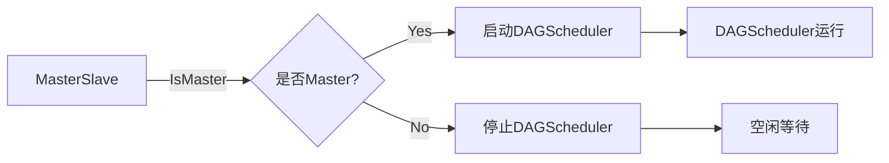
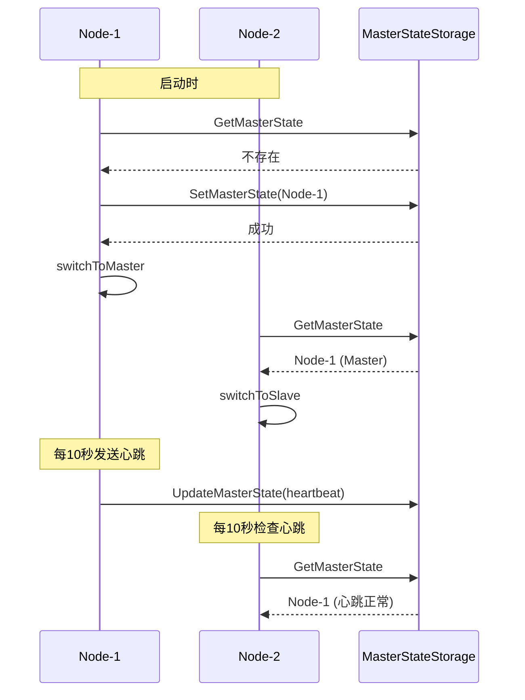
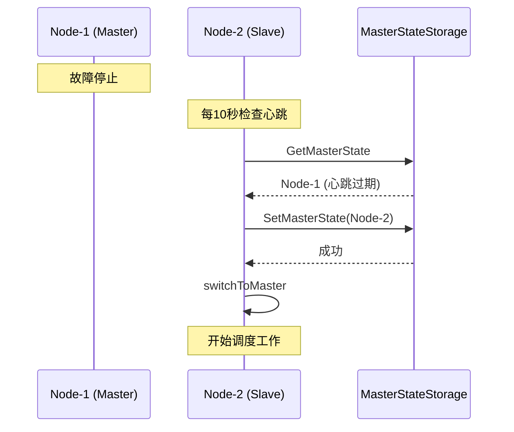

# 主从模式设计

## 一、概述

调度服务采用主从模式部署，实现高可用和避免竞态资源更新问题。

**职责边界**：
- 管理调度服务的主从角色切换
- Master节点负责实际调度工作
- Slave节点备用，Master故障时接管
- 不关注调度逻辑本身（由 DAGScheduler 处理）

**设计动机**：
- 避免多节点同时调度导致资源竞态
- 实现故障自动切换，提高可用性
- 单 Master 模式简化状态管理

---

## 二、结构与数据模型

### 2.1 MasterState（主从状态）

```go
type MasterState struct {
    NodeId        string            // 节点唯一标识
    Role          NodeRole          // 角色（Master/Slave）
    LastHeartbeat time.Time         // 最后心跳时间
    UpdatedAt     time.Time         // 更新时间
}

type NodeRole int

const (
    RoleSlave  = 0  // 从节点
    RoleMaster = 1  // 主节点
)
```

### 2.3 MasterSlave

```go
type MasterSlave struct {
    nodeId            string              // 当前节点ID
    storage           MasterStateStorage  // 主从状态存储
    scheduler         *DAGScheduler       // DAG调度器（Master时启动）

    heartbeatTTL      time.Duration       // 心跳过期时间（默认 30s）
    heartbeatInterval time.Duration       // 心跳发送间隔（默认 10s）

    logger            *zap.Logger
    stopCh            chan struct{}
}
```

| 方法 | 说明 |
|------|------|
| Start() | 启动主从管理循环 |
| Stop() | 停止主从管理循环 |
| IsMaster() bool | 判断当前节点是否为 Master |
| trySwitchToMaster() bool | 尝试切换为 Master |
| switchToMaster() | 切换为 Master（启动调度器） |
| switchToSlave() | 切换为 Slave（停止调度器） |
| updateHeartbeat() | 更新心跳（Master执行） |
| checkMasterHeartbeat() | 检查 Master 心跳（Slave执行） |

---

## 三、核心逻辑

### 3.1 Start（启动主从管理）

```go
func (m *MasterSlave) Start() {
    go func() {
        ticker := time.NewTicker(m.heartbeatInterval)
        defer ticker.Stop()

        for {
            select {
            case <-ticker.C:
                m.manageRole()
            case <-m.stopCh:
                return
            }
        }
    }()
}

func (m *MasterSlave) manageRole() {
    // 获取当前状态
    state, err := m.storage.GetMasterState()
    if err != nil {
        // 状态不存在，尝试成为 Master
        m.trySwitchToMaster()
        return
    }

    if m.IsMaster() {
        // 当前是 Master，维持心跳
        m.updateHeartbeat()
    } else {
        // 当前是 Slave，检查 Master 心跳
        m.checkMasterHeartbeat(state)
    }
}
```

### 3.2 trySwitchToMaster（尝试切换为 Master）

```go
func (m *MasterSlave) trySwitchToMaster() bool {
    // 尝试写入自己的节点ID作为 Master
    state := &MasterState{
        NodeId:        m.nodeId,
        Role:          RoleMaster,
        LastHeartbeat: time.Now(),
        UpdatedAt:     time.Now(),
    }

    err := m.storage.SetMasterState(state)
    if err != nil {
        // 设置失败（可能是其他节点已抢占）
        m.logger.Info("failed to become master",
            zap.String("nodeId", m.nodeId),
            zap.Error(err))
        return false
    }

    // 成功切换为 Master
    m.switchToMaster()
    return true
}
```

### 3.3 switchToMaster（切换为 Master）

```go
func (m *MasterSlave) switchToMaster() {
    m.logger.Info("switched to master",
        zap.String("nodeId", m.nodeId))

    // 启动 DAG 调度器（开始实际调度工作）
    m.scheduler.Start()
}
```

### 3.4 switchToSlave（切换为 Slave）

```go
func (m *MasterSlave) switchToSlave() {
    m.logger.Info("switched to slave",
        zap.String("nodeId", m.nodeId))

    // 停止 DAG 调度器（停止调度工作）
    m.scheduler.Stop()
}
```

### 3.5 updateHeartbeat（更新心跳）

```go
func (m *MasterSlave) updateHeartbeat() {
    // 检查自己是否仍然是 Master
    state, err := m.storage.GetMasterState()
    if err != nil {
        // 状态丢失，尝试重新成为 Master
        m.trySwitchToMaster()
        return
    }

    if state.NodeId != m.nodeId {
        // 被其他节点抢占，切换为 Slave
        m.switchToSlave()
        return
    }

    // 更新心跳时间
    state.LastHeartbeat = time.Now()
    state.UpdatedAt = time.Now()
    m.storage.UpdateMasterState(state)
}
```

### 3.6 checkMasterHeartbeat（检查 Master 心跳）

```go
func (m *MasterSlave) checkMasterHeartbeat(state *MasterState) {
    // 判断 Master 心跳是否过期
    elapsed := time.Since(state.LastHeartbeat)
    if elapsed > m.heartbeatTTL {
        m.logger.Warn("master heartbeat expired",
            zap.String("masterNodeId", state.NodeId),
            zap.Duration("elapsed", elapsed))

        // Master 心跳过期，尝试抢占成为新 Master
        m.trySwitchToMaster()
    }
}
```

### 3.7 IsMaster（判断是否为 Master）

```go
func (m *MasterSlave) IsMaster() bool {
    state, err := m.storage.GetMasterState()
    if err != nil {
        return false
    }
    return state.NodeId == m.nodeId && state.Role == RoleMaster
}
```

---

## 四、扩展与集成

### 4.1 与 DAGScheduler 协作



### 4.2 Master 选举流程



### 4.3 故障切换流程



### 4.4 参数配置

| 参数 | 默认值 | 说明 |
|------|--------|------|
| heartbeatTTL | 30s | 心跳过期时间 |
| heartbeatInterval | 10s | 心跳发送/检查间隔 |

**配置关系**：

```
heartbeatTTL >= 3 * heartbeatInterval

保证：Master 至少有 3 次心跳机会
```

### 4.5 存储实现

**MongoDB 实现**：

```go
type MongoMasterStateStorage struct {
    collection *mongo.Collection
}

func (s *MongoMasterStateStorage) GetMasterState() (*MasterState, error) {
    // 查询 master_state 表的唯一记录
}

func (s *MongoMasterStateStorage) SetMasterState(state *MasterState) error {
    // 使用 upsert，原子操作
    // 如果已存在其他 Master，返回错误
}

func (s *MongoMasterStateStorage) UpdateMasterState(state *MasterState) error {
    // 更新心跳时间，条件：NodeId 匹配
}
```

### 4.6 设计原则

| 原则 | 说明 |
|------|------|
| **单 Master** | 避免多节点同时调度导致竞态 |
| **心跳机制** | 简单可靠，无需复杂的选举协议 |
| **快速切换** | heartbeatTTL 时间内完成故障切换 |
| **持久化状态** | Master 状态存储在 MongoDB，支持重启恢复 |

### 4.7 与模型评测服务对比

| 维度 | 模型评测服务 | 应用评测服务 |
|------|-------------|--------------|
| 主从模式 | 多节点负载均衡 | 单 Master 模式 |
| 原因 | 无竞态资源更新 | DAG状态聚合需单节点 |
| 故障切换 | 无需切换 | 自动切换（心跳过期） |

---

## 五、相关文档

- [模块设计文档](../../模块设计文档.md) - MasterSlave 职责
- [DAG调度器设计](DAG调度器设计.md) - DAGScheduler 与 MasterSlave 协作
- [数据模型设计文档](../../数据模型设计文档.md) - MasterState 数据结构