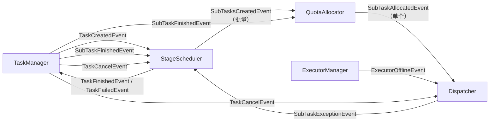

# 事件总线设计

## 一、概述

实现调度服务内部的事件驱动架构，替代定时扫描数据库的轮询模式，实现模块间异步解耦通信。

**职责边界**：
- 只关注事件发布/订阅/分发，不关注业务逻辑
- 各模块通过 EventBus 通信，事件处理器负责具体业务

**核心原则**：
- 事件是**状态通知**，不是**命令**
- 发布者只通知"发生了什么"，不关心"谁来处理"
- 接收者自主决定是否响应
- 单个事件类型允许**多个订阅者**同时接收

**对比轮询模式优势**：响应更快、无无效轮询开销、模块解耦。

---

## 二、结构与数据模型

### 2.1 EventBus

```go
type EventBus struct {
    handlers   map[int][]EventHandler // eventType → Handlers
    events     *list.List             // 待分发事件链表
    maxBacklog int                    // 最大积压限制
    logger     *zap.Logger
}

type Event struct {
    Type      int         // 事件类型
    Content   interface{} // 事件内容
    Timestamp int64       // 发生时间
}
```

| 方法 | 说明 |
|------|------|
| Publish(event) error | 发布事件 |
| RegisterHandler(eventType, handler) | 为事件类型注册一个处理器 |
| Start(ctx, wg) | 启动分发循环 |

### 2.2 EventHandler 接口

```go
type EventHandler interface {
    Receive(event *Event) error           // 接收事件（推入本地队列）
    RegisterEventBus(eventBus EventBus)   // 注册事件总线
    Start(ctx, wg)                        // 启动处理循环
}
```

### 2.3 事件类型定义

| 事件类型 | 常量 | 含义 | 发布者 | 订阅者 |
|---------|------|------|--------|--------|
| TaskCreatedEvent | 1 | 任务已创建 | TaskManager | StageScheduler |
| SubTasksCreatedEvent | 2 | 子任务已创建（批量） | StageScheduler | QuotaAllocator |
| SubTaskAllocatedEvent | 3 | 单个子任务配额分配完成 | QuotaAllocator | Dispatcher |
| SubTaskFinishedEvent | 4 | 子任务状态已落库 | TaskManager | QuotaAllocator, StageScheduler |
| TaskFinishedEvent | 5 | 任务执行完成 | StageScheduler | TaskManager |
| TaskFailedEvent | 6 | 任务执行失败 | StageScheduler | TaskManager |
| TaskCancelEvent | 7 | 任务取消请求 | TaskManager | StageScheduler, Dispatcher |
| ExecutorOfflineEvent | 8 | 执行服务失联 | ExecutorManager | Dispatcher |
| SubTaskExceptionEvent | 9 | 子任务进入可恢复异常态 | Dispatcher | StageScheduler |

> **命名约定**：事件名称使用核心实体（Task/SubTask），复数形式表示批量，单数形式表示单个。如 SubTasksCreatedEvent（批量创建）、SubTaskAllocatedEvent（单个分配）。

> **SubTaskExceptionEvent 触发场景**：
> 1. 执行服务失联后，Dispatcher 清理已分发子任务的执行态
> 2. 分发失败重试次数耗尽后，Dispatcher 强制释放配额并发布事件

### 2.4 事件内容结构

```go
// TaskCreatedEvent（阶段已预拆分）
type TaskCreatedEventContent struct {
    TaskId   string // 任务ID
    StageIds []int  // 阶段ID列表（已预拆分）
}

// SubTasksCreatedEvent（批量发布）
type SubTasksCreatedEventContent struct {
    TaskId     string   // 任务ID
    StageId    int      // 阶段ID
    SubTaskIds []string // 创建的子任务ID列表
}

// SubTaskAllocatedEvent（单个发布）
type SubTaskAllocatedEventContent struct {
    TaskId    string // 任务ID
    StageId   int    // 阶段ID
    SubTaskId string // 子任务ID
    ModelId   string // 模型ID（用于追踪，可选）
}

// SubTaskFinishedEvent
type SubTaskFinishedEventContent struct {
    TaskId    string
    StageId   int
    SubTaskId string
    Status    int        // Finished 或 Failed
    Result    *SubTaskResult // 执行结果
}

// SubTaskExceptionEvent
// 表示已分发子任务因执行服务失联等原因进入可恢复异常态，需由调度器重新评估是否释放节点
type SubTaskExceptionEventContent struct {
    TaskId    string
    StageId   int
    SubTaskId string
    Reason    string
}

// TaskFinishedEvent
type TaskFinishedEventContent struct {
    TaskId  string
    Result  *TaskResult
    Message string
}

// TaskFailedEvent
type TaskFailedEventContent struct {
    TaskId  string
    ErrCode int
    Message string
}

// TaskCancelEvent
type TaskCancelEventContent struct {
    TaskId string
    Reason string // 取消原因
}

// ExecutorOfflineEvent
type ExecutorOfflineEventContent struct {
    ExecutorId string
    Address    string
}
```

---

## 三、核心逻辑

### 3.1 事件分发循环

```go
func (eb *EventBus) Start(ctx context.Context, wg *sync.WaitGroup) {
    wg.Add(1)
    go func() {
        defer wg.Done()
        for {
            select {
            case <-ctx.Done():
                return
            default:
                if event := eb.popEvent(); event != nil {
                    handlers := eb.handlers[event.Type]
                    for _, handler := range handlers {
                        handler.Receive(event)
                    }
                }
            }
        }
    }()
}
```

### 3.2 事件发布

```go
func (eb *EventBus) Publish(event *Event) error {
    if eb.events.Len() >= eb.maxBacklog {
        return errors.New("event backlog exceeded")
    }
    eb.events.PushBack(event)
    return nil
}
```

---

## 四、扩展与集成

### 4.1 模块集成方式

| 模块 | 发布事件 | 订阅事件 |
|------|---------|---------|
| TaskManager | TaskCreatedEvent（含StageIds）, SubTaskFinishedEvent, TaskCancelEvent | TaskFinishedEvent, TaskFailedEvent |
| StageScheduler | SubTasksCreatedEvent, TaskFinishedEvent, TaskFailedEvent | TaskCreatedEvent, SubTaskFinishedEvent, TaskCancelEvent, SubTaskExceptionEvent |
| QuotaAllocator | SubTaskAllocatedEvent | SubTasksCreatedEvent, SubTaskFinishedEvent |
| Dispatcher | SubTaskExceptionEvent | SubTaskAllocatedEvent, ExecutorOfflineEvent, TaskCancelEvent |
| ExecutorManager | ExecutorOfflineEvent | 无（HealthChecker 内部发布） |

### 4.2 事件流转图



### 4.3 任务生命周期事件流

```
任务创建 → 阶段调度 → 执行 → 任务完成：

TaskManager.InitializeTask
    ↓
创建 Task + TaskConfig + Stages（阶段预拆分同步完成）
    ↓
发布 TaskCreatedEvent（含StageIds） → StageScheduler
    ↓
StageScheduler 初始化阶段索引 → 启动第一阶段 → 子任务拆分
    ↓
发布 SubTasksCreatedEvent（批量） → QuotaAllocator
    ↓
QuotaAllocator 批量入队 → 单个配额分配 → 发布 SubTaskAllocatedEvent（单个）
    ↓
Dispatcher 接收单个事件 → 选择执行服务 → 分发
    ↓                                              ↘
    ↓                                        分发失败 → 重试队列 → 定时重试
    ↓                                              ↘
    ↓                                        重试耗尽 → ForceRelease → SubTaskExceptionEvent
    ↓
TaskManager 更新子任务状态并发布 SubTaskFinishedEvent
    ↓
StageScheduler 聚合阶段状态 → 统计完成数/失败数
    ↓
若执行服务失联 → ExecutorManager 发布 ExecutorOfflineEvent → Dispatcher 清理执行态并发布 SubTaskExceptionEvent
    ↓
StageScheduler 收到异常事件后重新释放子任务，重新发布 SubTasksCreatedEvent
    ↓
StageScheduler 判断阶段完成 → 内部启动下一阶段（无事件）
    ↓
所有阶段完成 → 发布 TaskFinishedEvent → TaskManager
阶段失败 → 发布 TaskFailedEvent → TaskManager
```

### 4.4 分发失败恢复路径

```
分发失败 → 重试机制 → 恢复闭环：

SubTaskAllocatedEvent → Dispatcher.handleSubTaskAllocated
    ↓
选择执行服务 → 分发
    ↓                              ↘
    成功 → Allocated → 执行         失败 → addToRetryQueue
    ↓                              ↘
    ↓                         pendingQueue（等待重试）
    ↓                              ↘
    ↓                         定时触发 processRetryQueue
    ↓                              ↘
    ↓                         retryDispatch → 成功 → removeFromRetryQueue
    ↓                              ↘
    ↓                         重试次数≥max → handleRetryExhausted
    ↓                              ↘
    ↓                         ForceRelease（释放配额） → SubTaskExceptionEvent
    ↓                              ↘
    ↓                         StageScheduler 收到 → 重新释放 → SubTasksCreatedEvent
    ↓                              ↘
    ↓                         QuotaAllocator 收到 → 重新分配 → SubTaskAllocatedEvent
    ↓
执行完成 → SubTaskFinishedEvent → StageScheduler 聚合
```

### 4.5 不适用 EventBus 的场景

| 场景 | 原因 | 处理方式 |
|------|------|---------|
| Master故障切换 | 心跳检测需主动周期探测 | 保留定时心跳检查 |
| 执行服务健康检查 | 主动探测存活状态 | 保留定时HTTP调用 |
| 阶段内部流转 | 状态聚合→阶段转换是连续逻辑 | 直接方法调用，不发布事件 |
| 分发失败重试 | 内部队列处理，无需外部通知 | Dispatcher 内部重试队列 |

### 4.6 事件交互详情

> **说明**：EventBus 作为基础设施组件，不订阅业务事件也不发布业务事件。它负责事件的**分发和广播**，将发布者的事件传递给一个或多个订阅者。

#### 基础设施角色

| 角色 | 说明 |
|------|------|
| **事件广播器** | 将事件从发布者分发到一个或多个订阅者 |
| **事件队列** | 缓冲待分发事件，防止事件丢失 |
| **处理器注册** | 维护 eventType → Handlers 的映射关系 |

#### 事件流转机制

```mermaid
flowchart TB
    subgraph 发布者
        P1[TaskManager] -->|"Publish"| EB
        P2[StageScheduler] -->|"Publish"| EB
        P3[QuotaAllocator] -->|"Publish"| EB
        P4[ExecutorManager] -->|"Publish"| EB
    end

    subgraph EventBus核心
        EB[EventBus] --> QE[事件队列<br/>events.List]
        QE --> DP[分发循环<br/>Start]
        DP --> RH[查找处理器列表<br/>handlers[eventType]]
        RH --> RC[依次调用Receive<br/>推入订阅者队列]
    end

    subgraph 订阅者
        RC --> S1[StageScheduler]
        RC --> S2[QuotaAllocator]
        RC --> S3[Dispatcher]
        RC --> S4[TaskManager]
    end

    note["EventBus 不订阅业务事件<br/>仅负责事件广播分发"]
```

#### Publish → Receive 流程

| 步骤 | EventBus 操作 | 说明 |
|------|--------------|------|
| 1 | Publish(event) | 发布者调用，事件推入队列 |
| 2 | popEvent() | 分发循环取出队首事件 |
| 3 | handlers[eventType] | 根据事件类型查找处理器列表 |
| 4 | handler.Receive(event) | 依次调用所有订阅者的 Receive 方法 |

---

## 五、相关文档

- [模块设计文档](../../模块设计文档.md) - EventBus 职责
- [架构设计文档](../../架构设计文档.md) - 事件驱动架构概述
- [阶段调度器设计](阶段调度器设计.md) - StageScheduler 完整生命周期管理
- [配额分配器设计](配额分配器设计.md) - QuotaAllocator 配额门控
- [子任务分发器设计](子任务分发器设计.md) - Dispatcher 分发逻辑