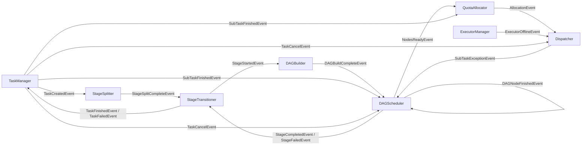

# 事件总线设计

## 一、概述

实现调度服务内部的事件驱动架构，替代定时扫描数据库的轮询模式，实现模块间异步解耦通信。

**职责边界**：
- 只关注事件发布/订阅/分发，不关注业务逻辑
- 各模块通过 EventBus 通信，事件处理器负责具体业务

**核心原则**：
- 事件是**状态通知**，不是**命令**
- 发布者只通知"发生了什么"，不关心"谁来处理"
- 接收者自主决定是否响应
- 单个事件类型允许**多个订阅者**同时接收

**对比轮询模式优势**：响应更快、无无效轮询开销、模块解耦。

---

## 二、结构与数据模型

### 2.1 EventBus

```go
type EventBus struct {
    handlers   map[int][]EventHandler // eventType → Handlers
    events     *list.List             // 待分发事件链表
    maxBacklog int                    // 最大积压限制
    logger     *zap.Logger
}

type Event struct {
    Type      int         // 事件类型
    Content   interface{} // 事件内容
    Timestamp int64       // 发生时间
}
```

| 方法 | 说明 |
|------|------|
| Publish(event) error | 发布事件 |
| RegisterHandler(eventType, handler) | 为事件类型注册一个处理器 |
| Start(ctx, wg) | 启动分发循环 |

### 2.2 EventHandler 接口

```go
type EventHandler interface {
    Receive(event *Event) error           // 接收事件（推入本地队列）
    RegisterEventBus(eventBus EventBus)   // 注册事件总线
    Start(ctx, wg)                        // 启动处理循环
}
```

### 2.3 事件类型定义

| 事件类型 | 常量 | 含义 | 发布者 | 订阅者 |
|---------|------|------|--------|--------|
| TaskCreatedEvent | 1 | 任务已创建 | TaskManager | StageSplitter |
| StageSplitCompleteEvent | 2 | 阶段拆分已完成 | StageSplitter | StageTransitioner |
| StageStartedEvent | 3 | 阶段已启动 | StageTransitioner | DAGBuilder |
| DAGBuildCompleteEvent | 4 | DAG构建已完成 | DAGBuilder | DAGScheduler |
| DAGNodeFinishedEvent | 5 | DAG节点执行完成 | DAGScheduler | DAGScheduler |
| NodesReadyEvent | 6 | DAG节点已就绪（批量） | DAGScheduler | QuotaAllocator |
| AllocationEvent | 7 | 配额分配已完成 | QuotaAllocator | Dispatcher |
| SubTaskFinishedEvent | 8 | 子任务状态已落库 | TaskManager | QuotaAllocator, DAGScheduler |
| StageCompletedEvent | 9 | 阶段执行完成 | DAGScheduler | StageTransitioner |
| StageFailedEvent | 10 | 阶段执行失败 | DAGScheduler | StageTransitioner |
| TaskFinishedEvent | 11 | 任务执行完成 | StageTransitioner | TaskManager |
| TaskFailedEvent | 12 | 任务执行失败 | StageTransitioner | TaskManager |
| TaskCancelEvent | 13 | 任务取消请求 | TaskManager | DAGScheduler, Dispatcher |
| ExecutorOfflineEvent | 14 | 执行服务失联 | ExecutorManager | Dispatcher |
| SubTaskExceptionEvent | 15 | 子任务进入可恢复异常态 | Dispatcher | DAGScheduler |

### 2.4 事件内容结构

```go
// TaskCreatedEvent
type TaskCreatedEventContent struct {
    TaskId string // 任务ID
}

// StageSplitCompleteEvent
type StageSplitCompleteEventContent struct {
    TaskId   string // 任务ID
    StageIds []int  // 阶段ID列表（按 stage_id 升序）
}

// StageStartedEvent
type StageStartedEventContent struct {
    TaskId  string // 任务ID
    StageId int    // 阶段ID（任务内顺序编号）
}

// DAGBuildCompleteEvent
type DAGBuildCompleteEventContent struct {
    TaskId     string   // 任务ID
    StageId    int      // 阶段ID
    NodeIds    []string // DAG节点ID列表
    SubTaskIds []string // 子任务ID列表
}

// DAGNodeFinishedEvent
type DAGNodeFinishedEventContent struct {
    TaskId  string
    StageId int
    NodeId  string
    Status  int
}

// NodesReadyEvent（批量发布）
type NodesReadyEventContent struct {
    TaskId     string   // 任务ID
    StageId    int      // 阶段ID
    SubTaskIds []string // 就绪的子任务ID列表
}

// AllocationEvent
type AllocationEventContent struct {
    TaskId      string       // 任务ID
    StageId     int          // 阶段ID
    Allocations []Allocation // 分配列表 [{SubTaskId}]
}

type Allocation struct {
    SubTaskId string // 子任务ID
}

// SubTaskFinishedEvent
type SubTaskFinishedEventContent struct {
    TaskId    string
    StageId   int
    SubTaskId string
    Result    *SubTaskResult // 执行结果
}

// SubTaskExceptionEvent
// 表示已分发子任务因执行服务失联等原因进入可恢复异常态，需由调度器重新评估是否释放节点

type SubTaskExceptionEventContent struct {
    TaskId    string
    StageId   int
    SubTaskId string
    Reason    string
}

// StageCompletedEvent
type StageCompletedEventContent struct {
    TaskId  string
    StageId int
}

// StageFailedEvent
type StageFailedEventContent struct {
    TaskId      string
    StageId     int
    FailedCount int
}

// TaskFinishedEvent
type TaskFinishedEventContent struct {
    TaskId  string
    Result  *TaskResult
    Message string
}

// TaskFailedEvent
type TaskFailedEventContent struct {
    TaskId  string
    ErrCode int
    Message string
}

// TaskCancelEvent
type TaskCancelEventContent struct {
    TaskId string
    Reason string // 取消原因
}

// ExecutorOfflineEvent
type ExecutorOfflineEventContent struct {
    ExecutorId string
    Address    string
}
```

---

## 三、核心逻辑

### 3.1 事件分发循环

```go
func (eb *EventBus) Start(ctx context.Context, wg *sync.WaitGroup) {
    wg.Add(1)
    go func() {
        defer wg.Done()
        for {
            select {
            case <-ctx.Done():
                return
            default:
                if event := eb.popEvent(); event != nil {
                    handlers := eb.handlers[event.Type]
                    for _, handler := range handlers {
                        handler.Receive(event)
                    }
                }
            }
        }
    }()
}
```

### 3.2 事件发布

```go
func (eb *EventBus) Publish(event *Event) error {
    if eb.events.Len() >= eb.maxBacklog {
        return errors.New("event backlog exceeded")
    }
    eb.events.PushBack(event)
    return nil
}
```

---

## 四、扩展与集成

### 4.1 模块集成方式

| 模块 | 发布事件 | 订阅事件 |
|------|---------|---------|
| TaskManager | TaskCreatedEvent, SubTaskFinishedEvent, TaskCancelEvent | TaskFinishedEvent, TaskFailedEvent |
| StageSplitter | StageSplitCompleteEvent | TaskCreatedEvent |
| StageTransitioner | StageStartedEvent, TaskFinishedEvent, TaskFailedEvent | StageSplitCompleteEvent, StageCompletedEvent, StageFailedEvent |
| DAGBuilder | DAGBuildCompleteEvent | StageStartedEvent |
| DAGScheduler | DAGNodeFinishedEvent, NodesReadyEvent, StageCompletedEvent, StageFailedEvent | DAGBuildCompleteEvent, DAGNodeFinishedEvent, SubTaskFinishedEvent, TaskCancelEvent, SubTaskExceptionEvent |
| QuotaAllocator | AllocationEvent | NodesReadyEvent, SubTaskFinishedEvent |
| Dispatcher | SubTaskExceptionEvent | AllocationEvent, ExecutorOfflineEvent, TaskCancelEvent |
| ExecutorManager | ExecutorOfflineEvent | 无（HealthChecker 内部发布） |

### 4.2 事件流转图



### 4.3 阶段转换事件流

```
StageTransitioner 事件订阅/发布循环：

订阅 StageSplitCompleteEvent
    ↓
StartStage(firstStageId)
    ↓
发布 StageStartedEvent → DAGBuilder
    ↓
DAGBuilder 构建完成 → 发布 DAGBuildCompleteEvent → DAGScheduler
    ↓
DAGScheduler 调度 → 发布 NodesReadyEvent → QuotaAllocator
    ↓
QuotaAllocator 分配 → 发布 AllocationEvent → Dispatcher
    ↓
Dispatcher 分发执行 → 等待执行服务异步状态上报
    ↓
TaskManager 更新子任务状态并发布 SubTaskFinishedEvent
    ↓
DAGScheduler 聚合节点状态 → 发布 DAGNodeFinishedEvent
    ↓
若执行服务失联 → ExecutorManager 发布 ExecutorOfflineEvent → Dispatcher 清理执行态并发布 SubTaskExceptionEvent
    ↓
DAGScheduler 收到异常事件后重新评估节点，必要时重新发布 NodesReadyEvent
    ↓
DAGScheduler 判断阶段完成/失败 → 发布 StageCompletedEvent / StageFailedEvent
    ↓
StageTransitioner 订阅 StageCompletedEvent / StageFailedEvent
    ↓
有下一阶段 → StartStage(nextStageId)
无下一阶段 → 发布 TaskFinishedEvent
阶段失败 → 发布 TaskFailedEvent
```

### 4.4 不适用 EventBus 的场景

| 场景 | 原因 | 处理方式 |
|------|------|---------|
| Master故障切换 | 心跳检测需主动周期探测 | 保留定时心跳检查 |
| 执行服务健康检查 | 主动探测存活状态 | 保留定时HTTP调用 |

### 4.5 事件交互详情

> **说明**：EventBus 作为基础设施组件，不订阅业务事件也不发布业务事件。它负责事件的**分发和广播**，将发布者的事件传递给一个或多个订阅者。

#### 基础设施角色

| 角色 | 说明 |
|------|------|
| **事件广播器** | 将事件从发布者分发到一个或多个订阅者 |
| **事件队列** | 缓冲待分发事件，防止事件丢失 |
| **处理器注册** | 维护 eventType → Handlers 的映射关系 |

#### 事件流转机制

```mermaid
flowchart TB
    subgraph 发布者
        P1[TaskManager] -->|"Publish"| EB
        P2[StageSplitter] -->|"Publish"| EB
        P3[StageTransitioner] -->|"Publish"| EB
        P4[DAGBuilder] -->|"Publish"| EB
        P5[DAGScheduler] -->|"Publish"| EB
        P6[QuotaAllocator] -->|"Publish"| EB
        P7[ExecutorManager] -->|"Publish"| EB
    end

    subgraph EventBus核心
        EB[EventBus] --> QE[事件队列<br/>events.List]
        QE --> DP[分发循环<br/>Start]
        DP --> RH[查找处理器列表<br/>handlers[eventType]]
        RH --> RC[依次调用Receive<br/>推入订阅者队列]
    end

    subgraph 订阅者
        RC --> S1[StageSplitter]
        RC --> S2[StageTransitioner]
        RC --> S3[DAGBuilder]
        RC --> S4[DAGScheduler]
        RC --> S5[QuotaAllocator]
        RC --> S6[Dispatcher]
        RC --> S7[TaskManager]
    end

    note["EventBus 不订阅业务事件<br/>仅负责事件广播分发"]
```

#### Publish → Receive 流程

| 步骤 | EventBus 操作 | 说明 |
|------|--------------|------|
| 1 | Publish(event) | 发布者调用，事件推入队列 |
| 2 | popEvent() | 分发循环取出队首事件 |
| 3 | handlers[eventType] | 根据事件类型查找处理器列表 |
| 4 | handler.Receive(event) | 依次调用所有订阅者的 Receive 方法 |

---

## 五、相关文档

- [模块设计文档](../../模块设计文档.md) - EventBus 职责
- [架构设计文档](../../架构设计文档.md) - 事件驱动架构概述
- [模块设计文档](../../模块设计文档.md) - 增量式拆分架构