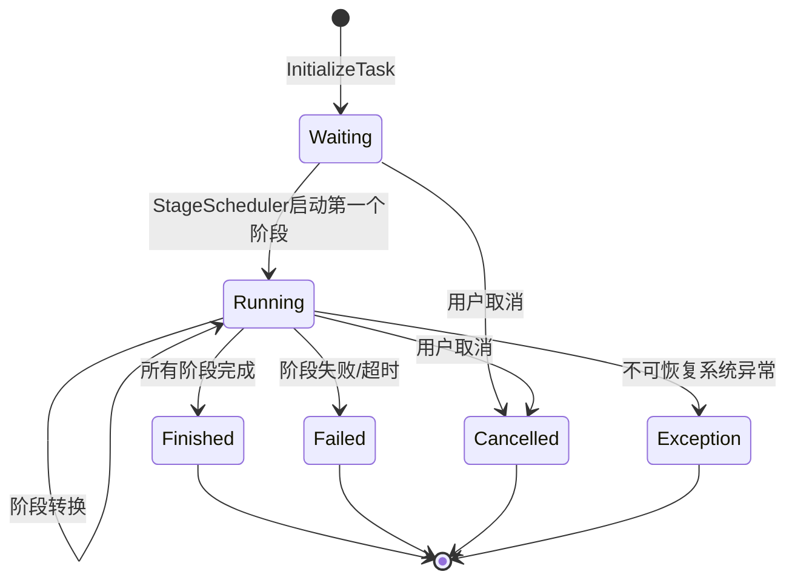
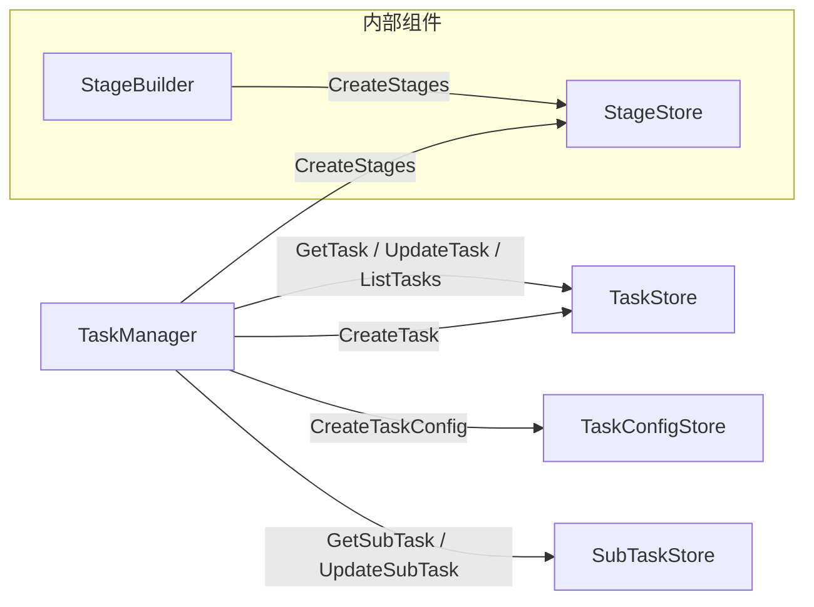
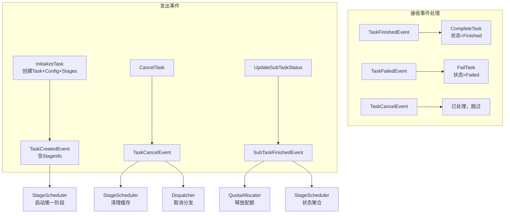

# 任务管理器设计

## 一、概述

任务生命周期管理，包括任务初始化、阶段预拆分、查询、取消、子任务状态更新、任务终态落库。

**职责边界**：
- 负责任务记录的 CRUD 操作和任务状态流转
- 负责创建 `tasks`、`task_configs`、`stages` 表记录（提交时同步完成）
- 负责阶段预拆分（通过内置 StageBuilder）
- 发布任务创建/取消事件，触发后续流程
- 负责接收执行服务上报后更新子任务状态，并发布 `SubTaskFinishedEvent`
- 负责消费任务终态事件，统一更新任务最终状态与结果
- 不关注子任务拆分（由 StageScheduler 在阶段启动时处理）
- 不关注阶段运行时调度与状态聚合（由 StageScheduler 处理）

**设计动机**：
- 任务提交成功 = 所有阶段已创建，避免"任务存在但无阶段"的中间状态
- 阶段拆分本质是任务初始化的一部分，由 TaskManager 同步完成
- 拆分失败时任务不入库，用户直接收到错误响应（而非异步 TaskFailed）

---

## 二、结构与数据模型

### 2.1 StageBuilder（阶段拆分器）

负责阶段预拆分的内部组件。

```go
type StageBuilder struct {
    // 拆分策略
    stageSplitStrategies map[string]StageSplitStrategy  // key: taskType
    
    // 存储
    stageStore StageStore
    
    logger *zap.Logger
}

type StageSplitStrategy interface {
    GetStageConfigs(task *Task, taskConfig *TaskConfig) ([]StageConfig, error)
}

type StageConfig struct {
    StageId    int                    // 阶段ID，任务内递增编号
    StageType  string                 // 阶段类型
    Config     map[string]interface{} // 阶段配置
    IsSkipped  bool                   // 是否跳过
}
```

### 2.2 TaskManager

```go
type TaskManager struct {
    // 阶段拆分器（内置）
    stageBuilder *StageBuilder
    
    // 存储
    taskStore       TaskStore
    taskConfigStore TaskConfigStore
    subTaskStore    SubTaskStore
    
    // 事件
    eventBus EventBus
    
    logger *zap.Logger
}
```

| 方法 | 说明 |
|------|------|
| InitializeTask(ctx, req) (string, error) | 初始化任务（创建 tasks、task_configs、stages 表记录） + 发布 TaskCreatedEvent |
| GetTask(ctx, taskId) (*Task, error) | 查询任务详情 |
| CancelTask(ctx, taskId, reason) error | 取消任务 + 发布 TaskCancelEvent |
| ListTasks(ctx, appId, status, offset, limit) ([]*Task, int, error) | 查询任务列表 |
| UpdateTaskStatus(ctx, taskId, status, message) error | 更新任务状态 |
| UpdateTaskCurrentStage(ctx, taskId, stageId, stageType) error | 更新当前阶段 |
| CompleteTask(ctx, taskId, result, message) error | 更新任务完成态与结果 |
| FailTask(ctx, taskId, errCode, message) error | 更新任务失败态 |
| UpdateSubTaskStatus(ctx, req) error | 更新子任务状态并发布 SubTaskFinishedEvent |
| Receive(event) error | 处理 TaskFinishedEvent / TaskFailedEvent |
| RegisterStageStrategy(taskType, strategy) | 注册阶段拆分策略 |

### 2.3 任务状态定义

```go
type TaskStatus int

const (
    TaskWaiting    = 0  // 等待处理
    TaskRunning    = 1  // 执行中
    TaskFinished   = 2  // 完成
    TaskFailed     = 3  // 失败
    TaskCancelled  = 4  // 取消
    TaskException  = 5  // 异常
)
```

### 2.4 任务状态流转图



---

## 三、核心逻辑

### 3.1 InitializeTask（初始化任务）

提交时同步创建 Task、TaskConfig、Stage 记录。

```go
func (m *TaskManager) InitializeTask(ctx context.Context, req *CreateTaskRequest) (string, error) {
    // 1. 生成任务ID
    taskId := generateTaskId()

    // 2. 构造 Task 记录
    task := &Task{
        TaskId:      taskId,
        AppId:       req.AppId,
        Type:        req.Type,
        Description: req.Description,
        Status:      TaskWaiting,
        Progress:    0,
        Message:     "任务已创建，等待处理",
        CreatedAt:   time.Now(),
        UpdatedAt:   time.Now(),
    }

    // 3. 构造 TaskConfig 记录
    taskConfig := &TaskConfig{
        TaskId: taskId,
        Type:   req.Type,
        Config: req.Config,
    }

    // 4. 执行阶段预拆分（提交时同步完成）
    stageConfigs, err := m.stageBuilder.GetStageConfigs(task, taskConfig)
    if err != nil {
        // 拆分失败：任务不入库，直接返回错误
        m.logger.Error("stage split failed before task creation",
            zap.String("taskId", taskId),
            zap.Error(err))
        return "", fmt.Errorf("阶段拆分失败: %w", err)
    }

    // 5. 构造 Stage 记录
    stages := make([]*Stage, 0, len(stageConfigs))
    stageIds := make([]int, 0, len(stageConfigs))
    
    for _, cfg := range stageConfigs {
        stage := &Stage{
            TaskId:     taskId,
            StageId:    cfg.StageId,
            StageType:  cfg.StageType,
            Status:     StagePending,
            Config:     cfg.Config,
            TotalCount: 0,
        }
        if cfg.IsSkipped {
            stage.Status = StageSkipped
        }
        stages = append(stages, stage)
        stageIds = append(stageIds, cfg.StageId)
    }

    // 6. 批量落库（同事务或顺序写入）
    if err := m.taskStore.CreateTask(ctx, task); err != nil {
        return "", err
    }
    if err := m.taskConfigStore.CreateTaskConfig(ctx, taskConfig); err != nil {
        return "", err
    }
    if err := m.stageStore.CreateStages(ctx, stages); err != nil {
        return "", err
    }

    // 7. 发布 TaskCreatedEvent（包含阶段ID列表）
    m.eventBus.Publish(&Event{
        Type: TaskCreatedEvent,
        Content: &TaskCreatedEventContent{
            TaskId:  taskId,
            StageIds: stageIds,
        },
    })

    m.logger.Info("task initialized with stages",
        zap.String("taskId", taskId),
        zap.String("appId", req.AppId),
        zap.String("type", req.Type),
        zap.Ints("stageIds", stageIds))

    return taskId, nil
}
```

### 3.2 StageBuilder.GetStageConfigs

```go
func (b *StageBuilder) GetStageConfigs(task *Task, taskConfig *TaskConfig) ([]StageConfig, error) {
    // 1. 获取拆分策略
    strategy, ok := b.stageSplitStrategies[task.Type]
    if !ok {
        return nil, fmt.Errorf("no stage split strategy for task type %s", task.Type)
    }

    // 2. 生成阶段配置
    return strategy.GetStageConfigs(task, taskConfig)
}
```

### 3.3 GetTask（查询任务）

```go
func (m *TaskManager) GetTask(ctx context.Context, taskId string) (*Task, error) {
    task, err := m.taskStore.GetTask(ctx, taskId)
    if err != nil {
        return nil, err
    }
    return task, nil
}
```

### 3.4 CancelTask（取消任务）

```go
func (m *TaskManager) CancelTask(ctx context.Context, taskId string, reason string) error {
    // 1. 获取任务
    task, err := m.taskStore.GetTask(ctx, taskId)
    if err != nil {
        return err
    }

    // 2. 检查状态是否可取消
    if task.Status == TaskFinished || task.Status == TaskFailed || task.Status == TaskCancelled {
        return errors.New("task already terminated: cannot cancel")
    }

    // 3. 更新状态为 Cancelled
    task.Status = TaskCancelled
    task.Message = reason
    task.UpdatedAt = time.Now()

    if err := m.taskStore.UpdateTask(ctx, task); err != nil {
        return err
    }

    // 4. 发布 TaskCancelEvent
    m.eventBus.Publish(&Event{
        Type: TaskCancelEvent,
        Content: &TaskCancelEventContent{
            TaskId: taskId,
            Reason: reason,
        },
    })

    m.logger.Info("task cancelled",
        zap.String("taskId", taskId),
        zap.String("reason", reason))

    return nil
}
```

### 3.5 ListTasks（查询任务列表）

```go
func (m *TaskManager) ListTasks(ctx context.Context, appId string, status []int, offset, limit int) ([]*Task, int, error) {
    tasks, total, err := m.taskStore.ListTasks(ctx, appId, status, offset, limit)
    if err != nil {
        return nil, 0, err
    }
    return tasks, total, nil
}
```

### 3.6 UpdateTaskStatus（更新任务状态）

```go
func (m *TaskManager) UpdateTaskStatus(ctx context.Context, taskId string, status int, message string) error {
    task, err := m.taskStore.GetTask(ctx, taskId)
    if err != nil {
        return err
    }

    task.Status = status
    task.Message = message
    task.UpdatedAt = time.Now()

    return m.taskStore.UpdateTask(ctx, task)
}
```

### 3.7 UpdateTaskCurrentStage（更新当前阶段）

```go
func (m *TaskManager) UpdateTaskCurrentStage(ctx context.Context, taskId string, stageId int, stageType string) error {
    task, err := m.taskStore.GetTask(ctx, taskId)
    if err != nil {
        return err
    }

    task.Status = TaskRunning
    task.CurrentStage = stageId
    task.CurrentStageType = stageType
    task.UpdatedAt = time.Now()

    return m.taskStore.UpdateTask(ctx, task)
}
```

### 3.8 CompleteTask（任务完成）

```go
func (m *TaskManager) CompleteTask(ctx context.Context, taskId string, result *TaskResult, message string) error {
    task, err := m.taskStore.GetTask(ctx, taskId)
    if err != nil {
        return err
    }

    task.Status = TaskFinished
    task.Result = result
    task.Progress = 100
    task.Message = message
    task.UpdatedAt = time.Now()

    return m.taskStore.UpdateTask(ctx, task)
}
```

### 3.9 FailTask（任务失败）

```go
func (m *TaskManager) FailTask(ctx context.Context, taskId string, errCode int, message string) error {
    task, err := m.taskStore.GetTask(ctx, taskId)
    if err != nil {
        return err
    }

    task.Status = TaskFailed
    task.ErrorCode = errCode
    task.Message = message
    task.UpdatedAt = time.Now()

    return m.taskStore.UpdateTask(ctx, task)
}
```

### 3.10 UpdateSubTaskStatus（更新子任务状态）

```go
func (m *TaskManager) UpdateSubTaskStatus(ctx context.Context, req *UpdateSubTaskStatusRequest) error {
    subTask, err := m.subTaskStore.GetSubTask(ctx, req.SubTaskId)
    if err != nil {
        return err
    }

    subTask.Status = req.Status
    subTask.Result = req.Result
    subTask.Message = req.Message
    subTask.UpdatedAt = time.Now()

    if err := m.subTaskStore.UpdateSubTask(ctx, subTask); err != nil {
        return err
    }

    if req.Status == SubTaskFinished || req.Status == SubTaskFailed || req.Status == SubTaskException {
        m.eventBus.Publish(&Event{
            Type: SubTaskFinishedEvent,
            Content: &SubTaskFinishedEventContent{
                TaskId:    subTask.TaskId,
                StageId:   subTask.StageId,
                SubTaskId: subTask.SubTaskId,
                Status:    subTask.Status,
                Result:    subTask.Result,
            },
        })
    }

    return nil
}
```

### 3.11 Receive（事件处理器接口）

```go
func (m *TaskManager) Receive(event *Event) error {
    switch event.Type {
    case TaskFinishedEvent:
        content := event.Content.(*TaskFinishedEventContent)
        return m.CompleteTask(context.Background(), content.TaskId, content.Result, content.Message)
    case TaskFailedEvent:
        content := event.Content.(*TaskFailedEventContent)
        return m.FailTask(context.Background(), content.TaskId, content.ErrCode, content.Message)
    case TaskCancelEvent:
        // 取消事件已在 CancelTask 中处理，此处无需再次处理
        return nil
    }
    return nil
}
```

### 3.12 RegisterStageStrategy（注册阶段拆分策略）

```go
func (m *TaskManager) RegisterStageStrategy(taskType string, strategy StageSplitStrategy) {
    m.stageBuilder.stageSplitStrategies[taskType] = strategy
    m.logger.Info("stage split strategy registered", zap.String("taskType", taskType))
}
```

---

## 四、扩展与集成

### 4.1 内置阶段拆分策略

| 任务类型 | 策略 | 阶段配置 |
|---------|------|---------|
| agent_eval | AgentEvalStageStrategy | synthesis → inference → eval → report |
| model_eval | ModelEvalStageStrategy | inference → eval → report |

**AgentEvalStageStrategy 示例**：

```go
func (s *AgentEvalStageStrategy) GetStageConfigs(task *Task, taskConfig *TaskConfig) ([]StageConfig, error) {
    workflow := taskConfig.Config["workflow"].([]string)
    stageConfigs := make([]StageConfig, 0, len(workflow))
    
    for i, stageType := range workflow {
        stageConfig := StageConfig{
            StageId:   i + 1,
            StageType: stageType,
            Config:    extractStageConfig(taskConfig.Config, stageType),
            IsSkipped: false,
        }
        
        // 如果已有评测集，跳过 synthesis 阶段
        if stageType == "synthesis" && taskConfig.Config["evalset_id"] != "" {
            stageConfig.IsSkipped = true
        }
        
        stageConfigs = append(stageConfigs, stageConfig)
    }
    
    return stageConfigs, nil
}
```

### 4.2 与 Storage 协作



### 4.3 状态更新来源

| 状态变化 | 触发者 | 说明 |
|---------|--------|------|
| Waiting → Running | StageScheduler | 第一个阶段启动后，调用 TaskManager.UpdateTaskCurrentStage |
| Running → Running | StageScheduler | 阶段转换时调用 UpdateTaskCurrentStage |
| Running → Finished | StageScheduler | 所有阶段完成后发布 TaskFinishedEvent |
| Running → Failed | StageScheduler | 阶段失败后发布 TaskFailedEvent |
| Waiting/Running → Cancelled | TaskAPI → TaskManager | 用户主动取消，由 TaskManager 统一落库并发布事件 |

### 4.4 设计原则

| 原则 | 说明 |
|------|------|
| **提交完整性** | 任务提交成功 = Task + TaskConfig + Stages 均已创建 |
| **拆分同步化** | 阶段拆分在提交时同步完成，失败直接返回错误 |
| **单一职责** | TaskManager 负责任务初始化（含阶段拆分），StageScheduler 负责运行时调度 |
| **事件驱动** | 通过 TaskCreatedEvent 触发 StageScheduler 启动第一阶段 |
| **终态收口** | 任务完成/失败统一由 TaskFinishedEvent / TaskFailedEvent 驱动 |

### 4.5 事件交互详情

#### 接收事件

| 事件类型 | 事件来源 | 触发时机 | 处理流程 |
|---------|---------|---------|---------|
| TaskFinishedEvent | StageScheduler | 所有阶段完成，任务进入终态 | 调用 `CompleteTask`，更新任务状态为 `TaskFinished` |
| TaskFailedEvent | StageScheduler | 某阶段失败或超时 | 调用 `FailTask`，更新任务状态为 `TaskFailed` |
| TaskCancelEvent | TaskManager（自身发布） | 用户主动取消任务 | 已在 `CancelTask` 中处理，此处忽略 |

#### 发出事件

| 事件类型 | 发布时机 | 目标模块 | 触发动作 |
|---------|---------|---------|---------|
| TaskCreatedEvent | `InitializeTask` 成功后 | StageScheduler | 启动第一个阶段 |
| TaskCancelEvent | `CancelTask` 成功后 | StageScheduler、Dispatcher | 清理缓存、取消分发中的子任务 |
| SubTaskFinishedEvent | `UpdateSubTaskStatus` 落库后 | QuotaAllocator、StageScheduler | 释放配额、状态聚合 |

#### 事件处理流程图



---

## 五、相关文档

- [模块设计文档](../../模块设计文档.md) - TaskManager 职责
- [事件总线设计](事件总线设计.md) - TaskCreatedEvent 定义
- [阶段调度器设计](阶段调度器设计.md) - 运行时调度与状态聚合
- [数据模型设计文档](../../数据模型设计文档.md) - 数据表结构