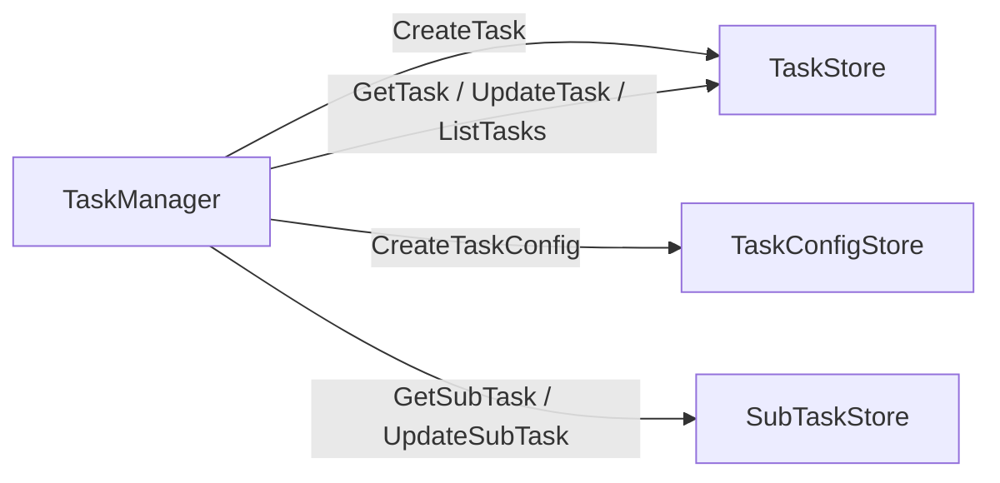
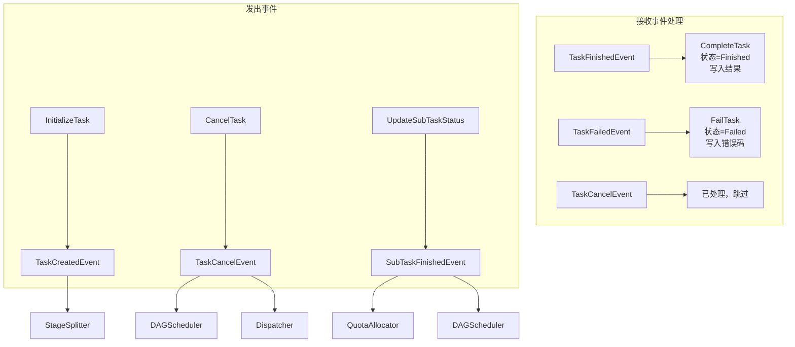

# 任务管理器设计

## 一、概述

任务生命周期管理，包括任务初始化、查询、取消、子任务状态更新、任务终态落库。

**职责边界**：
- 负责任务记录的 CRUD 操作和任务状态流转
- 负责创建 `tasks`、`task_configs` 表记录
- 发布任务创建/取消事件，触发后续流程
- 负责接收执行服务上报后更新子任务状态，并发布 `SubTaskFinishedEvent`
- 负责消费任务终态事件，统一更新任务最终状态与结果
- 不负责阶段拆分（由 StageSplitter 处理）
- 不关注阶段内子任务拆分细节（由 DAGBuilder 处理）
- 不关注阶段转换细节（由 StageTransitioner 处理）

---

## 二、结构与数据模型

### 2.1 TaskManager

```go
type TaskManager struct {
    taskStore       TaskStore
    taskConfigStore TaskConfigStore
    subTaskStore    SubTaskStore
    eventBus        EventBus
    logger          *zap.Logger
}
```

| 方法 | 说明 |
|------|------|
| InitializeTask(ctx, req) (string, error) | 初始化任务（创建 tasks、task_configs 表记录） + 发布 TaskCreatedEvent |
| GetTask(ctx, taskId) (*Task, error) | 查询任务详情 |
| CancelTask(ctx, taskId, reason) error | 取消任务 + 发布 TaskCancelEvent |
| ListTasks(ctx, appId, status, offset, limit) ([]*Task, int, error) | 查询任务列表 |
| UpdateTaskStatus(ctx, taskId, status, message) error | 更新任务状态 |
| UpdateTaskCurrentStage(ctx, taskId, stageId, stageType) error | 更新当前阶段 |
| CompleteTask(ctx, taskId, result, message) error | 更新任务完成态与结果 |
| FailTask(ctx, taskId, errCode, message) error | 更新任务失败态 |
| UpdateSubTaskStatus(ctx, req) error | 更新子任务状态并发布 SubTaskFinishedEvent |
| Receive(event) error | 处理 TaskFinishedEvent / TaskFailedEvent |

```go
type TaskStatus int

const (
    TaskWaiting    = 0  // 等待处理
    TaskRunning    = 1  // 执行中
    TaskFinished   = 2  // 完成
    TaskFailed     = 3  // 失败
    TaskCancelled  = 4  // 取消
    TaskException  = 5  // 异常
)
```

### 2.3 任务状态流转图


> **说明**：执行服务失联优先映射为子任务 `Exception`，由 Dispatcher 清理执行态并发布 `SubTaskExceptionEvent`，不直接导致任务进入 `TaskException`。任务终态仍由 `TaskFinishedEvent / TaskFailedEvent` 驱动。

---

## 三、核心逻辑

### 3.1 InitializeTask（初始化任务）

```go
func (m *TaskManager) InitializeTask(ctx context.Context, req *CreateTaskRequest) (string, error) {
    // 1. 生成任务ID
    taskId := generateTaskId()

    // 2. 构造 Task 记录（只存通用状态信息）
    task := &Task{
        TaskId:      taskId,
        AppId:       req.AppId,
        Type:        req.Type,
        Description: req.Description,
        Status:      TaskWaiting,
        Progress:    0,
        Message:     "任务已创建，等待处理",
        CreatedAt:   time.Now(),
        UpdatedAt:   time.Now(),
    }

    // 3. 持久化到 tasks 表
    if err := m.taskStore.CreateTask(ctx, task); err != nil {
        return "", err
    }

    // 4. 构造 TaskConfig 记录（独立存储）
    taskConfig := &TaskConfig{
        TaskId: taskId,
        Type:   req.Type,
        Config: req.Config,
    }

    // 5. 持久化到 task_configs 表
    if err := m.taskConfigStore.CreateTaskConfig(ctx, taskConfig); err != nil {
        return "", err
    }

    // 6. 发布 TaskCreatedEvent（触发 StageSplitter 执行阶段拆分）
    m.eventBus.Publish(&Event{
        Type: TaskCreatedEvent,
        Content: &TaskCreatedEventContent{
            TaskId: taskId,
        },
    })

    m.logger.Info("task initialized",
        zap.String("taskId", taskId),
        zap.String("appId", req.AppId),
        zap.String("type", req.Type))

    return taskId, nil
}

func generateTaskId() string {
    return fmt.Sprintf("task-%s-%d", time.Now().Format("20060102"), rand.Intn(10000))
}
```

### 3.2 GetTask（查询任务）

```go
func (m *TaskManager) GetTask(ctx context.Context, taskId string) (*Task, error) {
    task, err := m.taskStore.GetTask(ctx, taskId)
    if err != nil {
        return nil, err
    }
    return task, nil
}
```

### 3.3 CancelTask（取消任务）

```go
func (m *TaskManager) CancelTask(ctx context.Context, taskId string, reason string) error {
    // 1. 获取任务
    task, err := m.taskStore.GetTask(ctx, taskId)
    if err != nil {
        return err
    }

    // 2. 检查状态是否可取消
    if task.Status == TaskFinished || task.Status == TaskFailed || task.Status == TaskCancelled {
        return errors.New("task already terminated: cannot cancel")
    }

    // 3. 更新状态为 Cancelled
    task.Status = TaskCancelled
    task.Message = reason
    task.UpdatedAt = time.Now()

    if err := m.taskStore.UpdateTask(ctx, task); err != nil {
        return err
    }

    // 4. 发布 TaskCancelEvent（触发 DAGScheduler / Dispatcher 清理执行态）
    m.eventBus.Publish(&Event{
        Type: TaskCancelEvent,
        Content: &TaskCancelEventContent{
            TaskId: taskId,
            Reason: reason,
        },
    })

    m.logger.Info("task cancelled",
        zap.String("taskId", taskId),
        zap.String("reason", reason))

    return nil
}
```

### 3.4 ListTasks（查询任务列表）

```go
func (m *TaskManager) ListTasks(ctx context.Context, appId string, status []int, offset, limit int) ([]*Task, int, error) {
    tasks, total, err := m.taskStore.ListTasks(ctx, appId, status, offset, limit)
    if err != nil {
        return nil, 0, err
    }
    return tasks, total, nil
}
```

### 3.5 UpdateTaskStatus（更新任务状态）

```go
func (m *TaskManager) UpdateTaskStatus(ctx context.Context, taskId string, status int, message string) error {
    task, err := m.taskStore.GetTask(ctx, taskId)
    if err != nil {
        return err
    }

    task.Status = status
    task.Message = message
    task.UpdatedAt = time.Now()

    return m.taskStore.UpdateTask(ctx, task)
}
```

### 3.6 UpdateTaskCurrentStage（更新当前阶段）

```go
func (m *TaskManager) UpdateTaskCurrentStage(ctx context.Context, taskId string, stageId int, stageType string) error {
    task, err := m.taskStore.GetTask(ctx, taskId)
    if err != nil {
        return err
    }

    task.CurrentStage = stageId
    task.CurrentStageType = stageType
    task.UpdatedAt = time.Now()

    return m.taskStore.UpdateTask(ctx, task)
}
```

### 3.7 CompleteTask（任务完成）

```go
func (m *TaskManager) CompleteTask(ctx context.Context, taskId string, result *TaskResult, message string) error {
    task, err := m.taskStore.GetTask(ctx, taskId)
    if err != nil {
        return err
    }

    task.Status = TaskFinished
    task.Result = result
    task.Progress = 100
    task.Message = message
    task.UpdatedAt = time.Now()

    return m.taskStore.UpdateTask(ctx, task)
}
```

### 3.8 FailTask（任务失败）

```go
func (m *TaskManager) FailTask(ctx context.Context, taskId string, errCode int, message string) error {
    task, err := m.taskStore.GetTask(ctx, taskId)
    if err != nil {
        return err
    }

    task.Status = TaskFailed
    task.ErrorCode = errCode
    task.Message = message
    task.UpdatedAt = time.Now()

    return m.taskStore.UpdateTask(ctx, task)
}
```

### 3.9 UpdateSubTaskStatus（更新子任务状态）

```go
func (m *TaskManager) UpdateSubTaskStatus(ctx context.Context, req *UpdateSubTaskStatusRequest) error {
    subTask, err := m.subTaskStore.GetSubTask(ctx, req.SubTaskId)
    if err != nil {
        return err
    }

    subTask.Status = req.Status
    subTask.Result = req.Result
    subTask.Message = req.Message
    subTask.UpdatedAt = time.Now()

    if err := m.subTaskStore.UpdateSubTask(ctx, subTask); err != nil {
        return err
    }

    if req.Status == SubTaskFinished || req.Status == SubTaskFailed || req.Status == SubTaskException {
        m.eventBus.Publish(&Event{
            Type: SubTaskFinishedEvent,
            Content: &SubTaskFinishedEventContent{
                TaskId:    subTask.TaskId,
                StageId:   subTask.StageId,
                SubTaskId: subTask.SubTaskId,
                Result:    subTask.Result,
            },
        })
    }

    return nil
}
```

### 3.10 Receive（事件处理器接口）

```go
// TaskManager 作为 EventHandler，订阅任务终态事件
func (m *TaskManager) Receive(event *Event) error {
    switch event.Type {
    case TaskFinishedEvent:
        content := event.Content.(*TaskFinishedEventContent)
        return m.CompleteTask(context.Background(), content.TaskId, content.Result, content.Message)
    case TaskFailedEvent:
        content := event.Content.(*TaskFailedEventContent)
        return m.FailTask(context.Background(), content.TaskId, content.ErrCode, content.Message)
    case TaskCancelEvent:
        // 取消事件已在 CancelTask 中处理，此处无需再次处理
        return nil
    }
    return nil
}
```

---

## 四、扩展与集成

### 4.1 与 Storage 协作



### 4.2 状态更新来源

| 状态变化 | 触发者 | 说明 |
|---------|--------|------|
| Waiting → Running | StageTransitioner | 第一个阶段启动后，调用 TaskManager 更新任务状态 |
| Running → Running | StageTransitioner | 阶段转换时更新 current_stage |
| Running → Finished | StageTransitioner | 所有阶段完成后发布 TaskFinishedEvent |
| Running → Failed | StageTransitioner | 阶段失败后发布 TaskFailedEvent |
| Waiting/Running → Cancelled | TaskAPI → TaskManager | 用户主动取消，由 TaskManager 统一落库并发布事件 |
| Running → Exception | 系统级故障处理 | 仅在不可恢复的系统级异常场景下进入 TaskException，不由执行服务失联直接触发 |

### 4.3 设计原则

| 原则 | 说明 |
|------|------|
| **单一职责** | 只负责 Task / SubTask 记录的 CRUD、任务终态落库和事件发布 |
| **事件驱动** | 不直接调用 StageSplitter、DAGScheduler，通过事件触发后续模块 |
| **状态机管理** | 统一维护任务状态流转，避免 API 层或其他模块直接改任务终态 |
| **终态收口** | 任务完成/失败统一由 `TaskFinishedEvent / TaskFailedEvent` 驱动，执行服务失联不会直接改写任务终态 |
| **配置分离** | 任务配置独立存储，任务表只存通用状态 |

### 4.4 事件交互详情

#### 接收事件

| 事件类型 | 事件来源 | 触发时机 | 处理流程 |
|---------|---------|---------|---------|
| TaskFinishedEvent | StageTransitioner | 所有阶段完成，任务进入终态 | 调用 `CompleteTask`，更新任务状态为 `TaskFinished`、写入结果与完成消息 |
| TaskFailedEvent | StageTransitioner | 某阶段失败或超时，任务进入失败态 | 调用 `FailTask`，更新任务状态为 `TaskFailed`、写入错误码与失败消息 |
| TaskCancelEvent | TaskManager（自身发布） | 用户主动取消任务 | 已在 `CancelTask` 方法中完成状态更新，此处理器仅做忽略 |

#### 发出事件

| 事件类型 | 发布时机 | 目标模块 | 触发动作 |
|---------|---------|---------|---------|
| TaskCreatedEvent | `InitializeTask` 成功创建任务后 | StageSplitter | 触发阶段拆分与阶段记录创建 |
| TaskCancelEvent | `CancelTask` 成功更新状态后 | DAGScheduler、Dispatcher | 清理内存中的 StageDAG、取消分发中的子任务 |
| SubTaskFinishedEvent | `UpdateSubTaskStatus` 成功落库后 | QuotaAllocator、DAGScheduler | 释放配额、聚合 DAGNode 状态并继续调度 |

#### 事件处理流程图



---

## 五、相关文档

- [模块设计文档](../../模块设计文档.md) - TaskManager 职责
- [事件总线设计](事件总线设计.md) - TaskCreatedEvent/TaskCancelEvent 定义
- [阶段拆分器设计](阶段拆分器设计.md) - 阶段预拆分逻辑
- [模块设计文档](../../模块设计文档.md) - 增量式拆分架构
- [数据模型设计文档](../../数据模型设计文档.md) - 数据表结构