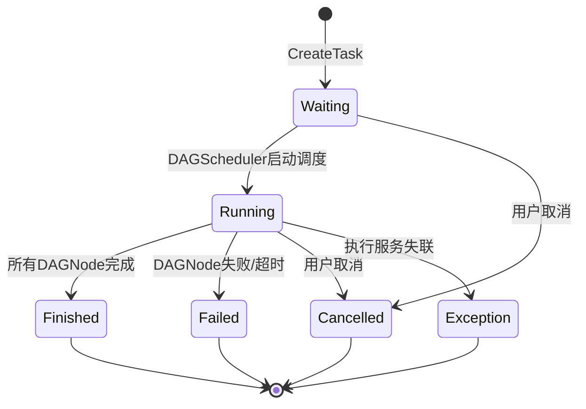
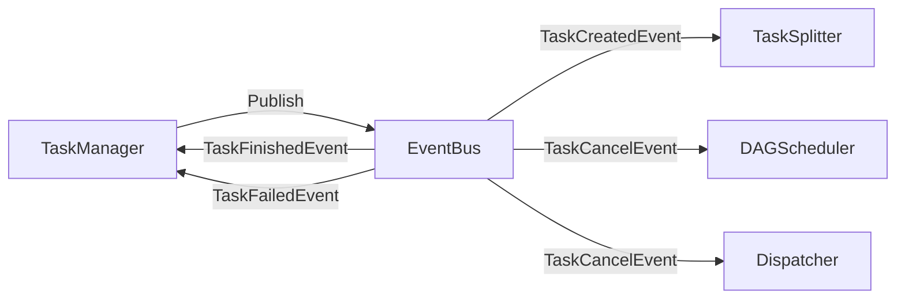
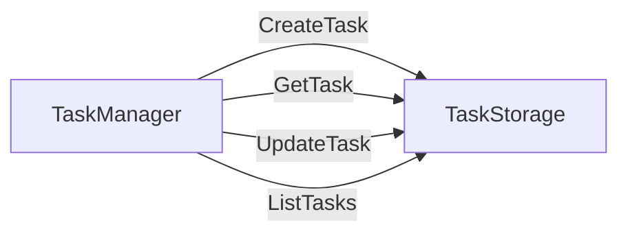

# 任务管理器设计

## 一、概述

任务生命周期管理，包括任务创建、查询、取消、状态更新、事件发布。

**职责边界**：
- 负责任务记录的 CRUD 操作和状态流转
- 发布任务创建/取消事件，触发后续流程
- 不关注任务拆分细节（由 TaskSplitter 处理）
- 不关注 DAG 构建细节（由 DAGBuilder 处理）

---

## 二、结构与数据模型

### 2.1 TaskManager

```go
type TaskManager struct {
    taskStorage   TaskStorage        // 任务存储
    eventBus      EventBus           // 事件总线
    logger        *zap.Logger
}
```

| 方法 | 说明 |
|------|------|
| CreateTask(ctx, req) (string, error) | 创建任务（落库）+ 发布 TaskCreatedEvent |
| GetTask(ctx, taskId) (*Task, error) | 查询任务详情 |
| CancelTask(ctx, taskId, reason) error | 取消任务 + 发布 TaskCancelEvent |
| ListTasks(ctx, appId, status, offset, limit) ([]*Task, int, error) | 查询任务列表 |
| UpdateTaskStatus(ctx, taskId, status, message) error | 更新任务状态（事件处理器调用） |
| UpdateTaskResult(ctx, taskId, result) error | 更新任务结果（事件处理器调用） |

### 2.2 任务状态枚举

```go
type TaskStatus int

const (
    TaskWaiting    = 0  // 等待处理
    TaskRunning    = 1  // 执行中
    TaskFinished   = 2  // 完成
    TaskFailed     = 3  // 失败
    TaskCancelled  = 4  // 取消
    TaskException  = 5  // 异常
)
```

### 2.3 任务状态流转图



---

## 三、核心逻辑

### 3.1 CreateTask（创建任务）

```go
func (m *TaskManager) CreateTask(ctx context.Context, req *CreateTaskRequest) (string, error) {
    // 1. 生成任务ID
    taskId := generateTaskId()

    // 2. 构造 Task 记录
    task := &Task{
        TaskId:      taskId,
        AppId:       req.AppId,
        Type:        req.Type,
        Description: req.Description,
        Config:      req.Config,
        Status:      TaskWaiting,
        Progress:    0,
        Message:     "任务已创建，等待处理",
        CreatedAt:   time.Now(),
        UpdatedAt:   time.Now(),
    }

    // 3. 持久化到存储
    if err := m.taskStorage.CreateTask(ctx, task); err != nil {
        return "", err
    }

    // 4. 发布 TaskCreatedEvent（触发 TaskSplitter）
    m.eventBus.Publish(&Event{
        Type: TaskCreatedEvent,
        Content: &TaskCreatedEventContent{
            TaskId: taskId,
        },
    })

    m.logger.Info("task created",
        zap.String("taskId", taskId),
        zap.String("appId", req.AppId),
        zap.String("type", req.Type))

    return taskId, nil
}

func generateTaskId() string {
    return fmt.Sprintf("task-%s-%d", time.Now().Format("20060102"), rand.Intn(10000))
}
```

### 3.2 GetTask（查询任务）

```go
func (m *TaskManager) GetTask(ctx context.Context, taskId string) (*Task, error) {
    task, err := m.taskStorage.GetTask(ctx, taskId)
    if err != nil {
        return nil, err
    }
    return task, nil
}
```

### 3.3 CancelTask（取消任务）

```go
func (m *TaskManager) CancelTask(ctx context.Context, taskId string, reason string) error {
    // 1. 获取任务
    task, err := m.taskStorage.GetTask(ctx, taskId)
    if err != nil {
        return err
    }

    // 2. 检查状态是否可取消
    if task.Status == TaskFinished || task.Status == TaskFailed {
        return errors.New("task already finished: cannot cancel")
    }

    // 3. 更新状态为 Cancelled
    task.Status = TaskCancelled
    task.Message = reason
    task.UpdatedAt = time.Now()

    if err := m.taskStorage.UpdateTask(ctx, task); err != nil {
        return err
    }

    // 4. 发布 TaskCancelEvent（触发 DAGScheduler/Dispatcher 处理）
    m.eventBus.Publish(&Event{
        Type: TaskCancelEvent,
        Content: &TaskCancelEventContent{
            TaskId: taskId,
            Reason: reason,
        },
    })

    m.logger.Info("task cancelled",
        zap.String("taskId", taskId),
        zap.String("reason", reason))

    return nil
}
```

### 3.4 ListTasks（查询任务列表）

```go
func (m *TaskManager) ListTasks(ctx context.Context, appId string, status []int, offset, limit int) ([]*Task, int, error) {
    tasks, total, err := m.taskStorage.ListTasks(ctx, appId, status, offset, limit)
    if err != nil {
        return nil, 0, err
    }
    return tasks, total, nil
}
```

### 3.5 UpdateTaskStatus（更新任务状态）

```go
// 由 DAGScheduler 的事件处理器调用
func (m *TaskManager) UpdateTaskStatus(ctx context.Context, taskId string, status int, message string) error {
    task, err := m.taskStorage.GetTask(ctx, taskId)
    if err != nil {
        return err
    }

    task.Status = status
    task.Message = message
    task.UpdatedAt = time.Now()

    return m.taskStorage.UpdateTask(ctx, task)
}
```

### 3.6 UpdateTaskResult（更新任务结果）

```go
// 由 DAGScheduler 的 TaskFinishedEvent 处理器调用
func (m *TaskManager) UpdateTaskResult(ctx context.Context, taskId string, result *TaskResult) error {
    task, err := m.taskStorage.GetTask(ctx, taskId)
    if err != nil {
        return err
    }

    task.Result = result
    task.Progress = 100
    task.UpdatedAt = time.Now()

    return m.taskStorage.UpdateTask(ctx, task)
}
```

### 3.7 Receive（事件处理器接口）

```go
// TaskManager 作为 EventHandler，订阅任务终态事件
func (m *TaskManager) Receive(event *Event) error {
    switch event.Type {
    case TaskFinishedEvent:
        content := event.Content.(*TaskStatusEventContent)
        return m.UpdateTaskResult(nil, content.TaskId, content.Result)
    case TaskFailedEvent:
        content := event.Content.(*TaskStatusEventContent)
        return m.UpdateTaskStatus(nil, content.TaskId, TaskFailed, content.Message)
    case TaskCancelEvent:
        // 取消事件已在 CancelTask 中处理，此处无需再次处理
        return nil
    }
    return nil
}
```

---

## 四、扩展与集成

### 4.1 与 EventBus 协作



### 4.2 EventBus 集成表

| 模块 | 发布事件 | 订阅事件 |
|------|---------|---------|
| TaskManager | TaskCreatedEvent, TaskCancelEvent | TaskFinishedEvent, TaskFailedEvent |

### 4.3 与 Storage 协作



### 4.4 事件发布时机

| 操作 | 发布事件 | 触发模块 |
|------|---------|---------|
| CreateTask | TaskCreatedEvent | TaskSplitter（拆分任务） |
| CancelTask | TaskCancelEvent | DAGScheduler（清理内存）、Dispatcher（取消分发） |
| 任务完成 | TaskFinishedEvent | TaskManager（更新状态） |

### 4.5 状态更新来源

| 状态变化 | 触发者 | 说明 |
|---------|--------|------|
| Waiting → Running | DAGScheduler | DAG构建完成，开始调度 |
| Running → Finished | DAGScheduler | 所有 DAGNode 完成 |
| Running → Failed | DAGScheduler/Dispatcher | DAGNode 失败或执行服务失联 |
| Waiting/Running → Cancelled | TaskAPI | 用户主动取消 |
| Running → Exception | Dispatcher | 执行服务失联，子任务重置 |

### 4.6 设计原则

| 原则 | 说明 |
|------|------|
| **单一职责** | 只负责 Task 记录的 CRUD 和事件发布 |
| **事件驱动** | 不直接调用 TaskSplitter，通过事件触发 |
| **状态机管理** | 明确状态流转规则，防止非法状态转换 |

---

## 五、相关文档

- [模块设计文档](../../模块设计文档.md) - TaskManager 职责
- [事件总线设计](事件总线设计.md) - TaskCreatedEvent/TaskCancelEvent 定义
- [DAG调度器设计](DAG调度器设计.md) - 任务终态事件发布
- [数据模型设计文档](../../数据模型设计文档.md) - Task 数据结构