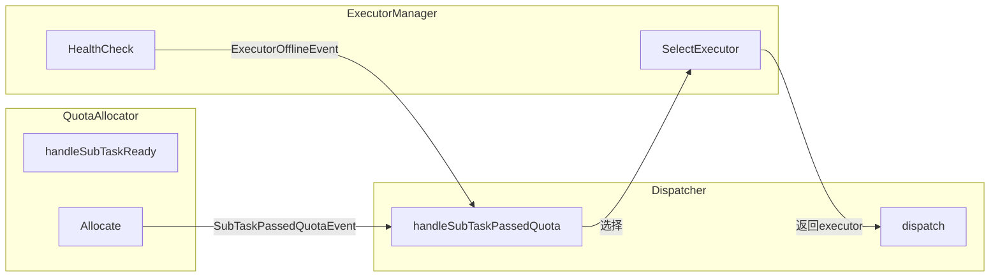

# 子任务分发器设计

## 一、概述

协调子任务的执行服务选择与分发发送，实现子任务到执行服务的可靠分发。

**职责边界**：
- 只关注分发执行，不关注配额分配（由 QuotaAllocator 处理）
- 接收已通过配额门控的子任务，执行分发
- 不感知任务/DAG结构，只感知子任务
- 协调 ExecutorManager 完成执行服务选择

**核心流程**：

```
子任务通过配额门控 → 选择执行服务 → 分发发送 → 发布子任务完成事件
```

---

## 二、结构与数据模型

### 2.1 Dispatcher（分发器）

```go
type Dispatcher struct {
    // 协调组件
    executorManager *ExecutorManager     // 执行服务管理

    // 存储与事件
    eventBus        EventBus
    storage         SubTaskStorage
    logger          *zap.Logger
    stopCh          chan struct{}
}
```

| 方法 | 说明 |
|------|------|
| Start(ctx) | 启动事件处理循环 |
| Receive(event) error | 接收事件（EventHandler接口） |
| handleSubTaskPassedQuota(event) | 处理配额通过事件 → 选择执行服务 → 分发 |
| handleExecutorOffline(event) | 处理执行服务失联 → 重置分发中的子任务 |
| dispatch(subTask) error | 分发子任务到执行服务 |

### 2.2 ExecutorManager（执行服务管理）

负责执行服务的注册、健康检查、服务选择。

```go
type ExecutorManager struct {
    registry      *ExecutorRegistry      // 执行服务注册表
    healthChecker *HealthChecker         // 健康检查器
    logger        *zap.Logger
    stopCh        chan struct{}
}

type Executor struct {
    ExecutorId string
    Address    string
    Status     int       // Active/Offline
    Capacity   int       // 执行容量
    LastCheck  time.Time
}
```

| 方法 | 说明 |
|------|------|
| GetActiveExecutors() []*Executor | 获取活跃的执行服务列表 |
| SelectExecutor() (*Executor, error) | 选择执行服务（负载均衡） |
| RegisterExecutor(executor) error | 注册执行服务 |
| DeregisterExecutor(address) error | 注销执行服务 |
| Start() | 启动健康检查循环 |
| Stop() | 停止健康检查 |

### 2.3 ExecutorRegistry（执行服务注册表）

```go
type ExecutorRegistry struct {
    executors map[string]*Executor       // executorId → Executor
    rwLock    sync.RWMutex
    logger    *zap.Logger
}
```

| 方法 | 说明 |
|------|------|
| Register(executor) error | 注册执行服务 |
| Deregister(executorId) error | 注销执行服务 |
| Get(executorId) (*Executor, error) | 获取执行服务 |
| ListActive() []*Executor | 获取活跃执行服务列表 |
| UpdateStatus(executorId, status) error | 更新执行服务状态 |

### 2.4 HealthChecker（健康检查器）

```go
type HealthChecker struct {
    registry       *ExecutorRegistry
    checkInterval  time.Duration
    maxFailCount   int
    logger         *zap.Logger
    stopCh         chan struct{}
}
```

| 方法 | 说明 |
|------|------|
| Start() | 启动健康检查循环 |
| Stop() | 停止健康检查 |
| checkHealth(executor) bool | 检查执行服务健康状态 |
| handleFailure(executor) | 处理健康检查失败 |
| publishOfflineEvent(executor) | 发布执行服务失联事件 |

---

## 三、核心逻辑

### 3.1 Dispatcher 事件处理循环

```go
func (d *Dispatcher) Start(ctx context.Context) {
    go func() {
        for {
            select {
            case event := <-d.eventBus.Receive():
                d.handleEvent(event)
            case <-ctx.Done():
                return
            }
        }
    }()
}

func (d *Dispatcher) handleEvent(event *Event) {
    switch event.Type {
    case SubTaskPassedQuotaEvent:
        d.handleSubTaskPassedQuota(event)
    case ExecutorOfflineEvent:
        d.handleExecutorOffline(event)
    case TaskCancelEvent:
        d.handleTaskCancel(event)
    }
}
```

### 3.2 handleSubTaskPassedQuota（子任务通过配额门控）

```go
func (d *Dispatcher) handleSubTaskPassedQuota(event *Event) error {
    subTaskId := event.Content.(*SubTaskPassedQuotaEventContent).SubTaskId
    subTask := d.storage.GetSubTask(subTaskId)

    // 1. 选择执行服务
    executor, err := d.executorManager.SelectExecutor()
    if err != nil {
        // 无可用执行服务，记录日志等待下次
        d.logger.Warn("no available executor", zap.String("subTaskId", subTaskId))
        return err
    }

    // 2. 分发子任务
    return d.dispatch(subTask, executor)
}
```

### 3.3 dispatch（分发子任务）

```go
func (d *Dispatcher) dispatch(subTask *SubTask, executor *Executor) error {
    // 1. 构建分发请求
    req := &DispatchRequest{
        SubTaskId:  subTask.SubTaskId,
        TaskId:     subTask.TaskId,
        Type:       subTask.Type,
        SubType:    subTask.SubType,
        Config:     subTask.Config,
        Extra:      subTask.Extra,
        Timeout:    subTask.Timeout,
    }

    // 2. 发送分发请求
    err := d.sendToExecutor(req, executor)
    if err != nil {
        d.logger.Error("dispatch failed",
            zap.String("subTaskId", subTask.SubTaskId),
            zap.String("executor", executor.Address),
            zap.Error(err))
        return err
    }

    // 3. 更新子任务状态为 Allocated
    d.storage.UpdateSubTaskStatus(subTask.SubTaskId, Allocated, nil)

    // 4. 记录执行服务绑定
    d.storage.UpdateSubTaskExecutor(subTask.SubTaskId, executor.ExecutorId)

    return nil
}

func (d *Dispatcher) sendToExecutor(req *DispatchRequest, executor *Executor) error {
    // HTTP POST 到执行服务的 DispatchAPI
    url := fmt.Sprintf("%s/internal/subtasks/dispatch", executor.Address)
    resp, err := http.Post(url, req)
    if err != nil {
        return err
    }
    if resp.StatusCode != 200 {
        return fmt.Errorf("dispatch failed: status %d", resp.StatusCode)
    }
    return nil
}
```

### 3.4 handleExecutorOffline（执行服务失联）

```go
func (d *Dispatcher) handleExecutorOffline(event *Event) error {
    executorId := event.Content.(*ExecutorOfflineEventContent).ExecutorId

    // 1. 获取该执行服务上的运行中子任务
    subTasks, err := d.storage.GetSubTasksByExecutor(executorId)
    if err != nil {
        return err
    }

    // 2. 重置子任务状态为 Exception（等待重新调度）
    for _, subTask := range subTasks {
        if subTask.Status == Running || subTask.Status == Allocated {
            d.storage.UpdateSubTaskStatus(subTask.SubTaskId, Exception, nil)
        }
    }

    d.logger.Info("reset subtasks for offline executor",
        zap.String("executorId", executorId),
        zap.Int("count", len(subTasks)))

    return nil
}
```

### 3.5 handleTaskCancel（任务取消）

```go
func (d *Dispatcher) handleTaskCancel(event *Event) error {
    content := event.Content.(*TaskCancelEventContent)
    taskId := content.TaskId

    // 1. 获取该任务已分发的子任务
    subTasks, err := d.storage.GetSubTasksByTask(taskId)
    if err != nil {
        return err
    }

    // 2. 向执行服务发送取消请求
    for _, subTask := range subTasks {
        if subTask.Status == Allocated || subTask.Status == Running {
            executor := d.executorManager.registry.Get(subTask.Executor)
            if executor != nil && executor.Status == Active {
                d.sendCancelToExecutor(subTask.SubTaskId, executor)
            }
        }
    }

    d.logger.Info("sent cancel requests for task",
        zap.String("taskId", taskId),
        zap.Int("count", len(subTasks)))

    return nil
}

func (d *Dispatcher) sendCancelToExecutor(subTaskId string, executor *Executor) error {
    url := fmt.Sprintf("%s/internal/subtasks/cancel", executor.Address)
    req := &CancelRequest{SubTaskId: subTaskId}
    _, err := http.Post(url, req)
    if err != nil {
        d.logger.Warn("cancel request failed",
            zap.String("subTaskId", subTaskId),
            zap.String("executor", executor.Address),
            zap.Error(err))
    }
    return err
}
```

### 3.6 ExecutorManager.SelectExecutor（执行服务选择）

```go
func (m *ExecutorManager) SelectExecutor() (*Executor, error) {
    executors := m.registry.ListActive()
    if len(executors) == 0 {
        return nil, errors.New("no active executor")
    }

    // 负载均衡策略：选择活跃子任务数最少的服务
    selected := executors[0]
    minLoad := m.getExecutorLoad(selected.ExecutorId)

    for _, executor := range executors[1:] {
        load := m.getExecutorLoad(executor.ExecutorId)
        if load < minLoad {
            selected = executor
            minLoad = load
        }
    }

    return selected, nil
}

func (m *ExecutorManager) getExecutorLoad(executorId string) int {
    // 查询该执行服务上的活跃子任务数
    subTasks := m.storage.GetSubTasksByExecutor(executorId)
    activeCount := 0
    for _, st := range subTasks {
        if st.Status == Running || st.Status == Allocated {
            activeCount++
        }
    }
    return activeCount
}
```

### 3.6 HealthChecker 健康检查循环

```go
func (h *HealthChecker) Start() {
    go func() {
        ticker := time.NewTicker(h.checkInterval)
        defer ticker.Stop()

        failCount := make(map[string]int)

        for {
            select {
            case <-ticker.C:
                executors := h.registry.ListActive()
                for _, executor := range executors {
                    if !h.checkHealth(executor) {
                        failCount[executor.ExecutorId]++
                        if failCount[executor.ExecutorId] >= h.maxFailCount {
                            h.handleFailure(executor)
                            failCount[executor.ExecutorId] = 0
                        }
                    } else {
                        failCount[executor.ExecutorId] = 0
                    }
                }
            case <-h.stopCh:
                return
            }
        }
    }()
}

func (h *HealthChecker) checkHealth(executor *Executor) bool {
    url := fmt.Sprintf("%s/health", executor.Address)
    resp, err := http.Get(url, 5*time.Second)
    if err != nil || resp.StatusCode != 200 {
        return false
    }
    return true
}

func (h *HealthChecker) handleFailure(executor *Executor) {
    // 1. 更新注册表状态
    h.registry.UpdateStatus(executor.ExecutorId, Offline)

    // 2. 发布失联事件
    h.eventBus.Publish(&Event{
        Type: ExecutorOfflineEvent,
        Content: &ExecutorOfflineEventContent{
            ExecutorId: executor.ExecutorId,
            Address:    executor.Address,
        },
    })
}
```

---

## 四、扩展与集成

### 4.1 事件处理总览

| 事件 | Dispatcher 处理 |
|------|-----------------|
| SubTaskPassedQuotaEvent | 选择执行服务 → 分发发送 |
| ExecutorOfflineEvent | 重置分发中的子任务状态 |
| TaskCancelEvent | 向执行服务发送取消请求 |

### 4.2 组件协作流程



### 4.3 设计模式应用

| 模式 | 应用 | 说明 |
|------|------|------|
| **观察者模式** | 事件驱动 | EventBus 通知，Dispatcher 响应 |
| **策略模式** | SelectExecutor | 执行服务选择策略可扩展 |
| **负载均衡** | 最少活跃数 | 选择活跃子任务数最少的执行服务 |

### 4.4 分发状态流转

```
SubTask 状态流转：
Pending → Allocated → Running → Finished
   ↑        ↑          ↑
   DAGScheduler  Dispatcher  ExecutorService
   (发布SubTaskReadyEvent → QuotaAllocator → Dispatcher)
```

### 4.5 错误处理

| 场景 | 处理方式 |
|------|----------|
| 无可用执行服务 | 记录日志，等待下次健康检查恢复后重新分发 |
| 分发请求失败 | 记录错误日志，子任务状态保持 Ready，等待重试 |
| 执行服务失联 | 重置子任务为 Exception，等待重新调度 |

---

## 五、相关文档

- [模块设计文档](../../模块设计文档.md) - Dispatcher 职责
- [事件总线设计](事件总线设计.md) - SubTaskPassedQuotaEvent 定义
- [配额分配器设计](配额分配器设计.md) - QuotaAllocator 配额门控逻辑
- [DAG调度器设计](DAG调度器设计.md) - DAGScheduler 与 Dispatcher 协作