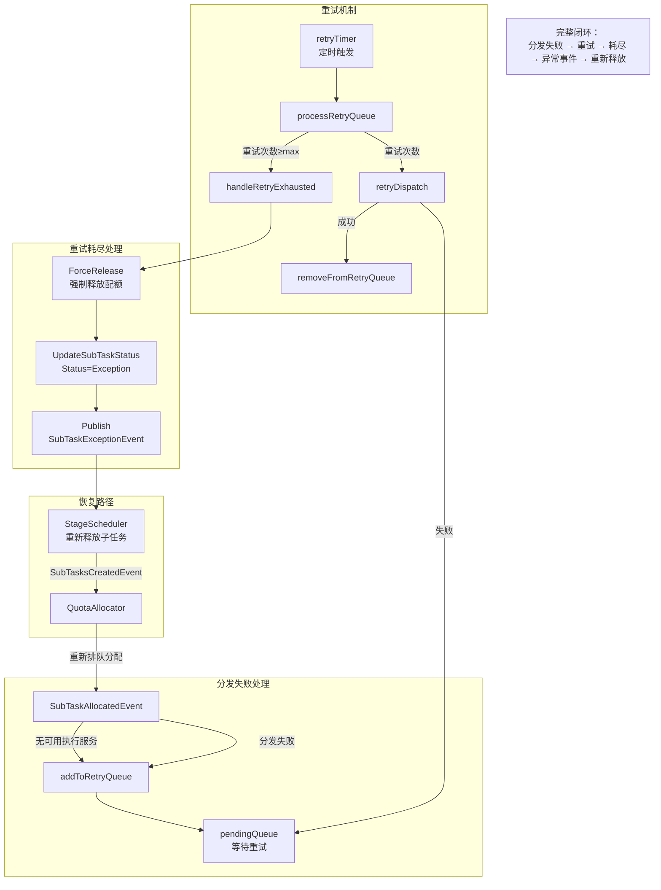
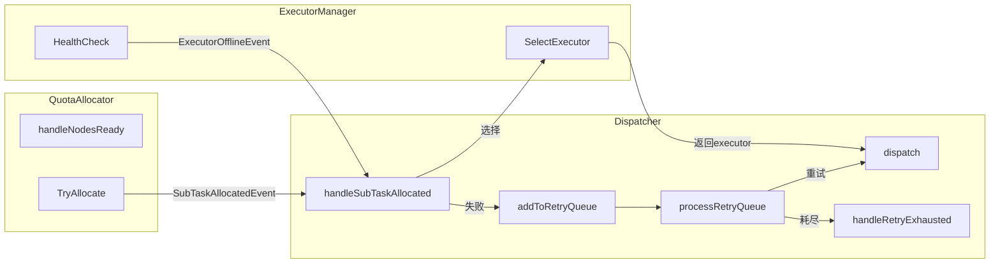
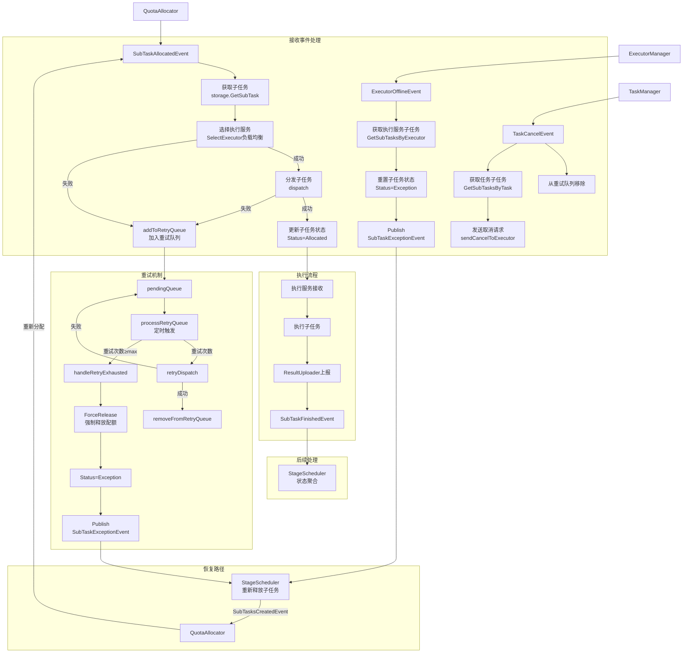

# 子任务分发器设计

## 一、概述

协调子任务的执行服务选择、分发发送与执行态清理，单个处理已分配配额的子任务。

**职责边界**：
- 负责执行服务选择、单个分发，以及已分发子任务的执行态清理
- 不关注配额分配（由 QuotaAllocator 处理）
- 接收 SubTaskAllocatedEvent（单个），执行分发
- 在执行服务失联时清理 `Allocated/Running` 子任务的执行态，并发布 `SubTaskExceptionEvent`
- 在任务取消时向执行服务发送取消请求并清理执行绑定
- 不感知任务/DAG结构，只感知子任务
- 协调 ExecutorManager 完成执行服务选择
- 不负责阶段状态聚合（由 StageScheduler 处理）

**核心流程**：

```
SubTaskAllocatedEvent → 选择执行服务 → 分发发送 → 子任务进入执行流程
```

---

## 二、结构与数据模型

### 2.1 Dispatcher（分发器）

```go
type Dispatcher struct {
    // 协调组件
    executorManager *ExecutorManager     // 执行服务管理
    quotaAllocator  *QuotaAllocator      // 配额分配器（用于强制释放配额）

    // 重试机制
    pendingQueue    map[string]*RetryItem  // subTaskId → RetryItem（待重试分发队列）
    retryTimer      *time.Timer             // 重试定时器
    retryInterval   time.Duration           // 重试间隔（默认 30s）
    maxRetryCount   int                     // 最大重试次数（默认 3）

    // 存储与事件
    eventBus        EventBus
    storage         SubTaskStorage
    logger          *zap.Logger
    stopCh          chan struct{}
    retryCh         chan string             // 重试触发通道
}

// RetryItem 重试项
type RetryItem struct {
    SubTaskId   string        // 子任务ID
    TaskId      string        // 任务ID
    StageId     int           // 阶段ID
    ModelId     string        // 模型ID（用于释放配额）
    RetryCount  int           // 当前重试次数
    LastAttempt time.Time     // 最后尝试时间
    Reason      string        // 失败原因
}
```

| 方法 | 说明 |
|------|------|
| Start(ctx) | 启动事件处理循环和重试定时器 |
| Receive(event) error | 接收事件（EventHandler接口） |
| handleSubTaskAllocated(event) | 处理配额分配事件 → 选择执行服务 → 分发或入重试队列 |
| handleExecutorOffline(event) | 处理执行服务失联 → 清理分发中的子任务执行态并发布 `SubTaskExceptionEvent` |
| handleTaskCancel(event) | 处理任务取消 → 向执行服务发送取消请求并清理执行绑定 |
| dispatch(subTask, executor) error | 分发子任务到执行服务 |
| addToRetryQueue(item) | 加入重试队列 |
| processRetryQueue() | 处理重试队列（定时触发） |
| retryDispatch(item) | 重试分发 |
| handleRetryExhausted(item) | 重试次数耗尽 → 强制释放配额 → 发布 SubTaskExceptionEvent |
| removeFromRetryQueue(subTaskId) | 从重试队列移除（分发成功或任务取消时） |

### 2.2 ExecutorManager（执行服务管理）

负责执行服务的注册、健康检查、服务选择。

```go
type ExecutorManager struct {
    registry      *ExecutorRegistry      // 执行服务注册表
    healthChecker *HealthChecker         // 健康检查器
    logger        *zap.Logger
    stopCh        chan struct{}
}

type Executor struct {
    ExecutorId string
    Address    string
    Status     int       // Active/Offline
    Capacity   int       // 执行容量
    LastCheck  time.Time
}
```

| 方法 | 说明 |
|------|------|
| GetActiveExecutors() []*Executor | 获取活跃的执行服务列表 |
| SelectExecutor() (*Executor, error) | 选择单个执行服务（负载均衡） |
| RegisterExecutor(executor) error | 注册执行服务 |
| DeregisterExecutor(address) error | 注销执行服务 |
| Start() | 启动健康检查循环 |
| Stop() | 停止健康检查 |

### 2.3 ExecutorRegistry（执行服务注册表）

```go
type ExecutorRegistry struct {
    executors map[string]*Executor       // executorId → Executor
    rwLock    sync.RWMutex
    logger    *zap.Logger
}
```

| 方法 | 说明 |
|------|------|
| Register(executor) error | 注册执行服务 |
| Deregister(executorId) error | 注销执行服务 |
| Get(executorId) (*Executor, error) | 获取执行服务 |
| ListActive() []*Executor | 获取活跃执行服务列表 |
| UpdateStatus(executorId, status) error | 更新执行服务状态 |

### 2.4 HealthChecker（健康检查器）

```go
type HealthChecker struct {
    registry       *ExecutorRegistry
    checkInterval  time.Duration
    maxFailCount   int
    logger         *zap.Logger
    stopCh         chan struct{}
}
```

| 方法 | 说明 |
|------|------|
| Start() | 启动健康检查循环 |
| Stop() | 停止健康检查 |
| checkHealth(executor) bool | 检查执行服务健康状态 |
| handleFailure(executor) | 处理健康检查失败 |
| publishOfflineEvent(executor) | 发布执行服务失联事件 |

---

## 三、核心逻辑

### 3.1 Dispatcher 事件处理循环

```go
func (d *Dispatcher) Start(ctx context.Context) {
    // 启动重试定时器
    d.retryTimer = time.NewTimer(d.retryInterval)
    
    go func() {
        for {
            select {
            case event := <-d.eventBus.Receive():
                d.handleEvent(event)
            case <-d.retryTimer.C:
                d.processRetryQueue()
                d.retryTimer.Reset(d.retryInterval)
            case subTaskId := <-d.retryCh:
                // 立即重试（执行服务恢复时触发）
                d.retryImmediately(subTaskId)
            case <-ctx.Done():
                d.retryTimer.Stop()
                return
            case <-d.stopCh:
                d.retryTimer.Stop()
                return
            }
        }
    }()
}

func (d *Dispatcher) handleEvent(event *Event) {
    switch event.Type {
    case SubTaskAllocatedEvent:
        d.handleSubTaskAllocated(event)
    case ExecutorOfflineEvent:
        d.handleExecutorOffline(event)
    case TaskCancelEvent:
        d.handleTaskCancel(event)
    }
}
```

### 3.2 handleSubTaskAllocated（单个处理配额分配）

```go
func (d *Dispatcher) handleSubTaskAllocated(event *Event) error {
    content := event.Content.(*SubTaskAllocatedEventContent)
    taskId := content.TaskId
    stageId := content.StageId
    subTaskId := content.SubTaskId
    modelId := content.ModelId

    // 1. 获取子任务
    subTask := d.storage.GetSubTask(subTaskId)
    if subTask == nil {
        d.logger.Error("subtask not found",
            zap.String("taskId", taskId),
            zap.Int("stageId", stageId),
            zap.String("subTaskId", subTaskId))
        return fmt.Errorf("subtask not found: %s", subTaskId)
    }

    // 2. 选择执行服务
    executor, err := d.executorManager.SelectExecutor()
    if err != nil {
        // 无可用执行服务，加入重试队列
        d.addToRetryQueue(&RetryItem{
            SubTaskId:   subTaskId,
            TaskId:      taskId,
            StageId:     stageId,
            ModelId:     modelId,
            RetryCount:  0,
            LastAttempt: time.Now(),
            Reason:      "no available executor",
        })
        return nil  // 不返回错误，事件已处理（进入重试队列）
    }

    // 3. 分发子任务
    err = d.dispatch(subTask, executor)
    if err != nil {
        // 分发失败，加入重试队列
        d.addToRetryQueue(&RetryItem{
            SubTaskId:   subTaskId,
            TaskId:      taskId,
            StageId:     stageId,
            ModelId:     modelId,
            RetryCount:  0,
            LastAttempt: time.Now(),
            Reason:      "dispatch failed: " + err.Error(),
        })
        return nil  // 不返回错误，事件已处理（进入重试队列）
    }

    // 4. 分发成功，从重试队列移除（如果存在）
    d.removeFromRetryQueue(subTaskId)

    return nil
}
```

### 3.3 addToRetryQueue（加入重试队列）

```go
func (d *Dispatcher) addToRetryQueue(item *RetryItem) {
    d.pendingQueue[item.SubTaskId] = item
    
    d.logger.Warn("subtask added to retry queue",
        zap.String("taskId", item.TaskId),
        zap.Int("stageId", item.StageId),
        zap.String("subTaskId", item.SubTaskId),
        zap.String("reason", item.Reason))
}
```

### 3.4 processRetryQueue（处理重试队列）

```go
func (d *Dispatcher) processRetryQueue() {
    for subTaskId, item := range d.pendingQueue {
        // 增加重试计数
        item.RetryCount++
        item.LastAttempt = time.Now()
        
        if item.RetryCount >= d.maxRetryCount {
            // 重试次数耗尽，强制释放配额并发布异常事件
            d.handleRetryExhausted(item)
            delete(d.pendingQueue, subTaskId)
            continue
        }
        
        // 尝试重新分发
        d.retryDispatch(item)
    }
}
```

### 3.5 retryDispatch（重试分发）

```go
func (d *Dispatcher) retryDispatch(item *RetryItem) {
    subTask := d.storage.GetSubTask(item.SubTaskId)
    if subTask == nil {
        // 子任务不存在（可能已被取消），从队列移除
        d.removeFromRetryQueue(item.SubTaskId)
        return
    }
    
    // 检查任务是否已取消
    task := d.storage.GetTask(item.TaskId)
    if task != nil && task.Status == TaskCancelled {
        d.removeFromRetryQueue(item.SubTaskId)
        return
    }
    
    // 选择执行服务
    executor, err := d.executorManager.SelectExecutor()
    if err != nil {
        // 仍然无可用执行服务，等待下次重试
        d.logger.Debug("retry dispatch: no executor available",
            zap.String("subTaskId", item.SubTaskId),
            zap.Int("retryCount", item.RetryCount))
        return
    }
    
    // 尝试分发
    err = d.dispatch(subTask, executor)
    if err != nil {
        // 分发失败，等待下次重试
        d.logger.Warn("retry dispatch failed",
            zap.String("subTaskId", item.SubTaskId),
            zap.Int("retryCount", item.RetryCount),
            zap.Error(err))
        return
    }
    
    // 分发成功，从重试队列移除
    d.removeFromRetryQueue(item.SubTaskId)
    
    d.logger.Info("retry dispatch succeeded",
        zap.String("subTaskId", item.SubTaskId),
        zap.Int("retryCount", item.RetryCount))
}
```

### 3.6 handleRetryExhausted（重试次数耗尽）

```go
func (d *Dispatcher) handleRetryExhausted(item *RetryItem) {
    d.logger.Error("retry exhausted, forcing release",
        zap.String("taskId", item.TaskId),
        zap.Int("stageId", item.StageId),
        zap.String("subTaskId", item.SubTaskId),
        zap.String("modelId", item.ModelId),
        zap.Int("totalRetries", item.RetryCount))
    
    // 1. 强制释放配额（如果有）
    if item.ModelId != "" {
        d.quotaAllocator.ForceRelease(item.ModelId, item.SubTaskId)
    }
    
    // 2. 更新子任务状态为 Exception
    d.storage.UpdateSubTaskStatus(item.SubTaskId, SubTaskException, nil)
    d.storage.UpdateSubTaskExecutor(item.SubTaskId, "")
    
    // 3. 发布 SubTaskExceptionEvent，触发 StageScheduler 重新释放
    d.eventBus.Publish(&Event{
        Type: SubTaskExceptionEvent,
        Content: &SubTaskExceptionEventContent{
            TaskId:    item.TaskId,
            StageId:   item.StageId,
            SubTaskId: item.SubTaskId,
            Reason:    "dispatch retry exhausted: " + item.Reason,
        },
    })
}
```

### 3.7 removeFromRetryQueue（从重试队列移除）

```go
func (d *Dispatcher) removeFromRetryQueue(subTaskId string) {
    if _, exists := d.pendingQueue[subTaskId]; exists {
        delete(d.pendingQueue, subTaskId)
        d.logger.Debug("removed from retry queue",
            zap.String("subTaskId", subTaskId))
    }
}
```

### 3.8 retryImmediately（立即重试）

执行服务恢复时触发立即重试，而非等待定时器。

```go
func (d *Dispatcher) retryImmediately(subTaskId string) {
    item, exists := d.pendingQueue[subTaskId]
    if !exists {
        return
    }
    
    d.retryDispatch(item)
}
```

### 3.10 dispatch（分发子任务）

```go
func (d *Dispatcher) dispatch(subTask *SubTask, executor *Executor) error {
    // 1. 构建分发请求
    req := &DispatchRequest{
        SubTaskId:  subTask.SubTaskId,
        TaskId:     subTask.TaskId,
        StageId:    subTask.StageId,
        TaskType:   subTask.TaskType,
        StageType:  subTask.StageType,
        Input:      subTask.Input,
    }

    // 2. 发送分发请求
    err := d.sendToExecutor(req, executor)
    if err != nil {
        d.logger.Error("dispatch failed",
            zap.String("subTaskId", subTask.SubTaskId),
            zap.String("executor", executor.Address),
            zap.Error(err))
        // 分发失败，返回错误（上层会将子任务加入重试队列）
        return err
    }

    // 3. 更新子任务状态为 Allocated
    d.storage.UpdateSubTaskStatus(subTask.SubTaskId, Allocated, nil)

    // 4. 记录执行服务绑定
    d.storage.UpdateSubTaskExecutor(subTask.SubTaskId, executor.ExecutorId)

    d.logger.Info("subtask dispatched",
        zap.String("taskId", subTask.TaskId),
        zap.Int("stageId", subTask.StageId),
        zap.String("subTaskId", subTask.SubTaskId),
        zap.String("executor", executor.ExecutorId))

    return nil
}

func (d *Dispatcher) sendToExecutor(req *DispatchRequest, executor *Executor) error {
    // HTTP POST 到执行服务的 DispatchAPI
    url := fmt.Sprintf("%s/internal/subtasks/dispatch", executor.Address)
    resp, err := http.Post(url, req)
    if err != nil {
        return err
    }
    if resp.StatusCode != 200 {
        return fmt.Errorf("dispatch failed: status %d", resp.StatusCode)
    }
    return nil
}
```

### 3.11 handleExecutorOffline（执行服务失联）

```go
func (d *Dispatcher) handleExecutorOffline(event *Event) error {
    content := event.Content.(*ExecutorOfflineEventContent)
    executorId := content.ExecutorId

    // 1. 获取该执行服务上的运行中子任务
    subTasks, err := d.storage.GetSubTasksByExecutor(executorId)
    if err != nil {
        return err
    }

    // 2. 清理执行态并发布可恢复异常事件
    for _, subTask := range subTasks {
        if subTask.Status == Running || subTask.Status == Allocated {
            if err := d.storage.UpdateSubTaskStatus(subTask.SubTaskId, Exception, nil); err != nil {
                return err
            }
            d.storage.UpdateSubTaskExecutor(subTask.SubTaskId, "")

            d.eventBus.Publish(&Event{
                Type: SubTaskExceptionEvent,
                Content: &SubTaskExceptionEventContent{
                    TaskId:    subTask.TaskId,
                    StageId:   subTask.StageId,
                    SubTaskId: subTask.SubTaskId,
                    Reason:    "executor offline",
                },
            })
        }
    }
    
    // 3. 通知 QuotaAllocator 恢复后触发立即重试（可选）
    // 当有新的执行服务注册时，可以通过 retryCh 触发立即重试

    d.logger.Info("cleanup subtasks for offline executor",
        zap.String("executorId", executorId),
        zap.Int("count", len(subTasks)))

    return nil
}

// 恢复路径说明：
// Dispatcher 在执行服务失联时负责清理已分发子任务的执行态，并为每个受影响子任务发布 SubTaskExceptionEvent。
// StageScheduler 收到异常事件后会重新释放子任务，重新发布 SubTasksCreatedEvent，
// 后续继续进入 QuotaAllocator → SubTaskAllocatedEvent → Dispatcher 的标准调度链路。
```

### 3.12 handleTaskCancel（任务取消）

```go
func (d *Dispatcher) handleTaskCancel(event *Event) error {
    content := event.Content.(*TaskCancelEventContent)
    taskId := content.TaskId

    // 1. 从重试队列移除该任务的所有子任务
    for subTaskId, item := range d.pendingQueue {
        if item.TaskId == taskId {
            delete(d.pendingQueue, subTaskId)
            d.logger.Debug("removed from retry queue for cancelled task",
                zap.String("subTaskId", subTaskId))
        }
    }

    // 2. 获取该任务已分发的子任务
    subTasks, err := d.storage.GetSubTasksByTask(taskId)
    if err != nil {
        return err
    }

    // 3. 向执行服务发送取消请求并清理执行绑定
    for _, subTask := range subTasks {
        if subTask.Status == Allocated || subTask.Status == Running {
            executor := d.executorManager.registry.Get(subTask.Executor)
            if executor != nil && executor.Status == Active {
                d.sendCancelToExecutor(subTask.SubTaskId, executor)
            }
            d.storage.UpdateSubTaskExecutor(subTask.SubTaskId, "")
        }
    }

    d.logger.Info("sent cancel requests for task",
        zap.String("taskId", taskId),
        zap.Int("count", len(subTasks)))

    return nil
}

func (d *Dispatcher) sendCancelToExecutor(subTaskId string, executor *Executor) error {
    url := fmt.Sprintf("%s/internal/subtasks/cancel", executor.Address)
    req := &CancelRequest{SubTaskId: subTaskId}
    _, err := http.Post(url, req)
    if err != nil {
        d.logger.Warn("cancel request failed",
            zap.String("subTaskId", subTaskId),
            zap.String("executor", executor.Address),
            zap.Error(err))
    }
    return err
}
```

### 3.13 ExecutorManager.SelectExecutor（选择执行服务）

```go
func (m *ExecutorManager) SelectExecutor() (*Executor, error) {
    executors := m.registry.ListActive()
    if len(executors) == 0 {
        return nil, errors.New("no active executor")
    }

    // 负载均衡策略：按活跃子任务数排序，选择负载最低的
    sortedExecutors := m.sortByLoad(executors)

    // 返回负载最低的执行服务
    return sortedExecutors[0], nil
}

func (m *ExecutorManager) sortByLoad(executors []*Executor) []*Executor {
    // 按活跃子任务数排序（升序）
    loadMap := make(map[string]int)
    for _, exec := range executors {
        loadMap[exec.ExecutorId] = m.getExecutorLoad(exec.ExecutorId)
    }

    sort.Slice(executors, func(i, j int) bool {
        return loadMap[executors[i].ExecutorId] < loadMap[executors[j].ExecutorId]
    })

    return executors
}

func (m *ExecutorManager) getExecutorLoad(executorId string) int {
    // 查询该执行服务上的活跃子任务数
    subTasks := m.storage.GetSubTasksByExecutor(executorId)
    activeCount := 0
    for _, st := range subTasks {
        if st.Status == Running || st.Status == Allocated {
            activeCount++
        }
    }
    return activeCount
}
```

---

## 四、扩展与集成

### 4.1 分发失败恢复机制



### 4.2 重试参数配置

| 参数 | 默认值 | 说明 |
|------|--------|------|
| retryInterval | 30s | 重试定时器间隔 |
| maxRetryCount | 3 | 最大重试次数 |
| retryCh | - | 立即重试通道（执行服务恢复时触发） |

**参数调优建议**：

| 场景 | retryInterval | maxRetryCount | 说明 |
|------|--------------|---------------|------|
| 高可用环境 | 10s | 5 | 快速重试，容忍短暂故障 |
| 普通环境 | 30s | 3 | 默认配置，平衡性能与可靠性 |
| 低成本环境 | 60s | 2 | 降低重试频率，减少资源消耗 |

### 4.3 组件协作流程



### 4.4 设计模式应用

| 模式 | 应用 | 说明 |
|------|------|------|
| **观察者模式** | 事件驱动 | EventBus 通知，Dispatcher 响应 |
| **策略模式** | SelectExecutor | 执行服务选择策略可扩展 |
| **负载均衡** | 最少活跃数 | 选择活跃子任务数最少的执行服务 |
| **单个处理** | SubTaskAllocatedEvent | 单个接收、单个分发 |
| **重试队列** | pendingQueue | 分发失败后内部重试，无需外部事件 |

### 4.5 分发状态流转

```
SubTask 状态流转：
Pending → Allocated → Running → Finished
   ↑        ↑          ↑
   StageScheduler  Dispatcher  ExecutorService
   (SubTasksCreatedEvent → QuotaAllocator → Dispatcher)

分发失败重试路径：
Pending → [重试队列] → Allocated → Running → Finished
              ↑
              Dispatcher内部处理（无需外部事件）

分发失败耗尽路径：
Pending → Exception → 重新释放 → Pending（闭环）
              ↑
              SubTaskExceptionEvent → StageScheduler
```

### 4.6 错误处理

| 场景 | 处理方式 | 恢复机制 |
|------|----------|---------|
| 无可用执行服务 | 加入重试队列，等待定时重试 | 定时器每 retryInterval 检查 |
| 分发请求失败 | 加入重试队列，等待定时重试 | 定时器每 retryInterval 检查 |
| 重试次数耗尽 | 强制释放配额 + 发布 SubTaskExceptionEvent | StageScheduler 重新释放子任务 |
| 执行服务失联 | 清理子任务执行态 + 发布 SubTaskExceptionEvent | StageScheduler 重新释放子任务 |

### 4.7 事件交互详情

#### 接收事件

| 事件类型 | 事件来源 | 触发时机 | 处理流程 |
|---------|---------|---------|---------|
| SubTaskAllocatedEvent | QuotaAllocator | 配额分配成功，子任务已通过配额门控 | 1. 获取子任务<br/>2. 选择执行服务（负载均衡）<br/>3. 成功：分发子任务，更新状态为Allocated<br/>4. 失败：加入重试队列 |
| ExecutorOfflineEvent | ExecutorManager | 健康检查连续失败，执行服务标记为offline | 1. 获取该执行服务的运行中子任务<br/>2. 清理子任务执行态并移除执行绑定<br/>3. 发布 `SubTaskExceptionEvent` 触发 StageScheduler 重新释放子任务 |
| TaskCancelEvent | TaskManager | 用户主动取消任务 | 1. 从重试队列移除该任务的所有子任务<br/>2. 获取该任务已分发的子任务<br/>3. 向执行服务发送取消请求<br/>4. 清理执行绑定 |

#### 发出事件

| 事件类型 | 发布时机 | 目标模块 | 触发动作 |
|---------|---------|---------|---------|
| SubTaskExceptionEvent | 1. 执行服务失联后完成执行态清理<br/>2. 分发重试次数耗尽 | StageScheduler | 重新释放异常子任务 |

> **说明**：
> - Dispatcher 负责执行器选择、分发以及已分发子任务的执行态清理
> - `SubTaskExceptionEvent` 由 Dispatcher 在两种情况下发布：
>   1. 执行服务失联后清理子任务执行态
>   2. 分发重试次数耗尽后强制释放配额
> - `SubTaskFinishedEvent` 由 TaskManager 在子任务状态落库后发布
> - 执行服务通过 HTTP 调用调度服务的 StatusAPI 上报状态，TaskManager 更新数据库后发布 `SubTaskFinishedEvent` 到 EventBus
> - 分发失败后子任务进入 Dispatcher 内部重试队列，无需外部事件触发重试

#### 事件处理流程图



---

## 五、相关文档

- [模块设计文档](../../模块设计文档.md) - Dispatcher 职责
- [事件总线设计](事件总线设计.md) - SubTaskAllocatedEvent 定义
- [配额分配器设计](配额分配器设计.md) - QuotaAllocator 配额门控逻辑
- [阶段调度器设计](阶段调度器设计.md) - StageScheduler 子任务释放逻辑
- [执行服务管理器设计](执行服务管理器设计.md) - ExecutorManager 详细设计
- [数据模型设计文档](../../数据模型设计文档.md) - subtasks 表结构
- [模块设计文档](../../模块设计文档.md) - 增量式拆分架构