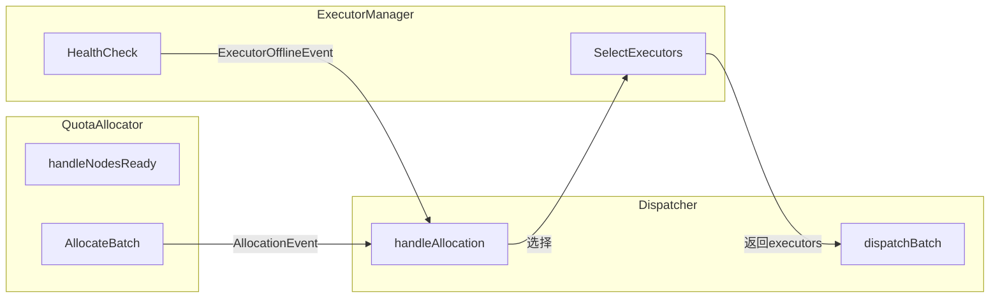
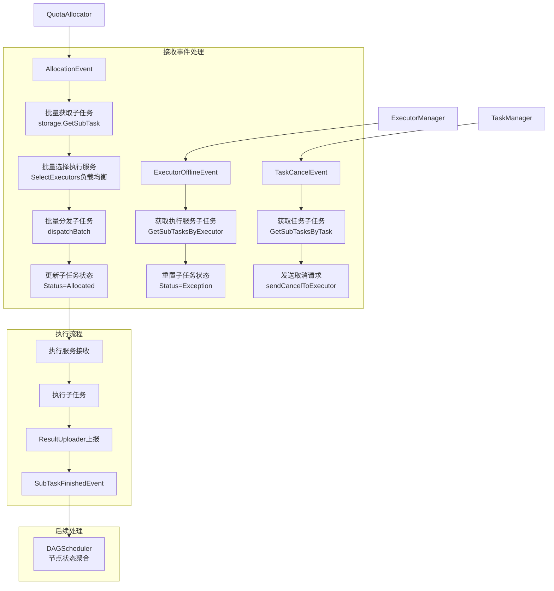

# 子任务分发器设计

## 一、概述

协调子任务的执行服务选择、分发发送与执行态清理，批量处理配额分配结果。

**职责边界**：
- 负责执行服务选择、批量分发，以及已分发子任务的执行态清理
- 不关注配额分配（由 QuotaAllocator 处理）
- 接收配额分配结果（AllocationEvent），批量执行分发
- 在执行服务失联时清理 `Allocated/Running` 子任务的执行态，并发布 `SubTaskExceptionEvent`
- 在任务取消时向执行服务发送取消请求并清理执行绑定
- 不感知任务/DAG结构，只感知子任务
- 协调 ExecutorManager 完成执行服务选择
- 不负责 DAG 重试决策（由 DAGScheduler 处理）

**核心变化**：
- 旧设计：订阅 SubTaskPassedQuotaEvent（单个），逐个分发
- 新设计：订阅 AllocationEvent（批量），批量分发

**核心流程**：

```
AllocationEvent → 批量选择执行服务 → 批量分发发送 → 子任务进入执行流程
```

---

## 二、结构与数据模型

### 2.1 Dispatcher（分发器）

```go
type Dispatcher struct {
    // 协调组件
    executorManager *ExecutorManager     // 执行服务管理

    // 存储与事件
    eventBus        EventBus
    storage         SubTaskStorage
    logger          *zap.Logger
    stopCh          chan struct{}
}
```

| 方法 | 说明 |
|------|------|
| Start(ctx) | 启动事件处理循环 |
| Receive(event) error | 接收事件（EventHandler接口） |
| handleAllocation(event) | 处理配额分配事件 → 批量选择执行服务 → 批量分发 |
| handleExecutorOffline(event) | 处理执行服务失联 → 清理分发中的子任务执行态并发布 `SubTaskExceptionEvent` |
| handleTaskCancel(event) | 处理任务取消 → 向执行服务发送取消请求并清理执行绑定 |
| dispatchBatch(subTasks, executors) error | 批量分发子任务到执行服务 |

### 2.2 ExecutorManager（执行服务管理）

负责执行服务的注册、健康检查、服务选择。

```go
type ExecutorManager struct {
    registry      *ExecutorRegistry      // 执行服务注册表
    healthChecker *HealthChecker         // 健康检查器
    logger        *zap.Logger
    stopCh        chan struct{}
}

type Executor struct {
    ExecutorId string
    Address    string
    Status     int       // Active/Offline
    Capacity   int       // 执行容量
    LastCheck  time.Time
}
```

| 方法 | 说明 |
|------|------|
| GetActiveExecutors() []*Executor | 获取活跃的执行服务列表 |
| SelectExecutors(count int) ([]*Executor, error) | 批量选择执行服务（负载均衡） |
| RegisterExecutor(executor) error | 注册执行服务 |
| DeregisterExecutor(address) error | 注销执行服务 |
| Start() | 启动健康检查循环 |
| Stop() | 停止健康检查 |

### 2.3 ExecutorRegistry（执行服务注册表）

```go
type ExecutorRegistry struct {
    executors map[string]*Executor       // executorId → Executor
    rwLock    sync.RWMutex
    logger    *zap.Logger
}
```

| 方法 | 说明 |
|------|------|
| Register(executor) error | 注册执行服务 |
| Deregister(executorId) error | 注销执行服务 |
| Get(executorId) (*Executor, error) | 获取执行服务 |
| ListActive() []*Executor | 获取活跃执行服务列表 |
| UpdateStatus(executorId, status) error | 更新执行服务状态 |

### 2.4 HealthChecker（健康检查器）

```go
type HealthChecker struct {
    registry       *ExecutorRegistry
    checkInterval  time.Duration
    maxFailCount   int
    logger         *zap.Logger
    stopCh         chan struct{}
}
```

| 方法 | 说明 |
|------|------|
| Start() | 启动健康检查循环 |
| Stop() | 停止健康检查 |
| checkHealth(executor) bool | 检查执行服务健康状态 |
| handleFailure(executor) | 处理健康检查失败 |
| publishOfflineEvent(executor) | 发布执行服务失联事件 |

---

## 三、核心逻辑

### 3.1 Dispatcher 事件处理循环

```go
func (d *Dispatcher) Start(ctx context.Context) {
    go func() {
        for {
            select {
            case event := <-d.eventBus.Receive():
                d.handleEvent(event)
            case <-ctx.Done():
                return
            }
        }
    }()
}

func (d *Dispatcher) handleEvent(event *Event) {
    switch event.Type {
    case AllocationEvent:
        d.handleAllocation(event)
    case ExecutorOfflineEvent:
        d.handleExecutorOffline(event)
    case TaskCancelEvent:
        d.handleTaskCancel(event)
    }
}
```

### 3.2 handleAllocation（批量处理配额分配）

```go
func (d *Dispatcher) handleAllocation(event *Event) error {
    content := event.Content.(*AllocationEventContent)
    taskId := content.TaskId
    stageId := content.StageId
    allocations := content.Allocations

    // 1. 批量获取子任务
    subTasks := []*SubTask{}
    for _, alloc := range allocations {
        subTask := d.storage.GetSubTask(alloc.SubTaskId)
        subTasks = append(subTasks, subTask)
    }

    // 2. 批量选择执行服务
    executors, err := d.executorManager.SelectExecutors(len(subTasks))
    if err != nil {
        // 无可用执行服务，记录日志等待下次
        d.logger.Warn("no available executors",
            zap.String("taskId", taskId),
            zap.Int("stageId", stageId),
            zap.Int("count", len(subTasks)))
        return err
    }

    // 3. 批量分发子任务
    return d.dispatchBatch(subTasks, executors, taskId, stageId)
}
```

### 3.3 dispatchBatch（批量分发子任务）

```go
func (d *Dispatcher) dispatchBatch(subTasks []*SubTask, executors []*Executor, taskId string, stageId int) error {
    // 1. 按负载均衡策略分配子任务到执行服务
    assignments := d.assignSubTasks(subTasks, executors)

    // 2. 并行发送分发请求
    for subTaskId, executor := range assignments {
        go func(stId string, exec *Executor) {
            subTask := d.storage.GetSubTask(stId)
            err := d.dispatch(subTask, exec)
            if err != nil {
                d.logger.Error("dispatch failed",
                    zap.String("subTaskId", stId),
                    zap.String("executor", exec.Address),
                    zap.Error(err))
                // 分发失败，子任务状态保持待分配，等待重试
            }
        }(subTaskId, executor)
    }

    return nil
}

func (d *Dispatcher) assignSubTasks(subTasks []*SubTask, executors []*Executor) map[string]*Executor {
    assignments := make(map[string]*Executor)

    // 负载均衡策略：轮询分配
    for i, subTask := range subTasks {
        executorIndex := i % len(executors)
        assignments[subTask.SubTaskId] = executors[executorIndex]
    }

    return assignments
}
```

### 3.4 dispatch（分发单个子任务）

```go
func (d *Dispatcher) dispatch(subTask *SubTask, executor *Executor) error {
    // 1. 构建分发请求
    req := &DispatchRequest{
        SubTaskId:  subTask.SubTaskId,
        TaskId:     subTask.TaskId,
        StageId:    subTask.StageId,
        TaskType:   subTask.TaskType,
        StageType:  subTask.StageType,
        Input:      subTask.Input,
    }

    // 2. 发送分发请求
    err := d.sendToExecutor(req, executor)
    if err != nil {
        return err
    }

    // 3. 更新子任务状态为 Allocated
    d.storage.UpdateSubTaskStatus(subTask.SubTaskId, Allocated, nil)

    // 4. 记录执行服务绑定
    d.storage.UpdateSubTaskExecutor(subTask.SubTaskId, executor.ExecutorId)

    return nil
}

func (d *Dispatcher) sendToExecutor(req *DispatchRequest, executor *Executor) error {
    // HTTP POST 到执行服务的 DispatchAPI
    url := fmt.Sprintf("%s/internal/subtasks/dispatch", executor.Address)
    resp, err := http.Post(url, req)
    if err != nil {
        return err
    }
    if resp.StatusCode != 200 {
        return fmt.Errorf("dispatch failed: status %d", resp.StatusCode)
    }
    return nil
}
```

### 3.5 handleExecutorOffline（执行服务失联）

```go
func (d *Dispatcher) handleExecutorOffline(event *Event) error {
    content := event.Content.(*ExecutorOfflineEventContent)
    executorId := content.ExecutorId

    // 1. 获取该执行服务上的运行中子任务
    subTasks, err := d.storage.GetSubTasksByExecutor(executorId)
    if err != nil {
        return err
    }

    // 2. 清理执行态并发布可恢复异常事件
    for _, subTask := range subTasks {
        if subTask.Status == Running || subTask.Status == Allocated {
            if err := d.storage.UpdateSubTaskStatus(subTask.SubTaskId, Exception, nil); err != nil {
                return err
            }
            d.storage.UpdateSubTaskExecutor(subTask.SubTaskId, "")

            d.eventBus.Publish(&Event{
                Type: SubTaskExceptionEvent,
                Content: &SubTaskExceptionEventContent{
                    TaskId:    subTask.TaskId,
                    StageId:   subTask.StageId,
                    SubTaskId: subTask.SubTaskId,
                    Reason:    "executor offline",
                },
            })
        }
    }

    d.logger.Info("cleanup subtasks for offline executor",
        zap.String("executorId", executorId),
        zap.Int("count", len(subTasks)))

    return nil
}

// 恢复路径说明：
// Dispatcher 在执行服务失联时负责清理已分发子任务的执行态，并为每个受影响子任务发布 SubTaskExceptionEvent。
// DAGScheduler 收到异常事件后会立即重新评估对应 DAGNode，若节点仍可重试，则重新发布 NodesReadyEvent，
// 后续继续进入 QuotaAllocator → AllocationEvent → Dispatcher 的标准调度链路。
```

### 3.6 handleTaskCancel（任务取消）

```go
func (d *Dispatcher) handleTaskCancel(event *Event) error {
    content := event.Content.(*TaskCancelEventContent)
    taskId := content.TaskId

    // 1. 获取该任务已分发的子任务
    subTasks, err := d.storage.GetSubTasksByTask(taskId)
    if err != nil {
        return err
    }

    // 2. 向执行服务发送取消请求并清理执行绑定
    for _, subTask := range subTasks {
        if subTask.Status == Allocated || subTask.Status == Running {
            executor := d.executorManager.registry.Get(subTask.Executor)
            if executor != nil && executor.Status == Active {
                d.sendCancelToExecutor(subTask.SubTaskId, executor)
            }
            d.storage.UpdateSubTaskExecutor(subTask.SubTaskId, "")
        }
    }

    d.logger.Info("sent cancel requests for task",
        zap.String("taskId", taskId),
        zap.Int("count", len(subTasks)))

    return nil
}

func (d *Dispatcher) sendCancelToExecutor(subTaskId string, executor *Executor) error {
    url := fmt.Sprintf("%s/internal/subtasks/cancel", executor.Address)
    req := &CancelRequest{SubTaskId: subTaskId}
    _, err := http.Post(url, req)
    if err != nil {
        d.logger.Warn("cancel request failed",
            zap.String("subTaskId", subTaskId),
            zap.String("executor", executor.Address),
            zap.Error(err))
    }
    return err
}
```

### 3.7 ExecutorManager.SelectExecutors（批量选择执行服务）

```go
func (m *ExecutorManager) SelectExecutors(count int) ([]*Executor, error) {
    executors := m.registry.ListActive()
    if len(executors) == 0 {
        return nil, errors.New("no active executor")
    }

    // 负载均衡策略：按活跃子任务数排序，选择负载最低的
    sortedExecutors := m.sortByLoad(executors)

    // 根据需要的数量返回执行服务（循环使用）
    result := []*Executor{}
    for i := 0; i < count; i++ {
        result = append(result, sortedExecutors[i % len(sortedExecutors)])
    }

    return result, nil
}

func (m *ExecutorManager) sortByLoad(executors []*Executor) []*Executor {
    // 按活跃子任务数排序（升序）
    loadMap := make(map[string]int)
    for _, exec := range executors {
        loadMap[exec.ExecutorId] = m.getExecutorLoad(exec.ExecutorId)
    }

    sort.Slice(executors, func(i, j int) bool {
        return loadMap[executors[i].ExecutorId] < loadMap[executors[j].ExecutorId]
    })

    return executors
}

func (m *ExecutorManager) getExecutorLoad(executorId string) int {
    // 查询该执行服务上的活跃子任务数
    subTasks := m.storage.GetSubTasksByExecutor(executorId)
    activeCount := 0
    for _, st := range subTasks {
        if st.Status == Running || st.Status == Allocated {
            activeCount++
        }
    }
    return activeCount
}
```

---

## 四、扩展与集成

### 4.1 组件协作流程



### 4.2 设计模式应用

| 模式 | 应用 | 说明 |
|------|------|------|
| **观察者模式** | 事件驱动 | EventBus 通知，Dispatcher 响应 |
| **策略模式** | SelectExecutors | 执行服务选择策略可扩展 |
| **负载均衡** | 最少活跃数 | 选择活跃子任务数最少的执行服务 |
| **批量处理** | AllocationEvent | 批量接收、批量分发 |

### 4.3 分发状态流转

```
SubTask 状态流转：
Pending → Allocated → Running → Finished
   ↑        ↑          ↑
   DAGScheduler  Dispatcher  ExecutorService
   (NodesReadyEvent → QuotaAllocator → Dispatcher)
```

### 4.4 错误处理

| 场景 | 处理方式 |
|------|----------|
| 无可用执行服务 | 记录日志，等待下次健康检查恢复后重新分发 |
| 分发请求失败 | 记录错误日志，子任务状态保持待分配，等待重试 |
| 执行服务失联 | 清理子任务执行态并发布 `SubTaskExceptionEvent`，由 DAGScheduler 立即重新评估节点是否可重试 |

### 4.5 事件交互详情

#### 接收事件

| 事件类型 | 事件来源 | 触发时机 | 处理流程 |
|---------|---------|---------|---------|
| AllocationEvent | QuotaAllocator | 配额分配成功，子任务已通过配额门控 | 1. 批量获取子任务<br/>2. 批量选择执行服务（负载均衡）<br/>3. 批量分发子任务到执行服务<br/>4. 更新子任务状态为Allocated |
| ExecutorOfflineEvent | ExecutorManager | 健康检查连续失败，执行服务标记为offline | 1. 获取该执行服务的运行中子任务<br/>2. 清理子任务执行态并移除执行绑定<br/>3. 发布 `SubTaskExceptionEvent` 触发 DAGScheduler 重新评估节点 |
| TaskCancelEvent | TaskManager | 用户主动取消任务 | 1. 获取该任务已分发的子任务<br/>2. 向执行服务发送取消请求<br/>3. 清理执行绑定 |

#### 发出事件

| 事件类型 | 发布时机 | 目标模块 | 触发动作 |
|---------|---------|---------|---------|
| SubTaskExceptionEvent | 执行服务失联后完成执行态清理 | DAGScheduler | 重新评估异常子任务所属节点，必要时重新释放节点 |

> **说明**：
> - Dispatcher 负责执行器选择、分发以及已分发子任务的执行态清理
> - `SubTaskExceptionEvent` 由 Dispatcher 在执行服务失联后清理子任务执行态时发布
> - `SubTaskFinishedEvent` 由 TaskManager 在子任务状态落库后发布
> - 执行服务通过 HTTP 调用调度服务的 StatusAPI 上报状态，TaskManager 更新数据库后发布 `SubTaskFinishedEvent` 到 EventBus

#### 事件处理流程图



---

## 五、新旧设计对比

| 维度 | 旧设计 | 新设计 |
|-----|-------|-------|
| 输入事件 | SubTaskPassedQuotaEvent（单个） | AllocationEvent（批量） |
| 处理粒度 | 逐个分发 | 批量分发 |
| 执行服务选择 | SelectExecutor（单个） | SelectExecutors（批量） |
| 事件内容 | SubTaskId + ModelId | StageId + Allocations[] |

---

## 六、相关文档

- [模块设计文档](../../模块设计文档.md) - Dispatcher 职责
- [事件总线设计](事件总线设计.md) - AllocationEvent 定义
- [配额分配器设计](配额分配器设计.md) - QuotaAllocator 配额门控逻辑
- [执行服务管理器设计](执行服务管理器设计.md) - ExecutorManager 详细设计
- [数据模型设计文档](../../数据模型设计文档.md) - subtasks 表结构
- [模块设计文档](../../模块设计文档.md) - 增量式拆分架构