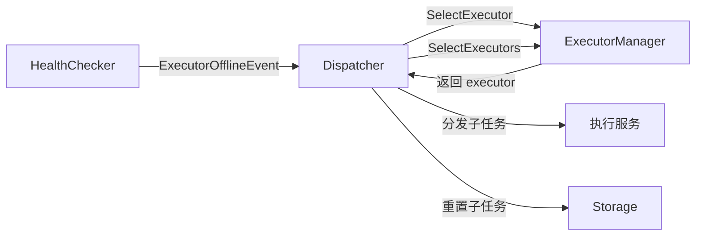
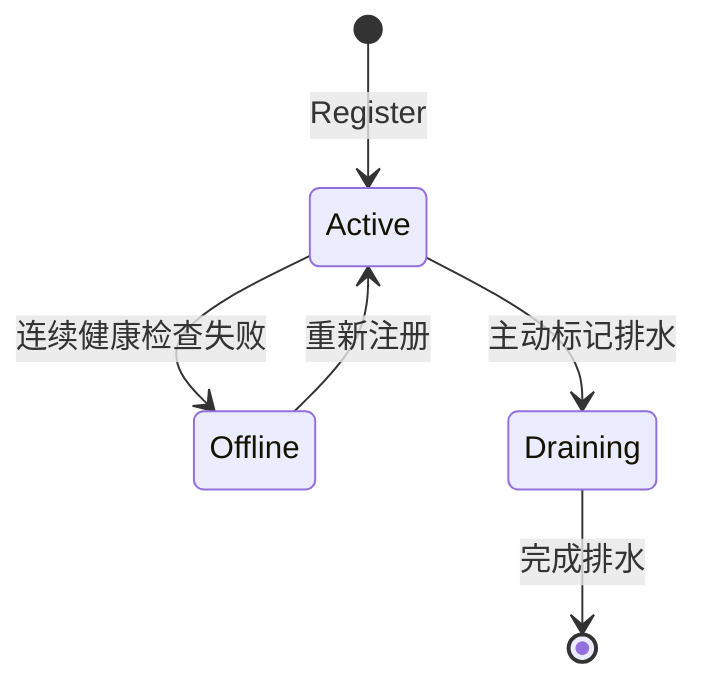
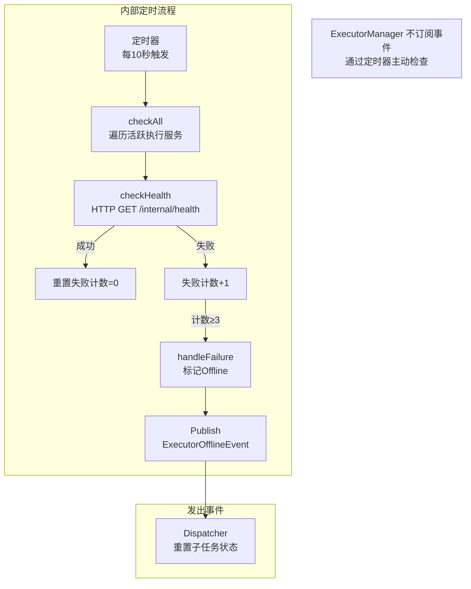

# 执行服务管理器设计

## 一、概述

管理执行服务的注册、健康检查、负载选择、失联处理。

**职责边界**：
- 维护执行服务注册表，记录活跃状态
- 定时健康检查，检测失联并发布事件
- 为 Dispatcher 提供执行服务选择（负载均衡）
- 支持单个和批量选择执行服务
- 不关注子任务分发细节（由 Dispatcher 处理）

---

## 二、结构与数据模型

### 2.1 Executor（执行服务实例）

```go
type Executor struct {
    ExecutorId    string            // 执行服务唯一标识
    Address       string            // HTTP地址（如 http://10.0.0.1:8080）
    Status        ExecutorStatus    // 活跃状态
    RegisterTime  time.Time         // 注册时间
    LastHealthCheck time.Time       // 最后健康检查时间
    Metadata      map[string]string // 元数据（如版本、区域等）
}

type ExecutorStatus int

const (
    ExecutorActive   = 0  // 活跃
    ExecutorOffline  = 1  // 失联
    ExecutorDraining = 2  // 正在排水（准备下线）
)
```

### 2.2 ExecutorRegistry（注册表）

```go
type ExecutorRegistry struct {
    executors map[string]*Executor  // executorId → Executor
    mutex     sync.RWMutex
}
```

| 方法 | 说明 |
|------|------|
| Register(executor) error | 注册执行服务 |
| Deregister(executorId) error | 注销执行服务 |
| Get(executorId) (*Executor, error) | 获取执行服务 |
| UpdateStatus(executorId, status) error | 更新状态 |
| ListActive() []*Executor | 获取所有活跃执行服务 |
| ListAll() []*Executor | 获取所有执行服务 |

### 2.3 HealthChecker（健康检查器）

```go
type HealthChecker struct {
    registry      *ExecutorRegistry
    eventBus      EventBus
    storage       SubTaskStorage

    checkInterval time.Duration      // 检查间隔（默认 10s）
    maxFailCount  int                // 最大连续失败次数（默认 3）
    failCount     map[string]int     // executorId → 连续失败次数

    logger        *zap.Logger
    stopCh        chan struct{}
}
```

| 方法 | 说明 |
|------|------|
| Start() | 启动健康检查循环 |
| Stop() | 停止健康检查循环 |
| checkHealth(executor) bool | 执行健康检查（HTTP调用） |
| handleFailure(executor) | 处理失联（更新状态+发布事件） |

### 2.4 ExecutorManager

```go
type ExecutorManager struct {
    registry      *ExecutorRegistry
    healthChecker *HealthChecker
    storage       SubTaskStorage

    logger        *zap.Logger
    stopCh        chan struct{}
}
```

| 方法 | 说明 |
|------|------|
| Start() | 启动管理器（启动健康检查） |
| Stop() | 停止管理器 |
| RegisterExecutor(executor) error | 注册执行服务 |
| DeregisterExecutor(executorId) error | 注销执行服务 |
| SelectExecutor() (*Executor, error) | 选择单个执行服务（负载均衡） |
| SelectExecutors(count int) ([]*Executor, error) | 批量选择执行服务（负载均衡） |
| GetActiveCount() int | 获取活跃执行服务数量 |

---

## 三、核心逻辑

### 3.1 ExecutorRegistry.Register（注册）

```go
func (r *ExecutorRegistry) Register(executor *Executor) error {
    r.mutex.Lock()
    defer r.mutex.Unlock()

    if _, exists := r.executors[executor.ExecutorId]; exists {
        return errors.New("executor already registered")
    }

    executor.Status = ExecutorActive
    executor.RegisterTime = time.Now()
    r.executors[executor.ExecutorId] = executor

    return nil
}
```

### 3.2 ExecutorRegistry.ListActive（获取活跃列表）

```go
func (r *ExecutorRegistry) ListActive() []*Executor {
    r.mutex.RLock()
    defer r.mutex.RUnlock()

    result := make([]*Executor, 0)
    for _, executor := range r.executors {
        if executor.Status == ExecutorActive {
            result = append(result, executor)
        }
    }
    return result
}
```

### 3.3 HealthChecker.Start（启动检查循环）

```go
func (h *HealthChecker) Start() {
    go func() {
        ticker := time.NewTicker(h.checkInterval)
        defer ticker.Stop()

        for {
            select {
            case <-ticker.C:
                h.checkAll()
            case <-h.stopCh:
                return
            }
        }
    }()
}

func (h *HealthChecker) checkAll() {
    executors := h.registry.ListActive()
    for _, executor := range executors {
        healthy := h.checkHealth(executor)
        if healthy {
            h.failCount[executor.ExecutorId] = 0
            executor.LastHealthCheck = time.Now()
        } else {
            h.failCount[executor.ExecutorId]++
            if h.failCount[executor.ExecutorId] >= h.maxFailCount {
                h.handleFailure(executor)
                h.failCount[executor.ExecutorId] = 0
            }
        }
    }
}
```

### 3.4 HealthChecker.checkHealth（执行健康检查）

```go
func (h *HealthChecker) checkHealth(executor *Executor) bool {
    url := fmt.Sprintf("%s/internal/health", executor.Address)

    ctx, cancel := context.WithTimeout(context.Background(), 5*time.Second)
    defer cancel()

    req, err := http.NewRequestWithContext(ctx, "GET", url, nil)
    if err != nil {
        h.logger.Warn("health check request failed",
            zap.String("executorId", executor.ExecutorId),
            zap.Error(err))
        return false
    }

    resp, err := http.DefaultClient.Do(req)
    if err != nil {
        h.logger.Warn("health check failed",
            zap.String("executorId", executor.ExecutorId),
            zap.Error(err))
        return false
    }
    defer resp.Body.Close()

    if resp.StatusCode != 200 {
        h.logger.Warn("health check status error",
            zap.String("executorId", executor.ExecutorId),
            zap.Int("statusCode", resp.StatusCode))
        return false
    }

    return true
}
```

### 3.5 HealthChecker.handleFailure（处理失联）

```go
func (h *HealthChecker) handleFailure(executor *Executor) {
    // 1. 更新注册表状态
    h.registry.UpdateStatus(executor.ExecutorId, ExecutorOffline)

    // 2. 发布 ExecutorOfflineEvent（Dispatcher订阅处理）
    h.eventBus.Publish(&Event{
        Type: ExecutorOfflineEvent,
        Content: &ExecutorOfflineEventContent{
            ExecutorId: executor.ExecutorId,
            Address:    executor.Address,
        },
    })

    h.logger.Warn("executor offline",
        zap.String("executorId", executor.ExecutorId),
        zap.String("address", executor.Address))
}
```

### 3.6 ExecutorManager.SelectExecutor（选择单个执行服务）

```go
func (m *ExecutorManager) SelectExecutor() (*Executor, error) {
    executors := m.registry.ListActive()
    if len(executors) == 0 {
        return nil, errors.New("no active executor")
    }

    // 负载均衡策略：最少活跃子任务数
    selected := executors[0]
    minLoad := m.getExecutorLoad(selected.ExecutorId)

    for _, executor := range executors[1:] {
        load := m.getExecutorLoad(executor.ExecutorId)
        if load < minLoad {
            selected = executor
            minLoad = load
        }
    }

    return selected, nil
}
```

### 3.7 ExecutorManager.SelectExecutors（批量选择执行服务）

```go
func (m *ExecutorManager) SelectExecutors(count int) ([]*Executor, error) {
    executors := m.registry.ListActive()
    if len(executors) == 0 {
        return nil, errors.New("no active executor")
    }

    // 负载均衡策略：按活跃子任务数排序，选择负载最低的
    sortedExecutors := m.sortByLoad(executors)

    // 根据需要的数量返回执行服务（循环使用）
    result := []*Executor{}
    for i := 0; i < count; i++ {
        result = append(result, sortedExecutors[i % len(sortedExecutors)])
    }

    return result, nil
}

func (m *ExecutorManager) sortByLoad(executors []*Executor) []*Executor {
    // 按活跃子任务数排序（升序）
    loadMap := make(map[string]int)
    for _, exec := range executors {
        loadMap[exec.ExecutorId] = m.getExecutorLoad(exec.ExecutorId)
    }

    sort.Slice(executors, func(i, j int) bool {
        return loadMap[executors[i].ExecutorId] < loadMap[executors[j].ExecutorId]
    })

    return executors
}

func (m *ExecutorManager) getExecutorLoad(executorId string) int {
    // 查询该执行服务上的活跃子任务数
    subTasks := m.storage.GetSubTasksByExecutor(executorId)
    activeCount := 0
    for _, st := range subTasks {
        if st.Status == Allocated || st.Status == Running {
            activeCount++
        }
    }
    return activeCount
}
```

---

## 四、扩展与集成

### 4.1 与 Dispatcher 协作



### 4.2 失联判定策略

| 参数 | 默认值 | 说明 |
|------|--------|------|
| checkInterval | 10s | 健康检查间隔 |
| maxFailCount | 3 | 连续失败次数阈值 |
| checkTimeout | 5s | 单次检查超时 |

**判定流程**：

```
检查周期: 每10秒
判定条件: 连续3次检查失败
失联动作: 标记Offline + 发布ExecutorOfflineEvent
```

### 4.3 负载均衡策略

| 策略 | 实现 | 说明 |
|------|------|------|
| 最少活跃数 | 当前实现 | 选择活跃子任务数最少的执行服务 |
| 随机选择 | 可扩展 | 随机选择一个活跃执行服务 |
| 轮询选择 | 可扩展 | 按顺序轮询活跃执行服务 |

**扩展方式**：

```go
type SelectStrategy interface {
    Select(executors []*Executor, loadMap map[string]int) (*Executor, error)
    SelectBatch(executors []*Executor, loadMap map[string]int, count int) ([]*Executor, error)
}

// 注册不同策略
executorManager.SetSelectStrategy(&LeastActiveStrategy{})
executorManager.SetSelectStrategy(&RandomStrategy{})
```

### 4.4 执行服务状态流转



### 4.5 执行服务注册方式

| 方式 | 说明 |
|------|------|
| 启动时注册 | 执行服务启动时调用调度服务的注册接口 |
| 配置文件 | 调度服务配置文件中预定义执行服务列表 |
| 自动发现 | 通过服务发现机制（如K8s Service）动态发现 |

### 4.6 事件交互详情

#### 接收事件

> **说明**：ExecutorManager 不订阅任何事件，它作为被动服务提供执行服务管理能力。其内部的 HealthChecker 定时主动发起健康检查，而非被动接收事件。

| 事件类型 | 事件来源 | 触发时机 | 处理流程 |
|---------|---------|---------|---------|
| 无 | - | - | ExecutorManager 不订阅事件，通过定时健康检查主动发现执行服务失联 |

#### 发出事件

| 事件类型 | 发布时机 | 目标模块 | 触发动作 |
|---------|---------|---------|---------|
| ExecutorOfflineEvent | 健康检查连续失败达到阈值（默认3次） | Dispatcher | 清理该执行服务上的子任务执行态，并由 Dispatcher 发布 `SubTaskExceptionEvent` 供 DAGScheduler 重新评估节点 |

#### 事件处理流程图



---

## 五、相关文档

- [模块设计文档](../../模块设计文档.md) - ExecutorManager 职责
- [事件总线设计](事件总线设计.md) - ExecutorOfflineEvent 定义
- [子任务分发器设计](子任务分发器设计.md) - Dispatcher 与 ExecutorManager 协作
- [API接口设计文档](../../API接口设计文档.md) - 健康检查接口定义
- [数据模型设计文档](../../数据模型设计文档.md) - subtasks 表结构