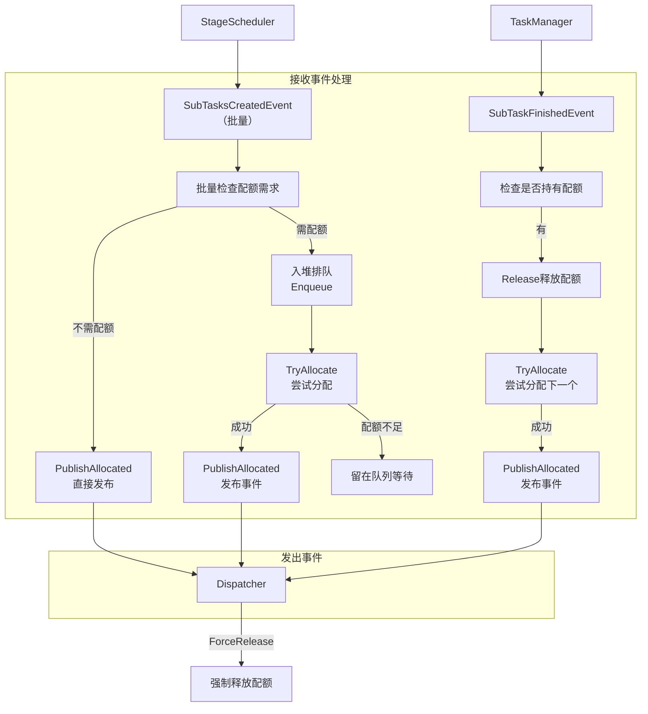

# 配额分配器设计

## 一、概述

实现子任务的模型配额门控，批量处理已创建子任务的入队，单个处理配额分配成功后的发布。

**职责边界**：
- 作为配额门控（Quota Gate），在子任务进入分发前进行配额控制
- 判断子任务是否需要模型配额，需要则排队，不需要则直接通过
- 配额获取成功后发布 SubTaskAllocatedEvent（单个）
- 不关注执行服务选择、分发发送（由 Dispatcher 处理）

**核心原则**：
- 配额是**并发控制**手段，不是调度决策
- 子任务通过配额门控后，独立进入 Dispatcher 执行分发
- 汇总类子任务可能不需要模型配额，直接通过
- 各模型队列独立运作，配额分配成功后立即发布事件，不等待其他队列

**核心流程**：

```
SubTasksCreatedEvent（批量） → 批量判断配额需求 → [需配额: 入堆排队] / [不需配额: 直接发布]
配额分配成功（单个） → 发布 SubTaskAllocatedEvent（单个） → Dispatcher
```

---

## 二、结构与数据模型

### 2.1 QuotaAllocator（配额门控）

```go
type QuotaAllocator struct {
    // 排队管理
    queues      map[string]*MinHeap[*QueueItem]  // modelId → 最小堆

    // 配额管理
    quotaManager QuotaManager                    // 配额管理器接口

    // 配额控制配置
    quotaModels map[string]bool                  // 需要配额控制的模型列表

    // 存储与事件
    eventBus    EventBus
    storage     SubTaskStorage

    // 状态与锁
    rwLock      sync.RWMutex
    logger      *zap.Logger
}
```

| 方法 | 说明 |
|------|------|
| Receive(event) error | 接收事件（EventHandler接口） |
| handleNodesReady(event) | 处理节点就绪事件 → 批量判断配额需求 → 入队/直接发布 |
| handleSubTaskFinished(event) | 处理子任务完成 → 释放配额 → 触发下一个分配 |
| HasModel(modelId) bool | 判断是否需要该模型的配额控制 |
| Enqueue(modelId, item) | 子任务入堆排队 |
| TryAllocate(modelId) (*QueueItem, bool) | 尝试分配配额（堆顶 → 获取配额 → 出堆 → 返回单个） |
| Release(modelId) error | 释放配额 |
| ForceRelease(modelId, subTaskId) error | 强制释放配额（分发失败重试耗尽时使用） |
| SyncUsage() error | 同步配额使用量 |
| PublishAllocated(taskId, stageId, subTaskId, modelId) | 发布 SubTaskAllocatedEvent（单个） |

### 2.2 QueueItem（排队项）

```go
type QueueItem struct {
    SubTaskId   string    // 子任务ID
    StageId     int       // 阶段ID（从1开始）
    TaskId      string    // 任务ID
    ModelId     string    // 所需模型
    SubmitTime  int64     // 任务提交时间（优先级）
    RetryCount  int       // 重试次数
}

// QueueItem 优先级比较（实现 Comparable 接口）
func (q *QueueItem) CompareTo(other *QueueItem) int {
    // 1. SubmitTime 越小越优先（先提交先执行）
    if q.SubmitTime != other.SubmitTime {
        return int(q.SubmitTime - other.SubmitTime)
    }
    // 2. RetryCount 越小越优先（新任务优先）
    return q.RetryCount - other.RetryCount
}
```

### 2.3 MinHeap（最小堆）

```go
type MinHeap[T Comparable] struct {
    items []T
    mu    sync.RWMutex
}

type Comparable interface {
    CompareTo(other T) int
}
```

| 方法 | 说明 |
|------|------|
| Push(item) | 入堆 |
| Pop() (T, bool) | 出堆 |
| Peek() (T, bool) | 查看堆顶 |
| Len() int | 堆大小 |
| IsEmpty() bool | 堆是否为空 |

### 2.4 QuotaManager（配额管理器接口）

```go
type QuotaManager interface {
    Acquire(resource Resource) error           // 获取配额
    Release(resource Resource) error           // 释放配额
    GetQuota(resourceId string) (*Quota, error) // 查询配额信息
    UpdateUsage(resourceId string, used int) error // 更新使用量
}

type Resource struct {
    Id   string  // 资源ID（modelId）
    Used int     // 使用量
}

type Quota struct {
    ResourceId string
    Total      int     // 总配额
    Used       int     // 已使用
}
```

### 2.5 配额分配事件内容

SubTaskAllocatedEvent 由 QuotaAllocator 发布，见 [事件总线设计](事件总线设计.md)。

```go
// SubTaskAllocatedEventContent（单个发布）
type SubTaskAllocatedEventContent struct {
    TaskId    string // 任务ID
    StageId   int    // 阶段ID
    SubTaskId string // 子任务ID
    ModelId   string // 模型ID（用于追踪）
}
```

---

## 三、核心逻辑

### 3.1 事件处理循环

```go
func (a *QuotaAllocator) Start(ctx context.Context, wg *sync.WaitGroup) {
    wg.Add(1)
    go func() {
        defer wg.Done()
        for {
            select {
            case event := <-a.eventBus.Receive():
                a.handleEvent(event)
            case <-ctx.Done():
                return
            }
        }
    }()
}

func (a *QuotaAllocator) handleEvent(event *Event) {
    switch event.Type {
    case SubTasksCreatedEvent:
        a.handleNodesReady(event)
    case SubTaskFinishedEvent:
        a.handleSubTaskFinished(event)
    }
}
```

### 3.2 handleNodesReady（批量入队，单个发布）

```go
func (a *QuotaAllocator) handleNodesReady(event *Event) error {
    content := event.Content.(*SubTasksCreatedEventContent)
    taskId := content.TaskId
    stageId := content.StageId
    subTaskIds := content.SubTaskIds

    // 1. 批量检查配额需求，分别入队
    for _, subTaskId := range subTaskIds {
        subTask := a.storage.GetSubTask(subTaskId)
        modelId := subTask.Input.Variant["variant_id"]  // 从 variant 获取模型ID

        if modelId == "" || !a.HasModel(modelId) {
            // 不需要配额控制，直接发布 SubTaskAllocatedEvent
            a.PublishAllocated(taskId, stageId, subTaskId, "")
        } else {
            // 需要配额，入堆排队
            queueItem := &QueueItem{
                SubTaskId:  subTaskId,
                StageId:    stageId,
                TaskId:     taskId,
                ModelId:    modelId,
                SubmitTime: subTask.CreatedAt,
                RetryCount: 0,
            }
            a.Enqueue(modelId, queueItem)

            // 立即尝试分配配额
            allocatedItem, ok := a.TryAllocate(modelId)
            if ok {
                // 配额分配成功，发布 SubTaskAllocatedEvent
                a.PublishAllocated(taskId, stageId, allocatedItem.SubTaskId, modelId)
            }
        }
    }

    return nil
}
```

### 3.3 TryAllocate（尝试单个分配）

```go
func (a *QuotaAllocator) TryAllocate(modelId string) (*QueueItem, bool) {
    a.rwLock.Lock()
    defer a.rwLock.Unlock()

    heap := a.queues[modelId]
    if heap == nil || heap.IsEmpty() {
        return nil, false
    }

    // 1. 查看堆顶
    queueItem, ok := heap.Peek()
    if !ok {
        return nil, false
    }

    // 2. 尝试获取配额
    resource := Resource{Id: modelId, Used: 1}
    if err := a.quotaManager.Acquire(resource); err != nil {
        // 配额不足，增加重试计数
        queueItem.RetryCount++
        return nil, false
    }

    // 3. 配额获取成功，出堆
    heap.Pop()

    return queueItem, true
}
```

### 3.4 handleSubTaskFinished（子任务完成）

```go
func (a *QuotaAllocator) handleSubTaskFinished(event *Event) error {
    content := event.Content.(*SubTaskFinishedEventContent)
    subTaskId := content.SubTaskId
    subTask := a.storage.GetSubTask(subTaskId)

    // 1. 检查是否持有模型配额
    modelId := subTask.Input.Variant["variant_id"]
    if modelId == "" || !a.HasModel(modelId) {
        return nil  // 不需要释放
    }

    // 2. 释放配额
    a.Release(modelId)

    // 3. 尝试为下一个子任务分配配额
    allocatedItem, ok := a.TryAllocate(modelId)
    if ok {
        // 配额分配成功，发布 SubTaskAllocatedEvent
        a.PublishAllocated(content.TaskId, content.StageId, allocatedItem.SubTaskId, modelId)
    }

    return nil
}
```

### 3.5 PublishAllocated（发布单个分配事件）

```go
func (a *QuotaAllocator) PublishAllocated(taskId string, stageId int, subTaskId string, modelId string) {
    a.eventBus.Publish(&Event{
        Type: SubTaskAllocatedEvent,
        Content: &SubTaskAllocatedEventContent{
            TaskId:    taskId,
            StageId:   stageId,
            SubTaskId: subTaskId,
            ModelId:   modelId,
        },
    })

    a.logger.Info("subtask allocated",
        zap.String("taskId", taskId),
        zap.Int("stageId", stageId),
        zap.String("subTaskId", subTaskId),
        zap.String("modelId", modelId))
}
```

### 3.6 Release（释放配额）

```go
func (a *QuotaAllocator) Release(modelId string) error {
    resource := Resource{Id: modelId, Used: 1}
    return a.quotaManager.Release(resource)
}
```

### 3.7 ForceRelease（强制释放配额）

分发失败重试次数耗尽时，Dispatcher 调用此方法强制释放配额。

```go
func (a *QuotaAllocator) ForceRelease(modelId string, subTaskId string) error {
    a.rwLock.Lock()
    defer a.rwLock.Unlock()
    
    // 1. 释放配额
    resource := Resource{Id: modelId, Used: 1}
    if err := a.quotaManager.Release(resource); err != nil {
        a.logger.Error("force release quota failed",
            zap.String("modelId", modelId),
            zap.String("subTaskId", subTaskId),
            zap.Error(err))
        return err
    }
    
    // 2. 从队列中移除该子任务（如果还在队列中）
    heap := a.queues[modelId]
    if heap != nil {
        // 遍历堆，找到并移除该子任务
        items := heap.items
        for i, item := range items {
            if item.SubTaskId == subTaskId {
                // 移除该元素
                items = append(items[:i], items[i+1:]...)
                heap.items = items
                heap.mu.Lock()
                heap.rebuildHeap()  // 重建堆
                heap.mu.Unlock()
                break
            }
        }
    }
    
    a.logger.Info("quota force released",
        zap.String("modelId", modelId),
        zap.String("subTaskId", subTaskId))
    
    // 3. 尝试为下一个子任务分配配额
    allocatedItem, ok := a.TryAllocateInternal(modelId)
    if ok {
        a.PublishAllocated(allocatedItem.TaskId, allocatedItem.StageId, allocatedItem.SubTaskId, modelId)
    }
    
    return nil
}

// TryAllocateInternal 内部分配（已持有锁）
func (a *QuotaAllocator) TryAllocateInternal(modelId string) (*QueueItem, bool) {
    heap := a.queues[modelId]
    if heap == nil || heap.IsEmpty() {
        return nil, false
    }
    
    queueItem, ok := heap.Peek()
    if !ok {
        return nil, false
    }
    
    resource := Resource{Id: modelId, Used: 1}
    if err := a.quotaManager.Acquire(resource); err != nil {
        queueItem.RetryCount++
        return nil, false
    }
    
    heap.Pop()
    return queueItem, true
}
```

### 3.8 SyncUsage（配额同步）

```go
func (a *QuotaAllocator) SyncUsage() error {
    // 1. 计算各模型实际使用量
    usage := a.calculateQuotaUsage()

    // 2. 同步到配额管理器
    for modelId, used := range usage {
        a.quotaManager.UpdateUsage(modelId, used)

        // 3. 配额充足时触发分配
        quota, _ := a.quotaManager.GetQuota(modelId)
        if quota.Total > quota.Used {
            allocatedItem, ok := a.TryAllocate(modelId)
            if ok {
                // 获取 stageId（需从子任务获取）
                subTask := a.storage.GetSubTask(allocatedItem.SubTaskId)
                a.PublishAllocated(subTask.TaskId, allocatedItem.StageId, allocatedItem.SubTaskId, modelId)
            }
        }
    }

    return nil
}

func (a *QuotaAllocator) calculateQuotaUsage() map[string]int {
    // 查询所有 Running + Allocated 状态的子任务
    // 按 modelId 统计使用量
    runningTasks := a.storage.GetByStatus(Running)
    allocatedTasks := a.storage.GetByStatus(Allocated)
    tasks := append(runningTasks, allocatedTasks...)

    usageMap := make(map[string]int)
    for _, task := range tasks {
        modelId := task.Input.Variant["variant_id"]
        if modelId != "" && a.HasModel(modelId) {
            usageMap[modelId]++
        }
    }
    return usageMap
}
```

---

## 四、扩展与集成

### 4.1 配额控制配置

```go
// 初始化时配置需要配额控制的模型
quotaAllocator := &QuotaAllocator{
    quotaModels: map[string]bool{
        "gpt-4":       true,
        "claude-3":    true,
        "gemini-pro":  true,
        // 其他模型...
    },
}
```

### 4.2 ForceRelease 使用场景

| 场景 | 触发者 | 说明 |
|------|--------|------|
| 分发失败重试耗尽 | Dispatcher | 子任务从未真正执行，无法触发 SubTaskFinishedEvent 释放配额 |
| 执行服务失联清理 | Dispatcher | 已分发子任务被标记为 Exception，需要释放配额 |

**设计动机**：
- SubTaskAllocatedEvent 表示配额已分配成功
- 正常流程中，配额通过 SubTaskFinishedEvent 触发 Release 释放
- 异常场景（分发失败、执行服务失联）中，子任务未执行完成，无法触发 SubTaskFinishedEvent
- ForceRelease 提供主动释放机制，避免配额被长时间占用

### 4.3 设计模式应用

| 模式 | 应用 | 说明 |
|------|------|------|
| **门控模式** | QuotaAllocator | 作为配额门控，决定子任务是否通过 |
| **策略模式** | MinHeap 排队 | 按 SubmitTime 优先级排序 |
| **观察者模式** | 事件驱动 | EventBus 通知，QuotaAllocator 响应 |
| **批量入队** | SubTasksCreatedEvent | 批量接收、批量入队 |
| **单个发布** | SubTaskAllocatedEvent | 配额分配成功后独立发布 |

### 4.4 与 Dispatcher 协作

```
QuotaAllocator（配额门控）          Dispatcher（分发执行）
┌─────────────────┐                ┌─────────────────┐
│ NodesReady      │                │ SubTaskAllocated│
│   （批量）       │                │   （单个）       │
│     ↓           │                │     ↓           │
│ 批量判断配额    │                │ 选择执行服务    │
│     ↓           │                │     ↓           │
│ 批量入队        │                │ 分发发送        │
│     ↓           │                │     ↓           │
│ TryAllocate     │                │ 成功: Allocated │
│   （单个分配）   │                │ 失败: 重试队列  │
│     ↓           │                │     ↓           │
│ SubTaskAllocated│ ──────────────→│                 │
│                 │                │ 重试耗尽:       │
│                 │←───────────────│ ForceRelease    │
└─────────────────┘                └─────────────────┘

SubTasksCreatedEvent 由 StageScheduler 发布（阶段启动时拆分子任务后）
SubTaskAllocatedEvent 由 QuotaAllocator 发布（配额分配成功后）
SubTaskFinishedEvent 由 TaskManager 发布（执行服务通过HTTP上报后）
ForceRelease 由 Dispatcher 调用（分发失败重试耗尽时）
```

### 4.5 与模型评测服务对比

| 维度 | 模型评测服务 | 应用评测服务（新设计） |
|------|-------------|----------------------|
| 配额门控组件 | ModelQuotaAllocator | QuotaAllocator |
| 排队结构 | MinHeap | MinHeap（相同） |
| 配额获取 | 本地槽位 | QuotaManager 接口（可扩展） |
| 输入事件 | SubTaskReadyEvent（单个） | SubTasksCreatedEvent（批量入队） |
| 输出事件 | SubTaskPassedQuotaEvent（单个） | SubTaskAllocatedEvent（单个） |
| 发布策略 | 单个发布 | 单个发布（队列独立） |

### 4.6 事件交互详情

#### 接收事件

| 事件类型 | 事件来源 | 触发时机 | 处理流程 |
|---------|---------|---------|---------|
| SubTasksCreatedEvent | StageScheduler | 阶段启动，子任务拆分完成后直接释放 | 1. 批量检查子任务配额需求<br/>2. 不需配额→直接发布 SubTaskAllocatedEvent<br/>3. 需配额→入堆排队<br/>4. TryAllocate 尝试分配<br/>5. 分配成功→发布 SubTaskAllocatedEvent |
| SubTaskFinishedEvent | TaskManager | 子任务状态已落库，TaskManager发布事件 | 1. 检查是否持有模型配额<br/>2. Release 释放配额<br/>3. TryAllocate 尝试分配下一个<br/>4. 分配成功→发布 SubTaskAllocatedEvent |

#### 发出事件

| 事件类型 | 发布时机 | 目标模块 | 触发动作 |
|---------|---------|---------|---------|
| SubTaskAllocatedEvent | 配额分配成功后（不需配额或配额获取成功） | Dispatcher | 选择执行服务、分发子任务 |

#### 外部调用接口

| 接口 | 调用者 | 触发时机 | 说明 |
|------|--------|---------|------|
| ForceRelease(modelId, subTaskId) | Dispatcher | 分发失败重试次数耗尽 | 强制释放配额，避免配额被长时间占用 |

#### 事件处理流程图



---

## 五、相关文档

- [模块设计文档](../../模块设计文档.md) - QuotaAllocator 职责
- [事件总线设计](事件总线设计.md) - SubTasksCreatedEvent、SubTaskAllocatedEvent 定义
- [子任务分发器设计](子任务分发器设计.md) - Dispatcher 分发逻辑
- [阶段调度器设计](阶段调度器设计.md) - StageScheduler 子任务拆分与释放逻辑
- [数据模型设计文档](../../数据模型设计文档.md) - subtasks 表结构
- [模块设计文档](../../模块设计文档.md) - 增量式拆分架构