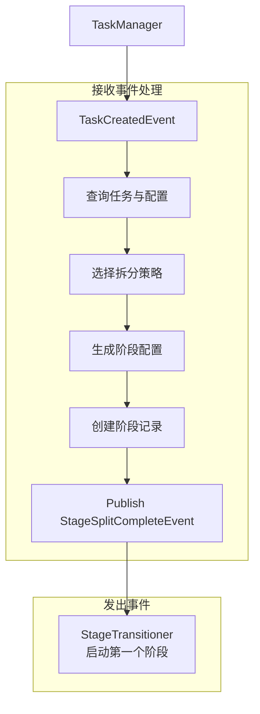

# 阶段拆分器设计

## 一、概述

根据任务配置执行阶段拆分并创建阶段记录，触发阶段转换流程。

**职责边界**：
- 订阅 `TaskCreatedEvent`，读取任务配置并执行阶段拆分
- 负责创建 `stages` 表记录，统一分配 `stage_id:int`
- 发布 `StageSplitCompleteEvent`，触发 `StageTransitioner` 启动第一个阶段
- 不关注子任务拆分细节（由 `DAGBuilder` 在阶段启动时处理）
- 不关注阶段转换逻辑（由 `StageTransitioner` 处理）

---

## 二、结构与数据模型

### 2.1 StageSplitStrategy（策略接口）

不同任务类型的阶段配置策略。

```go
type StageSplitStrategy interface {
    GetStageConfigs(task *Task, taskConfig *TaskConfig) ([]StageConfig, error)
}

type StageConfig struct {
    StageId    int                    // 阶段ID，任务内递增编号
    StageType  string                 // 阶段类型
    Config     map[string]interface{} // 阶段配置
    IsSkipped  bool                   // 是否跳过
}
```

### 2.2 StageSplitter（拆分器）

```go
type StageSplitter struct {
    strategies      map[string]StageSplitStrategy // taskType → 策略
    taskStore        TaskStore
    taskConfigStore  TaskConfigStore
    stageStore       StageStore
    eventBus         EventBus
    logger           *zap.Logger
}
```

| 方法 | 说明 |
|------|------|
| RegisterStrategy(taskType, strategy) | 注册拆分策略 |
| Receive(event) error | 接收事件（EventHandler 接口） |
| handleTaskCreated(event) error | 处理任务创建事件 → 查询任务/配置 → 阶段拆分 → 批量创建阶段 → 发布 `StageSplitCompleteEvent` |
| createStages(ctx, task, configs) ([]int, error) | 批量创建阶段记录 |

---

## 三、核心逻辑

### 3.1 事件处理

```go
func (s *StageSplitter) Receive(event *Event) error {
    switch event.Type {
    case TaskCreatedEvent:
        return s.handleTaskCreated(event)
    }
    return nil
}

func (s *StageSplitter) handleTaskCreated(event *Event) error {
    content := event.Content.(*TaskCreatedEventContent)
    taskId := content.TaskId

    // 1. 查询任务与任务配置
    task, err := s.taskStore.GetTask(context.Background(), taskId)
    if err != nil {
        return err
    }
    taskConfig, err := s.taskConfigStore.GetTaskConfig(context.Background(), taskId)
    if err != nil {
        return err
    }

    // 2. 查找拆分策略
    strategy, ok := s.strategies[task.Type]
    if !ok {
        return fmt.Errorf("no stage split strategy for task type %s", task.Type)
    }

    // 3. 生成阶段配置
    stageConfigs, err := strategy.GetStageConfigs(task, taskConfig)
    if err != nil {
        return err
    }

    // 4. 创建阶段记录
    stageIds, err := s.createStages(context.Background(), task, stageConfigs)
    if err != nil {
        return err
    }

    // 5. 发布 StageSplitCompleteEvent（触发 StageTransitioner）
    s.eventBus.Publish(&Event{
        Type: StageSplitCompleteEvent,
        Content: &StageSplitCompleteEventContent{
            TaskId:   taskId,
            StageIds: stageIds,
        },
    })

    s.logger.Info("stage split completed",
        zap.String("taskId", taskId),
        zap.Int("stageCount", len(stageIds)))

    return nil
}
```

### 3.2 createStages（批量创建阶段记录）

```go
func (s *StageSplitter) createStages(ctx context.Context, task *Task, configs []StageConfig) ([]int, error) {
    stageIds := make([]int, 0, len(configs))
    stages := make([]*Stage, 0, len(configs))

    for i, cfg := range configs {
        stageId := i + 1
        stage := &Stage{
            TaskId:     task.TaskId,
            StageId:    stageId,
            StageType:  cfg.StageType,
            Status:     StagePending,
            Config:     cfg.Config,
            TotalCount: 0,
        }

        if cfg.IsSkipped {
            stage.Status = StageSkipped
        }

        stages = append(stages, stage)
        stageIds = append(stageIds, stageId)
    }

    if err := s.stageStore.CreateStages(ctx, stages); err != nil {
        return nil, err
    }

    return stageIds, nil
}
```

---

## 四、扩展与集成

### 4.1 内置策略

| 任务类型 | 策略 | 阶段配置 |
|---------|------|---------|
| agent_eval | AgentEvalStageStrategy | synthesis → inference → eval → report |
| model_eval | ModelEvalStageStrategy | inference → eval → report |

**AgentEvalStageStrategy**：

```go
func (s *AgentEvalStageStrategy) GetStageConfigs(task *Task, taskConfig *TaskConfig) ([]StageConfig, error) {
    workflow := taskConfig.Config["workflow"].([]string)
    stageConfigs := make([]StageConfig, 0, len(workflow))

    for i, stageType := range workflow {
        stageConfig := StageConfig{
            StageId:   i + 1,
            StageType: stageType,
            Config:    extractStageConfig(taskConfig.Config, stageType),
            IsSkipped: false,
        }

        if stageType == "synthesis" && taskConfig.Config["evalset_id"] != "" {
            stageConfig.IsSkipped = true
        }

        stageConfigs = append(stageConfigs, stageConfig)
    }

    return stageConfigs, nil
}

func extractStageConfig(config map[string]interface{}, stageType string) map[string]interface{} {
    switch stageType {
    case "synthesis":
        return config["synthesis"].(map[string]interface{})
    case "inference":
        return config["inference"].(map[string]interface{})
    case "eval":
        return config["eval"].(map[string]interface{})
    case "report":
        return config["report"].(map[string]interface{})
    }
    return nil
}
```

**ModelEvalStageStrategy**：

```go
func (s *ModelEvalStageStrategy) GetStageConfigs(task *Task, taskConfig *TaskConfig) ([]StageConfig, error) {
    workflow := []string{"inference", "eval", "report"}
    stageConfigs := make([]StageConfig, 0, len(workflow))

    for i, stageType := range workflow {
        stageConfigs = append(stageConfigs, StageConfig{
            StageId:   i + 1,
            StageType: stageType,
            Config:    extractStageConfig(taskConfig.Config, stageType),
        })
    }

    return stageConfigs, nil
}
```

### 4.2 扩展方式

新增任务类型的步骤：

```go
// 1. 定义策略
type SafetyEvalStageStrategy struct{}

func (s *SafetyEvalStageStrategy) GetStageConfigs(task *Task, taskConfig *TaskConfig) ([]StageConfig, error) {
    return []StageConfig{
        {StageId: 1, StageType: "inference", Config: extractStageConfig(taskConfig.Config, "inference")},
        {StageId: 2, StageType: "eval", Config: extractStageConfig(taskConfig.Config, "eval")},
    }, nil
}

// 2. 注册
splitter.RegisterStrategy("safety_eval", &SafetyEvalStageStrategy{})
```

### 4.3 与 TaskManager 协作

| 步骤 | 模块 | 输出 |
|------|------|------|
| 1. InitializeTask | TaskManager | 创建 `tasks`、`task_configs` 表记录 |
| 2. Publish TaskCreatedEvent | TaskManager | 触发 `StageSplitter` |
| 3. Split stages and create records | StageSplitter | 批量创建 `stages` 表记录 |
| 4. Publish StageSplitCompleteEvent | StageSplitter | 触发 `StageTransitioner` |

### 4.4 事件交互详情

#### 接收事件

| 事件类型 | 事件来源 | 触发时机 | 处理流程 |
|---------|---------|---------|---------|
| TaskCreatedEvent | TaskManager | 任务初始化成功，`tasks` / `task_configs` 已落库 | 1. 查询任务与配置<br/>2. 选择拆分策略<br/>3. 生成阶段配置列表<br/>4. 批量创建阶段记录<br/>5. 发布 `StageSplitCompleteEvent` |

#### 发出事件

| 事件类型 | 发布时机 | 目标模块 | 触发动作 |
|---------|---------|---------|---------|
| StageSplitCompleteEvent | 阶段创建成功后 | StageTransitioner | 启动第一个非跳过阶段 |

#### 事件处理流程图



---

## 五、相关文档

- [任务管理器设计](任务管理器设计.md) - 任务初始化与 TaskCreatedEvent 发布
- [阶段转换器设计](阶段转换器设计.md) - 阶段转换流程
- [DAG构建器设计](DAG构建器设计.md) - 子任务拆分逻辑
- [事件总线设计](事件总线设计.md) - StageSplitCompleteEvent 定义
- [模块设计文档](../../模块设计文档.md) - 增量式拆分架构