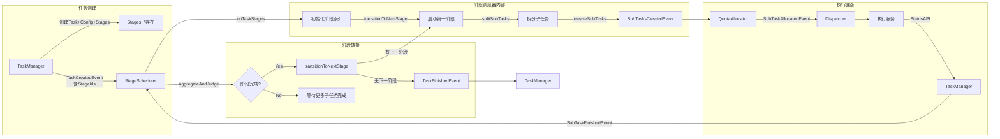
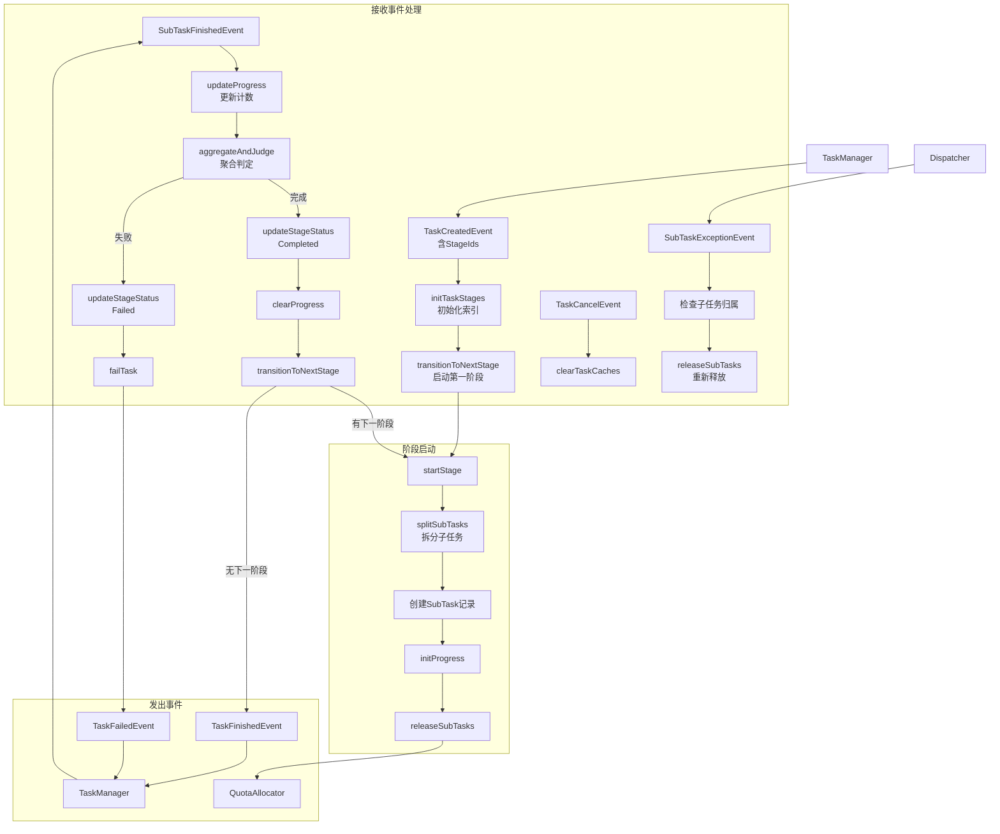

# 阶段调度器设计

## 一、概述

负责阶段运行时调度，包括阶段启动、子任务拆分与释放、状态聚合、阶段转换、任务终态判定。

**职责边界**：
- 订阅 TaskCreatedEvent，初始化阶段索引并启动第一个阶段
- 订阅 SubTaskFinishedEvent，执行状态聚合并判定阶段完成
- 阶段完成后，启动下一阶段或触发任务终态
- 订阅 SubTaskExceptionEvent，重新释放异常子任务
- 订阅 TaskCancelEvent，清理任务相关缓存
- 发布 SubTasksCreatedEvent（批量子任务就绪）
- 发布 TaskFinishedEvent / TaskFailedEvent（任务终态）
- 不负责阶段预拆分（由 TaskManager 在提交时同步完成）
- 不关注配额分配（由 QuotaAllocator 处理）
- 不关注分发执行（由 Dispatcher 处理）

**设计动机**：
- 阶段预拆分移至 TaskManager，提交时同步完成
- StageScheduler 职责聚焦于运行时调度（启动、聚合、转换）
- 避免初始化逻辑与运行时逻辑混合
- 状态聚合 → 阶段转换 → 启动下一阶段是连续逻辑，直接方法调用而非事件接力

---

## 二、结构与数据模型

### 2.1 SubTaskSplitStrategy（子任务拆分策略）

不同任务类型/阶段类型的子任务拆分策略。

```go
type SubTaskSplitStrategy interface {
    Split(taskId string, stageId int, task *Task, config *TaskConfig) ([]*SubTask, error)
}
```

### 2.2 StageScheduler（阶段调度器）

```go
type StageScheduler struct {
    // 子任务拆分策略
    subTaskSplitStrategies map[string]SubTaskSplitStrategy  // key: "{taskType}-{stageType}"
    
    // 存储
    taskStore       TaskStore
    taskConfigStore TaskConfigStore
    stageStore      StageStore
    subTaskStore    SubTaskStore
    
    // 事件
    eventBus        EventBus
    
    // 状态追踪（内存缓存）
    stageProgress   map[string]*StageProgress   // key: "{taskId}-{stageId}"
    taskStages      map[string]*TaskStageInfo   // key: taskId
    
    // 状态与锁
    rwLock          sync.RWMutex
    logger          *zap.Logger
    stopCh          chan struct{}
}

// StageProgress 阶段进度追踪
type StageProgress struct {
    TaskId        string
    StageId       int
    TotalCount    int           // 总子任务数
    FinishedCount int           // 已完成数
    FailedCount   int           // 已失败数
    SubTaskIds    []string      // 子任务ID列表
    UpdatedAt     time.Time
}

// TaskStageInfo 任务阶段信息
type TaskStageInfo struct {
    TaskId       string
    StageIds     []int          // 阶段ID列表（按顺序）
    CurrentIndex int            // 当前阶段索引
    UpdatedAt    time.Time
}
```

| 方法 | 说明 |
|------|------|
| RegisterSubTaskStrategy(key, strategy) | 注册子任务拆分策略 |
| Start(ctx, wg) | 启动事件处理循环 |
| Receive(event) error | 接收事件（EventHandler 接口） |
| handleTaskCreated(event) error | 处理任务创建 → 初始化阶段索引 → 启动第一阶段 |
| handleSubTaskFinished(event) error | 处理子任务完成 → 更新进度 → 聚合判定 → 阶段转换或任务终态 |
| handleSubTaskException(event) error | 处理子任务异常 → 重新释放 |
| handleTaskCancel(event) error | 处理任务取消 → 清理缓存 |
| startStage(taskId, stageId) | 启动阶段 → 子任务拆分 → 释放 |
| transitionToNextStage(taskId) | 阶段转换 → 启动下一阶段或触发任务终态 |
| splitSubTasks(taskId, stageId) ([]*SubTask, error) | 执行子任务拆分 |
| releaseSubTasks(taskId, stageId, subTaskIds) | 发布 SubTasksCreatedEvent |
| aggregateAndJudge(taskId, stageId) | 状态聚合与阶段完成判定 |

---

## 三、核心逻辑

### 3.1 事件处理循环

```go
func (s *StageScheduler) Start(ctx context.Context, wg *sync.WaitGroup) {
    wg.Add(1)
    go func() {
        defer wg.Done()
        for {
            select {
            case event := <-s.eventBus.Receive():
                s.handleEvent(event)
            case <-ctx.Done():
                return
            case <-s.stopCh:
                return
            }
        }
    }()
}

func (s *StageScheduler) handleEvent(event *Event) error {
    switch event.Type {
    case TaskCreatedEvent:
        return s.handleTaskCreated(event)
    case SubTaskFinishedEvent:
        return s.handleSubTaskFinished(event)
    case SubTaskExceptionEvent:
        return s.handleSubTaskException(event)
    case TaskCancelEvent:
        return s.handleTaskCancel(event)
    }
    return nil
}
```

### 3.2 handleTaskCreated（处理任务创建）

不再执行阶段拆分，直接从事件获取 StageIds 并启动第一阶段。

```go
func (s *StageScheduler) handleTaskCreated(event *Event) error {
    content := event.Content.(*TaskCreatedEventContent)
    taskId := content.TaskId
    stageIds := content.StageIds
    
    // 1. 初始化任务阶段信息（直接从事件获取）
    s.initTaskStages(taskId, stageIds)
    
    // 2. 启动第一个非跳过阶段
    s.transitionToNextStage(taskId)
    
    s.logger.Info("task stages initialized, starting first stage",
        zap.String("taskId", taskId),
        zap.Ints("stageIds", stageIds))
    
    return nil
}
```

### 3.3 initTaskStages（初始化阶段索引）

```go
func (s *StageScheduler) initTaskStages(taskId string, stageIds []int) {
    s.rwLock.Lock()
    defer s.rwLock.Unlock()
    
    s.taskStages[taskId] = &TaskStageInfo{
        TaskId:       taskId,
        StageIds:     stageIds,
        CurrentIndex: -1,  // 未启动任何阶段
        UpdatedAt:    time.Now(),
    }
}
```

### 3.4 transitionToNextStage（阶段转换）

```go
func (s *StageScheduler) transitionToNextStage(taskId string) {
    s.rwLock.Lock()
    taskInfo := s.taskStages[taskId]
    s.rwLock.Unlock()
    
    if taskInfo == nil {
        return
    }
    
    // 查找下一个非跳过阶段
    for i := taskInfo.CurrentIndex + 1; i < len(taskInfo.StageIds); i++ {
        stageId := taskInfo.StageIds[i]
        stage, err := s.stageStore.GetStage(ctx, taskId, stageId)
        if err != nil {
            continue
        }
        
        if stage.Status != StageSkipped {
            // 更新当前阶段索引
            s.rwLock.Lock()
            taskInfo.CurrentIndex = i
            taskInfo.UpdatedAt = time.Now()
            s.rwLock.Unlock()
            
            // 启动该阶段
            s.startStage(taskId, stageId)
            return
        }
    }
    
    // 无下一阶段，任务完成
    s.completeTask(taskId)
}
```

### 3.5 startStage（启动阶段）

```go
func (s *StageScheduler) startStage(taskId string, stageId int) {
    // 1. 更新阶段状态为 Running
    stage, err := s.stageStore.GetStage(ctx, taskId, stageId)
    if err != nil {
        s.logger.Error("get stage failed", zap.String("taskId", taskId), zap.Int("stageId", stageId))
        return
    }
    stage.Status = StageRunning
    s.stageStore.UpdateStage(ctx, stage)
    
    // 2. 更新任务当前阶段
    task, err := s.taskStore.GetTask(ctx, taskId)
    if err != nil {
        return
    }
    task.Status = TaskRunning
    task.CurrentStage = stageId
    task.CurrentStageType = stage.StageType
    s.taskStore.UpdateTask(ctx, task)
    
    // 3. 执行子任务拆分
    subTasks, err := s.splitSubTasks(taskId, stageId)
    if err != nil {
        s.logger.Error("subtask split failed", zap.String("taskId", taskId), zap.Int("stageId", stageId))
        s.failTask(taskId, ErrorCodeSubTaskSplitFailed, "子任务拆分失败")
        return
    }
    
    // 4. 批量创建子任务记录
    if err := s.subTaskStore.CreateSubTasks(ctx, subTasks); err != nil {
        s.logger.Error("create subtasks failed", zap.String("taskId", taskId), zap.Int("stageId", stageId))
        s.failTask(taskId, ErrorCodeCreateSubTaskFailed, "子任务创建失败")
        return
    }
    
    // 5. 更新阶段统计
    stage.TotalCount = len(subTasks)
    s.stageStore.UpdateStage(ctx, stage)
    
    // 6. 初始化进度缓存
    subTaskIds := extractSubTaskIds(subTasks)
    s.initProgress(taskId, stageId, len(subTasks), subTaskIds)
    
    // 7. 释放子任务
    s.releaseSubTasks(taskId, stageId, subTaskIds)
    
    s.logger.Info("stage started",
        zap.String("taskId", taskId),
        zap.Int("stageId", stageId),
        zap.Int("subTaskCount", len(subTasks)))
}
```

### 3.6 splitSubTasks（子任务拆分）

```go
func (s *StageScheduler) splitSubTasks(taskId string, stageId int) ([]*SubTask, error) {
    stage, err := s.stageStore.GetStage(ctx, taskId, stageId)
    if err != nil {
        return nil, err
    }
    
    task, err := s.taskStore.GetTask(ctx, taskId)
    if err != nil {
        return nil, err
    }
    
    config, err := s.taskConfigStore.GetTaskConfig(ctx, taskId)
    if err != nil {
        return nil, err
    }
    
    key := fmt.Sprintf("%s-%s", task.Type, stage.StageType)
    strategy, ok := s.subTaskSplitStrategies[key]
    if !ok {
        return nil, fmt.Errorf("no subtask split strategy for %s", key)
    }
    
    return strategy.Split(taskId, stageId, task, config)
}
```

### 3.7 releaseSubTasks（释放子任务）

```go
func (s *StageScheduler) releaseSubTasks(taskId string, stageId int, subTaskIds []string) {
    s.eventBus.Publish(&Event{
        Type: SubTasksCreatedEvent,
        Content: &SubTasksCreatedEventContent{
            TaskId:     taskId,
            StageId:    stageId,
            SubTaskIds: subTaskIds,
        },
    })
}
```

### 3.8 handleSubTaskFinished（处理子任务完成）

```go
func (s *StageScheduler) handleSubTaskFinished(event *Event) error {
    content := event.Content.(*SubTaskFinishedEventContent)
    taskId := content.TaskId
    stageId := content.StageId
    status := content.Status
    
    // 1. 更新进度缓存
    s.updateProgress(taskId, stageId, status)
    
    // 2. 状态聚合与判定
    return s.aggregateAndJudge(taskId, stageId)
}
```

### 3.9 updateProgress（更新进度缓存）

```go
func (s *StageScheduler) updateProgress(taskId string, stageId int, status int) {
    s.rwLock.Lock()
    defer s.rwLock.Unlock()
    
    key := fmt.Sprintf("%s-%d", taskId, stageId)
    progress, ok := s.stageProgress[key]
    if !ok {
        return
    }
    
    switch status {
    case SubTaskFinished:
        progress.FinishedCount++
    case SubTaskFailed:
        progress.FailedCount++
    }
    progress.UpdatedAt = time.Now()
}
```

### 3.10 aggregateAndJudge（状态聚合与判定）

```go
func (s *StageScheduler) aggregateAndJudge(taskId string, stageId int) error {
    s.rwLock.RLock()
    key := fmt.Sprintf("%s-%d", taskId, stageId)
    progress := s.stageProgress[key]
    s.rwLock.RUnlock()
    
    if progress == nil {
        return nil
    }
    
    total := progress.TotalCount
    finished := progress.FinishedCount
    failed := progress.FailedCount
    
    // 阶段完成判定：所有子任务完成
    if finished == total {
        // 更新阶段状态为 Completed
        s.updateStageStatus(taskId, stageId, StageCompleted)
        
        // 清理进度缓存
        s.clearProgress(taskId, stageId)
        
        s.logger.Info("stage completed",
            zap.String("taskId", taskId),
            zap.Int("stageId", stageId))
        
        // 阶段转换：启动下一阶段
        s.transitionToNextStage(taskId)
        return nil
    }
    
    // 阶段失败判定：任一子任务失败（严格模式）
    if failed > 0 {
        // 更新阶段状态为 Failed
        s.updateStageStatus(taskId, stageId, StageFailed)
        
        // 清理进度缓存
        s.clearProgress(taskId, stageId)
        
        s.logger.Warn("stage failed",
            zap.String("taskId", taskId),
            zap.Int("stageId", stageId),
            zap.Int("failedCount", failed))
        
        // 任务失败
        s.failTask(taskId, ErrorCodeStageFailed, fmt.Sprintf("阶段 %d 执行失败", stageId))
        return nil
    }
    
    return nil
}
```

### 3.11 handleSubTaskException（处理子任务异常）

```go
func (s *StageScheduler) handleSubTaskException(event *Event) error {
    content := event.Content.(*SubTaskExceptionEventContent)
    taskId := content.TaskId
    stageId := content.StageId
    subTaskId := content.SubTaskId
    
    // 1. 获取阶段进度
    s.rwLock.RLock()
    key := fmt.Sprintf("%s-%d", taskId, stageId)
    progress := s.stageProgress[key]
    s.rwLock.RUnlock()
    
    if progress == nil {
        return nil
    }
    
    // 2. 检查子任务是否属于该阶段
    if !contains(progress.SubTaskIds, subTaskId) {
        return nil
    }
    
    // 3. 重新释放异常子任务
    s.releaseSubTasks(taskId, stageId, []string{subTaskId})
    
    s.logger.Info("subtask released after exception",
        zap.String("taskId", taskId),
        zap.Int("stageId", stageId),
        zap.String("subTaskId", subTaskId))
    
    return nil
}
```

### 3.12 handleTaskCancel（处理任务取消）

```go
func (s *StageScheduler) handleTaskCancel(event *Event) error {
    content := event.Content.(*TaskCancelEventContent)
    taskId := content.TaskId
    
    // 清理该任务的所有缓存
    s.clearTaskProgress(taskId)
    s.clearTaskStages(taskId)
    
    s.logger.Info("task caches cleared for cancelled task",
        zap.String("taskId", taskId))
    
    return nil
}
```

### 3.13 任务终态处理

```go
func (s *StageScheduler) completeTask(taskId string) {
    s.eventBus.Publish(&Event{
        Type: TaskFinishedEvent,
        Content: &TaskFinishedEventContent{
            TaskId:  taskId,
            Result:  nil,  // 结果由 TaskManager 从 stages 聚合
            Message: "任务执行完成",
        },
    })
    
    // 清理缓存
    s.clearTaskProgress(taskId)
    s.clearTaskStages(taskId)
    
    s.logger.Info("task completed", zap.String("taskId", taskId))
}

func (s *StageScheduler) failTask(taskId string, errCode int, message string) {
    s.eventBus.Publish(&Event{
        Type: TaskFailedEvent,
        Content: &TaskFailedEventContent{
            TaskId:  taskId,
            ErrCode: errCode,
            Message: message,
        },
    })
    
    // 清理缓存
    s.clearTaskProgress(taskId)
    s.clearTaskStages(taskId)
    
    s.logger.Error("task failed",
        zap.String("taskId", taskId),
        zap.Int("errCode", errCode),
        zap.String("message", message))
}
```

### 3.14 缓存管理

```go
func (s *StageScheduler) initProgress(taskId string, stageId int, total int, subTaskIds []string) {
    s.rwLock.Lock()
    defer s.rwLock.Unlock()
    
    key := fmt.Sprintf("%s-%d", taskId, stageId)
    s.stageProgress[key] = &StageProgress{
        TaskId:        taskId,
        StageId:       stageId,
        TotalCount:    total,
        FinishedCount: 0,
        FailedCount:   0,
        SubTaskIds:    subTaskIds,
        UpdatedAt:     time.Now(),
    }
}

func (s *StageScheduler) clearProgress(taskId string, stageId int) {
    s.rwLock.Lock()
    defer s.rwLock.Unlock()
    
    key := fmt.Sprintf("%s-%d", taskId, stageId)
    delete(s.stageProgress, key)
}

func (s *StageScheduler) clearTaskProgress(taskId string) {
    s.rwLock.Lock()
    defer s.rwLock.Unlock()
    
    prefix := taskId + "-"
    for key := range s.stageProgress {
        if strings.HasPrefix(key, prefix) {
            delete(s.stageProgress, key)
        }
    }
}

func (s *StageScheduler) clearTaskStages(taskId string) {
    s.rwLock.Lock()
    defer s.rwLock.Unlock()
    
    delete(s.taskStages, taskId)
}

func (s *StageScheduler) updateStageStatus(taskId string, stageId int, status int) {
    stage, err := s.stageStore.GetStage(ctx, taskId, stageId)
    if err != nil {
        return
    }
    stage.Status = status
    s.stageStore.UpdateStage(ctx, stage)
}
```

---

## 四、扩展与集成

### 4.1 内置子任务拆分策略

| 任务类型 | 阶段类型 | 策略 | 子任务数量 |
|----------|----------|------|------------|
| agent_eval | synthesis | SynthesisSplitStrategy | 1 |
| agent_eval | inference | InferenceSplitStrategy | M × N |
| agent_eval | eval | EvalSplitStrategy | M × N |
| agent_eval | report | ReportSplitStrategy | 1 |
| model_eval | inference | ModelInferenceSplitStrategy | M |
| model_eval | eval | ModelEvalSplitStrategy | M |
| model_eval | report | ModelReportSplitStrategy | 1 |

### 4.2 组件协作流程



### 4.3 事件交互详情

#### 接收事件

| 事件类型 | 事件来源 | 触发时机 | 处理流程 |
|---------|---------|---------|---------|
| TaskCreatedEvent | TaskManager | 任务提交成功，stages 已创建 | 1. 从事件获取 StageIds<br/>2. 初始化 TaskStageInfo<br/>3. 启动第一个非跳过阶段 |
| SubTaskFinishedEvent | TaskManager | 子任务状态落库后 | 1. 更新 Progress 缓存<br/>2. 执行 aggregateAndJudge<br/>3. 若完成 → 阶段转换<br/>4. 若失败 → 任务失败 |
| SubTaskExceptionEvent | Dispatcher | 执行服务失联后清理执行态 | 1. 检查子任务是否属于该阶段<br/>2. 重新发布 SubTasksCreatedEvent |
| TaskCancelEvent | TaskManager | 用户取消任务 | 1. 清理该任务的所有缓存 |

#### 发出事件

| 事件类型 | 发布时机 | 目标模块 | 触发动作 |
|---------|---------|---------|---------|
| SubTasksCreatedEvent | 阶段启动后子任务拆分完成，或异常子任务重新释放 | QuotaAllocator | 批量配额门控 |
| TaskFinishedEvent | 所有阶段完成 | TaskManager | 更新任务终态 |
| TaskFailedEvent | 子任务拆分失败、阶段执行失败 | TaskManager | 更新任务失败态 |

#### 事件处理流程图



---

## 五、错误码定义

| 错误码 | 常量 | 含义 |
|--------|------|------|
| 1002 | ErrorCodeSubTaskSplitFailed | 子任务拆分失败 |
| 1003 | ErrorCodeCreateSubTaskFailed | 子任务创建失败 |
| 1004 | ErrorCodeStageFailed | 阶段执行失败 |

> **说明**：阶段拆分失败（ErrorCodeStageSplitFailed = 1001）由 TaskManager 处理，提交时直接返回错误，不再通过 TaskFailedEvent 发布。

---

## 七、相关文档

- [模块设计文档](../../模块设计文档.md) - StageScheduler 职责
- [任务管理器设计](任务管理器设计.md) - TaskManager 阶段预拆分
- [事件总线设计](事件总线设计.md) - SubTasksCreatedEvent、TaskFinishedEvent 定义
- [配额分配器设计](配额分配器设计.md) - QuotaAllocator 配额门控
- [子任务分发器设计](子任务分发器设计.md) - Dispatcher 分发逻辑
- [数据模型设计文档](../../数据模型设计文档.md) - stages、subtasks 表结构