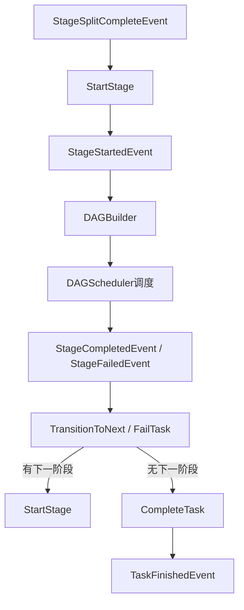
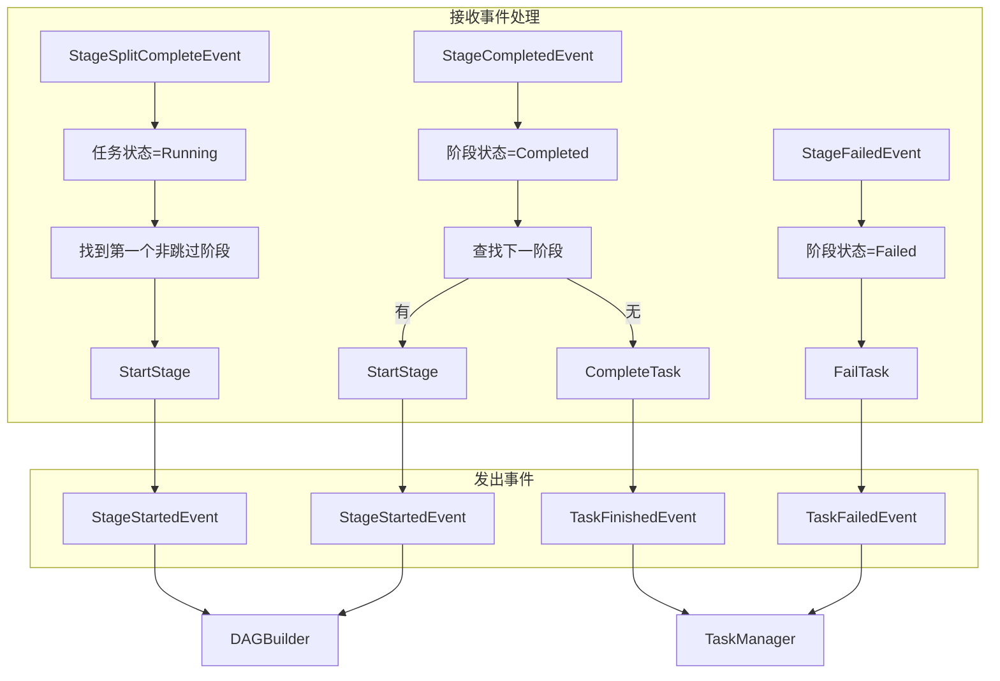

# 阶段转换器设计

## 一、概述

负责阶段启动、阶段转换和任务终态判定，是增量式拆分架构中承接阶段生命周期的核心组件。

**职责边界**：
- 订阅 `StageSplitCompleteEvent`，启动第一个非跳过阶段
- 订阅 `StageCompletedEvent`，触发下一阶段
- 订阅 `StageFailedEvent`，判定任务失败
- 更新 `stages` 表中的阶段状态
- 调用 `TaskManager` 更新任务状态与当前阶段信息
- 发布 `StageStartedEvent`、`TaskFinishedEvent`、`TaskFailedEvent`
- 不关注 DAG 调度细节（由 `DAGScheduler` 处理）
- 不关注子任务分发细节（由 `Dispatcher` 处理）

---

## 二、结构与数据模型

### 2.1 StageTransitioner

```go
type StageTransitioner struct {
    taskManager  *TaskManager
    stageStore   StageStore
    eventBus     EventBus
    logger       *zap.Logger
}
```

| 方法 | 说明 |
|------|------|
| Receive(event) error | 接收事件（EventHandler 接口） |
| handleStageSplitComplete(event) error | 处理阶段拆分完成 → 启动第一个阶段 |
| handleStageCompleted(event) error | 处理阶段完成 → 触发下一阶段或任务完成 |
| handleStageFailed(event) error | 处理阶段失败 → 发布 `TaskFailedEvent` |
| StartStage(taskId, stageId) error | 启动阶段 → 更新阶段状态/任务当前阶段 → 发布 `StageStartedEvent` |
| TransitionToNext(taskId, currentStageId) error | 转换到下一阶段 |
| CompleteTask(taskId, message) error | 发布 `TaskFinishedEvent` |
| FailTask(taskId, errCode, message) error | 发布 `TaskFailedEvent` |

---

## 三、核心逻辑

### 3.1 事件处理

```go
func (t *StageTransitioner) Receive(event *Event) error {
    switch event.Type {
    case StageSplitCompleteEvent:
        return t.handleStageSplitComplete(event)
    case StageCompletedEvent:
        return t.handleStageCompleted(event)
    case StageFailedEvent:
        return t.handleStageFailed(event)
    }
    return nil
}
```

### 3.2 handleStageSplitComplete（启动第一个阶段）

```go
func (t *StageTransitioner) handleStageSplitComplete(event *Event) error {
    content := event.Content.(*StageSplitCompleteEventContent)
    taskId := content.TaskId
    stageIds := content.StageIds

    // 1. 任务进入 Running
    if err := t.taskManager.UpdateTaskStatus(context.Background(), taskId, TaskRunning, "任务执行中"); err != nil {
        return err
    }

    // 2. 找到第一个非跳过阶段
    found := false
    var firstStageId int
    for _, stageId := range stageIds {
        stage, err := t.stageStore.GetStage(context.Background(), taskId, stageId)
        if err != nil {
            return err
        }
        if stage.Status != StageSkipped {
            firstStageId = stageId
            found = true
            break
        }
    }

    if !found {
        return t.CompleteTask(taskId, "所有阶段均被跳过，任务直接完成")
    }

    return t.StartStage(taskId, firstStageId)
}
```

### 3.3 StartStage（启动阶段）

```go
func (t *StageTransitioner) StartStage(taskId string, stageId int) error {
    // 1. 获取阶段信息
    stage, err := t.stageStore.GetStage(context.Background(), taskId, stageId)
    if err != nil {
        return err
    }

    // 2. 更新阶段状态为 Running
    stage.Status = StageRunning
    stage.StartedAt = time.Now()
    if err := t.stageStore.UpdateStage(context.Background(), stage); err != nil {
        return err
    }

    // 3. 更新任务当前阶段
    if err := t.taskManager.UpdateTaskCurrentStage(context.Background(), taskId, stageId, stage.StageType); err != nil {
        return err
    }

    // 4. 发布 StageStartedEvent（触发 DAGBuilder）
    t.eventBus.Publish(&Event{
        Type: StageStartedEvent,
        Content: &StageStartedEventContent{
            TaskId:  taskId,
            StageId: stageId,
        },
    })

    t.logger.Info("stage started",
        zap.String("taskId", taskId),
        zap.Int("stageId", stageId),
        zap.String("stageType", stage.StageType))

    return nil
}
```

### 3.4 handleStageCompleted（处理阶段完成）

```go
func (t *StageTransitioner) handleStageCompleted(event *Event) error {
    content := event.Content.(*StageCompletedEventContent)
    taskId := content.TaskId
    stageId := content.StageId

    // 1. 更新阶段状态为 Completed
    stage, err := t.stageStore.GetStage(context.Background(), taskId, stageId)
    if err != nil {
        return err
    }
    stage.Status = StageCompleted
    stage.CompletedAt = time.Now()
    if err := t.stageStore.UpdateStage(context.Background(), stage); err != nil {
        return err
    }

    t.logger.Info("stage completed",
        zap.String("taskId", taskId),
        zap.Int("stageId", stageId))

    // 2. 触发下一阶段
    return t.TransitionToNext(taskId, stageId)
}
```

### 3.5 TransitionToNext（转换到下一阶段）

```go
func (t *StageTransitioner) TransitionToNext(taskId string, currentStageId int) error {
    nextStageId := currentStageId + 1

    for {
        nextStage, err := t.stageStore.GetStage(context.Background(), taskId, nextStageId)
        if errors.Is(err, ErrStageNotFound) {
            return t.CompleteTask(taskId, "任务执行完成")
        }
        if err != nil {
            return err
        }

        if nextStage.Status == StageSkipped {
            nextStageId++
            continue
        }

        return t.StartStage(taskId, nextStageId)
    }
}
```

### 3.6 handleStageFailed（处理阶段失败）

```go
func (t *StageTransitioner) handleStageFailed(event *Event) error {
    content := event.Content.(*StageFailedEventContent)
    taskId := content.TaskId
    stageId := content.StageId

    // 1. 更新阶段状态为 Failed
    stage, err := t.stageStore.GetStage(context.Background(), taskId, stageId)
    if err != nil {
        return err
    }
    stage.Status = StageFailed
    stage.Message = fmt.Sprintf("阶段失败，失败子任务数: %d", content.FailedCount)
    stage.UpdatedAt = time.Now()
    if err := t.stageStore.UpdateStage(context.Background(), stage); err != nil {
        return err
    }

    t.logger.Warn("stage failed",
        zap.String("taskId", taskId),
        zap.Int("stageId", stageId),
        zap.Int("failedCount", content.FailedCount))

    // 2. 严格模式：任一阶段失败即任务失败
    return t.FailTask(taskId, 1, fmt.Sprintf("阶段 %s 执行失败", stage.StageType))
}
```

### 3.7 CompleteTask（任务完成）

```go
func (t *StageTransitioner) CompleteTask(taskId string, message string) error {
    result, err := t.buildTaskResult(context.Background(), taskId)
    if err != nil {
        return err
    }

    t.eventBus.Publish(&Event{
        Type: TaskFinishedEvent,
        Content: &TaskFinishedEventContent{
            TaskId:  taskId,
            Result:  result,
            Message: message,
        },
    })

    t.logger.Info("task finished",
        zap.String("taskId", taskId))

    return nil
}
```

### 3.8 FailTask（任务失败）

```go
func (t *StageTransitioner) FailTask(taskId string, errCode int, message string) error {
    t.eventBus.Publish(&Event{
        Type: TaskFailedEvent,
        Content: &TaskFailedEventContent{
            TaskId:  taskId,
            ErrCode: errCode,
            Message: message,
        },
    })

    t.logger.Warn("task failed",
        zap.String("taskId", taskId),
        zap.String("reason", message))

    return nil
}
```

---

## 四、扩展与集成

### 4.1 阶段转换流程图



### 4.2 与其他组件协作

| 组件 | 协作方式 |
|------|----------|
| TaskManager | 提供任务状态更新接口，并消费 `TaskFinishedEvent` / `TaskFailedEvent` |
| StageSplitter | 发布 `StageSplitCompleteEvent`，触发阶段启动 |
| DAGBuilder | 订阅 `StageStartedEvent`，执行 DAG 构建 |
| DAGScheduler | 发布 `StageCompletedEvent` / `StageFailedEvent`，驱动阶段前进或失败 |

### 4.3 阶段跳过处理

当用户已提供评测集（`evalset_id` 非空）时，`synthesis` 阶段会被 `StageSplitter` 标记为 `StageSkipped`：

```go
if stageType == "synthesis" && taskConfig.Config["evalset_id"] != "" {
    stageConfig.IsSkipped = true
}

if nextStage.Status == StageSkipped {
    nextStageId++
    continue
}
```

### 4.4 严格模式失败处理

评测任务完整性要求高，采用严格模式：

- 任一阶段失败 → 任务失败
- 不支持部分成功继续执行

### 4.5 事件交互详情

#### 接收事件

| 事件类型 | 事件来源 | 触发时机 | 处理流程 |
|---------|---------|---------|---------|
| StageSplitCompleteEvent | StageSplitter | 阶段拆分并建表完成 | 1. 调用 `TaskManager.UpdateTaskStatus` 置为 `Running`<br/>2. 找到第一个非跳过阶段<br/>3. 调用 `StartStage` |
| StageCompletedEvent | DAGScheduler | 阶段内所有 DAGNode 终结，阶段成功 | 1. 更新阶段状态为 `Completed`<br/>2. 查找下一阶段<br/>3. 有下一阶段 → 启动；无 → 发布 `TaskFinishedEvent` |
| StageFailedEvent | DAGScheduler | 阶段失败且无重试机会 | 1. 更新阶段状态为 `Failed`<br/>2. 发布 `TaskFailedEvent` |

#### 发出事件

| 事件类型 | 发布时机 | 目标模块 | 触发动作 |
|---------|---------|---------|---------|
| StageStartedEvent | `StartStage` 成功更新阶段状态后 | DAGBuilder | 触发 DAG 构建和子任务拆分 |
| TaskFinishedEvent | `CompleteTask` 判定所有阶段完成后 | TaskManager | 更新任务终态、结果、进度 100% |
| TaskFailedEvent | `FailTask` 判定任务失败后 | TaskManager | 更新任务状态为 `TaskFailed` |

#### 事件处理流程图



---

## 五、相关文档

- [事件总线设计](事件总线设计.md) - `StageSplitCompleteEvent`、`StageStartedEvent`、`StageCompletedEvent` 定义
- [阶段拆分器设计](阶段拆分器设计.md) - 阶段拆分逻辑
- [DAG构建器设计](DAG构建器设计.md) - DAG 构建逻辑
- [任务管理器设计](任务管理器设计.md) - 任务状态更新与终态落库
- [数据模型设计文档](../../数据模型设计文档.md) - `stages` 表结构
- [模块设计文档](../../模块设计文档.md) - 增量式拆分架构