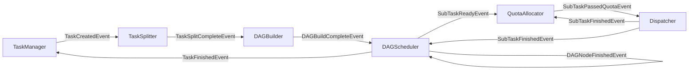

# 事件总线设计

## 一、概述

实现调度服务内部的事件驱动架构，替代定时扫描数据库的轮询模式，实现模块间异步解耦通信。

**职责边界**：
- 只关注事件发布/订阅/分发，不关注业务逻辑
- 各模块通过 EventBus 通信，事件处理器负责具体业务

**核心原则**：
- 事件是**状态通知**，不是**命令**
- 发布者只通知"发生了什么"，不关心"谁来处理"
- 接收者自主决定是否响应

**对比轮询模式优势**：响应更快、无无效轮询开销、模块解耦。

---

## 二、结构与数据模型

### 2.1 EventBus

```go
type EventBus struct {
    handlers   map[int]EventHandler  // eventType → Handler
    events     *list.List            // 待分发事件链表
    maxBacklog int                   // 最大积压限制
    logger     *zap.Logger
}

type Event struct {
    Type      int         // 事件类型
    Content   interface{} // 事件内容
    Timestamp int64       // 发生时间
}
```

| 方法 | 说明 |
|------|------|
| Publish(event) error | 发布事件 |
| RegisterHandler(eventType, handler) | 注册处理器 |
| Start(ctx, wg) | 启动分发循环 |

### 2.2 EventHandler 接口

```go
type EventHandler interface {
    Receive(event *Event) error           // 接收事件（推入本地队列）
    RegisterEventBus(eventBus EventBus)   // 注册事件总线
    Start(ctx, wg)                        // 启动处理循环
}
```

### 2.3 事件类型定义

| 事件类型 | 常量 | 含义 | 发布者 | 订阅者 |
|---------|------|------|--------|--------|
| TaskCreatedEvent | 1 | 任务已创建 | TaskManager | TaskSplitter |
| TaskSplitCompleteEvent | 2 | 任务拆分已完成 | TaskSplitter | DAGBuilder |
| DAGBuildCompleteEvent | 3 | DAG构建已完成 | DAGBuilder | DAGScheduler |
| DAGNodeFinishedEvent | 4 | DAG节点执行完成 | DAGScheduler | DAGScheduler |
| SubTaskReadyEvent | 5 | 子任务已就绪（可分发） | DAGScheduler | QuotaAllocator |
| SubTaskPassedQuotaEvent | 6 | 子任务已通过配额门控 | QuotaAllocator | Dispatcher |
| SubTaskFinishedEvent | 7 | 子任务执行完成 | Dispatcher | QuotaAllocator, DAGScheduler |
| TaskFinishedEvent | 8 | 任务执行完成 | DAGScheduler | TaskManager |
| TaskFailedEvent | 9 | 任务执行失败 | DAGScheduler, Dispatcher | TaskManager |
| TaskCancelEvent | 10 | 任务取消请求 | TaskAPI | TaskManager, DAGScheduler, Dispatcher |
| ExecutorOfflineEvent | 11 | 执行服务失联 | ExecutorManager | Dispatcher |

### 2.4 事件内容结构

```go
// TaskCreatedEvent
type TaskCreatedEventContent struct {
    TaskId string    // 任务ID
}

// TaskSplitCompleteEvent
type TaskSplitCompleteEventContent struct {
    TaskId    string   // 任务ID
    SubTaskIds []string // 子任务ID列表
}

// DAGBuildCompleteEvent
type DAGBuildCompleteEventContent struct {
    TaskId    string   // 任务ID
    DAGNodeIds []string // DAG节点ID列表
}

// DAGNodeFinishedEvent
type DAGNodeFinishedEventContent struct {
    TaskId string
    NodeId string
    Status int
}

// SubTaskReadyEvent
type SubTaskReadyEventContent struct {
    TaskId    string
    SubTaskId string
    ModelId   string    // 所需模型（可选，用于配额控制）
}

// SubTaskFinishedEvent
type SubTaskFinishedEventContent struct {
    TaskId    string
    SubTaskId string
    ModelId   string    // 所需模型（用于释放配额）
}

// SubTaskPassedQuotaEvent
type SubTaskPassedQuotaEventContent struct {
    SubTaskId string
    ModelId   string    // 使用的模型（可能为空，表示不需要模型配额）
}

// ExecutorOfflineEvent
type ExecutorOfflineEventContent struct {
    ExecutorId string
    Address    string
}

// TaskCancelEvent
type TaskCancelEventContent struct {
    TaskId  string
    Reason  string    // 取消原因
}

// TaskStatusEvent（完成/失败）
type TaskStatusEventContent struct {
    TaskId  string
    ErrCode int
    Message string
}
```

---

## 三、核心逻辑

### 3.1 事件分发循环

```go
func (eb *EventBus) Start(ctx context.Context, wg *sync.WaitGroup) {
    wg.Add(1)
    go func() {
        defer wg.Done()
        for {
            select {
            case <-ctx.Done():
                return
            default:
                if event := eb.popEvent(); event != nil {
                    handler := eb.handlers[event.Type]
                    handler.Receive(event)
                }
            }
        }
    }()
}
```

### 3.2 事件发布

```go
func (eb *EventBus) Publish(event *Event) error {
    if eb.events.Len() >= eb.maxBacklog {
        return errors.New("event backlog exceeded")
    }
    eb.events.PushBack(event)
    return nil
}
```

---

## 四、扩展与集成

### 4.1 模块集成方式

| 模块 | 发布事件 | 订阅事件 |
|------|---------|---------|
| TaskManager | TaskCreatedEvent | TaskFinishedEvent, TaskFailedEvent, TaskCancelEvent |
| TaskSplitter | TaskSplitCompleteEvent | TaskCreatedEvent |
| DAGBuilder | DAGBuildCompleteEvent | TaskSplitCompleteEvent |
| DAGScheduler | DAGBuildCompleteEvent, DAGNodeFinishedEvent, SubTaskReadyEvent, TaskFinishedEvent, TaskFailedEvent | DAGBuildCompleteEvent, DAGNodeFinishedEvent, SubTaskFinishedEvent |
| QuotaAllocator | SubTaskPassedQuotaEvent | SubTaskReadyEvent, SubTaskFinishedEvent |
| Dispatcher | SubTaskFinishedEvent | SubTaskPassedQuotaEvent, ExecutorOfflineEvent, TaskCancelEvent |
| ExecutorManager | ExecutorOfflineEvent | 无（HealthChecker 内部发布） |
| TaskAPI | TaskCancelEvent | 无 |

### 4.2 事件流转图



### 4.3 不适用 EventBus 的场景

| 场景 | 原因 | 处理方式 |
|------|------|---------|
| Master故障切换 | 心跳检测需主动周期探测 | 保留定时心跳检查 |
| 执行服务健康检查 | 主动探测存活状态 | 保留定时HTTP调用 |

---

## 五、相关文档

- [模块设计文档](../模块设计文档.md) - EventBus 职责
- [架构设计文档](../架构设计文档.md) - 事件驱动架构概述