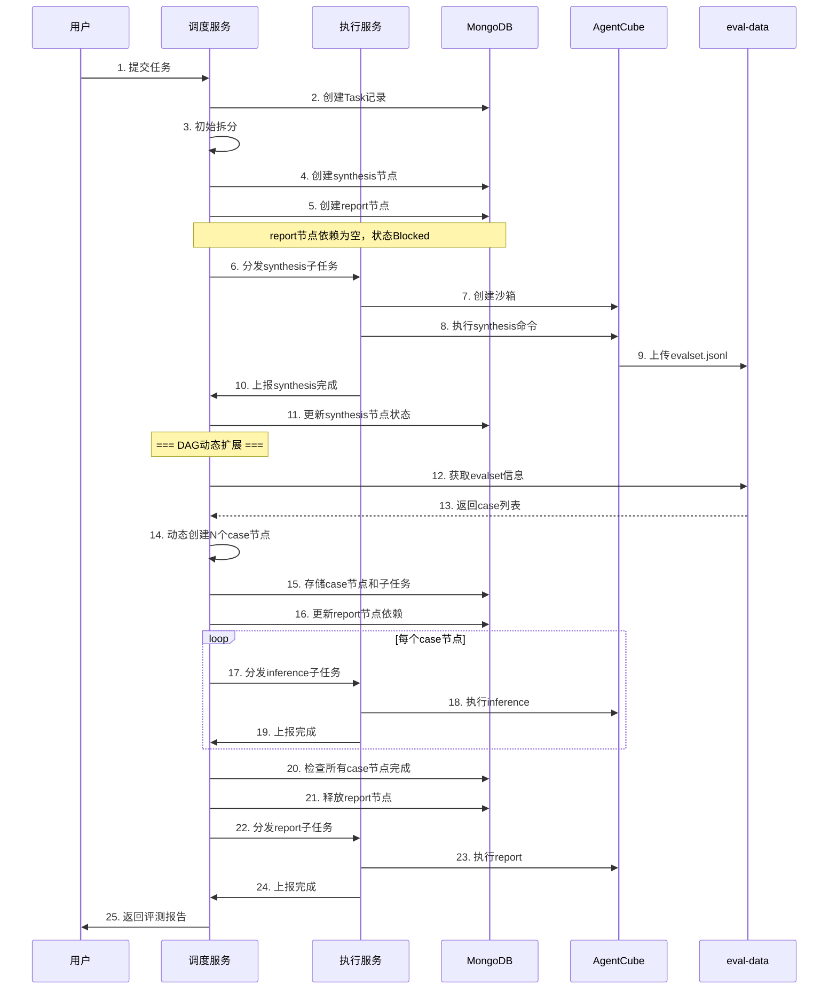

# 动态DAG节点创建流程设计文档

## 一、问题背景

### 1.1 问题描述

在当前设计中，DAG节点在任务拆分时创建，但**case数量在synthesis阶段完成后才能确定**。这导致：

1. 初始拆分时无法确定case节点数量
2. synthesis完成后需要动态创建case节点和对应的子任务
3. report节点需要等待所有case节点完成后才能执行

### 1.2 设计目标

- 支持动态DAG扩展，在synthesis完成后创建case节点
- 保证DAG节点状态的一致性
- 支持事务性创建，确保数据完整性
- 提供可观测性，便于追踪DAG扩展过程

---

## 二、整体流程

### 2.1 流程概览

```
┌─────────────────────────────────────────────────────────────────┐
│                      任务拆分与DAG扩展流程                         │
├─────────────────────────────────────────────────────────────────┤
│                                                                  │
│  阶段1: 初始拆分（任务提交时）                                      │
│  ┌──────────┐                                                    │
│  │ 任务提交  │                                                    │
│  └────┬─────┘                                                    │
│       ↓                                                          │
│  ┌──────────────────────────────────────┐                       │
│  │ 创建初始DAG节点:                       │                       │
│  │ - synthesis节点 (Status=Ready)         │                       │
│  │ - report节点 (Status=Blocked)          │ ← 预创建，依赖为空     │                       │
│  └──────────────────────────────────────┘                       │
│                                                                  │
│  阶段2: synthesis完成后动态扩展                                    │
│  ┌──────────────────────────────────────┐                       │
│  │ synthesis子任务完成                    │                       │
│  │ 输出: evalset.jsonl (包含N个case)      │                       │
│  └──────────────────┬───────────────────┘                       │
│                     ↓                                            │
│  ┌──────────────────────────────────────┐                       │
│  │ 解析evalset.jsonl                      │                       │
│  │ 获取case数量和case_id列表               │                       │
│  └──────────────────┬───────────────────┘                       │
│                     ↓                                            │
│  ┌──────────────────────────────────────┐                       │
│  │ 动态创建case节点 (N个):                 │                       │
│  │ - case-1节点 → 依赖synthesis节点        │                       │
│  │ - case-2节点 → 依赖synthesis节点        │                       │
│  │ - ...                                  │                       │
│  │ - case-N节点 → 依赖synthesis节点        │                       │
│  └──────────────────┬───────────────────┘                       │
│                     ↓                                            │
│  ┌──────────────────────────────────────┐                       │
│  │ 更新report节点依赖:                    │                       │
│  │ report.dependencies = [case-1, ..., case-N]│                   │
│  └──────────────────────────────────────┘                       │
│                                                                  │
└─────────────────────────────────────────────────────────────────┘
```

### 2.2 时序图



---

## 三、数据结构扩展

### 3.1 DAGNode扩展字段

```go
// DAGNode 扩展字段
type DAGNode struct {
    NodeId        string        `json:"node_id"`
    TaskId        string        `json:"task_id"`
    NodeType      string        `json:"node_type"`       // synthesis/case/report
    SubTaskIds    []string      `json:"sub_task_ids"`
    Dependencies  []string      `json:"dependencies"`
    Status        DAGNodeStatus `json:"status"`
    
    // 新增字段
    Dynamic       bool          `json:"dynamic"`         // 是否动态创建
    ParentNodeId  string        `json:"parent_node_id"`  // 动态创建时的父节点
    CaseId        string        `json:"case_id"`         // case节点绑定的case_id
    CreatedBy     string        `json:"created_by"`      // 创建来源: splitter/synthesis
    CreatedAt     int64         `json:"created_at"`
    UpdatedAt     int64         `json:"updated_at"`
}
```

### 3.2 DAG扩展请求

```go
// DAGExtensionRequest DAG扩展请求
type DAGExtensionRequest struct {
    TaskId        string          `json:"task_id"`
    TriggerNodeId string          `json:"trigger_node_id"`  // 触发扩展的节点ID (synthesis节点)
    EvalsetInfo   *EvalsetInfo    `json:"evalset_info"`
}

// EvalsetInfo 评测集信息
type EvalsetInfo struct {
    EvalsetId     string          `json:"evalset_id"`
    CaseCount     int             `json:"case_count"`
    CaseIds       []string        `json:"case_ids"`
    StorageRef    string          `json:"storage_ref"`      // eval-data中的存储引用
}
```

---

## 四、核心模块设计

### 4.1 Splitter初始拆分

```go
func (s *Splitter) Split(taskId string) error {
    ctx := context.Background()
    
    // 1. 获取任务配置
    task, err := s.storage.GetTask(ctx, taskId)
    if err != nil {
        return err
    }
    
    // 2. 解析配置
    parsedConfig, err := s.parseConfig(task.Config)
    if err != nil {
        return err
    }
    
    // 3. 创建初始DAG节点
    var nodes []*DAGNode
    var subTasks []*SubTask
    
    // 3.1 创建synthesis节点（如果workflow包含synthesis）
    if contains(parsedConfig.Workflow, "synthesis") {
        synthesisNode, synthesisSubTask := s.createSynthesisNode(taskId, parsedConfig)
        nodes = append(nodes, synthesisNode)
        subTasks = append(subTasks, synthesisSubTask)
    }
    
    // 3.2 预创建report节点（如果workflow包含report）
    // 注意: dependencies为空，等待synthesis完成后更新
    if contains(parsedConfig.Workflow, "report") {
        reportNode := &DAGNode{
            NodeId:       generateNodeId(),
            TaskId:       taskId,
            NodeType:     "report",
            SubTaskIds:   []string{},  // 稍后填充
            Dependencies: []string{},  // 稍后更新
            Status:       DAGNodeStatusBlocked,
            Dynamic:      false,
            CreatedBy:    "splitter",
            CreatedAt:    time.Now().Unix(),
            UpdatedAt:    time.Now().Unix(),
        }
        nodes = append(nodes, reportNode)
    }
    
    // 4. 事务存储DAG节点和子任务
    err = s.storage.CreateDAGNodesAndSubTasks(ctx, nodes, subTasks)
    if err != nil {
        return err
    }
    
    // 5. 更新任务状态
    err = s.storage.UpdateTaskStatus(ctx, taskId, TaskStatusRunning, "任务拆分完成，开始执行")
    
    return nil
}

// createSynthesisNode 创建synthesis节点
func (s *Splitter) createSynthesisNode(taskId string, config *ParsedConfig) (*DAGNode, *SubTask) {
    node := &DAGNode{
        NodeId:       generateNodeId(),
        TaskId:       taskId,
        NodeType:     "synthesis",
        SubTaskIds:   []string{},
        Dependencies: []string{},  // synthesis无依赖
        Status:       DAGNodeStatusReady,  // synthesis直接就绪
        Dynamic:      false,
        CreatedBy:    "splitter",
        CreatedAt:    time.Now().Unix(),
        UpdatedAt:    time.Now().Unix(),
    }
    
    subTask := &SubTask{
        SubTaskId:  generateSubTaskId(),
        TaskId:     taskId,
        Stage:      "synthesis",
        CaseId:     "",
        MergeMode:  false,
        Config:     extractSynthesisConfig(config),
        Status:     SubTaskStatusWaiting,
        RetryCount: 0,
        CreatedAt:  time.Now().Unix(),
        UpdatedAt:  time.Now().Unix(),
    }
    
    node.SubTaskIds = append(node.SubTaskIds, subTask.SubTaskId)
    
    return node, subTask
}
```

### 4.2 DAGExtender模块

```go
// DAGExtender DAG动态扩展器
type DAGExtender struct {
    storage         DAGNodeStorage
    subTaskStorage  SubTaskStorage
    taskStorage     TaskStorage
    dispatcher      *Dispatcher
    logger          *zap.Logger
}

// NewDAGExtender 创建DAGExtender实例
func NewDAGExtender(
    storage DAGNodeStorage,
    subTaskStorage SubTaskStorage,
    taskStorage TaskStorage,
    dispatcher *Dispatcher,
    logger *zap.Logger,
) *DAGExtender {
    return &DAGExtender{
        storage:        storage,
        subTaskStorage: subTaskStorage,
        taskStorage:    taskStorage,
        dispatcher:     dispatcher,
        logger:         logger,
    }
}

// ExtendDAG 扩展DAG，创建case节点
func (e *DAGExtender) ExtendDAG(ctx context.Context, req *DAGExtensionRequest) error {
    // 1. 解析评测集信息，获取case列表
    caseIds := req.EvalsetInfo.CaseIds
    caseCount := req.EvalsetInfo.CaseCount
    
    e.logger.Info("extending DAG with case nodes",
        zap.String("task_id", req.TaskId),
        zap.Int("case_count", caseCount),
        zap.String("trigger_node", req.TriggerNodeId),
    )
    
    // 2. 获取synthesis节点，作为case节点的依赖
    synthesisNode, err := e.storage.GetDAGNode(ctx, req.TriggerNodeId)
    if err != nil {
        return errors.Wrap(err, "get synthesis node failed")
    }
    
    // 3. 获取report节点
    reportNode, err := e.storage.GetReportNodeByTask(ctx, req.TaskId)
    if err != nil {
        e.logger.Warn("report node not found, may not be in workflow",
            zap.String("task_id", req.TaskId),
        )
        reportNode = nil
    }
    
    // 4. 获取任务配置
    task, err := e.taskStorage.GetTask(ctx, req.TaskId)
    if err != nil {
        return errors.Wrap(err, "get task failed")
    }
    
    // 5. 批量创建case节点和子任务
    var caseNodes []*DAGNode
    var caseSubTasks []*SubTask
    
    for _, caseId := range caseIds {
        // 创建case节点
        caseNode := &DAGNode{
            NodeId:       generateNodeId(),
            TaskId:       req.TaskId,
            NodeType:     "case",
            SubTaskIds:   []string{},
            Dependencies: []string{synthesisNode.NodeId},
            Status:       DAGNodeStatusReady,  // synthesis已完成，case节点就绪
            Dynamic:      true,
            ParentNodeId: synthesisNode.NodeId,
            CaseId:       caseId,
            CreatedBy:    "dag_extender",
            CreatedAt:    time.Now().Unix(),
            UpdatedAt:    time.Now().Unix(),
        }
        
        // 创建子任务（根据merge_mode决定创建1个还是2个子任务）
        subTasksForCase := e.createSubTasksForCase(req.TaskId, caseId, task.Config, req.EvalsetInfo)
        
        // 更新case节点的SubTaskIds
        for _, st := range subTasksForCase {
            caseNode.SubTaskIds = append(caseNode.SubTaskIds, st.SubTaskId)
        }
        
        caseNodes = append(caseNodes, caseNode)
        caseSubTasks = append(caseSubTasks, subTasksForCase...)
    }
    
    // 6. 更新report节点的依赖
    if reportNode != nil {
        caseNodeIds := make([]string, len(caseNodes))
        for i, node := range caseNodes {
            caseNodeIds[i] = node.NodeId
        }
        reportNode.Dependencies = caseNodeIds
        reportNode.UpdatedAt = time.Now().Unix()
    }
    
    // 7. 事务存储（创建case节点、子任务，更新report节点）
    err = e.storage.ExtendDAGWithCaseNodes(ctx, caseNodes, caseSubTasks, reportNode)
    if err != nil {
        return errors.Wrap(err, "extend DAG transaction failed")
    }
    
    e.logger.Info("DAG extended successfully",
        zap.String("task_id", req.TaskId),
        zap.Int("case_nodes", len(caseNodes)),
        zap.Int("subtasks", len(caseSubTasks)),
    )
    
    // 8. 触发case节点调度
    for _, node := range caseNodes {
        go e.dispatcher.DispatchNode(node)
    }
    
    return nil
}
```

### 4.3 Case子任务创建

```go
// createSubTasksForCase 为case创建子任务
func (e *DAGExtender) createSubTasksForCase(
    taskId string,
    caseId string,
    config *TaskConfig,
    evalsetInfo *EvalsetInfo,
) []*SubTask {
    var subTasks []*SubTask
    
    mergeMode := false
    if config.Inference != nil && config.Inference.MergeEval {
        mergeMode = true
    }
    
    if mergeMode {
        // 合并模式: inference+eval合为一个子任务
        subTask := &SubTask{
            SubTaskId:  generateSubTaskId(),
            TaskId:     taskId,
            Stage:      "inference-eval",
            CaseId:     caseId,
            MergeMode:  true,
            Config: &SubTaskConfig{
                ModelConfig: config.Models[0],  // 简化处理
                StageConfig: config.Inference,
                EvalsetRef: &EvalsetRef{
                    EvalsetId: evalsetInfo.EvalsetId,
                    AppId:     "todo",  // 从task获取
                },
            },
            Status:     SubTaskStatusWaiting,
            RetryCount: 0,
            CreatedAt:  time.Now().Unix(),
            UpdatedAt:  time.Now().Unix(),
        }
        subTasks = append(subTasks, subTask)
    } else {
        // 分离模式: inference和eval分别为子任务
        inferenceSubTask := &SubTask{
            SubTaskId:  generateSubTaskId(),
            TaskId:     taskId,
            Stage:      "inference",
            CaseId:     caseId,
            MergeMode:  false,
            Config: &SubTaskConfig{
                ModelConfig: config.Models[0],
                StageConfig: config.Inference,
                EvalsetRef: &EvalsetRef{
                    EvalsetId: evalsetInfo.EvalsetId,
                    AppId:     "todo",
                },
            },
            Status:     SubTaskStatusWaiting,
            RetryCount: 0,
            CreatedAt:  time.Now().Unix(),
            UpdatedAt:  time.Now().Unix(),
        }
        
        evalSubTask := &SubTask{
            SubTaskId:  generateSubTaskId(),
            TaskId:     taskId,
            Stage:      "eval",
            CaseId:     caseId,
            MergeMode:  false,
            Config: &SubTaskConfig{
                ModelConfig: config.Models[0],
                StageConfig: config.Eval,
                EvalsetRef: &EvalsetRef{
                    EvalsetId: evalsetInfo.EvalsetId,
                    AppId:     "todo",
                },
            },
            Status:     SubTaskStatusWaiting,
            RetryCount: 0,
            CreatedAt:  time.Now().Unix(),
            UpdatedAt:  time.Now().Unix(),
        }
        
        subTasks = append(subTasks, inferenceSubTask, evalSubTask)
    }
    
    return subTasks
}
```

### 4.4 触发时机

```go
// 在执行服务的SubTaskManager中，synthesis完成后触发DAG扩展
func (m *SubTaskManager) onSynthesisComplete(ctx context.Context, subTask *SubTaskContext, result *SubTaskResult) error {
    // 1. 解析evalset.jsonl，获取case信息
    evalsetInfo, err := m.parseEvalsetFromResult(ctx, subTask, result)
    if err != nil {
        m.logger.Error("failed to parse evalset",
            zap.String("subtask_id", subTask.SubTaskId),
            zap.Error(err),
        )
        return err
    }
    
    // 2. 构建DAG扩展请求
    req := &DAGExtensionRequest{
        TaskId:        subTask.TaskId,
        TriggerNodeId: subTask.NodeId,  // synthesis节点ID
        EvalsetInfo:   evalsetInfo,
    }
    
    // 3. 调用调度服务的DAG扩展接口
    err = m.schedulerClient.ExtendDAG(ctx, req)
    if err != nil {
        m.logger.Error("failed to extend DAG",
            zap.String("task_id", subTask.TaskId),
            zap.Error(err),
        )
        return err
    }
    
    return nil
}

// parseEvalsetFromResult 从synthesis结果中解析评测集信息
func (m *SubTaskManager) parseEvalsetFromResult(ctx context.Context, subTask *SubTaskContext, result *SubTaskResult) (*EvalsetInfo, error) {
    // 1. 从沙箱下载evalset.jsonl
    evalsetPath := result.OutputFiles["evalset.jsonl"]
    evalsetContent, err := subTask.Sandbox.ReadFile(ctx, evalsetPath)
    if err != nil {
        return nil, errors.Wrap(err, "read evalset file failed")
    }
    
    // 2. 解析JSONL，提取case_id列表
    var caseIds []string
    scanner := bufio.NewScanner(bytes.NewReader(evalsetContent))
    for scanner.Scan() {
        var item map[string]interface{}
        if err := json.Unmarshal(scanner.Bytes(), &item); err != nil {
            m.logger.Warn("failed to parse evalset line",
                zap.String("line", scanner.Text()),
                zap.Error(err),
            )
            continue
        }
        if caseId, ok := item["case_id"].(string); ok {
            caseIds = append(caseIds, caseId)
        }
    }
    
    // 3. 生成evalset_id并上传到eval-data
    evalsetId := generateEvalsetId()
    
    return &EvalsetInfo{
        EvalsetId: evalsetId,
        CaseCount: len(caseIds),
        CaseIds:   caseIds,
        StorageRef: "eval-data",
    }, nil
}
```

---

## 五、存储层扩展

### 5.1 MongoDB扩展接口

```go
// ExtendDAGWithCaseNodes 事务扩展DAG
func (s *MongoTaskStorage) ExtendDAGWithCaseNodes(
    ctx context.Context,
    caseNodes []*DAGNode,
    subTasks []*SubTask,
    reportNode *DAGNode,
) error {
    // 使用MongoDB事务
    session, err := s.client.StartSession()
    if err != nil {
        return err
    }
    defer session.EndSession(ctx)
    
    callback := func(sessionCtx mongo.SessionContext) (interface{}, error) {
        // 1. 批量插入case节点
        if len(caseNodes) > 0 {
            nodeDocs := make([]interface{}, len(caseNodes))
            for i, node := range caseNodes {
                nodeDocs[i] = node
            }
            _, err := s.dagNodeCollection.InsertMany(sessionCtx, nodeDocs)
            if err != nil {
                return nil, err
            }
        }
        
        // 2. 批量插入子任务
        if len(subTasks) > 0 {
            subTaskDocs := make([]interface{}, len(subTasks))
            for i, st := range subTasks {
                subTaskDocs[i] = st
            }
            _, err := s.subTaskCollection.InsertMany(sessionCtx, subTaskDocs)
            if err != nil {
                return nil, err
            }
        }
        
        // 3. 更新report节点依赖
        if reportNode != nil {
            filter := bson.M{"node_id": reportNode.NodeId}
            update := bson.M{
                "$set": bson.M{
                    "dependencies": reportNode.Dependencies,
                    "updated_at":   reportNode.UpdatedAt,
                },
            }
            _, err := s.dagNodeCollection.UpdateOne(sessionCtx, filter, update)
            if err != nil {
                return nil, err
            }
        }
        
        return nil, nil
    }
    
    _, err = session.WithTransaction(ctx, callback)
    return err
}

// GetReportNodeByTask 获取任务的report节点
func (s *MongoTaskStorage) GetReportNodeByTask(ctx context.Context, taskId string) (*DAGNode, error) {
    filter := bson.M{
        "task_id":   taskId,
        "node_type": "report",
    }
    
    var node DAGNode
    err := s.dagNodeCollection.FindOne(ctx, filter).Decode(&node)
    if err != nil {
        if err == mongo.ErrNoDocuments {
            return nil, errors.ErrDAGNodeNotFound
        }
        return nil, err
    }
    
    return &node, nil
}
```

---

## 六、异常处理

### 6.1 异常场景与处理

| 场景 | 处理方式 | 重试策略 |
|------|----------|----------|
| evalset解析失败 | synthesis子任务标记失败，任务失败 | 不重试 |
| evalset为空（case_count=0） | 任务标记失败，返回错误 | 不重试 |
| case节点创建失败 | 记录错误日志，重试创建 | 最大重试3次 |
| 数据库事务失败 | 回滚已创建的节点，重新尝试扩展 | 指数退避重试 |
| eval-data服务不可用 | 等待服务恢复后重试 | 最大重试5次 |
| 调度服务调用失败 | 执行服务本地缓存，稍后重试 | 最大重试3次 |

### 6.2 幂等性保证

```go
// ExtendDAG 扩展前检查是否已扩展
func (e *DAGExtender) ExtendDAG(ctx context.Context, req *DAGExtensionRequest) error {
    // 检查是否已经为该synthesis节点创建过case节点
    existingNodes, err := e.storage.GetCaseNodesByParent(ctx, req.TriggerNodeId)
    if err != nil {
        return err
    }
    
    if len(existingNodes) > 0 {
        e.logger.Warn("DAG already extended, skip",
            zap.String("task_id", req.TaskId),
            zap.String("trigger_node", req.TriggerNodeId),
            zap.Int("existing_case_nodes", len(existingNodes)),
        )
        return nil  // 幂等返回
    }
    
    // 继续扩展流程...
}
```

---

## 七、监控与日志

### 7.1 关键指标

| 指标名 | 类型 | 说明 |
|--------|------|------|
| `dag_extension_total` | Counter | DAG扩展总次数 |
| `dag_extension_duration_seconds` | Histogram | DAG扩展耗时 |
| `dag_extension_case_nodes_created` | Gauge | 扩展创建的case节点数 |
| `dag_extension_errors_total` | Counter | DAG扩展失败次数 |

### 7.2 关键日志

```go
// 扩展开始
e.logger.Info("DAG extension started",
    zap.String("task_id", taskId),
    zap.String("trigger_node", triggerNodeId),
    zap.Int("expected_case_count", caseCount),
)

// 扩展完成
e.logger.Info("DAG extension completed",
    zap.String("task_id", taskId),
    zap.Int("case_nodes_created", len(caseNodes)),
    zap.Int("subtasks_created", len(caseSubTasks)),
    zap.Duration("duration", time.Since(startTime)),
)

// 扩展失败
e.logger.Error("DAG extension failed",
    zap.String("task_id", taskId),
    zap.Error(err),
    zap.Int("retry_count", retryCount),
)
```

---

## 八、配置项

```yaml
# configs/scheduler.yaml
dag_extension:
  enabled: true
  max_case_count: 1000          # 最大case数量限制
  batch_create_size: 100        # 批量创建节点大小
  retry_count: 3                # 扩展失败重试次数
  retry_interval: 5s            # 重试间隔
  timeout: 30s                  # 扩展超时时间
```

---

## 九、测试要点

### 9.1 单元测试

| 测试场景 | 验证点 |
|----------|--------|
| 初始拆分-包含synthesis | 创建synthesis节点，report节点依赖为空 |
| 初始拆分-不包含synthesis | 直接创建case节点（基于预置评测集） |
| DAG扩展-正常流程 | 正确创建case节点和子任务 |
| DAG扩展-空评测集 | 返回错误，任务失败 |
| DAG扩展-重复扩展 | 幂等返回，不重复创建 |
| 子任务创建-合并模式 | 创建单个inference-eval子任务 |
| 子任务创建-分离模式 | 创建inference和eval两个子任务 |

### 9.2 集成测试

| 测试场景 | 验证点 |
|----------|--------|
| 完整流程-端到端 | synthesis完成→DAG扩展→case执行→report |
| 并发扩展 | 多个任务同时触发DAG扩展 |
| 事务回滚 | 扩展失败后数据一致性 |