# 应用评测服务架构设计文档

## 一、宏观架构

### 1. 概述

#### 1.1 项目定位

应用评测服务（agent-eval-server）旨在实现对**Skill（技能）**的自动化评测能力。用户提交一个或多个Skill，系统在隔离的沙箱环境中执行评测，评估Skill在特定场景下的表现。

**评测流程概述**：

1. **用户提交**：提交评测任务，包含Skill配置文件
2. **synthesis阶段**：根据Skill生成评测用例（case），输出评测集
3. **inference阶段**：评测工具驱动Claude Code/Open Claw加载Skill，对case做出响应
4. **eval阶段**：根据交互记录计算评测指标
5. **report阶段**：汇总生成评测报告

#### 1.2 核心目标

构建一个分布式评测服务系统，支持：

- 通过API接口提交Skill评测任务
- 任务自动拆分与DAG调度
- 在隔离的沙箱环境中执行评测
- 评测数据的持久化存储与管理
- 评测结果的汇总与报告生成

#### 1.3 功能边界

| 功能 | 说明 |
|-----|------|
| 任务管理 | 接收任务请求，管理任务生命周期 |
| 任务调度 | 任务拆分、DAG构建、子任务分发 |
| 子任务执行 | 在沙箱环境中执行评测工具 |
| 数据管理 | 评测集、评测记录的存储与查询（依赖eval-data服务） |
| 结果汇总 | 评测结果聚合、报告生成 |

#### 1.4 与模型评测服务的差异

| 维度 | 模型评测服务 | 应用评测服务 |
|------|-------------|-------------|
| 评测对象 | 模型输出（问答对话） | Skill（技能）在Agent环境下的表现 |
| 执行环境 | 执行服务本身是沙箱（Linux用户隔离） | 执行服务管理远程沙箱（AgentCube） |
| 任务拆分 | 按评测维度拆分（主观/客观评测） | 按workflow阶段+case拆分（混合拆分） |
| 数据流 | 本地文件读写 | 远程沙箱文件上传/下载 + eval-data持久化 |
| workflow | 无阶段概念 | 四阶段：synthesis→inference→eval→report |
| 调度服务 | 分布式多节点负载均衡 | 主从模式（避免竞态资源更新问题） |

---

### 2. 系统架构

#### 2.1 整体架构图

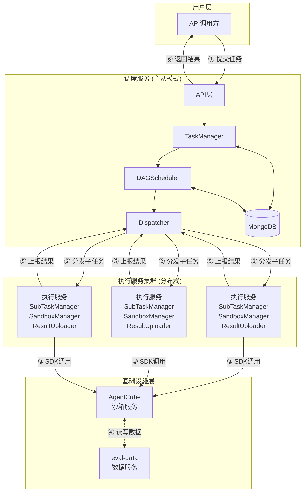

#### 2.2 服务组成与职责

| 服务 | 职责 | 说明 |
|------|------|------|
| **调度服务** | 任务生命周期管理、DAG调度、子任务分发 | 主从模式，Master节点负责实际调度 |
| **执行服务** | 接收子任务、管理沙箱、执行评测、上报结果 | 分布式部署，负载均衡 |
| **AgentCube** | 提供隔离沙箱环境 | 外部依赖，通过SDK调用 |
| **eval-data** | 评测数据持久化 | 外部依赖，通过HTTP API调用 |

#### 2.3 组件交互关系

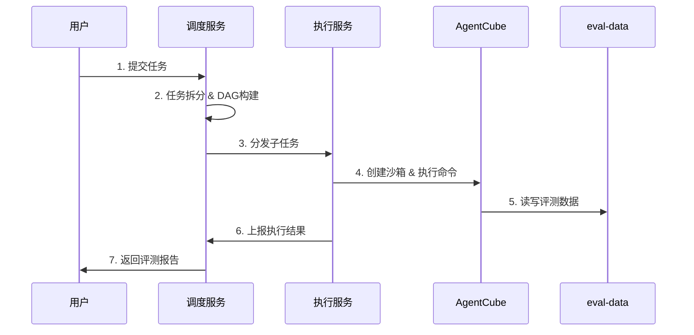

#### 2.4 部署形态

**调度服务**：
- 主从模式部署（1 Master + N Slave）
- Master节点负责实际调度工作
- Slave节点备用，Master故障时切换
- 所有节点共享MongoDB数据存储

**执行服务**：
- 分布式部署，多实例负载均衡
- 调度服务根据执行服务负载情况分发子任务
- 每个执行服务实例独立管理其所负责的子任务

**负载均衡策略**：
- 执行服务选择：基于执行服务当前活跃子任务数量，选择负载较低的实例
- 子任务分发：调度服务主动调用执行服务的子任务接收接口

---

## 二、核心概念与模型

### 1. 核心概念

#### 1.1 Skill（技能）

Skill是评测的核心对象，是用户定义的技能配置文件。一个Skill描述了Agent应具备的能力和行为规范，包括：
- 技能名称、描述
- 触发条件和执行规则
- 工具调用定义
- 行为约束

用户在提交评测任务时，可以提交一个或多个Skill，系统会评估这些Skill在特定场景下的表现。

#### 1.2 Case（评测用例）

Case是评测的基本单元，包含对Skill进行评测所需的信息：
- 问题或操作说明（question/instruction）
- 预期结果或参考答案（reference）
- 评测维度和标准

Case在**synthesis阶段**根据Skill自动生成，存储在评测集中。

#### 1.3 任务（Task）

用户提交的完整评测请求，包含评测配置和workflow定义。一个任务对应一次完整的Skill评测流程。

**任务属性**：
- Skill配置：一个或多个Skill文件
- 评测配置：workflow定义、模型配置、各阶段配置
- 评测资源：resource文件（pdf、txt、xlsx等）
- 整体状态：运行中、完成、失败、取消

#### 1.4 子任务（SubTask）

任务拆分后的执行单元，对应一个workflow阶段或一个case的执行。每个子任务绑定一个远程沙箱实例。

**子任务属性**：
- 阶段类型：synthesis、inference、eval、report
- case绑定：inference/eval阶段绑定的case_id
- 沙箱绑定：关联的AgentCube沙箱session_id
- 执行状态：等待、运行中、完成、失败

#### 1.5 DAG节点（DAGNode）

任务拆分后形成的有向无环图节点，表示一个或多个子任务的集合及其依赖关系。

**DAG节点属性**：
- 包含的子任务列表
- 前置依赖节点列表
- 节点状态：阻塞（依赖未满足）、就绪（可调度）、运行中、完成

#### 1.6 Workflow阶段

应用评测的执行阶段序列，每个阶段在独立的沙箱环境中执行：

| 阶段 | 执行逻辑 | 输入 | 输出 |
|------|---------|------|------|
| synthesis | 评测工具根据Skill生成评测用例（case） | Skill、场景描述 | dataset.jsonl, evalset.jsonl（评测集） |
| inference | 评测工具驱动Claude Code/Open Claw加载Skill，对case做出响应 | Skill、评测集 | transcript.jsonl（交互记录）, evalset.jsonl（含answer） |
| eval | 评测工具根据交互记录计算评测指标 | 交互记录、评测集 | result.json（评测结果） |
| report | 汇总评测结果，生成报告 | 评测结果 | conclusion.json, conclusion.html |

**阶段详细说明**：

**synthesis阶段**：
1. 执行服务创建沙箱实例
2. 上传Skill文件和评测工具到沙箱
3. 执行评测工具，根据Skill生成评测用例（case）
4. 输出评测集到沙箱文件系统
5. 上传评测集到eval-data服务

**inference阶段**：
1. 执行服务创建沙箱实例（沙箱预装Claude Code或Open Claw）
2. 上传Skill文件、评测工具到沙箱
3. 从eval-data下载评测集到沙箱
4. 执行评测工具：
   - 评测工具将Skill放置到对应目录
   - 评测工具将case送入Claude Code/Open Claw
   - Claude Code/Open Claw加载Skill，对case中的问题或操作说明做出响应
5. 输出交互记录和结果
6. 上传结果到eval-data服务

**eval阶段**：
1. 执行服务创建沙箱实例
2. 上传评测工具到沙箱
3. 从eval-data下载交互记录和评测集
4. 执行评测工具，计算评测指标
5. 输出评测结果
6. 上传结果到eval-data服务

**report阶段**：
1. 执行服务创建沙箱实例
2. 上传评测工具到沙箱
3. 从eval-data下载评测结果
4. 执行评测工具，生成评测报告
5. 输出报告文件

**执行模式**：
- 完整流程：synthesis → inference → eval → report
- 部分流程：可配置只执行部分阶段（如跳过synthesis，使用已有评测集）

#### 1.7 沙箱实例（Sandbox）

AgentCube提供的隔离执行环境，沙箱内预装了：
- Claude Code 或 Open Claw（Agent执行环境）
- 评测工具（astron-eval）

每个子任务创建一个独立的沙箱实例，确保评测过程隔离。

#### 1.8 概念关系图

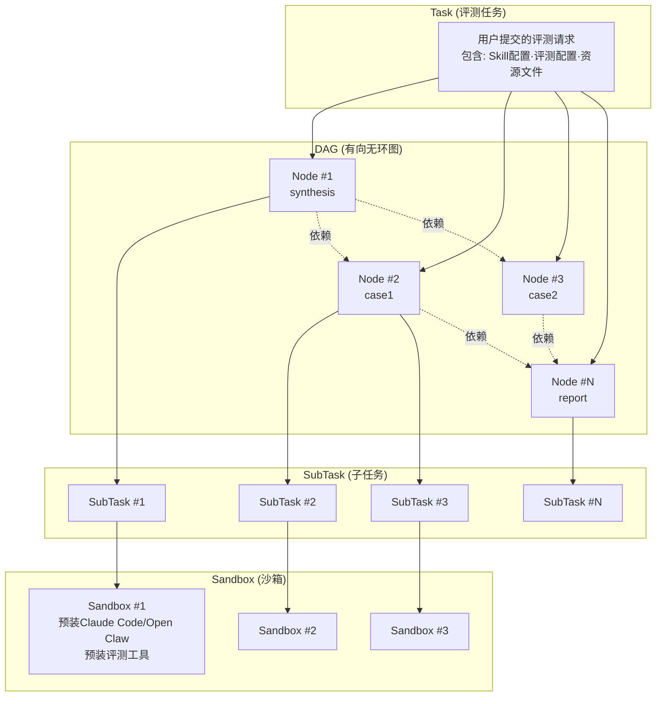

---

### 2. 数据模型

#### 2.1 Task（任务）

```go
type Task struct {
    TaskId      string                 // 任务唯一标识
    AppId       string                 // 应用标识
    Description string                 // 任务描述
    Config      *TaskConfig            // 任务配置（workflow、models、阶段配置）
    Resources   *TaskResources         // 评测资源（skills、files）
    Status      TaskStatus             // 任务状态
    Progress    int                    // 执行进度 0-100
    Message     string                 // 状态消息
    Result      *TaskResult            // 评测结果汇总
    CreatedAt   int64                  // 创建时间
    UpdatedAt   int64                  // 更新时间
    ExpiredAt   *time.Time             // 过期时间
}

type TaskConfig struct {
    Version    string                  // 配置版本
    Workflow   []string                // 执行阶段列表
    Models     []*ModelConfig          // 模型配置列表
    Synthesis  *SynthesisConfig        // synthesis阶段配置
    Inference  *InferenceConfig        // inference阶段配置
    Eval       *EvalConfig             // eval阶段配置
    Report     *ReportConfig           // report阶段配置
}

type TaskResources struct {
    Skills     []byte                  // skills目录打包内容
    Files      map[string][]byte       // resource文件 {filename: content}
}

type TaskResult struct {
    ReportUrl  string                  // 评测报告URL
    Usages     []*ModelUsage           // Token消耗统计
    Conclusion *Conclusion             // 评测结论
}
```

#### 2.2 TaskStatus（任务状态）

| 状态值 | 状态名 | 说明 |
|-------|--------|------|
| 0 | Waiting | 等待中（DAG节点未释放） |
| 1 | Running | 执行中（有子任务正在执行） |
| 2 | Finished | 执行完成 |
| 3 | Failed | 任务失败 |
| 4 | Canceled | 任务取消 |
| 5 | Exception | 任务异常（中间态） |

**状态流转**：

```
Waiting → Running → Finished
                 ↘ Failed
                 ↘ Canceled
                 ↘ Exception → Running/Failed
```

#### 2.3 SubTask（子任务）

```go
type SubTask struct {
    SubTaskId   string                 // 子任务唯一标识
    TaskId      string                 // 所属任务ID
    Stage       string                 // 阶段类型：synthesis/inference/eval/report
    CaseId      string                 // case标识（inference/eval阶段）
    MergeMode   bool                   // 是否为合并模式（inference+eval合并）
    Config      *SubTaskConfig         // 子任务执行配置
    Status      SubTaskStatus          // 子任务状态
    Executor    string                 // 执行服务实例地址
    SandboxId   string                 // AgentCube沙箱session_id
    Result      *SubTaskResult         // 执行结果
    RetryCount  int                    // 重试次数
    CreatedAt   int64                  // 创建时间
    UpdatedAt   int64                  // 更新时间
}

type SubTaskConfig struct {
    // 从TaskConfig中提取的该子任务所需配置
    ModelConfig *ModelConfig           // 该阶段使用的模型配置
    StageConfig interface{}            // 该阶段的配置（SynthesisConfig/InferenceConfig等）
    Evalset     *EvalsetRef            // 评测集引用（inference/eval阶段）
}

type SubTaskResult struct {
    Success     int                    // -1:失败, 0:执行中, 1:完成
    Message     string                 // 执行消息
    OutputFiles map[string]string      // 输出文件路径
    Usage       *ModelUsage            // Token消耗
}
```

#### 2.4 SubTaskStatus（子任务状态）

| 状态值 | 状态名 | 说明 |
|-------|--------|------|
| 0 | Waiting | 等待调度 |
| 1 | Allocated | 已分配执行服务 |
| 2 | Running | 运行中 |
| 3 | Finished | 完成 |
| 4 | Failed | 失败 |
| 5 | Exception | 异常（可重试） |
| 6 | Canceled | 取消 |

#### 2.5 DAGNode（DAG节点）

```go
type DAGNode struct {
    NodeId      string                 // 节点唯一标识
    TaskId      string                 // 所属任务ID
    SubTaskIds  []string               // 包含的子任务ID列表
    Dependencies []string              // 前置依赖节点ID列表
    Status      DAGNodeStatus          // 节点状态
    CreatedAt   int64                  // 创建时间
    UpdatedAt   int64                  // 更新时间
}
```

#### 2.6 DAGNodeStatus（DAG节点状态）

| 状态值 | 状态名 | 说明 |
|-------|--------|------|
| 0 | Blocked | 阻塞（依赖节点未完成） |
| 1 | Ready | 就绪（依赖节点已完成，可调度） |
| 2 | Running | 运行中（子任务正在执行） |
| 3 | Finished | 完成（所有子任务完成） |
| 4 | Failed | 失败（有子任务失败） |

**状态流转**：

```
Blocked → Ready → Running → Finished
                     ↘ Failed
```

#### 2.7 数据存储关系

```
MongoDB Collections:
├── tasks          // Task记录
├── subtasks       // SubTask记录
├── dag_nodes      // DAGNode记录（便于并发更新节点状态）
└── task_resources // TaskResources存储（可选，大文件可存对象存储）
```

---

### 3. 任务拆分与DAG

#### 3.1 拆分策略

采用混合拆分策略：

| 阶段 | 拆分方式 | 说明 |
|------|---------|------|
| synthesis | 整体执行 | 不按case拆分，生成完整评测集 |
| inference | 按case拆分 | 每个case一个或多个子任务 |
| eval | 按case拆分 | 每个case一个子任务，可与inference合并 |
| report | 整体执行 | 收集所有评测结果生成报告 |

#### 3.2 拆分模式

**模式A：分离模式**
- inference子任务 + eval子任务（每个case两个子任务）
- eval依赖inference完成

**模式B：合并模式**
- inference+eval合并子任务（每个case一个子任务）
- 在一个沙箱中顺序执行inference和eval

**配置示例**：

```yaml
# 分离模式
inference:
  type: claude-code
  model: ID_JUDGE_001
  merge_eval: false    # 不合并

eval:
  model: ID_JUDGE_001

# 合并模式
inference:
  type: claude-code
  model: ID_JUDGE_001
  merge_eval: true     # 合并eval
```

#### 3.3 DAG构建规则

**规则1：synthesis节点**
- 无前置依赖
- 包含1个synthesis子任务

**规则2：inference/eval节点**
- 依赖synthesis节点（如果workflow包含synthesis）
- 每个case对应一个DAG节点
- 分离模式：节点包含2个子任务（inference + eval），eval依赖inference
- 合并模式：节点包含1个子任务（inference+eval合并）

**规则3：report节点**
- 依赖所有inference/eval节点
- 包含1个report子任务

#### 3.4 DAG结构示例

**完整流程（分离模式）**：

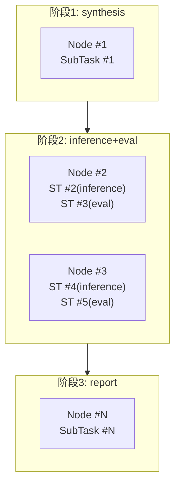

**完整流程（合并模式）**：

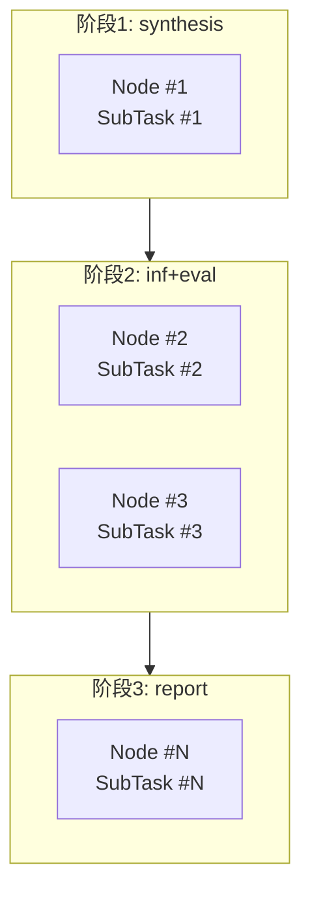

**部分流程（inference+eval）**：

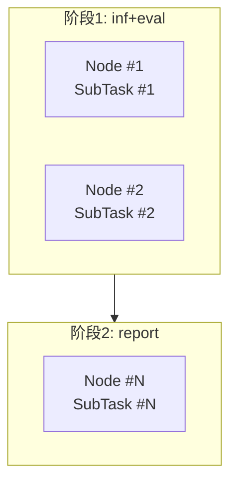

#### 3.5 DAG节点释放条件

节点状态从 Blocked → Ready 的条件：
- 所有依赖节点状态为 Finished
- 无依赖节点时，初始状态为 Ready

---

## 三、流程设计

### 1. 核心流程

#### 1.1 端到端流程图

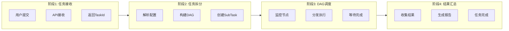

#### 1.2 流程关键点

| 步骤 | 关键点 | 说明 |
|------|--------|------|
| 任务接收 | 异步返回 | 任务提交后立即返回TaskId，不等待执行完成 |
| 任务拆分 | DAG构建 | 根据workflow配置构建有依赖关系的DAG |
| DAG调度 | 节点释放 | 依赖节点完成后，自动释放后续节点 |
| 子任务分发 | 负载均衡 | 选择负载最低的执行服务实例 |
| 结果汇总 | 状态聚合 | 所有DAG节点完成后，更新Task状态 |

---

### 2. 调度服务流程

#### 2.1 DAG节点状态监控流程

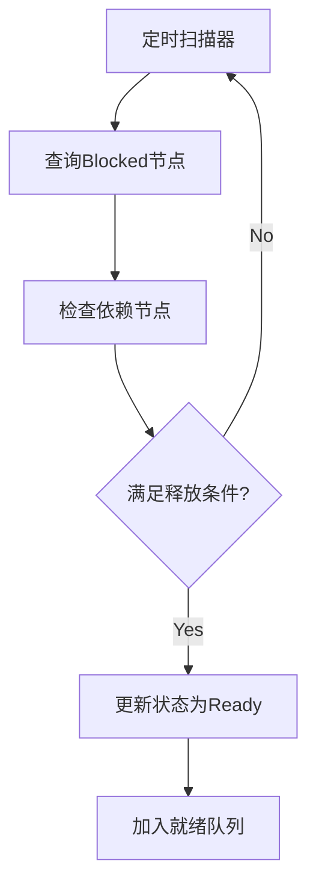

#### 2.2 子任务分发流程

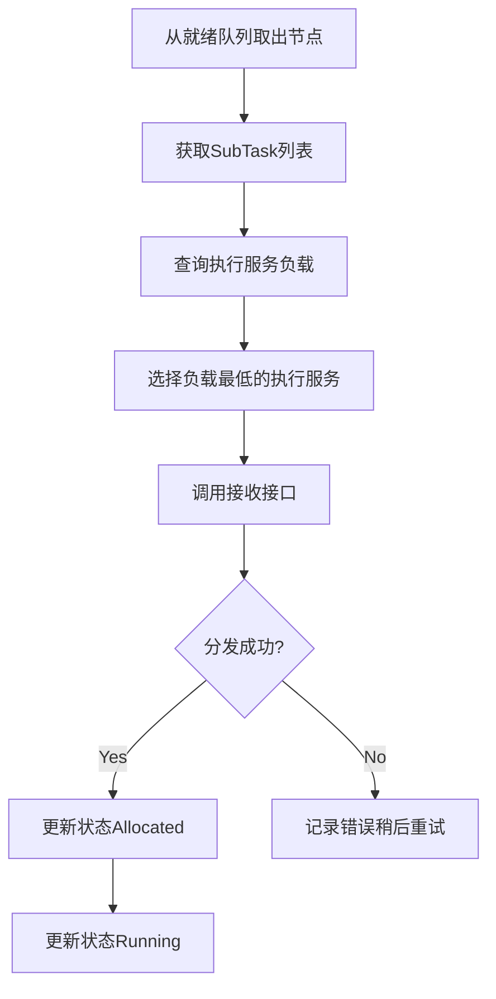

#### 2.3 状态更新监听流程

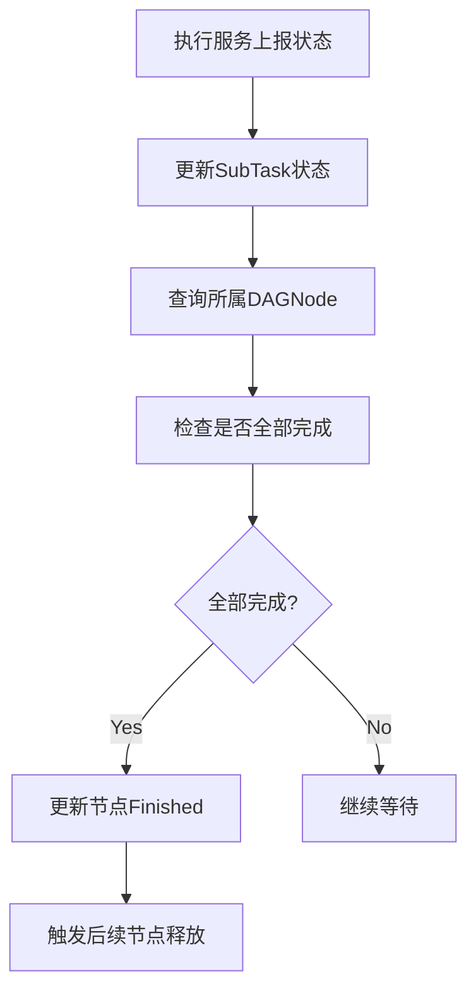

---

### 3. 执行服务流程

#### 3.1 子任务接收流程

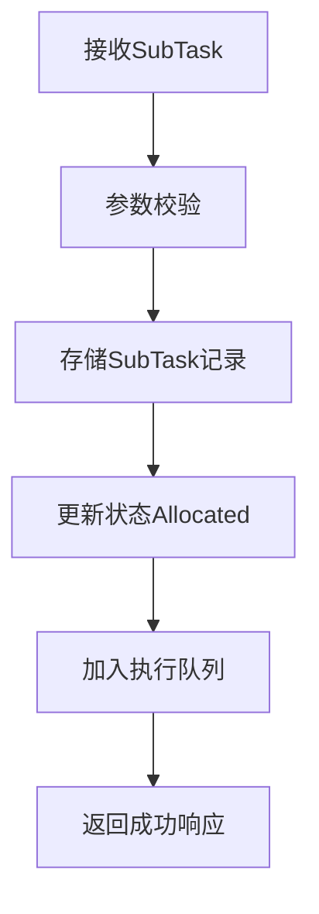

#### 3.2 子任务执行流程

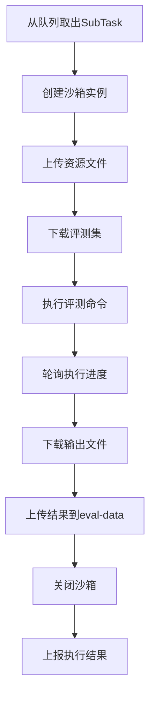

#### 3.3 沙箱生命周期管理流程

```mermaid
flowchart LR
    subgraph S1["创建阶段"]
        C1["NewSandbox"]
        C2["设置TTL"]
        C3["获取session_id"]
    end

    subgraph S2["准备阶段"]
        P1["UploadFile<br/>skills目录"]
        P2["WriteFile<br/>配置文件"]
        P3["DownloadURL<br/>eval-data"]
    end

    subgraph S3["执行阶段"]
        E1["ExecuteCommand<br/>评测命令"]
        E2["设置Timeout"]
        E3["获取stdout/stderr"]
    end

    subgraph S4["收集阶段"]
        L1["ListFiles"]
        L2["DownloadFile"]
        L3["ReadFile"]
    end

    subgraph S5["销毁阶段"]
        D1["Close"]
        D2["清除绑定"]
        D3["更新状态"]
    end

    S1 --> S2 --> S3 --> S4 --> S5
```

#### 3.4 状态上报流程

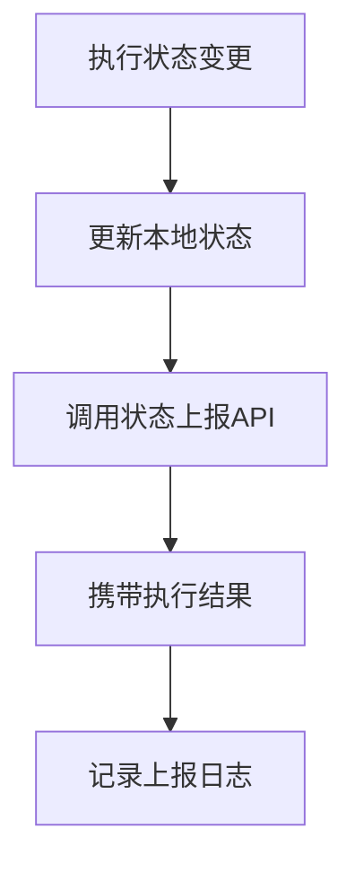

---

### 4. API处理流程

#### 4.1 任务提交流程

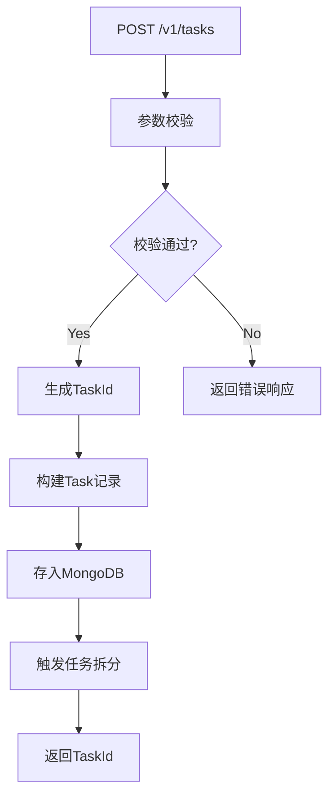

#### 4.2 任务查询流程

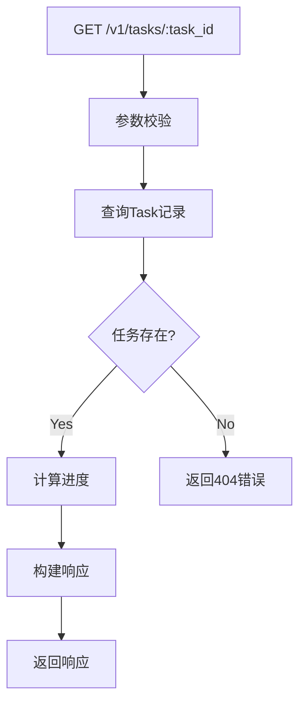

#### 4.3 任务取消流程

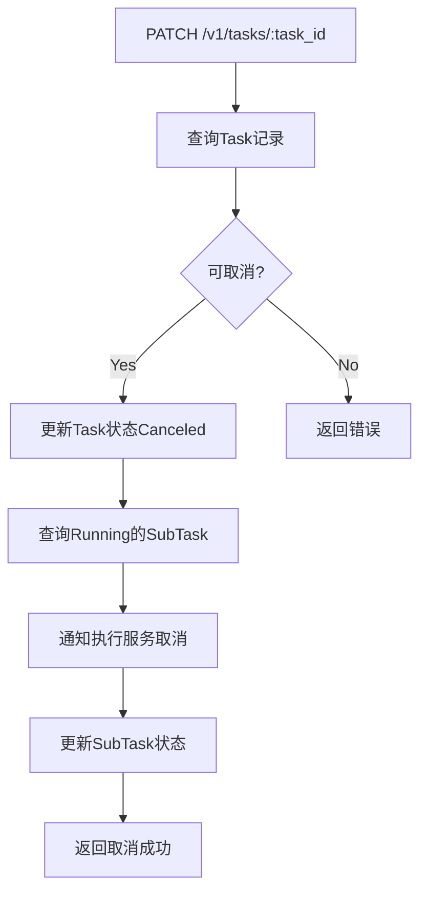

---

## 四、服务详细设计

### 1. 调度服务设计

#### 1.1 模块划分

```
调度服务
├── API层                    // HTTP接口处理
│   ├── TaskAPI              // 任务提交/查询/取消接口
│   ├── StatusAPI            // 状态上报接口（执行服务调用）
│   └── HealthAPI            // 健康检查接口
│
├── TaskManager              // 任务生命周期管理
│   ├── TaskCreator          // 任务创建
│   ├── TaskQuerier          // 任务查询
│   ├── TaskCanceler         // 任务取消
│   └── TaskUpdater          // 任务状态更新
│
├── Splitter                 // 任务拆分器
│   ├── ConfigParser         // 配置解析
│   ├── DAGBuilder           // DAG构建
│   └── SubTaskCreator       // 子任务创建
│
├── DAGScheduler             // DAG调度器
│   ├── NodeMonitor          // 节点状态监控
│   ├── DependencyChecker    // 依赖检查
│   ├── NodeReleaser         // 节点释放
│   └── StatusAggregator     // 状态聚合
│
├── Dispatcher               // 子任务分发器
│   ├── ExecutorSelector     // 执行服务选择
│   ├── LoadBalancer         // 负载均衡
│   └── SubTaskDispatcher    // 子任务分发
│
├── ExecutorManager          // 执行服务管理器
│   ├── ExecutorRegistry     // 执行服务注册
│   ├── HealthChecker        // 健康检查
│   ├── LoadCollector        // 负载收集
│   └── FailureHandler       // 失联处理
│
├── Storage                  // 数据存储层
│   ├── TaskStorage          // Task记录存储
│   ├── SubTaskStorage       // SubTask记录存储
│   ├── DAGNodeStorage       // DAGNode记录存储
│   └── ResourceStorage      // 资源文件存储
│
└── MasterSlave              // 主从模式管理
    ├── MasterController     // Master节点控制
    ├── SlaveController      // Slave节点备用
    └── Switcher             // 主从切换
```

#### 1.2 核心模块职责

| 模块 | 职责 | 关键方法 |
|------|------|---------|
| **API层** | 接收HTTP请求，参数校验，响应构造 | `SubmitTask()`, `QueryTask()`, `CancelTask()` |
| **TaskManager** | 任务记录的CRUD操作 | `CreateTask()`, `UpdateTaskStatus()`, `GetTask()` |
| **Splitter** | 根据配置拆分任务，构建DAG | `Split()`, `BuildDAG()`, `CreateSubTasks()` |
| **DAGScheduler** | 监控DAG节点状态，触发节点释放 | `MonitorNodes()`, `CheckDependencies()`, `ReleaseNode()` |
| **Dispatcher** | 选择执行服务，分发子任务 | `SelectExecutor()`, `DispatchSubTask()` |
| **ExecutorManager** | 管理执行服务注册与健康检查 | `RegisterExecutor()`, `CheckHealth()`, `CollectLoad()` |
| **Storage** | MongoDB数据访问封装 | `SaveTask()`, `GetSubTask()`, `UpdateDAGNode()` |
| **MasterSlave** | 主从模式的状态管理与切换 | `IsMaster()`, `SwitchToMaster()`, `SwitchToSlave()` |

#### 1.3 主从模式设计

**概述**：
- 调度服务采用主从模式，避免分布式多节点竞态资源更新问题
- Master节点负责所有调度工作
- Slave节点处于备用状态，不参与调度

**状态管理**：
- Master/Slave状态存储在共享数据库（MongoDB）
- 每个节点定时检查自身是否应该成为Master
- Master节点定时更新心跳时间戳
- Slave节点检测Master心跳超时后尝试切换

**切换机制**：

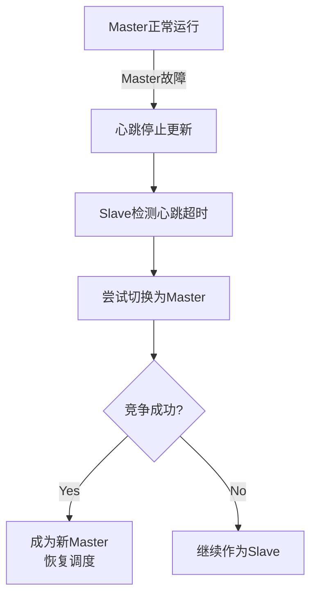

**数据结构**：

```go
type MasterState struct {
    NodeId      string       // 节点标识
    Role        string       // master/slave
    LastHeartbeat int64      // 最后心跳时间
    UpdatedAt   int64        // 更新时间
}
```

#### 1.4 DAG调度器详细设计

**NodeMonitor（节点监控器）**：
- 定时扫描Blocked状态的DAGNode
- 检查依赖节点的完成状态
- 触发依赖满足的节点状态更新

```go
func (m *NodeMonitor) MonitorLoop() {
    ticker := time.NewTicker(5 * time.Second)
    for range ticker.C {
        nodes := m.storage.GetBlockedNodes()
        for _, node := range nodes {
            if m.checkDependencies(node) {
                m.releaseNode(node)
            }
        }
    }
}

func (m *NodeMonitor) checkDependencies(node *DAGNode) bool {
    for _, depId := range node.Dependencies {
        depNode := m.storage.GetDAGNode(depId)
        if depNode.Status != DAGNodeStatusFinished {
            return false
        }
    }
    return true
}
```

**NodeReleaser（节点释放器）**：
- 将Blocked节点状态更新为Ready
- 将节点加入调度队列

```go
func (r *NodeReleaser) ReleaseNode(node *DAGNode) error {
    node.Status = DAGNodeStatusReady
    r.storage.UpdateDAGNode(node)
    r.schedulerQueue.Add(node)
    return nil
}
```

#### 1.5 子任务分发器详细设计

**ExecutorSelector（执行服务选择器）**：
- 基于负载选择最优执行服务实例

```go
func (s *ExecutorSelector) SelectBestExecutor() (*Executor, error) {
    executors := s.manager.GetActiveExecutors()
    if len(executors) == 0 {
        return nil, ErrNoAvailableExecutor
    }
    
    // 选择活跃子任务数量最少的执行服务
    var best *Executor
    minLoad := int.MaxValue
    for _, exec := range executors {
        load := exec.ActiveSubTaskCount
        if load < minLoad {
            minLoad = load
            best = exec
        }
    }
    return best, nil
}
```

**SubTaskDispatcher（子任务分发器）**：
- 调用执行服务的接收接口
- 更新子任务状态

```go
func (d *SubTaskDispatcher) Dispatch(subTask *SubTask, executor *Executor) error {
    req := DispatchRequest{
        SubTaskId: subTask.SubTaskId,
        TaskId:    subTask.TaskId,
        Stage:     subTask.Stage,
        Config:    subTask.Config,
    }
    
    resp, err := executor.Client.DispatchSubTask(req)
    if err != nil {
        return err
    }
    
    subTask.Status = SubTaskStatusAllocated
    subTask.Executor = executor.Address
    d.storage.UpdateSubTask(subTask)
    
    return nil
}
```

#### 1.6 执行服务管理器详细设计

**HealthChecker（健康检查器）**：
- 定时调用执行服务健康检查接口
- 检测失联并触发故障处理

```go
func (h *HealthChecker) CheckLoop() {
    ticker := time.NewTicker(10 * time.Second)
    for range ticker.C {
        executors := h.registry.GetAll()
        for _, exec := range executors {
            ok := h.checkExecutorHealth(exec)
            if !ok {
                h.failureHandler.HandleFailure(exec)
            }
        }
    }
}

func (h *HealthChecker) checkExecutorHealth(exec *Executor) bool {
    ctx, cancel := context.WithTimeout(context.Background(), 5*time.Second)
    defer cancel()
    
    resp, err := exec.Client.HealthCheck(ctx)
    if err != nil || !resp.Healthy {
        exec.FailCount++
        return exec.FailCount < 3  // 连续3次失败标记失联
    }
    exec.FailCount = 0
    return true
}
```

**FailureHandler（失联处理器）**：
- 标记执行服务失联
- 重新分发该执行服务的活跃子任务

```go
func (h *FailureHandler) HandleFailure(exec *Executor) {
    // 标记执行服务失联
    exec.Status = ExecutorStatusOffline
    h.registry.Update(exec)
    
    // 获取该执行服务的活跃子任务
    subTasks := h.storage.GetSubTasksByExecutor(exec.Address)
    for _, st := range subTasks {
        if st.Status == SubTaskStatusRunning {
            // 重置子任务状态，等待重新分发
            st.Status = SubTaskStatusException
            st.Executor = ""
            h.storage.UpdateSubTask(st)
        }
    }
}
```

---

### 2. 执行服务设计

#### 2.1 模块划分

```
执行服务
├── API层                    // HTTP接口处理
│   ├── DispatchAPI          // 子任务接收接口
│   ├── StatusAPI            // 状态上报接口（内部）
│   ├── CancelAPI            // 子任务取消接口
│   └── HealthAPI            // 健康检查接口
│
├── SubTaskManager           // 子任务生命周期管理
│   ├── SubTaskReceiver      // 子任务接收
│   ├── SubTaskQueue         // 本地执行队列
│   ├── SubTaskTracker       // 子任务状态追踪
│   └── SubTaskCanceler      // 子任务取消
│
├── SandboxManager           // 沙箱生命周期管理
│   ├── SandboxCreator       // 沙箱创建
│   ├── SandboxBinder        // 沙箱绑定
│   ├── SandboxDestroyer     // 沙箱销毁
│   └── SandboxPool          // 沙箱实例池（可选）
│
├── ExecutionTracker         // 执行状态追踪
│   ├── CommandExecutor      // 命令执行器
│   ├── StatusPoller         // 状态轮询
│   ├── TimeoutHandler       // 超时处理
│   └── OutputParser         // 输出解析
│
├── ResourceHandler          // 资源处理
│   ├── ResourceUploader     // 资源上传至沙箱
│   ├── ResourceDownloader   // 资源从沙箱下载
│   ├── EvalDataClient       // eval-data API客户端
│
├── ResultUploader           // 结果上报
│   ├── ResultCollector      // 结果收集
│   ├── ResultParser         // 结果解析
│   ├── StatusReporter       // 状态上报给调度服务
│
└── AgentCubeClient          // AgentCube SDK封装
    ├── SandboxClient         // 沙箱操作
    ├── FileClient            // 文件操作
    ├── CommandClient         // 命令执行
```

#### 2.2 核心模块职责

| 模块 | 职责 | 关键方法 |
|------|------|---------|
| **API层** | 接收调度服务请求 | `ReceiveSubTask()`, `CancelSubTask()`, `HealthCheck()` |
| **SubTaskManager** | 本地子任务队列管理 | `Enqueue()`, `Dequeue()`, `UpdateStatus()` |
| **SandboxManager** | AgentCube沙箱生命周期 | `CreateSandbox()`, `BindSandbox()`, `DestroySandbox()` |
| **ExecutionTracker** | 执行命令并追踪状态 | `Execute()`, `PollStatus()`, `HandleTimeout()` |
| **ResourceHandler** | 资源上传/下载处理 | `UploadToSandbox()`, `DownloadFromSandbox()`, `FetchEvalset()` |
| **ResultUploader** | 结果收集与上报 | `CollectResult()`, `ReportStatus()` |
| **AgentCubeClient** | SDK调用封装 | `NewSandbox()`, `ExecuteCommand()`, `UploadFile()` |

#### 2.3 子任务执行详细设计

**执行流程伪代码**：

```go
func (m *SubTaskManager) ExecuteSubTask(subTask *SubTask) error {
    // 1. 创建沙箱
    sandbox, err := m.sandboxManager.CreateSandbox(subTask.SubTaskId)
    if err != nil {
        return err
    }
    subTask.SandboxId = sandbox.SessionID
    m.storage.UpdateSubTask(subTask)
    
    // 2. 准备资源
    m.resourceHandler.UploadResources(sandbox, subTask)
    if needsEvalset(subTask.Stage) {
        m.resourceHandler.FetchEvalset(sandbox, subTask.Config.Evalset)
    }
    
    // 3. 执行命令
    cmd := buildCommand(subTask)
    result, err := m.executionTracker.Execute(sandbox, cmd)
    if err != nil {
        m.handleExecutionError(subTask, err)
        return err
    }
    
    // 4. 收集结果
    outputs := m.resultUploader.CollectResult(sandbox, subTask.Stage)
    subTask.Result = outputs
    
    // 5. 上传结果到eval-data（如需要）
    if needsUpload(subTask.Stage) {
        m.resourceHandler.UploadResultToEvalData(outputs)
    }
    
    // 6. 销毁沙箱
    m.sandboxManager.DestroySandbox(sandbox)
    
    // 7. 上报状态
    m.resultUploader.ReportStatus(subTask.TaskId, subTask.SubTaskId, "finished", outputs)
    
    return nil
}
```

#### 2.4 AgentCube集成详细设计

**SandboxCreator（沙箱创建器）**：

```go
func (c *SandboxCreator) CreateSandbox(subTaskId string) (*Sandbox, error) {
    opts := agentcube.SandboxOptions{
        Name:      "picod",
        TTL:       c.calculateTTL(subTaskId),
        Verbose:   true,
    }
    
    sb, err := agentcube.NewSandbox(context.Background(), opts)
    if err != nil {
        return nil, err
    }
    
    return &Sandbox{
        SessionID:  sb.SessionID,
        SubTaskId:  subTaskId,
        CreatedAt:  time.Now(),
        ExpiresAt:  time.Now().Add(opts.TTL),
    }, nil
}
```

**CommandExecutor（命令执行器）**：

```go
func (e *CommandExecutor) Execute(sandbox *agentcube.Sandbox, cmd string, timeout time.Duration) (*ExecutionResult, error) {
    opts := agentcube.ExecuteCommandOptions{
        Timeout: timeout,
    }
    
    output, err := sandbox.ExecuteCommand(context.Background(), cmd, opts)
    if err != nil {
        return nil, err
    }
    
    return &ExecutionResult{
        Stdout:  output,
        Stderr:  "",
        Success: true,
    }, nil
}
```

**ResourceUploader（资源上传器）**：

```go
func (u *ResourceUploader) UploadResources(sandbox *agentcube.Sandbox, subTask *SubTask) error {
    // 上传skills目录
    skillsPath := "/root/workspace/skills"
    err := sandbox.CreateDir(context.Background(), skillsPath, 0755)
    if err != nil {
        return err
    }
    
    // 遍历skills文件并上传
    for filename, content := range subTask.Resources.Skills {
        remotePath := skillsPath + "/" + filename
        err = sandbox.WriteFile(context.Background(), content, remotePath)
        if err != nil {
            return err
        }
    }
    
    // 上传配置文件
    configPath := "/root/workspace/task.yaml"
    configContent := serializeConfig(subTask.Config)
    err = sandbox.WriteFile(context.Background(), configContent, configPath)
    if err != nil {
        return err
    }
    
    return nil
}
```

#### 2.5 eval-data集成详细设计

**EvalDataClient（eval-data客户端）**：

```go
type EvalDataClient struct {
    BaseURL    string
    HTTPClient *http.Client
}

// 下载评测集
func (c *EvalDataClient) DownloadEvalset(appId, evalsetId string) ([]byte, error) {
    url := fmt.Sprintf("%s/v1/evalset/download?app_id=%s&evalset_id=%s", 
                       c.BaseURL, appId, evalsetId)
    resp, err := c.HTTPClient.Get(url)
    if err != nil {
        return nil, err
    }
    return parseEvalsetResponse(resp)
}

// 上传评测记录
func (c *EvalDataClient) UploadRecord(appId, taskId string, records []*Record) error {
    req := UploadRecordRequest{
        AppId:  appId,
        TaskId: taskId,
        Items:  records,
    }
    url := fmt.Sprintf("%s/v1/record/upload", c.BaseURL)
    _, err := c.HTTPClient.Post(url, req)
    return err
}
```

**使用场景**：

| 阶段 | eval-data操作 |
|------|---------------|
| synthesis | 上传评测集 (`POST /v1/evalset/upload`) |
| inference | 下载评测集 (`GET /v1/evalset/download`) |
| eval | 上传评测记录 (`POST /v1/record/upload`) |
| report | 下载评测记录 (`GET /v1/record/download`) |

#### 2.6 结果上报详细设计

**StatusReporter（状态上报器）**：

```go
func (r *StatusReporter) ReportStatus(taskId, subTaskId string, status string, result *SubTaskResult) error {
    req := StatusReportRequest{
        TaskId:    taskId,
        SubTaskId: subTaskId,
        Status:    status,
        Result:    result,
    }
    
    url := r.schedulerURL + "/internal/subtasks/status"
    _, err := r.httpClient.Post(url, req)
    if err != nil {
        // 记录失败，稍后重试
        r.retryQueue.Add(req)
    }
    return err
}
```

---

## 五、接口与集成

### 1. API接口设计

#### 1.1 对外API（用户接口）

**基础信息**：
- 协议：HTTP
- 数据格式：JSON
- 响应格式：`{code, message, data}`
- 基础路径：`/v1/tasks`

##### 任务提交接口

**请求**：`POST /v1/tasks`

```json
{
    "app_id": "agent-eval-app",
    "description": "场景描述",
    "config": {
        "version": "1.0.0",
        "workflow": ["synthesis", "inference", "eval", "report"],
        "models": [
            {
                "id": "ID_JUDGE_001",
                "type": "api-openai",
                "api_key": "xxx",
                "api_url": "https://...",
                "model": "deepseek-r1",
                "concurrency": 40
            }
        ],
        "synthesis": {
            "type": "agent",
            "count": 10,
            "model": "ID_JUDGE_001"
        },
        "inference": {
            "type": "claude-code",
            "model": "ID_JUDGE_001",
            "merge_eval": false
        },
        "eval": {
            "model": "ID_JUDGE_001"
        },
        "report": {
            "type": "agent",
            "model": "ID_JUDGE_001"
        }
    },
    "resources": {
        "skills": "base64编码的skills目录打包内容",
        "files": {
            "a.pdf": "base64编码的文件内容",
            "b.xlsx": "base64编码的文件内容"
        }
    }
}
```

**请求参数说明**：

| 字段 | 类型 | 必填 | 说明 |
|------|------|------|------|
| app_id | string | 是 | 应用标识 |
| description | string | 否 | 任务描述 |
| config | object | 是 | 任务配置 |
| resources | object | 是 | 评测资源 |

**响应示例**：

```json
{
    "code": 0,
    "message": "ok",
    "data": {
        "task_id": "agent-eval-abc123",
        "status": "waiting"
    }
}
```

##### 任务查询接口

**请求**：`GET /v1/tasks/:task_id`

**请求参数**：

| 参数 | 类型 | 必填 | 说明 |
|------|------|------|------|
| task_id | string | 是 | 任务ID（路径参数） |
| app_id | string | 是 | 应用ID（查询参数） |

**响应示例**：

```json
{
    "code": 0,
    "message": "ok",
    "data": {
        "task_id": "agent-eval-abc123",
        "status": "running",
        "progress": 50,
        "message": "执行inference阶段",
        "result": {
            "report_url": "",
            "usages": [
                {
                    "model_id": "ID_JUDGE_001",
                    "input_tokens": 1000,
                    "output_tokens": 500
                }
            ]
        },
        "created_at": 1761983527,
        "updated_at": 1761983627
    }
}
```

##### 任务取消接口

**请求**：`PATCH /v1/tasks/:task_id`

```json
{
    "app_id": "agent-eval-app",
    "action": "cancel"
}
```

**响应示例**：

```json
{
    "code": 0,
    "message": "ok",
    "data": {
        "task_id": "agent-eval-abc123",
        "status": "canceled"
    }
}
```

##### 任务列表接口

**请求**：`GET /v1/tasks`

**请求参数**：

| 参数 | 类型 | 必填 | 说明 |
|------|------|------|------|
| app_id | string | 是 | 应用ID |
| status | string | 否 | 任务状态筛选 |
| offset | int | 否 | 偏移量（默认0） |
| limit | int | 否 | 返回数量（默认20，最大100） |

**响应示例**：

```json
{
    "code": 0,
    "message": "ok",
    "data": {
        "total": 100,
        "items": [
            {
                "task_id": "agent-eval-abc123",
                "status": "finished",
                "progress": 100,
                "created_at": 1761983527
            },
            ...
        ]
    }
}
```

#### 1.2 内部API（调度↔执行）

##### 子任务分发接口（调度→执行）

**请求**：`POST /internal/subtasks/dispatch`

```json
{
    "sub_task_id": "subtask-001",
    "task_id": "agent-eval-abc123",
    "stage": "inference",
    "case_id": "case-001",
    "merge_mode": false,
    "config": {
        "model_config": {...},
        "stage_config": {...},
        "evalset_ref": {
            "evalset_id": "evalset-001",
            "app_id": "agent-eval-app"
        }
    },
    "resources_ref": {
        "task_id": "agent-eval-abc123"
    }
}
```

**响应示例**：

```json
{
    "code": 0,
    "message": "ok",
    "data": {
        "sub_task_id": "subtask-001",
        "status": "allocated"
    }
}
```

##### 子任务状态上报接口（执行→调度）

**请求**：`POST /internal/subtasks/status`

```json
{
    "task_id": "agent-eval-abc123",
    "sub_task_id": "subtask-001",
    "status": "finished",
    "result": {
        "success": 1,
        "message": "",
        "output_files": {
            "transcript.jsonl": "/root/workspace/transcript.jsonl",
            "evalset.jsonl": "/root/workspace/evalset.jsonl"
        },
        "usage": {
            "input_tokens": 100,
            "output_tokens": 50
        }
    }
}
```

**响应示例**：

```json
{
    "code": 0,
    "message": "ok"
}
```

##### 执行服务健康检查接口

**请求**：`GET /internal/health`

**响应示例**：

```json
{
    "code": 0,
    "message": "ok",
    "data": {
        "healthy": true,
        "active_subtasks": 5,
        "max_subtasks": 20
    }
}
```

##### 子任务取消接口（调度→执行）

**请求**：`POST /internal/subtasks/:sub_task_id/cancel`

**响应示例**：

```json
{
    "code": 0,
    "message": "ok",
    "data": {
        "sub_task_id": "subtask-001",
        "status": "canceled"
    }
}
```

#### 1.3 错误码定义

##### API接口错误码 (102xx)

| 错误码 | 错误类型 | 说明 |
|-------|---------|------|
| 10201 | request_authorized_failed | app_id不一致 |
| 10202 | request_body_read_error | 读取请求体错误 |
| 10203 | request_body_decode_error | 解析请求体错误 |
| 10204 | request_param_invalid_error | 请求参数有误 |
| 10205 | config_parse_error | 配置解析错误 |
| 10206 | resource_decode_error | 资源解码错误 |

##### 任务调度错误码 (103xx)

| 错误码 | 错误类型 | 说明 |
|-------|---------|------|
| 10300 | no_available_executor_error | 无可用执行服务 |
| 10301 | executor_http_request_error | HTTP请求错误 |
| 10302 | executor_response_code_error | 响应码错误 |
| 10303 | executor_not_alive_error | 执行服务失联 |
| 10304 | model_not_found | 模型配置不存在 |
| 10305 | dag_node_blocked_error | DAG节点阻塞 |
| 10306 | task_not_found_error | 任务不存在 |
| 10307 | task_already_finished_error | 任务已完成 |
| 10308 | task_retry_count_over_limit_error | 重试次数超限 |

##### 子任务执行错误码 (104xx)

| 错误码 | 错误类型 | 说明 |
|-------|---------|------|
| 10400 | subtask_not_found_error | 子任务不存在 |
| 10401 | sandbox_create_error | 创建沙箱失败 |
| 10402 | sandbox_upload_error | 上传资源失败 |
| 10403 | sandbox_execute_error | 执行命令失败 |
| 10404 | sandbox_download_error | 下载结果失败 |
| 10405 | sandbox_timeout_error | 执行超时 |
| 10406 | sandbox_close_error | 关闭沙箱失败 |
| 10407 | evaldata_fetch_error | 获取评测集失败 |
| 10408 | evaldata_upload_error | 上传结果失败 |
| 10409 | output_parse_error | 输出解析错误 |

---

### 2. 依赖服务集成

#### 2.1 AgentCube SDK集成

##### 集成方式

通过Go SDK调用AgentCube服务：

```go
import "github.com/volcano-sh/agentcube/go-sdk/agentcube"
```

##### 配置管理

**环境变量**：

| 变量名 | 说明 | 示例值 |
|--------|------|--------|
| SANDBOX_WORKLOAD_MANAGER_URL | 控制面服务地址 | `http://127.0.0.1:8081` |
| SANDBOX_ROUTER_URL | 数据面服务地址 | `http://127.0.0.1:8079` |
| SANDBOX_APP_ID | 应用ID | `agent-eval` |
| SANDBOX_USER_ID | 用户ID | `eval-user` |
| SANDBOX_API_TOKEN | Bearer Token | `xxx` |
| SANDBOX_KONG_TOKEN | API网关Token | `xxx` |

##### 核心操作封装

**沙箱生命周期**：

```go
type SandboxClient struct {
    client *agentcube.Sandbox
}

func (c *SandboxClient) Create(ctx context.Context, subTaskId string, ttl time.Duration) (*SandboxInstance, error) {
    opts := agentcube.SandboxOptions{
        Name:      "picod",
        TTL:       ttl,
        Verbose:   true,
    }
    sb, err := agentcube.NewSandbox(ctx, opts)
    if err != nil {
        return nil, err
    }
    return &SandboxInstance{
        SessionID: sb.SessionID,
        SubTaskId: subTaskId,
    }, nil
}

func (c *SandboxClient) Close(ctx context.Context) error {
    return c.client.Close(ctx)
}
```

**文件操作**：

```go
func (c *SandboxClient) UploadFile(ctx context.Context, localPath, remotePath string) error {
    return c.client.UploadFile(ctx, localPath, remotePath)
}

func (c *SandboxClient) DownloadFile(ctx context.Context, remotePath, localPath string) error {
    return c.client.DownloadFile(ctx, remotePath, localPath)
}

func (c *SandboxClient) WriteFile(ctx context.Context, content []byte, remotePath string) error {
    return c.client.WriteFile(ctx, content, remotePath)
}

func (c *SandboxClient) ReadFile(ctx context.Context, remotePath string) ([]byte, error) {
    return c.client.ReadFile(ctx, remotePath)
}
```

**命令执行**：

```go
func (c *SandboxClient) ExecuteCommand(ctx context.Context, cmd string, timeout time.Duration) (string, error) {
    opts := agentcube.ExecuteCommandOptions{
        Timeout: timeout,
    }
    return c.client.ExecuteCommand(ctx, cmd, opts)
}
```

##### 超时配置建议

| 操作类型 | 建议超时 | 说明 |
|---------|---------|------|
| 沙箱创建 | 30s | 创建新沙箱实例 |
| 文件上传 | 60s | 上传skills目录 |
| 命令执行 | 10min | 执行评测命令 |
| 文件下载 | 60s | 下载结果文件 |
| 沙箱关闭 | 10s | 关闭沙箱实例 |

#### 2.2 eval-data API集成

##### 集成方式

通过HTTP API调用eval-data服务：

```go
type EvalDataClient struct {
    BaseURL    string
    HTTPClient *http.Client
}
```

##### 配置管理

**配置项**：

| 配置项 | 说明 | 示例值 |
|--------|------|--------|
| EVAL_DATA_URL | eval-data服务地址 | `http://eval-data:8080` |
| EVAL_DATA_TIMEOUT | HTTP请求超时 | `30s` |

##### API调用封装

**评测集操作**：

```go
func (c *EvalDataClient) UploadEvalset(ctx context.Context, appId, evalsetId string, items []*EvalsetItem) error {
    req := UploadEvalsetReq{
        AppId:     appId,
        EvalsetId: evalsetId,
        Items:     items,
    }
    _, err := c.postJSON(ctx, "/v1/evalset/upload", req)
    return err
}

func (c *EvalDataClient) DownloadEvalset(ctx context.Context, appId, evalsetId string) ([]*EvalsetItem, error) {
    url := fmt.Sprintf("/v1/evalset/download?app_id=%s&evalset_id=%s", appId, evalsetId)
    resp, err := c.getJSON(ctx, url)
    if err != nil {
        return nil, err
    }
    return parseEvalsetItems(resp), nil
}
```

**评测记录操作**：

```go
func (c *EvalDataClient) UploadRecord(ctx context.Context, appId, taskId string, items []*RecordItem) error {
    req := UploadRecordReq{
        AppId:  appId,
        TaskId: taskId,
        Items:  items,
    }
    _, err := c.postJSON(ctx, "/v1/record/upload", req)
    return err
}

func (c *EvalDataClient) DownloadRecord(ctx context.Context, appId, taskId string) ([]*RecordItem, error) {
    url := fmt.Sprintf("/v1/record/download?app_id=%s&task_id=%s", appId, taskId)
    resp, err := c.getJSON(ctx, url)
    if err != nil {
        return nil, err
    }
    return parseRecordItems(resp), nil
}
```

##### 使用场景映射

| workflow阶段 | eval-data操作 | 说明 |
|-------------|---------------|------|
| synthesis完成后 | UploadEvalset | 上传生成的评测集 |
| inference开始前 | DownloadEvalset | 获取评测集作为输入 |
| eval完成后 | UploadRecord | 上传评测结果记录 |
| report开始前 | DownloadRecord | 获取评测记录生成报告 |

---

## 六、可靠性与运维

### 1. 可靠性设计

#### 1.1 失败重试机制

##### 重试场景分类

| 场景 | 触发条件 | 处理策略 | 重试次数限制 |
|------|---------|---------|-------------|
| 沙箱创建失败 | SDK返回错误 | 延迟重试，可能AgentCube服务波动 | 3次 |
| 命令执行超时 | 执行时间超过限制 | 终止当前沙箱，重新创建 | 2次 |
| 命令执行异常 | exit_code != 0 | 重新调度至其他执行服务 | 3次 |
| 结果下载失败 | 文件不存在或读取错误 | 检查沙箱状态，可能需要重新执行 | 2次 |
| eval-data API失败 | HTTP请求失败 | 延迟重试 | 3次 |
| 状态上报失败 | 调度服务无响应 | 本地缓存，稍后重试 | 无限（队列缓存） |
| 执行服务失联 | 健康检查连续失败 | 重新分发子任务 | 不重试，直接重新分发 |

##### 不重试场景

| 场景 | 处理方式 |
|------|---------|
| 配置解析错误 | 直接标记失败，返回错误消息 |
| 资源文件损坏 | 直接标记失败 |
| 任务被用户取消 | 直接终止 |
| 评测工具内部错误 | 根据exit_code判断，可能不重试 |

##### 重试策略

**指数退避重试**：

```go
func calculateRetryDelay(retryCount int) time.Duration {
    baseDelay := 10 * time.Second
    maxDelay := 5 * time.Minute
    
    delay := baseDelay * time.Duration(1 << retryCount)
    if delay > maxDelay {
        delay = maxDelay
    }
    return delay
}
```

**重试流程**：

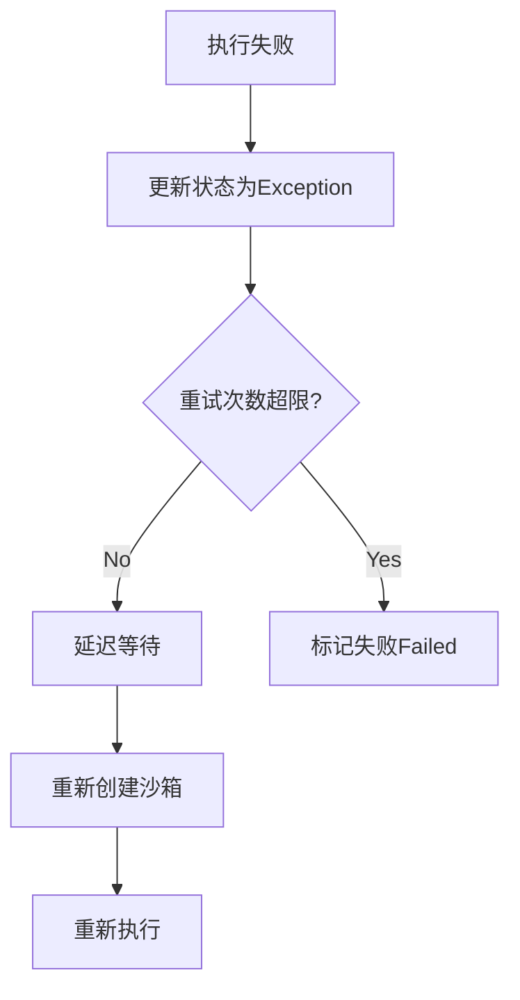

#### 1.2 执行服务故障处理

##### 失联检测

**检测机制**：
- 调度服务每10秒调用执行服务健康检查接口
- 连续3次失败标记为失联
- 单次成功恢复为正常状态

```go
func (h *HealthChecker) checkExecutorHealth(exec *Executor) bool {
    ctx, cancel := context.WithTimeout(context.Background(), 5*time.Second)
    defer cancel()
    
    resp, err := exec.Client.HealthCheck(ctx)
    if err != nil || !resp.Healthy {
        exec.FailCount++
        return exec.FailCount < MAX_FAIL_COUNT
    }
    exec.FailCount = 0
    return true
}
```

##### 失联处理流程

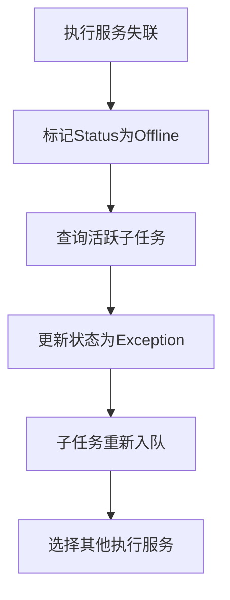

##### 影响评估

| 故障类型 | 影范围 | 说明 |
|---------|--------|------|
| 单个执行服务失联 | 该服务上的子任务需重新执行 | 已完成的步骤会重新消耗资源 |
| 多个执行服务失联 | 大量子任务需重新分发 | 可能导致任务延迟 |
| 所有执行服务失联 | 任务无法继续执行 | 等待执行服务恢复 |

#### 1.3 调度服务故障处理

##### 主从切换机制

**Master故障检测**：
- Slave节点定时检查Master心跳时间戳
- 心跳超时（超过TTL）认为Master故障
- 多个Slave竞争切换为Master

**切换流程**：

```mermaid
flowchart TB
    A["Master正常运行"]
    B["心跳停止更新"]
    C["Slave检测心跳超时"]
    D["尝试切换为Master"]
    E{竞争成功?}
    F["成为新Master<br/>恢复调度"]
    G["继续作为Slave"]

    A -->|Master故障| B --> C --> D --> E
    E -->|Yes| F
    E -->|No| G
```

**恢复调度**：
- 新Master启动DAG监控循环
- 加载所有Running状态的任务
- 与执行服务重新建联
- 继续监控子任务状态

##### 状态恢复

**任务状态恢复**：
- 从MongoDB读取所有Running/Waiting状态的任务
- 重新加载DAG节点状态
- 继续监控节点依赖关系

**执行服务关联恢复**：
- 查询Running状态子任务的Executor字段
- 尝试与对应执行服务建联
- 建联失败：标记子任务为Exception，等待重新分发
- 建联成功：继续监控子任务状态

#### 1.4 沙箱故障处理

##### 沙箱异常类型

| 异常类型 | 检测方式 | 处理方式 |
|---------|---------|---------|
| 创建失败 | SDK返回错误 | 重试创建或标记失败 |
| 执行超时 | 命令执行超过Timeout | 终止沙箱，重新创建 |
| 会话过期 | AgentCube TTL到期 | 检测session状态，可能需重新创建 |
| 文件操作失败 | 上传/下载返回错误 | 检查沙箱状态，可能需重新创建 |

##### 沙箱重建流程

```mermaid
flowchart TB
    A["检测到沙箱异常"]
    B["尝试关闭当前沙箱"]
    C["创建新沙箱"]
    D{创建成功?}
    E["重新上传资源"]
    F["延迟重试"]
    G["更新SandboxId"]

    A --> B --> C --> D
    D -->|Yes| E --> G
    D -->|No| F
```

##### 沙箱资源清理

**正常完成清理**：
- 子任务完成后立即关闭沙箱
- 释放AgentCube资源

**异常清理**：
- 检测到异常时先尝试关闭沙箱
- 关闭失败则依赖AgentCube TTL自动清理
- 定期扫描过期沙箱，清理本地记录

#### 1.5 数据一致性保障

##### MongoDB事务使用

**关键操作使用事务**：
- 任务创建：Task + DAGNode + SubTask批量写入
- 状态更新：SubTask + DAGNode联动更新
- 任务取消：Task + SubTask + DAGNode联动更新

```go
func (s *TaskStorage) CreateTaskWithDAG(task *Task, nodes []*DAGNode, subtasks []*SubTask) error {
    session, err := s.client.StartSession()
    if err != nil {
        return err
    }
    defer session.EndSession(ctx)
    
    err = mongo.WithSession(ctx, session, func(sc mongo.SessionContext) error {
        // 事务内批量写入
        if err := s.InsertTask(sc, task); err != nil {
            return err
        }
        if err := s.InsertDAGNodes(sc, nodes); err != nil {
            return err
        }
        if err := s.InsertSubTasks(sc, subtasks); err != nil {
            return err
        }
        return nil
    })
    
    return err
}
```

##### 状态同步机制

**分布式状态同步**：
- DAGNode状态单独存储，便于并发更新
- 使用MongoDB乐观锁（版本号）避免并发冲突
- 关键状态变更使用原子操作

```go
func (s *DAGNodeStorage) UpdateNodeStatus(nodeId string, newStatus int) error {
    filter := bson.M{"node_id": nodeId}
    update := bson.M{
        "$set": bson.M{
            "status":     newStatus,
            "updated_at": time.Now().Unix(),
        },
    }
    
    result, err := s.collection.UpdateOne(ctx, filter, update)
    if err != nil {
        return err
    }
    if result.ModifiedCount == 0 {
        return ErrNodeNotFound
    }
    return nil
}
```

---

### 2. 可观测性

#### 2.1 监控指标

##### 任务指标

| 指标名 | 类型 | 说明 |
|--------|------|------|
| `task_total` | Gauge | 任务总数 |
| `task_waiting` | Gauge | 等待中任务数 |
| `task_running` | Gauge | 运行中任务数 |
| `task_finished` | Gauge | 已完成任务数 |
| `task_failed` | Gauge | 失败任务数 |
| `task_canceled` | Gauge | 取消任务数 |
| `task_duration_seconds` | Histogram | 任务执行耗时分布 |

##### 子任务指标

| 指标名 | 类型 | 说明 |
|--------|------|------|
| `subtask_total` | Gauge | 子任务总数 |
| `subtask_running` | Gauge | 运行中子任务数 |
| `subtask_retries` | Counter | 子任务重试次数累计 |
| `subtask_duration_seconds` | Histogram | 子任务执行耗时分布 |
| `subtask_stage_duration` | Histogram | 各阶段执行耗时 |

##### 执行服务指标

| 指标名 | 类型 | 说明 |
|--------|------|------|
| `executor_total` | Gauge | 注册的执行服务数量 |
| `executor_active` | Gauge | 活跃的执行服务数量 |
| `executor_offline` | Gauge | 失联的执行服务数量 |
| `executor_active_subtasks` | Gauge | 各执行服务活跃子任务数 |
| `executor_health_check_errors` | Counter | 健康检查失败次数 |

##### 沙箱指标

| 指标名 | 类型 | 说明 |
|--------|------|------|
| `sandbox_created` | Counter | 沙箱创建次数 |
| `sandbox_destroyed` | Counter | 沙箱销毁次数 |
| `sandbox_create_errors` | Counter | 沙箱创建失败次数 |
| `sandbox_execute_errors` | Counter | 沙箱执行失败次数 |
| `sandbox_active` | Gauge | 当前活跃沙箱数 |

##### API接口指标

| 指标名 | 类型 | 说明 |
|--------|------|------|
| `api_requests_total` | Counter | API请求总数 |
| `api_requests_by_endpoint` | Counter | 各端点请求计数 |
| `api_request_duration_seconds` | Histogram | API响应耗时 |
| `api_request_errors` | Counter | API错误响应计数 |

##### 依赖服务指标

| 指标名 | 类型 | 说明 |
|--------|------|------|
| `agentcube_requests` | Counter | AgentCube SDK调用次数 |
| `agentcube_errors` | Counter | AgentCube调用错误次数 |
| `agentcube_request_duration` | Histogram | AgentCube调用耗时 |
| `evaldata_requests` | Counter | eval-data API调用次数 |
| `evaldata_errors` | Counter | eval-data调用错误次数 |

#### 2.2 日志规范

##### 日志格式

**结构化日志**（JSON格式）：

```json
{
    "timestamp": "2026-04-09T10:00:00Z",
    "level": "INFO",
    "service": "scheduler",
    "module": "DAGScheduler",
    "trace_id": "abc123",
    "span_id": "def456",
    "message": "DAG node released",
    "context": {
        "task_id": "agent-eval-001",
        "node_id": "node-001",
        "status": "ready"
    }
}
```

##### 日志级别使用规范

| 级别 | 使用场景 |
|------|---------|
| DEBUG | 详细调试信息（开发环境） |
| INFO | 关键业务事件（任务创建、状态变更） |
| WARN | 异常但可恢复的情况（重试、降级） |
| ERROR | 错误需要关注（执行失败、服务失联） |
| FATAL | 系统不可恢复错误（启动失败） |

##### 关键事件日志

**任务生命周期事件**：

| 事件 | 日志级别 | 关键字段 |
|------|---------|---------|
| 任务创建 | INFO | task_id, app_id, workflow |
| 任务拆分完成 | INFO | task_id, dag_nodes, subtasks |
| 任务开始执行 | INFO | task_id, first_node_id |
| 任务完成 | INFO | task_id, duration, result_url |
| 任务失败 | ERROR | task_id, error_message |
| 任务取消 | INFO | task_id, cancel_reason |

**子任务执行事件**：

| 事件 | 日志级别 | 关键字段 |
|------|---------|---------|
| 子任务分发 | INFO | subtask_id, executor |
| 沙箱创建 | INFO | subtask_id, sandbox_id |
| 命令执行开始 | INFO | subtask_id, command |
| 命令执行完成 | INFO | subtask_id, exit_code |
| 结果上传 | INFO | subtask_id, output_files |
| 子任务完成 | INFO | subtask_id, duration |
| 子任务失败 | ERROR | subtask_id, error |
| 子任务重试 | WARN | subtask_id, retry_count |

#### 2.3 告警策略

##### 告警规则定义

| 告警名称 | 触发条件 | 级别 | 处理建议 |
|---------|---------|------|---------|
| 执行服务全部失联 | `executor_active == 0` | Critical | 检查执行服务部署状态 |
| 执行服务部分失联 | `executor_offline > 0` | Warning | 检查失联执行服务日志 |
| 任务积压过多 | `task_waiting > 100` | Warning | 检查执行服务吞吐能力 |
| 任务失败率过高 | `task_failed / task_finished > 0.1` | Warning | 检查失败原因分布 |
| 沙箱创建失败率过高 | `sandbox_create_errors / sandbox_created > 0.05` | Warning | 检查AgentCube服务状态 |
| API响应时间过长 | `api_request_duration_seconds(p99) > 5s` | Warning | 检查数据库/网络状况 |

##### 告警通知方式

| 级别 | 通知方式 | 响应时间要求 |
|------|---------|-------------|
| Critical | 电话 + 短信 + IM | 立即响应（5分钟内） |
| Warning | 短信 + IM | 工作时间响应（30分钟内） |
| Info | IM通知 | 可延后处理 |

#### 2.4 链路追踪

##### TraceContext传递

**关键链路节点**：

| 阶段 | TraceSpan | 说明 |
|------|-----------|------|
| API接收 | `api.task.submit` | 任务提交请求 |
| 任务拆分 | `scheduler.task.split` | 任务拆分处理 |
| DAG调度 | `scheduler.dag.release` | DAG节点释放 |
| 子任务分发 | `dispatcher.subtask.dispatch` | 子任务分发 |
| 执行服务接收 | `executor.subtask.receive` | 子任务接收 |
| 沙箱创建 | `executor.sandbox.create` | 沙箱创建 |
| 命令执行 | `executor.sandbox.execute` | 评测命令执行 |
| 结果上报 | `executor.result.report` | 结果上报 |

##### Trace采集配置

**OpenTelemetry配置**：

```yaml
otlp:
  endpoint: 172.30.209.28:4317
  service_name: agent-eval-server
  sample_rate: 0.1  # 10%采样率
```

---

## 附录

### A. 配置示例

#### A.1 调度服务配置

```yaml
server:
  port: 8080
  mode: release

mongodb:
  url: mongodb://localhost:27017
  database: agent_eval
  collections:
    tasks: tasks
    subtasks: subtasks
    dag_nodes: dag_nodes

executor:
  health_check_interval: 10s
  health_check_timeout: 5s
  max_fail_count: 3

scheduler:
  dag_scan_interval: 5s
  max_retry_count: 3
  
master_slave:
  heartbeat_ttl: 30s
  heartbeat_interval: 10s

logging:
  level: info
  format: json
  
otlp:
  endpoint: 172.30.209.28:4317
```

#### A.2 执行服务配置

```yaml
server:
  port: 8081
  mode: release

mongodb:
  url: mongodb://localhost:27017
  database: agent_eval

agentcube:
  workload_manager_url: http://127.0.0.1:8081
  router_url: http://127.0.0.1:8079
  app_id: agent-eval
  user_id: eval-user
  default_ttl: 1h
  create_timeout: 30s
  execute_timeout: 10m

eval_data:
  url: http://eval-data:8080
  timeout: 30s

scheduler:
  url: http://scheduler:8080
  status_report_interval: 30s

logging:
  level: info
  format: json

otlp:
  endpoint: 172.30.209.28:4317
```

### B. 部署建议

#### B.1 资源规格

**调度服务**：
- CPU: 4核
- 内存: 512MB
- 实例数: 2（主从模式）

**执行服务**：
- CPU: 8核
- 内存: 2GB
- 实例数: 根据并发需求动态调整（建议每个实例处理10-20个子任务）

**MongoDB**：
- CPU: 4核
- 内存: 4GB
- 存储: 根据任务数据量规划

#### B.2 并发能力估算

**单个执行服务并发能力**：
- 最大活跃子任务数: 20（受AgentCube沙箱限制）
- 单个子任务平均执行时间: 10分钟
- 单实例吞吐量: 约2个子任务/分钟

**系统整体并发能力**：
- 执行服务实例数 × 单实例并发能力
- 例如: 10个执行服务 × 20并发 = 200个并发子任务

---