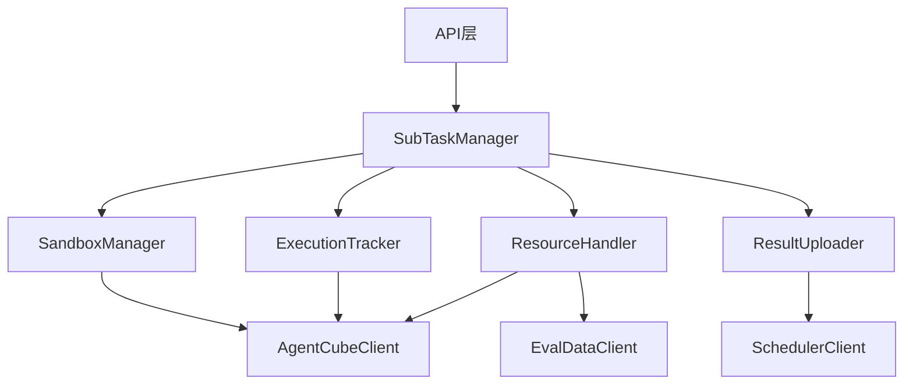

# 执行服务模块详细设计文档

## 一、概述

### 1.1 文档目的

本文档详细定义执行服务（Executor Service）的模块设计，包括：
- 模块接口定义
- 数据结构定义
- 方法签名设计
- 外部服务集成
- 关键流程实现

### 1.2 模块架构

```
执行服务
├── API层                    // HTTP接口处理
│   ├── DispatchAPI          // 子任务接收接口
│   ├── StatusAPI            // 状态上报接口（内部）
│   ├── CancelAPI            // 子任务取消接口
│   └── HealthAPI            // 健康检查接口
│
├── SubTaskManager           // 子任务生命周期管理
│   ├── SubTaskReceiver      // 子任务接收
│   ├── SubTaskQueue         // 本地执行队列
│   ├── SubTaskTracker       // 子任务状态追踪
│   └── SubTaskCanceler      // 子任务取消
│
├── SandboxManager           // 沙箱生命周期管理
│   ├── SandboxCreator       // 沙箱创建
│   ├── SandboxBinder        // 沙箱绑定
│   ├── SandboxDestroyer     // 沙箱销毁
│   └── SandboxPool          // 沙箱实例池（可选）
│
├── ExecutionTracker         // 执行状态追踪
│   ├── CommandExecutor      // 命令执行器
│   ├── StatusPoller         // 状态轮询
│   ├── TimeoutHandler       // 超时处理
│   └── OutputParser         // 输出解析
│
├── ResourceHandler          // 资源处理
│   ├── ResourceUploader     // 资源上传至沙箱
│   ├── ResourceDownloader   // 资源从沙箱下载
│   └── EvalDataClient       // eval-data API客户端
│
├── ResultUploader           // 结果上报
│   ├── ResultCollector      // 结果收集
│   ├── ResultParser         // 结果解析
│   └── StatusReporter       // 状态上报给调度服务
│
└── AgentCubeClient          // AgentCube SDK封装
    ├── SandboxClient         // 沙箱操作
    ├── FileClient            // 文件操作
    └── CommandClient         // 命令执行
```

### 1.3 模块依赖关系



---

## 二、API层设计

### 2.1 DispatchAPI（分发API）

#### 接口定义

```go
// DispatchAPI 处理子任务分发请求
type DispatchAPI struct {
    subTaskManager *SubTaskManager
    logger         *zap.Logger
}

// NewDispatchAPI 创建DispatchAPI实例
func NewDispatchAPI(subTaskManager *SubTaskManager, logger *zap.Logger) *DispatchAPI

// RegisterRoutes 注册路由
func (api *DispatchAPI) RegisterRoutes(r *gin.Engine)
```

#### 方法签名

```go
// HandleDispatch 处理子任务分发请求
// POST /internal/subtasks/dispatch
func (api *DispatchAPI) HandleDispatch(c *gin.Context)
```

#### 实现示例

```go
func (api *DispatchAPI) HandleDispatch(c *gin.Context) {
    ctx := c.Request.Context()
    
    var req DispatchRequest
    if err := c.ShouldBindJSON(&req); err != nil {
        api.respondError(c, errors.ErrRequestBodyDecode, err.Error())
        return
    }
    
    // 接收子任务
    err := api.subTaskManager.ReceiveSubTask(ctx, &req)
    if err != nil {
        api.respondError(c, err)
        return
    }
    
    api.respondSuccess(c, gin.H{
        "sub_task_id": req.SubTaskId,
        "status":      "allocated",
    })
}
```

### 2.2 CancelAPI（取消API）

#### 接口定义

```go
// CancelAPI 处理子任务取消请求
type CancelAPI struct {
    subTaskManager *SubTaskManager
    logger         *zap.Logger
}

// NewCancelAPI 创建CancelAPI实例
func NewCancelAPI(subTaskManager *SubTaskManager, logger *zap.Logger) *CancelAPI

// RegisterRoutes 注册路由
func (api *CancelAPI) RegisterRoutes(r *gin.Engine)
```

#### 方法签名

```go
// HandleCancel 处理子任务取消请求
// POST /internal/subtasks/:sub_task_id/cancel
func (api *CancelAPI) HandleCancel(c *gin.Context)
```

### 2.3 HealthAPI（健康检查API）

#### 接口定义

```go
// HealthAPI 处理健康检查请求
type HealthAPI struct {
    subTaskManager *SubTaskManager
}

// NewHealthAPI 创建HealthAPI实例
func NewHealthAPI(subTaskManager *SubTaskManager) *HealthAPI

// RegisterRoutes 注册路由
func (api *HealthAPI) RegisterRoutes(r *gin.Engine)
```

#### 方法签名

```go
// HandleHealth 处理健康检查请求
// GET /internal/health
func (api *HealthAPI) HandleHealth(c *gin.Context)
```

#### 实现示例

```go
func (api *HealthAPI) HandleHealth(c *gin.Context) {
    activeCount := api.subTaskManager.GetActiveCount()
    maxCount := api.subTaskManager.GetMaxConcurrent()
    
    healthy := activeCount < maxCount
    
    c.JSON(http.StatusOK, gin.H{
        "code":    0,
        "message": "ok",
        "data": gin.H{
            "healthy":          healthy,
            "active_subtasks":  activeCount,
            "max_subtasks":     maxCount,
            "load_percent":     activeCount * 100 / maxCount,
        },
    })
}
```

---

## 三、SubTaskManager设计

### 3.1 接口定义

```go
// SubTaskManager 子任务生命周期管理器
type SubTaskManager struct {
    queue           *SubTaskQueue
    sandboxManager  *SandboxManager
    resourceHandler *ResourceHandler
    executionTracker *ExecutionTracker
    resultUploader  *ResultUploader
    schedulerClient *SchedulerClient
    
    maxConcurrent   int
    activeCount     int32 // 原子计数
    logger          *zap.Logger
    stopCh          chan struct{}
}

// NewSubTaskManager 创建SubTaskManager实例
func NewSubTaskManager(
    queue *SubTaskQueue,
    sandboxManager *SandboxManager,
    resourceHandler *ResourceHandler,
    executionTracker *ExecutionTracker,
    resultUploader *ResultUploader,
    schedulerClient *SchedulerClient,
    maxConcurrent int,
    logger *zap.Logger,
) *SubTaskManager
```

### 3.2 方法签名

```go
// ReceiveSubTask 接收子任务
func (m *SubTaskManager) ReceiveSubTask(ctx context.Context, req *DispatchRequest) error

// Start 启动执行循环
func (m *SubTaskManager) Start()

// Stop 停止执行循环
func (m *SubTaskManager) Stop()

// executeLoop 执行循环
func (m *SubTaskManager) executeLoop()

// ExecuteSubTask 执行单个子任务
func (m *SubTaskManager) ExecuteSubTask(ctx context.Context, subTask *SubTaskContext) error

// CancelSubTask 取消子任务
func (m *SubTaskManager) CancelSubTask(ctx context.Context, subTaskId string) error

// GetActiveCount 获取活跃子任务数量
func (m *SubTaskManager) GetActiveCount() int

// GetMaxConcurrent 获取最大并发数
func (m *SubTaskManager) GetMaxConcurrent() int
```

### 3.3 数据结构

```go
// DispatchRequest 分发请求
type DispatchRequest struct {
    SubTaskId    string          `json:"sub_task_id"`
    TaskId       string          `json:"task_id"`
    Stage        string          `json:"stage"`
    CaseId       string          `json:"case_id"`
    MergeMode    bool            `json:"merge_mode"`
    Config       *SubTaskConfig  `json:"config"`
    ResourcesRef *ResourcesRef   `json:"resources_ref"`
}

// SubTaskContext 子任务执行上下文
type SubTaskContext struct {
    SubTaskId    string
    TaskId       string
    Stage        string
    CaseId       string
    MergeMode    bool
    Config       *SubTaskConfig
    Sandbox      *SandboxInstance
    StartTime    time.Time
    CancelCh     chan struct{}
}

// SubTaskConfig 子任务配置
type SubTaskConfig struct {
    ModelConfig *ModelConfig `json:"model_config"`
    StageConfig interface{}  `json:"stage_config"`
    EvalsetRef  *EvalsetRef  `json:"evalset_ref"`
}
```

### 3.4 实现示例

```go
func (m *SubTaskManager) ReceiveSubTask(ctx context.Context, req *DispatchRequest) error {
    // 1. 检查并发限制
    if m.GetActiveCount() >= m.maxConcurrent {
        return errors.New(errors.ErrExecutorOverloaded, "max concurrent subtasks reached")
    }
    
    // 2. 构建子任务上下文
    subTask := &SubTaskContext{
        SubTaskId: req.SubTaskId,
        TaskId:    req.TaskId,
        Stage:     req.Stage,
        CaseId:    req.CaseId,
        MergeMode: req.MergeMode,
        Config:    req.Config,
        CancelCh:  make(chan struct{}),
    }
    
    // 3. 加入执行队列
    err := m.queue.Enqueue(subTask)
    if err != nil {
        return err
    }
    
    // 4. 增加活跃计数
    atomic.AddInt32(&m.activeCount, 1)
    
    m.logger.Info("subtask received",
        zap.String("subtask_id", req.SubTaskId),
        zap.String("task_id", req.TaskId),
        zap.String("stage", req.Stage),
    )
    
    return nil
}

func (m *SubTaskManager) Start() {
    // 启动多个执行worker
    for i := 0; i < m.maxConcurrent; i++ {
        go m.executeLoop()
    }
    
    m.logger.Info("subtask manager started",
        zap.Int("max_concurrent", m.maxConcurrent),
    )
}

func (m *SubTaskManager) executeLoop() {
    for {
        select {
        case subTask := <-m.queue.Dequeue():
            ctx := context.Background()
            err := m.ExecuteSubTask(ctx, subTask)
            if err != nil {
                m.logger.Error("subtask execution failed",
                    zap.String("subtask_id", subTask.SubTaskId),
                    zap.Error(err),
                )
            }
            atomic.AddInt32(&m.activeCount, -1)
        case <-m.stopCh:
            return
        }
    }
}

func (m *SubTaskManager) ExecuteSubTask(ctx context.Context, subTask *SubTaskContext) error {
    startTime := time.Now()
    subTask.StartTime = startTime
    
    m.logger.Info("subtask execution started",
        zap.String("subtask_id", subTask.SubTaskId),
        zap.String("stage", subTask.Stage),
    )
    
    // 1. 创建沙箱
    sandbox, err := m.sandboxManager.CreateSandbox(ctx, subTask.SubTaskId)
    if err != nil {
        return m.handleError(subTask, err, "create sandbox")
    }
    subTask.Sandbox = sandbox
    
    defer func() {
        // 清理沙箱
        m.sandboxManager.DestroySandbox(ctx, sandbox)
    }()
    
    // 2. 准备资源
    err = m.resourceHandler.PrepareResources(ctx, sandbox, subTask)
    if err != nil {
        return m.handleError(subTask, err, "prepare resources")
    }
    
    // 3. 执行命令
    result, err := m.executionTracker.Execute(ctx, sandbox, subTask)
    if err != nil {
        return m.handleError(subTask, err, "execute command")
    }
    
    // 4. 收集结果
    outputs, err := m.resultUploader.CollectResults(ctx, sandbox, subTask)
    if err != nil {
        return m.handleError(subTask, err, "collect results")
    }
    
    // 5. 上传结果到eval-data（如需要）
    if m.needsUploadToEvalData(subTask.Stage) {
        err = m.resourceHandler.UploadToEvalData(ctx, outputs)
        if err != nil {
            return m.handleError(subTask, err, "upload to eval-data")
        }
    }
    
    // 6. 上报状态
    err = m.resultUploader.ReportStatus(ctx, subTask, "finished", outputs)
    if err != nil {
        m.logger.Warn("failed to report status", zap.Error(err))
    }
    
    duration := time.Since(startTime)
    m.logger.Info("subtask execution completed",
        zap.String("subtask_id", subTask.SubTaskId),
        zap.Duration("duration", duration),
    )
    
    return nil
}
```

---

## 四、SandboxManager设计

### 4.1 接口定义

```go
// SandboxManager 沙箱生命周期管理器
type SandboxManager struct {
    client         *AgentCubeClient
    defaultTTL     time.Duration
    createTimeout  time.Duration
    logger         *zap.Logger
}

// NewSandboxManager 创建SandboxManager实例
func NewSandboxManager(
    client *AgentCubeClient,
    defaultTTL time.Duration,
    createTimeout time.Duration,
    logger *zap.Logger,
) *SandboxManager
```

### 4.2 方法签名

```go
// CreateSandbox 创建沙箱实例
func (m *SandboxManager) CreateSandbox(ctx context.Context, subTaskId string) (*SandboxInstance, error)

// DestroySandbox 销毁沙箱实例
func (m *SandboxManager) DestroySandbox(ctx context.Context, sandbox *SandboxInstance) error

// BindSubTask 绑定子任务到沙箱
func (m *SandboxManager) BindSubTask(sandbox *SandboxInstance, subTaskId string)

// calculateTTL 计算沙箱TTL
func (m *SandboxManager) calculateTTL(subTaskId string) time.Duration
```

### 4.3 数据结构

```go
// SandboxInstance 沙箱实例
type SandboxInstance struct {
    SessionID   string        // AgentCube session ID
    SubTaskId   string        // 关联的子任务ID
    Sandbox     *agentcube.Sandbox // AgentCube沙箱对象
    CreatedAt   time.Time     // 创建时间
    ExpiresAt   time.Time     // 过期时间
    Status      string        // active/expired/error
}
```

### 4.4 实现示例

```go
func (m *SandboxManager) CreateSandbox(ctx context.Context, subTaskId string) (*SandboxInstance, error) {
    // 设置创建超时
    createCtx, cancel := context.WithTimeout(ctx, m.createTimeout)
    defer cancel()
    
    // 计算TTL
    ttl := m.calculateTTL(subTaskId)
    
    // 创建沙箱选项
    opts := agentcube.SandboxOptions{
        Name:    "picod",
        TTL:     ttl,
        Verbose: true,
    }
    
    // 调用AgentCube SDK创建沙箱
    sb, err := m.client.NewSandbox(createCtx, opts)
    if err != nil {
        m.logger.Error("failed to create sandbox",
            zap.String("subtask_id", subTaskId),
            zap.Error(err),
        )
        return nil, errors.Wrap(err, "sandbox create failed")
    }
    
    instance := &SandboxInstance{
        SessionID: sb.SessionID,
        SubTaskId: subTaskId,
        Sandbox:   sb,
        CreatedAt: time.Now(),
        ExpiresAt: time.Now().Add(ttl),
        Status:    "active",
    }
    
    m.logger.Info("sandbox created",
        zap.String("session_id", sb.SessionID),
        zap.String("subtask_id", subTaskId),
        zap.Duration("ttl", ttl),
    )
    
    return instance, nil
}

func (m *SandboxManager) DestroySandbox(ctx context.Context, sandbox *SandboxInstance) error {
    if sandbox == nil || sandbox.Sandbox == nil {
        return nil
    }
    
    // 设置关闭超时
    closeCtx, cancel := context.WithTimeout(ctx, 10*time.Second)
    defer cancel()
    
    err := sandbox.Sandbox.Close(closeCtx)
    if err != nil {
        m.logger.Warn("failed to close sandbox",
            zap.String("session_id", sandbox.SessionID),
            zap.Error(err),
        )
        return err
    }
    
    m.logger.Info("sandbox destroyed",
        zap.String("session_id", sandbox.SessionID),
        zap.String("subtask_id", sandbox.SubTaskId),
    )
    
    return nil
}

func (m *SandboxManager) calculateTTL(subTaskId string) time.Duration {
    // 根据stage类型计算TTL
    // synthesis: 较短，生成评测集
    // inference: 较长，需要执行Agent推理
    // eval: 中等，计算评测指标
    // report: 较短，生成报告
    
    // 默认返回配置的TTL
    return m.defaultTTL
}
```

---

## 五、ExecutionTracker设计

### 5.1 接口定义

```go
// ExecutionTracker 执行状态追踪器
type ExecutionTracker struct {
    client        *AgentCubeClient
    defaultTimeout time.Duration
    logger        *zap.Logger
}

// NewExecutionTracker 创建ExecutionTracker实例
func NewExecutionTracker(
    client *AgentCubeClient,
    defaultTimeout time.Duration,
    logger *zap.Logger,
) *ExecutionTracker
```

### 5.2 方法签名

```go
// Execute 执行命令并追踪状态
func (t *ExecutionTracker) Execute(ctx context.Context, sandbox *SandboxInstance, subTask *SubTaskContext) (*ExecutionResult, error)

// buildCommand 构建执行命令
func (t *ExecutionTracker) buildCommand(subTask *SubTaskContext) string

// pollOutput 轮询输出状态
func (t *ExecutionTracker) pollOutput(ctx context.Context, sandbox *SandboxInstance, timeout time.Duration) (*ExecutionResult, error)

// handleTimeout 处理执行超时
func (t *ExecutionTracker) handleTimeout(sandbox *SandboxInstance) error

// parseOutput 解析输出
func (t *ExecutionTracker) parseOutput(stdout string) (*ExecutionResult, error)
```

### 5.3 数据结构

```go
// ExecutionResult 执行结果
type ExecutionResult struct {
    ExitCode   int               // 退出码
    Stdout     string            // 标准输出
    Stderr     string            // 标准错误
    Success    bool              // 是否成功
    Duration   time.Duration     // 执行时长
    OutputFiles map[string]string // 输出文件路径
}

// CommandConfig 命令配置
type CommandConfig struct {
    Command string        // 命令
    Timeout time.Duration // 超时时间
    Env     []string      // 环境变量
    WorkDir string        // 工作目录
}
```

### 5.4 实现示例

```go
func (t *ExecutionTracker) Execute(ctx context.Context, sandbox *SandboxInstance, subTask *SubTaskContext) (*ExecutionResult, error) {
    // 1. 构建命令
    cmd := t.buildCommand(subTask)
    
    // 2. 确定超时时间
    timeout := t.defaultTimeout
    if subTask.Config.StageConfig != nil {
        if stageConfig, ok := subTask.Config.StageConfig.(map[string]interface{}); ok {
            if timeoutStr, ok := stageConfig["timeout"].(string); ok {
                if parsed, err := time.ParseDuration(timeoutStr); err == nil {
                    timeout = parsed
                }
            }
        }
    }
    
    // 3. 设置执行超时上下文
    execCtx, cancel := context.WithTimeout(ctx, timeout)
    defer cancel()
    
    t.logger.Info("command execution started",
        zap.String("subtask_id", subTask.SubTaskId),
        zap.String("command", cmd),
        zap.Duration("timeout", timeout),
    )
    
    // 4. 执行命令
    opts := agentcube.ExecuteCommandOptions{
        Timeout: timeout,
    }
    
    output, err := sandbox.Sandbox.ExecuteCommand(execCtx, cmd, opts)
    if err != nil {
        // 检查是否超时
        if execCtx.Err() == context.DeadlineExceeded {
            t.handleTimeout(sandbox)
            return nil, errors.ErrSandboxExecuteTimeout
        }
        return nil, errors.Wrap(err, "command execution failed")
    }
    
    // 5. 解析输出
    result, err := t.parseOutput(output)
    if err != nil {
        return nil, err
    }
    
    t.logger.Info("command execution completed",
        zap.String("subtask_id", subTask.SubTaskId),
        zap.Int("exit_code", result.ExitCode),
        zap.Duration("duration", result.Duration),
    )
    
    return result, nil
}

func (t *ExecutionTracker) buildCommand(subTask *SubTaskContext) string {
    // 根据stage构建不同的命令
    switch subTask.Stage {
    case "synthesis":
        return fmt.Sprintf("astron-eval synthesis --task-id %s", subTask.TaskId)
    case "inference":
        return fmt.Sprintf("astron-eval inference --task-id %s --case-id %s", subTask.TaskId, subTask.CaseId)
    case "eval":
        return fmt.Sprintf("astron-eval eval --task-id %s --case-id %s", subTask.TaskId, subTask.CaseId)
    case "report":
        return fmt.Sprintf("astron-eval report --task-id %s", subTask.TaskId)
    default:
        return ""
    }
}
```

---

## 六、ResourceHandler设计

### 6.1 接口定义

```go
// ResourceHandler 资源处理器
type ResourceHandler struct {
    agentCubeClient *AgentCubeClient
    evalDataClient  *EvalDataClient
    storageClient   *StorageClient // 用于获取任务资源
    logger          *zap.Logger
}

// NewResourceHandler 创建ResourceHandler实例
func NewResourceHandler(
    agentCubeClient *AgentCubeClient,
    evalDataClient *EvalDataClient,
    storageClient *StorageClient,
    logger *zap.Logger,
) *ResourceHandler
```

### 6.2 方法签名

```go
// PrepareResources 准备执行所需资源
func (h *ResourceHandler) PrepareResources(ctx context.Context, sandbox *SandboxInstance, subTask *SubTaskContext) error

// UploadSkills 上传skills目录到沙箱
func (h *ResourceHandler) UploadSkills(ctx context.Context, sandbox *SandboxInstance, taskId string) error

// UploadConfig 上传配置文件到沙箱
func (h *ResourceHandler) UploadConfig(ctx context.Context, sandbox *SandboxInstance, subTask *SubTaskContext) error

// FetchEvalset 从eval-data下载评测集到沙箱
func (h *ResourceHandler) FetchEvalset(ctx context.Context, sandbox *SandboxInstance, evalsetRef *EvalsetRef) error

// UploadToEvalData 上传结果到eval-data
func (h *ResourceHandler) UploadToEvalData(ctx context.Context, outputs map[string][]byte) error

// DownloadResults 从沙箱下载结果
func (h *ResourceHandler) DownloadResults(ctx context.Context, sandbox *SandboxInstance, subTask *SubTaskContext) (map[string][]byte, error)
```

### 6.3 实现示例

```go
func (h *ResourceHandler) PrepareResources(ctx context.Context, sandbox *SandboxInstance, subTask *SubTaskContext) error {
    // 1. 创建工作目录
    err := sandbox.Sandbox.CreateDir(ctx, "/root/workspace", 0755)
    if err != nil {
        return errors.Wrap(err, "create workspace dir failed")
    }
    
    err = sandbox.Sandbox.CreateDir(ctx, "/root/workspace/skills", 0755)
    if err != nil {
        return errors.Wrap(err, "create skills dir failed")
    }
    
    // 2. 上传skills
    err = h.UploadSkills(ctx, sandbox, subTask.TaskId)
    if err != nil {
        return err
    }
    
    // 3. 上传配置文件
    err = h.UploadConfig(ctx, sandbox, subTask)
    if err != nil {
        return err
    }
    
    // 4. 下载评测集（inference/eval阶段需要）
    if subTask.Stage == "inference" || subTask.Stage == "eval" {
        if subTask.Config.EvalsetRef != nil {
            err = h.FetchEvalset(ctx, sandbox, subTask.Config.EvalsetRef)
            if err != nil {
                return err
            }
        }
    }
    
    h.logger.Info("resources prepared",
        zap.String("subtask_id", subTask.SubTaskId),
        zap.String("session_id", sandbox.SessionID),
    )
    
    return nil
}

func (h *ResourceHandler) UploadSkills(ctx context.Context, sandbox *SandboxInstance, taskId string) error {
    // 从存储服务获取skills
    skillsData, err := h.storageClient.GetTaskSkills(ctx, taskId)
    if err != nil {
        return errors.Wrap(err, "get task skills failed")
    }
    
    // 解压skills（如果是tar.gz格式）
    // 这里简化处理，假设skillsData是解压后的文件映射
    for filename, content := range skillsData {
        remotePath := "/root/workspace/skills/" + filename
        err := sandbox.Sandbox.WriteFile(ctx, content, remotePath)
        if err != nil {
            return errors.Wrap(err, fmt.Sprintf("write skills file %s failed", filename))
        }
    }
    
    h.logger.Info("skills uploaded",
        zap.String("task_id", taskId),
        zap.Int("file_count", len(skillsData)),
    )
    
    return nil
}

func (h *ResourceHandler) FetchEvalset(ctx context.Context, sandbox *SandboxInstance, evalsetRef *EvalsetRef) error {
    // 从eval-data下载评测集
    evalsetData, err := h.evalDataClient.DownloadEvalset(ctx, evalsetRef.AppId, evalsetRef.EvalsetId)
    if err != nil {
        return errors.Wrap(err, "download evalset failed")
    }
    
    // 写入沙箱
    err = sandbox.Sandbox.WriteFile(ctx, evalsetData, "/root/workspace/evalset.jsonl")
    if err != nil {
        return errors.Wrap(err, "write evalset file failed")
    }
    
    h.logger.Info("evalset fetched",
        zap.String("evalset_id", evalsetRef.EvalsetId),
        zap.Int("size", len(evalsetData)),
    )
    
    return nil
}
```

---

## 七、ResultUploader设计

### 7.1 接口定义

```go
// ResultUploader 结果上报器
type ResultUploader struct {
    schedulerClient *SchedulerClient
    evalDataClient  *EvalDataClient
    logger          *zap.Logger
}

// NewResultUploader 创建ResultUploader实例
func NewResultUploader(
    schedulerClient *SchedulerClient,
    evalDataClient *EvalDataClient,
    logger *zap.Logger,
) *ResultUploader
```

### 7.2 方法签名

```go
// CollectResults 收集执行结果
func (u *ResultUploader) CollectResults(ctx context.Context, sandbox *SandboxInstance, subTask *SubTaskContext) (*SubTaskResult, error)

// ReportStatus 上报状态到调度服务
func (u *ResultUploader) ReportStatus(ctx context.Context, subTask *SubTaskContext, status string, result *SubTaskResult) error

// ParseResultFiles 解析结果文件
func (u *ResultUploader) ParseResultFiles(files map[string][]byte, stage string) (*SubTaskResult, error)
```

### 7.3 实现示例

```go
func (u *ResultUploader) CollectResults(ctx context.Context, sandbox *SandboxInstance, subTask *SubTaskContext) (*SubTaskResult, error) {
    result := &SubTaskResult{
        Success:     1,
        Message:     "",
        OutputFiles: make(map[string]string),
    }
    
    // 根据stage确定需要收集的文件
    var resultFiles []string
    switch subTask.Stage {
    case "synthesis":
        resultFiles = []string{"dataset.jsonl", "evalset.jsonl"}
    case "inference":
        resultFiles = []string{"transcript.jsonl", "evalset.jsonl"}
    case "eval":
        resultFiles = []string{"result.json"}
    case "report":
        resultFiles = []string{"conclusion.json", "conclusion.html"}
    }
    
    // 从沙箱读取结果文件
    for _, filename := range resultFiles {
        remotePath := "/root/workspace/" + filename
        content, err := sandbox.Sandbox.ReadFile(ctx, remotePath)
        if err != nil {
            // 文件可能不存在，跳过
            continue
        }
        
        result.OutputFiles[filename] = remotePath
        
        // 如果是特定文件，解析内容
        if filename == "result.json" {
            // 解析评测结果
            var evalResult map[string]interface{}
            json.Unmarshal(content, &evalResult)
            // 提取token usage等信息
        }
    }
    
    u.logger.Info("results collected",
        zap.String("subtask_id", subTask.SubTaskId),
        zap.Strings("files", resultFiles),
    )
    
    return result, nil
}

func (u *ResultUploader) ReportStatus(ctx context.Context, subTask *SubTaskContext, status string, result *SubTaskResult) error {
    req := &StatusReportRequest{
        TaskId:    subTask.TaskId,
        SubTaskId: subTask.SubTaskId,
        Status:    status,
        Result:    result,
    }
    
    err := u.schedulerClient.ReportSubTaskStatus(ctx, req)
    if err != nil {
        u.logger.Error("failed to report status",
            zap.String("subtask_id", subTask.SubTaskId),
            zap.Error(err),
        )
        return err
    }
    
    u.logger.Info("status reported",
        zap.String("subtask_id", subTask.SubTaskId),
        zap.String("status", status),
    )
    
    return nil
}
```

---

## 八、外部服务客户端设计

### 8.1 AgentCubeClient设计

```go
// AgentCubeClient AgentCube SDK封装
type AgentCubeClient struct {
    config *AgentCubeConfig
}

// AgentCubeConfig AgentCube配置
type AgentCubeConfig struct {
    WorkloadManagerURL string
    RouterURL          string
    AppId              string
    UserId             string
    ApiToken           string
    KongToken          string
}

// NewAgentCubeClient 创建AgentCubeClient实例
func NewAgentCubeClient(config *AgentCubeConfig) *AgentCubeClient

// NewSandbox 创建沙箱
func (c *AgentCubeClient) NewSandbox(ctx context.Context, opts agentcube.SandboxOptions) (*agentcube.Sandbox, error)

// ExecuteCommand 执行命令
func (c *AgentCubeClient) ExecuteCommand(ctx context.Context, sandbox *agentcube.Sandbox, cmd string, opts agentcube.ExecuteCommandOptions) (string, error)

// UploadFile 上传文件
func (c *AgentCubeClient) UploadFile(ctx context.Context, sandbox *agentcube.Sandbox, localPath, remotePath string) error

// DownloadFile 下载文件
func (c *AgentCubeClient) DownloadFile(ctx context.Context, sandbox *agentcube.Sandbox, remotePath, localPath string) error

// WriteFile 写入文件
func (c *AgentCubeClient) WriteFile(ctx context.Context, sandbox *agentcube.Sandbox, content []byte, remotePath string) error

// ReadFile 读取文件
func (c *AgentCubeClient) ReadFile(ctx context.Context, sandbox *agentcube.Sandbox, remotePath string) ([]byte, error)

// CreateDir 创建目录
func (c *AgentCubeClient) CreateDir(ctx context.Context, sandbox *agentcube.Sandbox, path string, mode os.FileMode) error

// Close 关闭沙箱
func (c *AgentCubeClient) Close(ctx context.Context, sandbox *agentcube.Sandbox) error
```

### 8.2 EvalDataClient设计

```go
// EvalDataClient eval-data服务客户端
type EvalDataClient struct {
    baseURL    string
    httpClient *http.Client
    logger     *zap.Logger
}

// NewEvalDataClient 创建EvalDataClient实例
func NewEvalDataClient(baseURL string, timeout time.Duration, logger *zap.Logger) *EvalDataClient

// DownloadEvalset 下载评测集
func (c *EvalDataClient) DownloadEvalset(ctx context.Context, appId, evalsetId string) ([]byte, error)

// UploadEvalset 上传评测集
func (c *EvalDataClient) UploadEvalset(ctx context.Context, appId, evalsetId string, items []*EvalsetItem) error

// UploadRecord 上传评测记录
func (c *EvalDataClient) UploadRecord(ctx context.Context, appId, taskId string, records []*RecordItem) error

// DownloadRecord 下载评测记录
func (c *EvalDataClient) DownloadRecord(ctx context.Context, appId, taskId string) ([]*RecordItem, error)
```

### 8.3 SchedulerClient设计

```go
// SchedulerClient 调度服务客户端
type SchedulerClient struct {
    baseURL    string
    httpClient *http.Client
    logger     *zap.Logger
}

// NewSchedulerClient 创建SchedulerClient实例
func NewSchedulerClient(baseURL string, timeout time.Duration, logger *zap.Logger) *SchedulerClient

// ReportSubTaskStatus 上报子任务状态
func (c *SchedulerClient) ReportSubTaskStatus(ctx context.Context, req *StatusReportRequest) error
```

---

## 九、SubTaskQueue设计

### 9.1 接口定义

```go
// SubTaskQueue 子任务执行队列
type SubTaskQueue struct {
    queue    chan *SubTaskContext
    capacity int
    logger   *zap.Logger
}

// NewSubTaskQueue 创建SubTaskQueue实例
func NewSubTaskQueue(capacity int, logger *zap.Logger) *SubTaskQueue
```

### 9.2 方法签名

```go
// Enqueue 入队
func (q *SubTaskQueue) Enqueue(subTask *SubTaskContext) error

// Dequeue 出队（阻塞）
func (q *SubTaskQueue) Dequeue() <-chan *SubTaskContext

// Len 队列长度
func (q *SubTaskQueue) Len() int

// IsFull 队列是否已满
func (q *SubTaskQueue) IsFull() bool
```

### 9.3 实现示例

```go
func NewSubTaskQueue(capacity int, logger *zap.Logger) *SubTaskQueue {
    return &SubTaskQueue{
        queue:    make(chan *SubTaskContext, capacity),
        capacity: capacity,
        logger:   logger,
    }
}

func (q *SubTaskQueue) Enqueue(subTask *SubTaskContext) error {
    select {
    case q.queue <- subTask:
        return nil
    default:
        return errors.New(errors.ErrQueueFull, "subtask queue is full")
    }
}

func (q *SubTaskQueue) Dequeue() <-chan *SubTaskContext {
    return q.queue
}

func (q *SubTaskQueue) Len() int {
    return len(q.queue)
}

func (q *SubTaskQueue) IsFull() bool {
    return len(q.queue) == q.capacity
}
```

---

## 十、主程序设计

### 10.1 main.go

```go
package main

import (
    "context"
    "log"
    "os"
    "os/signal"
    "syscall"
    
    "github.com/gin-gonic/gin"
    "go.uber.org/zap"
    
    "github.com/example/agent-eval-server/internal/executor/api"
    "github.com/example/agent-eval-server/internal/executor/manager"
    "github.com/example/agent-eval-server/internal/executor/client"
    "github.com/example/agent-eval-server/internal/pkg/config"
    "github.com/example/agent-eval-server/internal/pkg/logger"
)

func main() {
    // 1. 加载配置
    cfg, err := config.Load("configs/executor.yaml")
    if err != nil {
        log.Fatalf("failed to load config: %v", err)
    }
    
    // 2. 初始化日志
    logger.Init(cfg.Logging)
    
    // 3. 初始化外部服务客户端
    agentCubeClient := client.NewAgentCubeClient(&client.AgentCubeConfig{
        WorkloadManagerURL: cfg.AgentCube.WorkloadManagerURL,
        RouterURL:          cfg.AgentCube.RouterURL,
        AppId:              cfg.AgentCube.AppId,
        UserId:             cfg.AgentCube.UserId,
        ApiToken:           cfg.AgentCube.ApiToken,
        KongToken:          cfg.AgentCube.KongToken,
    })
    
    evalDataClient := client.NewEvalDataClient(
        cfg.EvalData.URL,
        cfg.EvalData.Timeout,
        logger.Log,
    )
    
    schedulerClient := client.NewSchedulerClient(
        cfg.Scheduler.URL,
        cfg.Scheduler.Timeout,
        logger.Log,
    )
    
    // 4. 初始化子任务队列
    queue := manager.NewSubTaskQueue(cfg.Executor.QueueCapacity, logger.Log)
    
    // 5. 初始化沙箱管理器
    sandboxManager := manager.NewSandboxManager(
        agentCubeClient,
        cfg.AgentCube.DefaultTTL,
        cfg.AgentCube.CreateTimeout,
        logger.Log,
    )
    
    // 6. 初始化执行追踪器
    executionTracker := manager.NewExecutionTracker(
        agentCubeClient,
        cfg.Executor.DefaultTimeout,
        logger.Log,
    )
    
    // 7. 初始化资源处理器
    resourceHandler := manager.NewResourceHandler(
        agentCubeClient,
        evalDataClient,
        nil, // storageClient用于获取任务资源
        logger.Log,
    )
    
    // 8. 初始化结果上报器
    resultUploader := manager.NewResultUploader(
        schedulerClient,
        evalDataClient,
        logger.Log,
    )
    
    // 9. 初始化子任务管理器
    subTaskManager := manager.NewSubTaskManager(
        queue,
        sandboxManager,
        resourceHandler,
        executionTracker,
        resultUploader,
        schedulerClient,
        cfg.Executor.MaxConcurrent,
        logger.Log,
    )
    
    // 10. 启动子任务管理器
    subTaskManager.Start()
    
    // 11. 初始化API
    router := gin.New()
    router.Use(gin.Recovery())
    
    dispatchAPI := api.NewDispatchAPI(subTaskManager, logger.Log)
    cancelAPI := api.NewCancelAPI(subTaskManager, logger.Log)
    healthAPI := api.NewHealthAPI(subTaskManager)
    
    dispatchAPI.RegisterRoutes(router)
    cancelAPI.RegisterRoutes(router)
    healthAPI.RegisterRoutes(router)
    
    // 12. 启动HTTP服务
    go func() {
        if err := router.Run(cfg.Server.Address()); err != nil {
            logger.Log.Fatal("failed to start server", zap.Error(err))
        }
    }()
    
    logger.Log.Info("executor service started",
        zap.String("address", cfg.Server.Address()),
        zap.Int("max_concurrent", cfg.Executor.MaxConcurrent),
    )
    
    // 13. 等待退出信号
    quit := make(chan os.Signal, 1)
    signal.Notify(quit, syscall.SIGINT, syscall.SIGTERM)
    <-quit
    
    // 14. 优雅关闭
    logger.Log.Info("shutting down executor service...")
    subTaskManager.Stop()
    
    logger.Log.Info("executor service stopped")
}
```

---

## 十一、配置文件设计

### 11.1 executor.yaml

```yaml
server:
  port: 8081
  mode: release

mongodb:
  url: mongodb://localhost:27017
  database: agent_eval

agentcube:
  workload_manager_url: http://127.0.0.1:8081
  router_url: http://127.0.0.1:8079
  app_id: agent-eval
  user_id: eval-user
  api_token: ""
  kong_token: ""
  default_ttl: 1h
  create_timeout: 30s

eval_data:
  url: http://eval-data:8080
  timeout: 30s

scheduler:
  url: http://scheduler:8080
  timeout: 10s

executor:
  max_concurrent: 20
  queue_capacity: 100
  default_timeout: 10m

logging:
  level: info
  format: json

otlp:
  endpoint: 172.30.209.28:4317
```

---

## 十二、模块测试要点

### 12.1 SubTaskManager测试

| 测试场景 | 验证点 |
|----------|--------|
| 正常接收子任务 | 入队成功、计数正确 |
| 接收子任务-队列满 | 返回错误 |
| 执行子任务-成功 | 沙箱创建、命令执行、结果收集、状态上报 |
| 执行子任务-沙箱创建失败 | 返回错误、上报失败状态 |
| 执行子任务-命令执行超时 | 返回超时错误、沙箱销毁 |
| 取消子任务-运行中 | 沙箱销毁、状态上报取消 |

### 12.2 SandboxManager测试

| 测试场景 | 验证点 |
|----------|--------|
| 创建沙箱-成功 | 返回session_id |
| 创建沙箱-超时 | 返回错误 |
| 销毁沙箱-成功 | 资源释放 |
| 销毁沙箱-失败 | 日志记录、不影响其他操作 |

### 12.3 ExecutionTracker测试

| 测试场景 | 验证点 |
|----------|--------|
| 执行命令-成功 | 返回正确输出 |
| 执行命令-超时 | 返回超时错误 |
| 执行命令-命令失败 | 返回错误、包含stderr |
| 解析输出-成功 | 正确解析结果 |

### 12.4 ResourceHandler测试

| 测试场景 | 验证点 |
|----------|--------|
| 上传skills-成功 | 文件写入沙箱 |
| 上传skills-失败 | 返回错误 |
| 下载评测集-成功 | 文件写入沙箱 |
| 下载评测集-失败 | 返回错误 |

### 12.5 ResultUploader测试

| 测试场景 | 验证点 |
|----------|--------|
| 收集结果-成功 | 返回结果文件路径 |
| 上报状态-成功 | 调度服务收到状态 |
| 上报状态-失败 | 重试机制 |

---

## 十三、错误处理设计

### 13.1 错误重试策略

| 错误类型 | 重试次数 | 重试间隔 |
|----------|----------|----------|
| 沙箱创建失败 | 3 | 指数退避 |
| 命令执行超时 | 2 | 固定10秒 |
| eval-data请求失败 | 3 | 指数退避 |
| 状态上报失败 | 无限 | 队列缓存 |

### 13.2 沙箱资源清理

| 场景 | 清理动作 |
|------|----------|
| 子任务完成 | 立即销毁沙箱 |
| 子任务取消 | 立即销毁沙箱 |
| 执行失败 | 尝试销毁沙箱，失败则依赖TTL |
| 执行超时 | 强制销毁沙箱 |

---

## 十四、监控指标

### 14.1 关键指标

| 指标名 | 类型 | 说明 |
|--------|------|------|
| `executor_active_subtasks` | Gauge | 当前活跃子任务数 |
| `executor_queue_length` | Gauge | 队列中等待的子任务数 |
| `executor_subtask_duration` | Histogram | 子任务执行时长分布 |
| `executor_subtask_success` | Counter | 成功完成的子任务数 |
| `executor_subtask_failure` | Counter | 失败的子任务数 |
| `sandbox_create_duration` | Histogram | 沙箱创建时长 |
| `sandbox_active_count` | Gauge | 当前活跃沙箱数 |
| `command_execute_duration` | Histogram | 命令执行时长分布 |