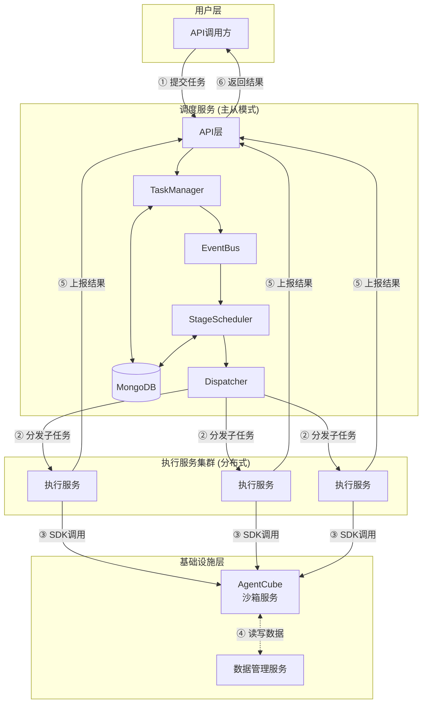
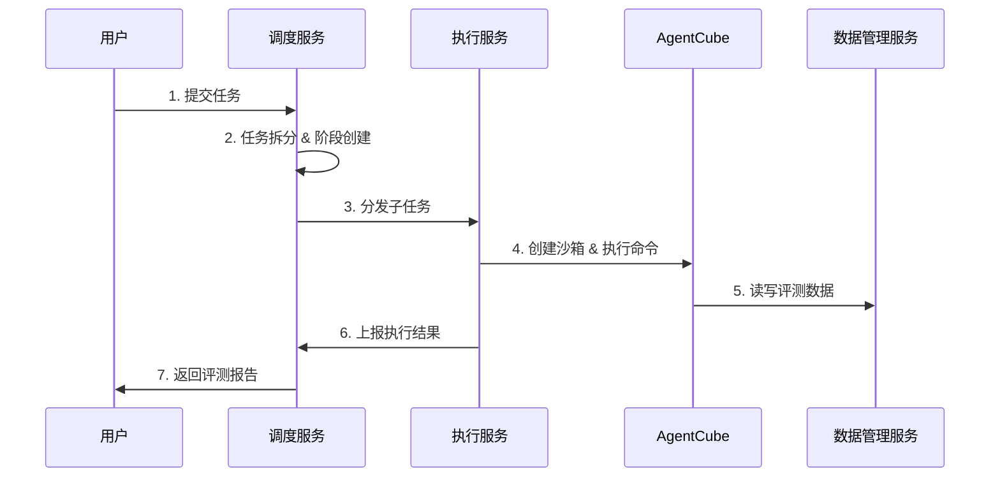
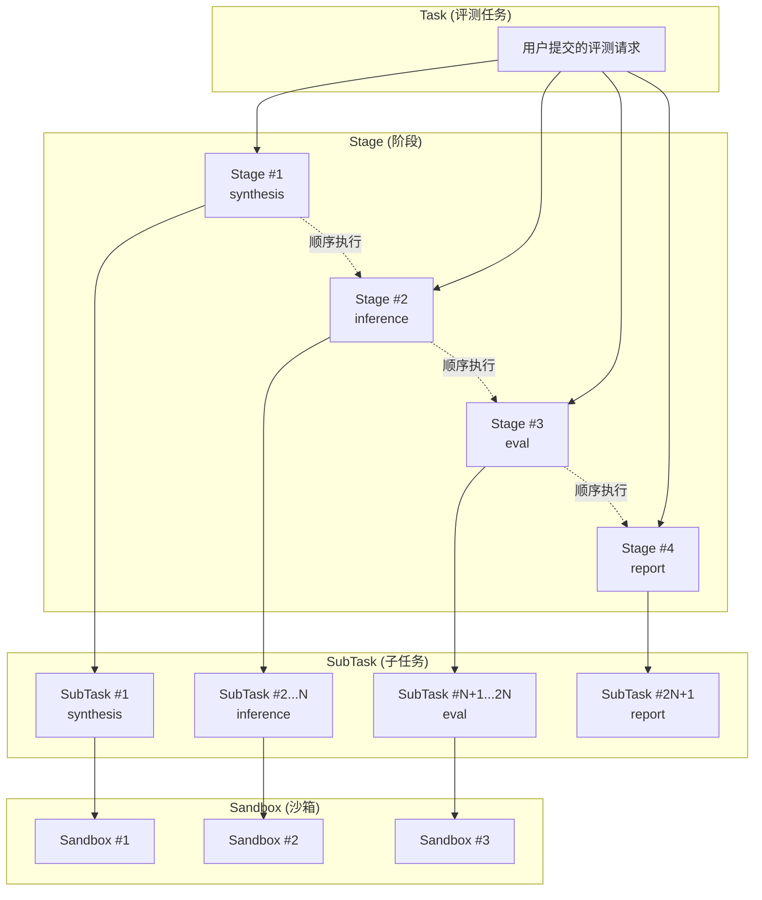
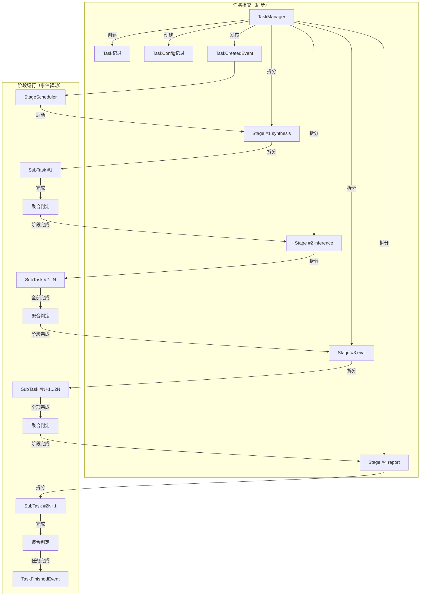
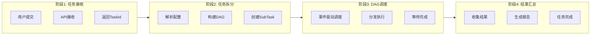

# 架构设计文档

## 一、概述

### 1.1 项目定位

应用评测服务（agent-eval-server）旨在实现对**Skill（技能）**的自动化评测能力。用户提交一个或多个Skill，系统在隔离的沙箱环境中执行评测，评估Skill在特定场景下的表现。

**评测流程概述**：

1. **用户提交**：提交评测任务，包含Skill配置文件
2. **synthesis阶段**：根据Skill生成评测用例（case），输出评测集
3. **inference阶段**：评测工具驱动Claude Code/Open Claw加载Skill，对case做出响应
4. **eval阶段**：根据交互记录计算评测指标
5. **report阶段**：汇总生成评测报告

### 1.2 核心目标

构建一个分布式评测服务系统，支持：

- 通过API接口提交Skill评测任务
- 任务自动拆分与阶段调度
- 在隔离的沙箱环境中执行评测
- 评测数据的持久化存储与管理
- 评测结果的汇总与报告生成

### 1.3 功能边界

| 功能 | 说明 |
|-----|------|
| 任务管理 | 接收任务请求，管理任务生命周期 |
| 任务调度 | 任务拆分、阶段调度、子任务分发 |
| 子任务执行 | 在沙箱环境中执行评测工具 |
| 数据管理 | 评测集、评测记录的存储与查询（依赖数据管理服务） |
| 结果汇总 | 评测结果聚合、报告生成 |

### 1.4 与模型评测服务的差异

| 维度 | 模型评测服务 | 应用评测服务 |
|------|-------------|-------------|
| 评测对象 | 模型输出（问答对话） | Skill（技能）在Agent环境下的表现 |
| 执行环境 | 执行服务本身是沙箱（Linux用户隔离） | 执行服务管理远程沙箱（AgentCube） |
| 任务拆分 | 按评测维度拆分（主观/客观评测） | 按workflow阶段+case拆分（混合拆分） |
| 数据流 | 本地文件读写 | 远程沙箱文件上传/下载 + 数据管理服务持久化 |
| workflow | 无阶段概念 | 四阶段：synthesis→inference→eval→report |
| 调度服务 | 分布式多节点负载均衡 | 主从模式（避免竞态资源更新问题） |

---

## 二、系统架构

### 2.1 整体架构图



**调度服务内部架构（事件驱动）**：

调度服务采用事件驱动架构，各模块通过 EventBus 进行异步通信：

| 模块 | 发布事件 | 订阅事件 |
|------|---------|---------|
| TaskManager | TaskCreatedEvent（含StageIds）, SubTaskFinishedEvent, TaskCancelEvent | TaskFinishedEvent, TaskFailedEvent |
| StageScheduler | SubTasksCreatedEvent, TaskFinishedEvent, TaskFailedEvent | TaskCreatedEvent, SubTaskFinishedEvent, TaskCancelEvent, SubTaskExceptionEvent |
| QuotaAllocator | SubTaskAllocatedEvent | SubTasksCreatedEvent, SubTaskFinishedEvent |
| Dispatcher | SubTaskExceptionEvent | SubTaskAllocatedEvent, ExecutorOfflineEvent, TaskCancelEvent |
| ExecutorManager | ExecutorOfflineEvent | - |

> 详细的事件定义和模块集成方式请参考 [模块设计文档](模块设计文档.md)。

### 2.2 服务组成与职责

| 服务 | 职责 | 说明 |
|------|------|------|
| **调度服务** | 任务生命周期管理、阶段调度、子任务分发 | 主从模式，Master节点负责实际调度 |
| **执行服务** | 接收子任务、管理沙箱、执行评测、上报结果 | 分布式部署，负载均衡 |
| **AgentCube** | 提供隔离沙箱环境 | 外部依赖，通过SDK调用 |
| **数据管理服务** | 评测数据持久化 | 外部依赖，通过HTTP API调用 |

### 2.3 组件交互关系



### 2.4 部署形态

**调度服务**：
- 主从模式部署（1 Master + N Slave）
- Master节点负责实际调度工作
- Slave节点备用，Master故障时切换
- 所有节点共享MongoDB数据存储

**执行服务**：
- 分布式部署，多实例负载均衡
- 调度服务根据执行服务负载情况分发子任务
- 每个执行服务实例独立管理其所负责的子任务

**负载均衡策略**：
- 执行服务选择：基于执行服务当前活跃子任务数量，选择负载较低的实例
- 子任务分发：调度服务主动调用执行服务的子任务接收接口

---

## 三、核心概念

### 3.1 Skill（技能）

Skill是评测的核心对象，是用户定义的技能配置文件。一个Skill描述了Agent应具备的能力和行为规范，包括：
- 技能名称、描述
- 触发条件和执行规则
- 工具调用定义
- 行为约束

### 3.2 Case（评测用例）

Case是评测的基本单元，包含对Skill进行评测所需的信息：
- 问题或操作说明（question/instruction）
- 预期结果或参考答案（reference）
- 评测维度和标准

Case在**synthesis阶段**根据Skill自动生成，存储在评测集中。

### 3.3 Task（任务）

用户提交的完整评测请求，包含评测配置和workflow定义。一个任务对应一次完整的Skill评测流程。

### 3.4 SubTask（子任务）

任务拆分后的执行单元，对应一个workflow阶段或一个case的执行。每个子任务绑定一个远程沙箱实例。

### 3.5 Stage（阶段）

任务拆分后的阶段执行单元，对应 workflow 的一个步骤。每个阶段包含一个或多个子任务：

| 阶段类型 | 说明 | 子任务特点 |
|---------|------|-----------|
| synthesis | 评测集合成 | 单个子任务 |
| inference | Agent推理执行 | 多个子任务（M×N），并行执行 |
| eval | 评测执行 | 多个子任务（M×N），并行执行 |
| report | 报告生成 | 单个子任务 |

阶段按顺序执行，前一阶段全部完成后启动下一阶段。

### 3.6 Workflow

应用评测的阶段执行序列：

| Workflow | 说明 |
|---------|------|
| synthesis → inference → eval → report | 完整流程 |
| inference → eval → report | 跳过synthesis（使用已有评测集） |

> 详细阶段定义和执行流程见 [第五章 任务拆分与阶段执行](#五任务拆分与阶段执行)。

### 3.7 Sandbox（沙箱实例）

AgentCube提供的隔离执行环境，沙箱内预装了：
- Claude Code 或 Open Claw（Agent执行环境）
- 评测工具（astron-eval）

每个子任务创建一个独立的沙箱实例，确保评测过程隔离。

### 3.8 概念关系图



**层级关系说明**：

| 层级 | 关系 | 说明 |
|------|------|------|
| Task → Stage | 1:N | 任务提交时预拆分为多个阶段 |
| Stage → SubTask | 1:N | 阶段启动时拆分为多个子任务 |
| SubTask → Sandbox | 1:1 | 每个子任务绑定一个沙箱实例 |

---

## 四、数据模型概述

> 详细的数据模型定义请参考 [数据模型设计文档](数据模型设计文档.md)。

### 4.1 核心数据模型

| 模型 | 说明 | 主要字段 |
|------|------|----------|
| Task | 任务记录 | task_id, app_id, type, status, progress, current_stage, result |
| TaskConfig | 任务配置 | task_id, type, config |
| Stage | 阶段记录 | task_id, stage_id, stage_type, status, total_count |
| SubTask | 子任务记录 | sub_task_id, task_id, stage_id, type, status, result |
| MasterState | 主从状态 | node_id, role, last_heartbeat |

### 4.2 任务类型

| 类型 | 说明 |
|------|------|
| model_eval | 模型评测任务 |
| agent_eval | 应用评测任务 |

### 4.3 子任务类型

| 类型 | 说明 |
|------|------|
| synthesis | 评测集合成 |
| inference | Agent推理执行 |
| eval | 评测执行 |
| report | 报告生成 |

---

## 五、任务拆分与阶段执行

### 5.1 增量式拆分架构

采用两步拆分方案：

| 拆分时机 | 拆分对象 | 执行模块 | 说明 |
|---------|---------|---------|------|
| 任务提交时 | Task + Stage | TaskManager | 同步完成，失败直接返回错误 |
| 阶段启动时 | SubTask | StageScheduler | 增量拆分，阶段内并行执行 |

**设计动机**：
- 阶段预拆分同步化：提交成功即可确认阶段已创建
- 子任务增量拆分：数量可能很大（M×N），不适合预拆分
- 部分拆分依赖执行结果：如inference的M值依赖synthesis输出

### 5.2 阶段定义

| 阶段 | 作用 | 输入 | 输出 | 子任务数量 |
|------|------|------|------|------------|
| synthesis | 合成评测集 | 场景描述、Skills | evalset.jsonl | 1 |
| inference | Agent推理执行 | evalset.jsonl | transcript.jsonl | M × N |
| eval | 评测执行 | transcript.jsonl + evalset.jsonl | record.json | M × N |
| report | 报告生成 | record.json列表 | conclusion.json/html | 1 |

**参数说明**：
- **M** = 评测集数量（synthesis阶段生成或用户提供）
- **N** = 变体数量（模型、Agent、Skill等变化维度）

### 5.3 阶段执行顺序

阶段按 stage_id 顺序依次执行：

```
synthesis → inference → eval → report
```

**执行规则**：
- 前一阶段全部子任务完成后，启动下一阶段
- 任一阶段失败，任务终止进入 TaskFailed
- 可配置跳过部分阶段（如已有评测集时跳过 synthesis）

### 5.4 阶段执行流程图



### 5.5 子任务拆分策略

**inference/eval阶段**：

子任务数量 = M × N

其中：
- M 从 synthesis 输出的 evalset.jsonl 获取（或用户提供）
- N 从 TaskConfig 配置获取（变体维度）

**拆分示例**：

场景A：3模型 + 评测集100条
- M = 100，N = 3
- inference 子任务 = 300
- eval 子任务 = 300

场景B：2Agent + 评测集50条
- M = 50，N = 2
- inference 子任务 = 100
- eval 子任务 = 100

---

## 六、核心流程

### 6.1 端到端流程图



### 6.2 流程关键点

| 步骤 | 关键点 | 说明 |
|------|--------|------|
| 任务接收 | 异步返回 | 任务提交后立即返回TaskId，不等待执行完成 |
| 任务拆分 | 阶段预拆分 + 子任务拆分 | 提交时创建Stages，阶段启动时拆分SubTasks |
| DAG调度 | 事件驱动 | 阶段完成后触发下一阶段启动 |
| 子任务分发 | 负载均衡 | 选择负载最低的执行服务实例 |
| 结果汇总 | 状态聚合 | SubTaskFinishedEvent触发阶段状态聚合，全部完成后发布TaskFinishedEvent |

---

## 七、服务模块概述

> 详细的服务模块设计请参考 [模块设计文档](模块设计文档.md)。

### 7.1 调度服务

调度服务负责任务生命周期管理、阶段调度、子任务分发。采用事件驱动架构，各模块通过 EventBus 进行异步通信。

**核心模块**：TaskManager、StageScheduler、QuotaAllocator、Dispatcher、ExecutorManager、EventBus

### 7.2 执行服务

执行服务负责接收子任务、管理沙箱、执行评测、上报结果。

**核心模块**：SubTaskManager、SandboxManager、SubTaskHandlerRegistry、ResultUploader

---

## 八、相关文档

### 设计文档

- [数据模型设计文档](数据模型设计文档.md) - 数据结构、字段、索引定义
- [API接口设计文档](API接口设计文档.md) - HTTP API定义
- [模块设计文档](模块设计文档.md) - 服务模块详细设计

### 实现细节

- [任务管理器设计](details/scheduler/任务管理器设计.md) - TaskManager 实现细节（含阶段预拆分）
- [阶段调度器设计](details/scheduler/阶段调度器设计.md) - StageScheduler 实现细节
- [事件总线设计](details/scheduler/事件总线设计.md) - EventBus 实现细节
- [配额分配器设计](details/scheduler/配额分配器设计.md) - QuotaAllocator 实现细节
- [子任务分发器设计](details/scheduler/子任务分发器设计.md) - Dispatcher 实现细节
- [执行服务管理器设计](details/scheduler/执行服务管理器设计.md) - ExecutorManager 实现细节
- [主从模式设计](details/scheduler/主从模式设计.md) - MasterSlave 实现细节
- [子任务管理器设计](details/executor/子任务管理器设计.md) - SubTaskManager 实现细节
- [沙箱管理器设计](details/executor/沙箱管理器设计.md) - SandboxManager 实现细节
- [结果上报器设计](details/executor/结果上报器设计.md) - ResultUploader 实现细节
- [子任务处理器设计](details/executor/子任务处理器设计.md) - SubTaskHandler 实现细节

### 依赖文档

- [评测工具交互说明](../dependencies/评测工具交互说明.md) - astron-eval集成方式