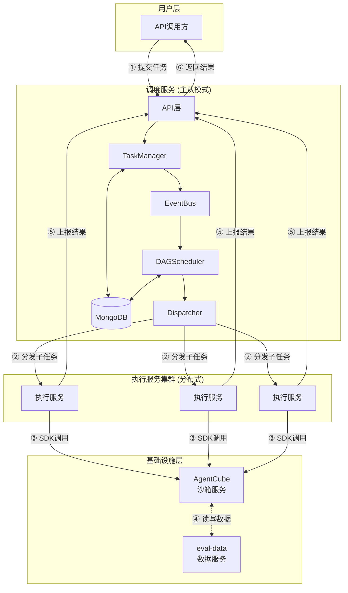
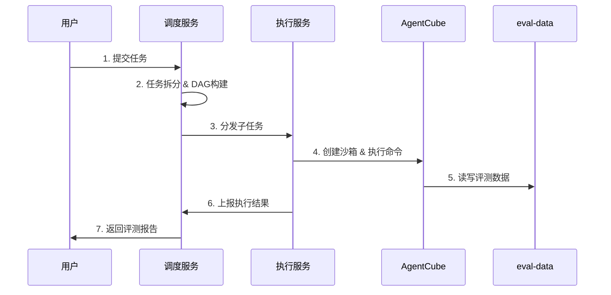
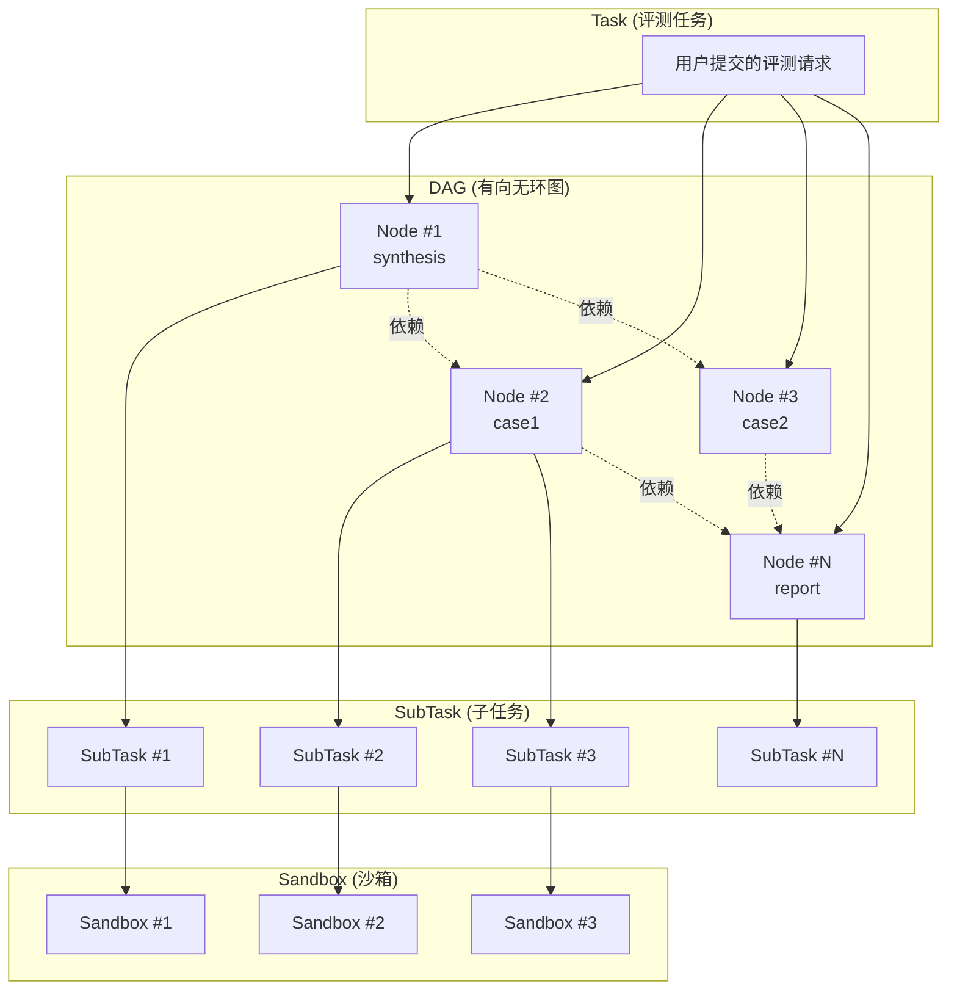
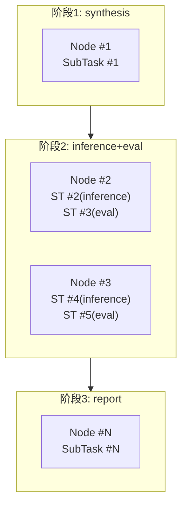
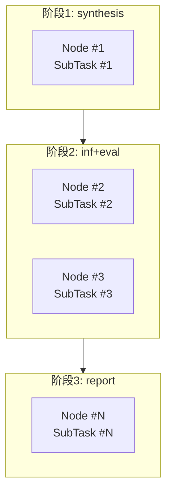
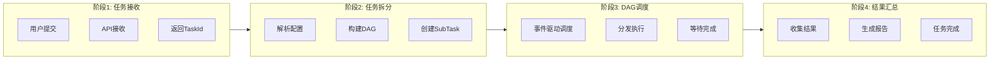

# 架构设计文档

## 一、概述

### 1.1 项目定位

应用评测服务（agent-eval-server）旨在实现对**Skill（技能）**的自动化评测能力。用户提交一个或多个Skill，系统在隔离的沙箱环境中执行评测，评估Skill在特定场景下的表现。

**评测流程概述**：

1. **用户提交**：提交评测任务，包含Skill配置文件
2. **synthesis阶段**：根据Skill生成评测用例（case），输出评测集
3. **inference阶段**：评测工具驱动Claude Code/Open Claw加载Skill，对case做出响应
4. **eval阶段**：根据交互记录计算评测指标
5. **report阶段**：汇总生成评测报告

### 1.2 核心目标

构建一个分布式评测服务系统，支持：

- 通过API接口提交Skill评测任务
- 任务自动拆分与DAG调度
- 在隔离的沙箱环境中执行评测
- 评测数据的持久化存储与管理
- 评测结果的汇总与报告生成

### 1.3 功能边界

| 功能 | 说明 |
|-----|------|
| 任务管理 | 接收任务请求，管理任务生命周期 |
| 任务调度 | 任务拆分、DAG构建、子任务分发 |
| 子任务执行 | 在沙箱环境中执行评测工具 |
| 数据管理 | 评测集、评测记录的存储与查询（依赖eval-data服务） |
| 结果汇总 | 评测结果聚合、报告生成 |

### 1.4 与模型评测服务的差异

| 维度 | 模型评测服务 | 应用评测服务 |
|------|-------------|-------------|
| 评测对象 | 模型输出（问答对话） | Skill（技能）在Agent环境下的表现 |
| 执行环境 | 执行服务本身是沙箱（Linux用户隔离） | 执行服务管理远程沙箱（AgentCube） |
| 任务拆分 | 按评测维度拆分（主观/客观评测） | 按workflow阶段+case拆分（混合拆分） |
| 数据流 | 本地文件读写 | 远程沙箱文件上传/下载 + eval-data持久化 |
| workflow | 无阶段概念 | 四阶段：synthesis→inference→eval→report |
| 调度服务 | 分布式多节点负载均衡 | 主从模式（避免竞态资源更新问题） |

---

## 二、系统架构

### 2.1 整体架构图



**调度服务内部架构（事件驱动）**：

调度服务采用事件驱动架构，各模块通过 EventBus 进行异步通信：

| 模块 | 发布事件 | 订阅事件 |
|------|---------|---------|
| Splitter | TaskSplitCompleteEvent | - |
| TaskManager | SubTaskCoordAddEvent, SubTaskCoordDeleteEvent | TaskFinishedEvent, TaskFailedEvent, TaskCancelEvent |
| DAGScheduler | DAGNodeFinishedEvent, TaskFinishedEvent, TaskFailedEvent | TaskSplitCompleteEvent, DAGNodeFinishedEvent, SubTaskStatusChangeEvent, SubTaskCoordAddEvent, SubTaskCoordDeleteEvent |
| Dispatcher | - | SubTaskStatusChangeEvent, ExecutorOfflineEvent, TaskCancelEvent |
| ExecutorManager | ExecutorOfflineEvent | - |

> 详细的事件定义和模块集成方式请参考 [模块设计文档](模块设计文档.md)。

### 2.2 服务组成与职责

| 服务 | 职责 | 说明 |
|------|------|------|
| **调度服务** | 任务生命周期管理、DAG调度、子任务分发 | 主从模式，Master节点负责实际调度 |
| **执行服务** | 接收子任务、管理沙箱、执行评测、上报结果 | 分布式部署，负载均衡 |
| **AgentCube** | 提供隔离沙箱环境 | 外部依赖，通过SDK调用 |
| **eval-data** | 评测数据持久化 | 外部依赖，通过HTTP API调用 |

### 2.3 组件交互关系



### 2.4 部署形态

**调度服务**：
- 主从模式部署（1 Master + N Slave）
- Master节点负责实际调度工作
- Slave节点备用，Master故障时切换
- 所有节点共享MongoDB数据存储

**执行服务**：
- 分布式部署，多实例负载均衡
- 调度服务根据执行服务负载情况分发子任务
- 每个执行服务实例独立管理其所负责的子任务

**负载均衡策略**：
- 执行服务选择：基于执行服务当前活跃子任务数量，选择负载较低的实例
- 子任务分发：调度服务主动调用执行服务的子任务接收接口

---

## 三、核心概念

### 3.1 Skill（技能）

Skill是评测的核心对象，是用户定义的技能配置文件。一个Skill描述了Agent应具备的能力和行为规范，包括：
- 技能名称、描述
- 触发条件和执行规则
- 工具调用定义
- 行为约束

### 3.2 Case（评测用例）

Case是评测的基本单元，包含对Skill进行评测所需的信息：
- 问题或操作说明（question/instruction）
- 预期结果或参考答案（reference）
- 评测维度和标准

Case在**synthesis阶段**根据Skill自动生成，存储在评测集中。

### 3.3 Task（任务）

用户提交的完整评测请求，包含评测配置和workflow定义。一个任务对应一次完整的Skill评测流程。

### 3.4 SubTask（子任务）

任务拆分后的执行单元，对应一个workflow阶段或一个case的执行。每个子任务绑定一个远程沙箱实例。

### 3.5 DAGNode（DAG节点）

任务拆分后形成的有向无环图节点，表示一个或多个子任务的集合及其依赖关系。

### 3.6 Workflow阶段

应用评测的执行阶段序列，每个阶段在独立的沙箱环境中执行：

| 阶段 | 执行逻辑 | 输入 | 输出 |
|------|---------|------|------|
| synthesis | 评测工具根据Skill生成评测用例（case） | Skill、场景描述 | dataset.jsonl, evalset.jsonl |
| inference | 评测工具驱动Claude Code/Open Claw加载Skill，对case做出响应 | Skill、评测集 | transcript.jsonl, evalset.jsonl（含answer） |
| eval | 评测工具根据交互记录计算评测指标 | 交互记录、评测集 | result.json |
| report | 汇总评测结果，生成报告 | 评测结果 | conclusion.json, conclusion.html |

**执行模式**：
- 完整流程：synthesis → inference → eval → report
- 部分流程：可配置只执行部分阶段（如跳过synthesis，使用已有评测集）

### 3.7 Sandbox（沙箱实例）

AgentCube提供的隔离执行环境，沙箱内预装了：
- Claude Code 或 Open Claw（Agent执行环境）
- 评测工具（astron-eval）

每个子任务创建一个独立的沙箱实例，确保评测过程隔离。

### 3.8 概念关系图



---

## 四、数据模型概述

> 详细的数据模型定义请参考 [数据模型设计文档](数据模型设计文档.md)。

### 4.1 核心数据模型

| 模型 | 说明 | 主要字段 |
|------|------|----------|
| Task | 任务记录 | task_id, app_id, type, config, status, progress, result |
| SubTask | 子任务记录 | sub_task_id, task_id, type, input, status, result |
| DAGNode | DAG节点 | node_id, task_id, node_type, sub_task_ids, dependencies, status |
| MasterState | 主从状态 | node_id, role, last_heartbeat |

### 4.2 任务类型

| 类型 | 说明 |
|------|------|
| model_eval | 模型评测任务 |
| agent_eval | 应用评测任务 |

### 4.3 子任务类型

| 类型 | 说明 |
|------|------|
| synthesis | 评测集合成 |
| inference | Agent推理执行 |
| eval | 评测执行 |
| report | 报告生成 |

---

## 五、任务拆分与DAG

### 5.1 拆分策略

采用混合拆分策略：

| 阶段 | 拆分方式 | 说明 |
|------|---------|------|
| synthesis | 整体执行 | 不按case拆分，生成完整评测集 |
| inference | 按case拆分 | 每个case一个或多个子任务 |
| eval | 按case拆分 | 每个case一个子任务，可与inference合并 |
| report | 整体执行 | 收集所有评测结果生成报告 |

### 5.2 拆分模式

**模式A：分离模式**
- inference子任务 + eval子任务（每个case两个子任务）
- eval依赖inference完成

**模式B：合并模式**
- inference+eval合并子任务（每个case一个子任务）
- 在一个沙箱中顺序执行inference和eval

### 5.3 DAG构建规则

**规则1：synthesis节点**
- 无前置依赖
- 包含1个synthesis子任务

**规则2：inference/eval节点**
- 依赖synthesis节点（如果workflow包含synthesis）
- 每个case对应一个DAG节点
- 分离模式：节点包含2个子任务（inference + eval），eval依赖inference
- 合并模式：节点包含1个子任务（inference+eval合并）

**规则3：report节点**
- 依赖所有inference/eval节点
- 包含1个report子任务

### 5.4 DAG结构示例

**完整流程（分离模式）**：



**完整流程（合并模式）**：



---

## 六、核心流程

### 6.1 端到端流程图



### 6.2 流程关键点

| 步骤 | 关键点 | 说明 |
|------|--------|------|
| 任务接收 | 异步返回 | 任务提交后立即返回TaskId，不等待执行完成 |
| 任务拆分 | DAG构建 + 事件通知 | 根据workflow配置构建DAG，拆分完成后发布TaskSplitCompleteEvent |
| DAG调度 | 事件驱动 | 节点完成后发布DAGNodeFinishedEvent，触发依赖节点检查和释放 |
| 子任务分发 | 负载均衡 | 选择负载最低的执行服务实例 |
| 结果汇总 | 事件聚合 | SubTaskStatusChangeEvent触发节点状态聚合，全部完成后更新Task状态 |

---

## 七、服务模块概述

> 详细的服务模块设计请参考 [模块设计文档](模块设计文档.md)。

### 7.1 调度服务模块

```
调度服务
├── API层                    // HTTP接口处理
├── TaskManager              // 任务生命周期管理
├── Splitter                 // 任务拆分器
├── EventBus                 // 事件总线（模块间异步通信）
├── DAGScheduler             // DAG调度器（事件驱动）
├── Dispatcher               // 子任务分发器
├── ExecutorManager          // 执行服务管理器
├── Storage                  // 数据存储层
└── MasterSlave              // 主从模式管理
```

**事件驱动架构**：

调度服务内部采用 EventBus 实现模块间解耦，替代传统的定时轮询数据库模式：
- **TaskSplitCompleteEvent**：Splitter 完成拆分后通知 DAGScheduler
- **DAGNodeFinishedEvent**：DAG 节点完成后触发依赖节点检查
- **SubTaskStatusChangeEvent**：子任务状态变更触发节点状态聚合
- **ExecutorOfflineEvent**：执行服务失联触发子任务重置

> 详细设计请参考 [模块设计文档](模块设计文档.md)。

### 7.2 执行服务模块

```
执行服务
├── API层                    // HTTP接口处理
├── SubTaskManager           // 子任务生命周期管理
├── SandboxManager           // 沙箱生命周期管理
├── ExecutionTracker         // 命令执行追踪
├── ResourceHandler          // 资源处理
└── ResultUploader           // 结果上报
```

---

## 八、相关文档

- [数据模型设计文档](数据模型设计文档.md) - 数据结构、字段、索引定义
- [API接口设计文档](API接口设计文档.md) - HTTP API定义
- [模块设计文档](模块设计文档.md) - 服务模块详细设计
- [评测工具交互说明](../dependencies/评测工具交互说明.md) - astron-eval集成方式