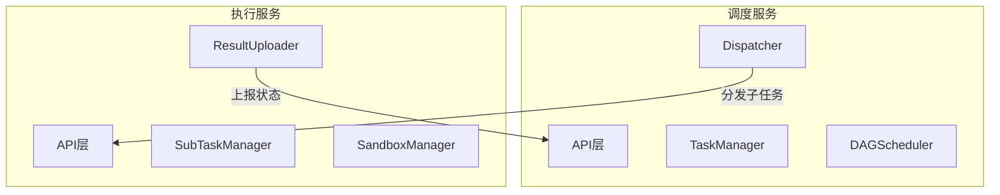
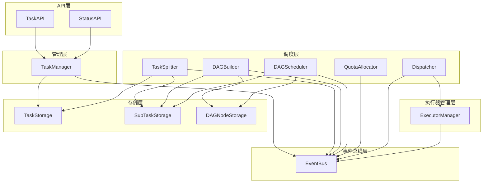
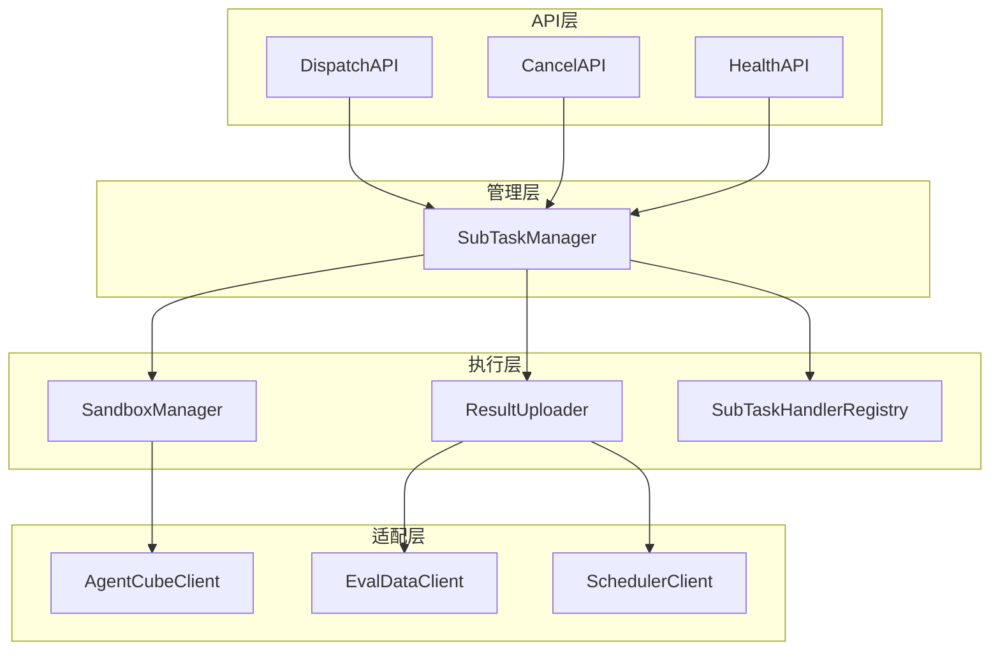
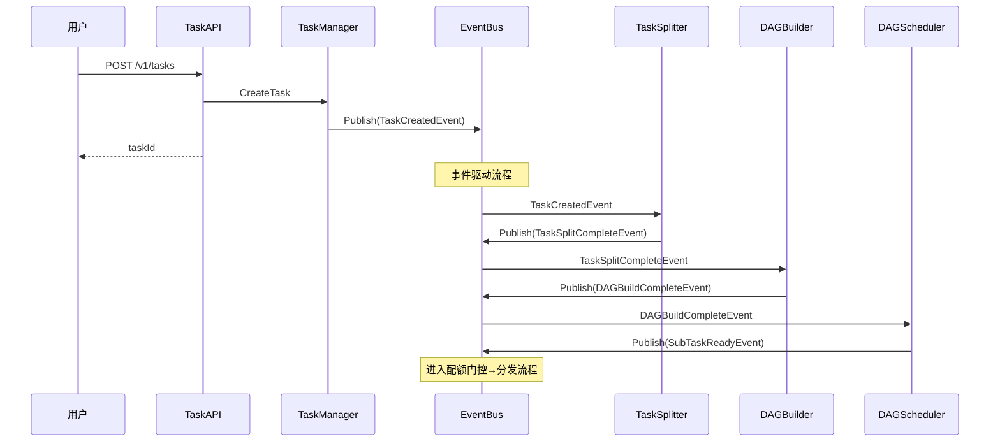
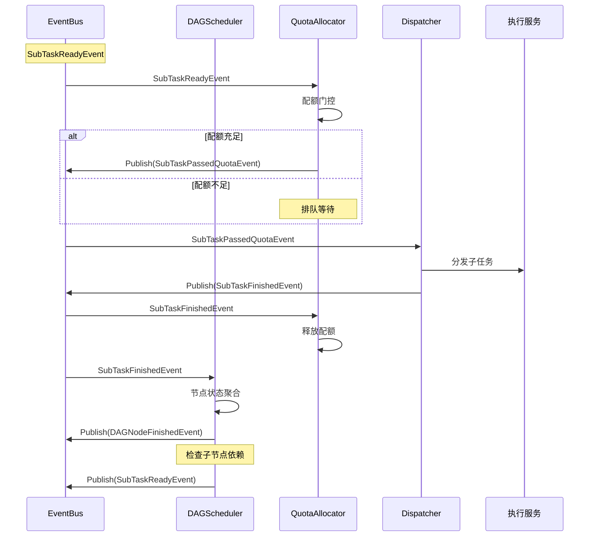
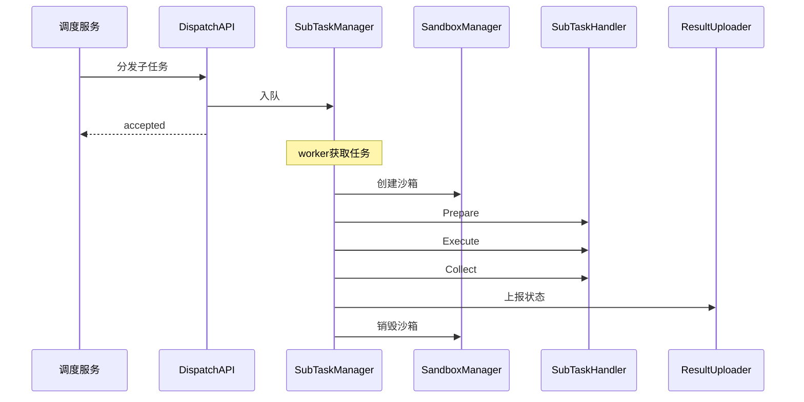
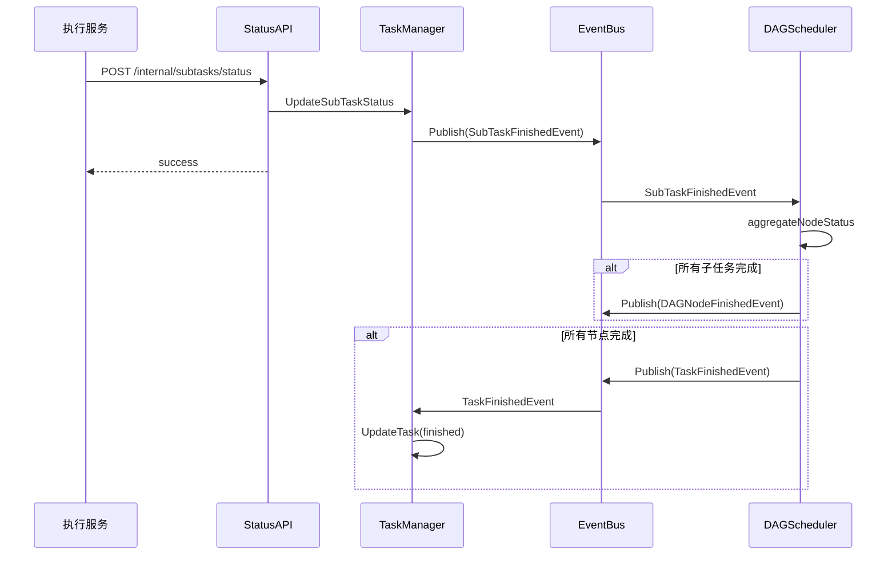
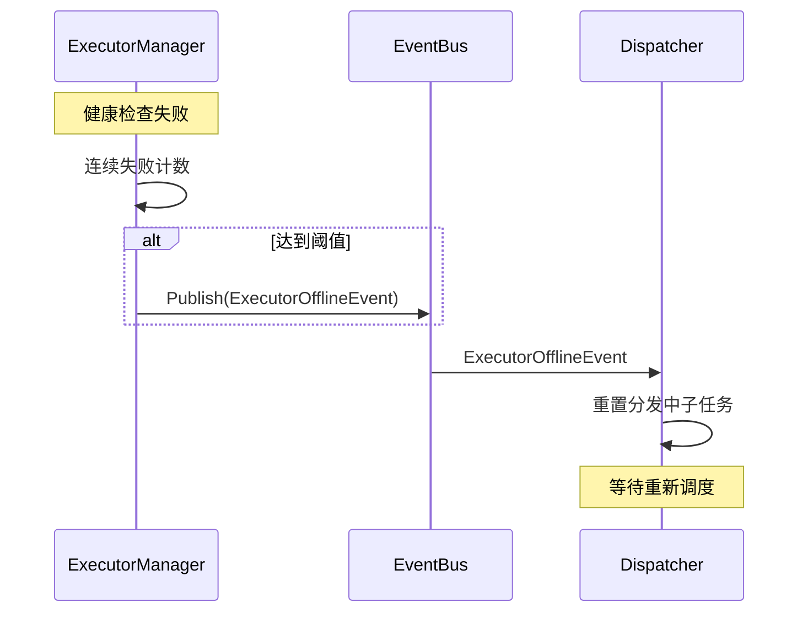

# 模块设计文档

## 一、概述

### 1.1 文档定位

本文档是架构设计文档与详细设计文档之间的桥梁层，定义调度服务和执行服务的模块划分与协作关系。

**文档层次关系**：

| 文档 | 内容 | 适用场景 |
|------|------|----------|
| 架构设计文档 | 系统架构、核心概念、服务组成 | 理解系统整体设计 |
| **模块设计文档** | 模块划分、职责边界、接口契约、协作流程 | 理解模块间如何协作 |
| 详细设计文档 | 单模块内部结构、处理逻辑、扩展方式 | 实现具体模块 |

### 1.2 服务关系

调度服务与执行服务通过HTTP接口交互：



---

## 二、调度服务模块概览

### 2.1 模块架构图

```
调度服务
├── API层                    // 接口接入
│   ├── TaskAPI              // 任务提交/查询/取消接口
│   ├── StatusAPI            // 状态上报接口（执行服务调用）
│   └── HealthAPI            // 健康检查接口
│
├── 管理层                   // 任务生命周期
│   └── TaskManager          // 任务CRUD、状态更新、事件发布
│
├── 调度层                   // 任务拆分、DAG构建、调度
│   ├── TaskSplitter         // 任务拆分器
│   ├── DAGBuilder           // DAG构建器
│   ├── DAGScheduler         // DAG调度器
│   ├── QuotaAllocator       // 配额分配器
│   └── Dispatcher           // 子任务分发器
│       └── ExecutorManager  // 执行服务管理（内部依赖）
│
├── 执行器管理层             // 执行服务注册与健康检查
│   └── ExecutorManager      // 执行服务注册、健康检查、负载选择
│       ├── ExecutorRegistry // 执行服务注册表（内部）
│       └── HealthChecker    // 健康检查器（内部）
│
├── 事件总线层               // 模块间异步通信
│   └── EventBus             // 事件发布/订阅/分发
│
├── 存储层                   // 数据持久化
│   ├── TaskStorage          // Task记录存储
│   ├── SubTaskStorage       // SubTask记录存储
│   ├── DAGNodeStorage       // DAGNode记录存储
│   └── MasterStateStorage   // 主从状态存储
│
└── 高可用层                 // 主从模式管理
    └── MasterSlave          // Master选举、心跳维持、故障切换
```

**层次职责说明**：

| 层次 | 职责 | 模块数 |
|------|------|--------|
| API层 | 接收请求、参数校验、响应返回 | 3 |
| 管理层 | 任务CRUD、状态更新、事件发布 | 1 |
| 调度层 | 任务拆分、DAG构建、依赖调度、配额门控、分发执行 | 5 |
| 执行器管理层 | 执行服务注册、健康检查、负载选择 | 1 |
| 事件总线层 | 事件发布/订阅/分发 | 1 |
| 存储层 | 数据持久化操作 | 4 |
| 高可用层 | Master选举、心跳维持、故障切换 | 1 |

### 2.2 模块职责表

| 模块 | 职责 | 不负责 | 依赖模块 |
|------|------|--------|----------|
| TaskAPI | 接收任务请求、参数校验、响应返回 | 任务创建逻辑 | TaskManager |
| StatusAPI | 接收状态上报、响应返回 | 状态更新逻辑 | TaskManager |
| HealthAPI | 健康检查响应 | 无 | 无 |
| TaskManager | 任务CRUD、状态更新、发布TaskCreatedEvent | 拆分逻辑、DAG构建 | EventBus, TaskStorage |
| TaskSplitter | 订阅TaskCreatedEvent→拆分子任务→发布完成事件 | DAG构建 | EventBus, TaskStorage, SubTaskStorage |
| DAGBuilder | 订阅拆分完成事件→构建DAG→发布完成事件 | 子任务创建 | EventBus, SubTaskStorage, DAGNodeStorage |
| DAGScheduler | 管理TaskDAG、依赖检查、节点释放、状态聚合 | 执行服务选择 | EventBus, DAGNodeStorage, SubTaskStorage |
| QuotaAllocator | 配额门控（排队/通过）、发布配额通过事件 | 分发执行 | EventBus, QuotaManager |
| Dispatcher | 订阅配额通过事件→选择执行服务→分发 | 配额分配 | EventBus, ExecutorManager |
| ExecutorManager | 执行服务注册、健康检查、负载选择 | 子任务重置 | EventBus |
| EventBus | 事件发布/订阅/分发 | 业务逻辑 | 无 |
| Storage | 数据CRUD | 业务逻辑 | 无 |
| MasterSlave | Master选举、心跳维持、故障切换 | 任务调度 | DAGScheduler, MasterStateStorage |

### 2.3 模块依赖关系图



### 2.4 跨模块接口契约

**Storage接口定义**：

```go
// TaskStorage 任务存储接口
type TaskStorage interface {
    CreateTask(ctx context.Context, task *Task) error
    GetTask(ctx context.Context, taskId string) (*Task, error)
    UpdateTask(ctx context.Context, task *Task) error
    UpdateTaskStatus(ctx context.Context, taskId string, status int, message string) error
    DeleteTask(ctx context.Context, taskId string) error
    ListTasks(ctx context.Context, appId string, status []int, offset, limit int) ([]*Task, int, error)
}

// SubTaskStorage 子任务存储接口
type SubTaskStorage interface {
    CreateSubTask(ctx context.Context, subTask *SubTask) error
    CreateSubTasks(ctx context.Context, subTasks []*SubTask) error
    GetSubTask(ctx context.Context, subTaskId string) (*SubTask, error)
    UpdateSubTask(ctx context.Context, subTask *SubTask) error
    GetSubTasksByTask(ctx context.Context, taskId string) ([]*SubTask, error)
}

// DAGNodeStorage DAG节点存储接口
type DAGNodeStorage interface {
    CreateDAGNodes(ctx context.Context, nodes []*DAGNode) error
    GetDAGNode(ctx context.Context, nodeId string) (*DAGNode, error)
    UpdateDAGNodeStatus(ctx context.Context, nodeId string, status int) error
    GetDAGNodesByTask(ctx context.Context, taskId string) ([]*DAGNode, error)
}
```

> 数据结构定义详见 [数据模型设计文档](数据模型设计文档.md)

### 2.5 EventBus集成表

| 模块 | 发布事件 | 订阅事件 |
|------|---------|---------|
| TaskManager | TaskCreatedEvent | TaskFinishedEvent, TaskFailedEvent, TaskCancelEvent |
| TaskSplitter | TaskSplitCompleteEvent | TaskCreatedEvent |
| DAGBuilder | DAGBuildCompleteEvent | TaskSplitCompleteEvent |
| DAGScheduler | SubTaskReadyEvent, DAGNodeFinishedEvent, TaskFinishedEvent, TaskFailedEvent | DAGBuildCompleteEvent, DAGNodeFinishedEvent, SubTaskFinishedEvent |
| QuotaAllocator | SubTaskPassedQuotaEvent | SubTaskReadyEvent, SubTaskFinishedEvent |
| Dispatcher | SubTaskFinishedEvent | SubTaskPassedQuotaEvent, ExecutorOfflineEvent, TaskCancelEvent |
| ExecutorManager | ExecutorOfflineEvent | 无 |

> 事件类型定义、事件结构详见 [事件总线设计](details/事件总线设计.md)

---

## 三、执行服务模块概览

### 3.1 模块架构图

```
执行服务
├── API层                        // 接口接入
│   ├── DispatchAPI              // 子任务接收接口
│   ├── CancelAPI                // 子任务取消接口
│   └── HealthAPI                // 健康检查接口
│
├── 管理层                       // 子任务生命周期
│   └── SubTaskManager           // 子任务入队、执行调度、取消处理
│       ├── SubTaskQueue         // 本地执行队列（内部）
│       └── ActiveTaskTracker    // 活跃任务追踪（内部）
│
├── 执行层                       // 核心执行逻辑
│   ├── SandboxManager           // 沙箱创建、销毁、TTL计算
│   ├── ExecutionTracker         // 命令执行追踪（内部）
│   ├── ResourceHandler          // 资源上传/下载（内部）
│   └── ResultUploader           // 结果收集、状态上报
│
└── 适配层                       // 外部服务客户端
    ├── AgentCubeClient          // AgentCube SDK封装
    ├── EvalDataClient           // 数据管理服务API客户端
    ├── SchedulerClient          // 调度服务API客户端
    └── StorageClient            // 存储服务客户端
```

**层次职责说明**：

| 层次 | 职责 | 模块数 |
|------|------|--------|
| API层 | 接收分发/取消请求、响应返回 | 3 |
| 管理层 | 子任务入队、执行调度、取消处理、并发控制 | 1 |
| 执行层 | 沙箱管理、命令执行、资源处理、结果上报 | 4 |
| 适配层 | 外部服务API封装 | 4 |

### 3.2 模块职责表

| 模块 | 职责 | 不负责 | 依赖模块 |
|------|------|--------|----------|
| DispatchAPI | 接收分发请求、参数校验、响应返回 | 子任务执行逻辑 | SubTaskManager |
| CancelAPI | 接收取消请求、调用取消逻辑 | 沙箱销毁细节 | SubTaskManager |
| HealthAPI | 健康状态计算、响应返回 | 资源分配 | SubTaskManager |
| SubTaskManager | 子任务入队、执行调度、取消处理、并发控制 | 沙箱创建细节 | SubTaskHandlerRegistry, SandboxManager, ResultUploader |
| SandboxManager | 沙箱创建、销毁、TTL计算 | 命令执行、资源上传 | AgentCubeClient |
| ResultUploader | 结果收集、状态上报 | 沙箱操作 | SchedulerClient |
| SubTaskHandlerRegistry | Handler注册与查询 | 业务逻辑实现 | 无 |
| AgentCubeClient | AgentCube SDK封装 | 无 | 无 |
| EvalDataClient | 数据管理服务API封装 | 无 | 无 |
| SchedulerClient | 调度服务API封装 | 无 | 无 |

### 3.3 模块依赖关系图



### 3.4 跨模块接口契约

**SubTaskHandler接口定义**：

```go
// SubTaskHandler 子任务处理器接口
type SubTaskHandler interface {
    Prepare(ctx context.Context, sandbox *SandboxInstance, subTask *SubTask) error
    Execute(ctx context.Context, sandbox *SandboxInstance, subTask *SubTask) (*ExecutionResult, error)
    Collect(ctx context.Context, sandbox *SandboxInstance, subTask *SubTask) (*SubTaskResult, error)
    GetTimeout() time.Duration
}
```

**内置Handler注册表**：

| 任务类型 | 子任务类型 | Handler | 说明 |
|----------|-----------|---------|------|
| agent_eval | synthesis | AgentEvalSynthesisHandler | 评测集合成 |
| agent_eval | inference | AgentEvalInferenceHandler | Agent推理执行 |
| agent_eval | eval | AgentEvalEvalHandler | 评测执行 |
| agent_eval | report | AgentEvalReportHandler | 报告生成 |

> Handler实现细节详见 [子任务处理器设计](details/子任务处理器设计.md)

### 3.5 与调度服务的交互

| 场景 | 执行服务调用 | 调度服务响应 |
|------|-------------|-------------|
| 接收子任务 | 被DispatchAPI调用 | 调度服务主动分发 |
| 上报状态 | SchedulerClient.ReportStatus | StatusAPI接收 |
| 健康检查 | 被HealthAPI调用 | ExecutorManager定时调用 |

---

## 四、核心流程概览

### 4.1 任务创建流程



**流程说明**：

| 步骤 | 触发事件 | 核心动作 |
|------|---------|---------|
| 任务创建 | TaskCreatedEvent | TaskManager落库后发布 |
| 任务拆分 | TaskSplitCompleteEvent | TaskSplitter拆分子任务 |
| DAG构建 | DAGBuildCompleteEvent | DAGBuilder构建依赖关系 |
| DAG调度 | SubTaskReadyEvent | DAGScheduler释放根节点 |

### 4.2 DAG调度与分发流程



**流程说明**：

| 步骤 | 触发事件 | 核心动作 |
|------|---------|---------|
| 配额门控 | SubTaskReadyEvent | QuotaAllocator判断是否需要配额 |
| 分发执行 | SubTaskPassedQuotaEvent | Dispatcher选择执行服务并分发 |
| 配额释放 | SubTaskFinishedEvent | QuotaAllocator释放配额，触发下一个 |
| 状态聚合 | SubTaskFinishedEvent | DAGScheduler聚合节点状态 |
| 依赖释放 | DAGNodeFinishedEvent | DAGScheduler检查并释放子节点 |

### 4.3 子任务执行流程



**流程说明**：

| 步骤 | 模块 | 核心动作 |
|------|------|---------|
| 接收入队 | SubTaskManager | 接收后立即返回，异步执行 |
| 沙箱创建 | SandboxManager | 调用AgentCube创建隔离环境 |
| 资源准备 | SubTaskHandler | 上传skills、配置文件等 |
| 命令执行 | SubTaskHandler | 执行评测工具命令 |
| 结果收集 | SubTaskHandler | 读取输出文件 |
| 状态上报 | ResultUploader | 调用调度服务StatusAPI |

### 4.4 状态上报与聚合流程



**流程说明**：

| 步骤 | 触发事件 | 核心动作 |
|------|---------|---------|
| 状态更新 | SubTaskFinishedEvent | TaskManager更新子任务状态 |
| 节点聚合 | SubTaskFinishedEvent | DAGScheduler聚合DAGNode状态 |
| 任务完成 | TaskFinishedEvent | TaskManager更新任务终态 |

### 4.5 执行服务失联处理流程



**流程说明**：

| 步骤 | 触发事件 | 核心动作 |
|------|---------|---------|
| 失联检测 | 健康检查连续失败 | ExecutorManager标记offline |
| 子任务重置 | ExecutorOfflineEvent | Dispatcher重置分发中的子任务为exception |

---

## 五、相关文档

### 设计文档

| 文档 | 内容 | 与本文档关系 |
|------|------|-------------|
| [架构设计文档](架构设计文档.md) | 系统架构、核心概念、服务组成 | 上层文档，定义整体架构 |
| [数据模型设计文档](数据模型设计文档.md) | 数据结构、字段、索引定义 | 补充数据结构定义 |
| [API接口设计文档](API接口设计文档.md) | HTTP API定义 | 补充接口细节 |

### 详细设计文档

**调度服务**：

| 文档 | 内容 | 与本文档关系 |
|------|------|-------------|
| [任务管理器设计](details/scheduler/任务管理器设计.md) | TaskManager内部实现 | 下层文档，补充任务生命周期管理细节 |
| [任务拆分器设计](details/scheduler/任务拆分器设计.md) | TaskSplitter内部实现 | 下层文档，补充拆分策略细节 |
| [DAG构建器设计](details/scheduler/DAG构建器设计.md) | DAGBuilder内部实现 | 下层文档，补充构建策略细节 |
| [事件总线设计](details/scheduler/事件总线设计.md) | EventBus实现、事件结构定义 | 下层文档，补充事件类型细节 |
| [DAG调度器设计](details/scheduler/DAG调度器设计.md) | DAGScheduler内部实现 | 下层文档，补充调度算法细节 |
| [配额分配器设计](details/scheduler/配额分配器设计.md) | QuotaAllocator内部实现 | 下层文档，补充配额门控细节 |
| [子任务分发器设计](details/scheduler/子任务分发器设计.md) | Dispatcher内部实现 | 下层文档，补充分发策略细节 |
| [执行服务管理器设计](details/scheduler/执行服务管理器设计.md) | ExecutorManager内部实现 | 下层文档，补充执行服务管理细节 |
| [主从模式设计](details/scheduler/主从模式设计.md) | MasterSlave内部实现 | 下层文档，补充主从选举与故障切换细节 |

**执行服务**：

| 文档 | 内容 | 与本文档关系 |
|------|------|-------------|
| [子任务管理器设计](details/executor/子任务管理器设计.md) | SubTaskManager内部实现 | 下层文档，补充子任务执行调度细节 |
| [沙箱管理器设计](details/executor/沙箱管理器设计.md) | SandboxManager内部实现 | 下层文档，补充沙箱生命周期管理细节 |
| [结果上报器设计](details/executor/结果上报器设计.md) | ResultUploader内部实现 | 下层文档，补充结果上报逻辑细节 |
| [子任务处理器设计](details/executor/子任务处理器设计.md) | SubTaskHandler实现 | 下层文档，补充Handler细节 |

### 依赖文档

| 文档 | 内容 |
|------|------|
| [AgentCube使用说明](../dependencies/AgentCube使用说明.md) | 沙箱SDK集成方式 |
| [数据管理服务接口文档](../dependencies/数据管理服务接口文档.md) | EvalDataClient使用说明 |
| [评测工具交互说明](../dependencies/评测工具交互说明.md) | astron-eval集成方式 |