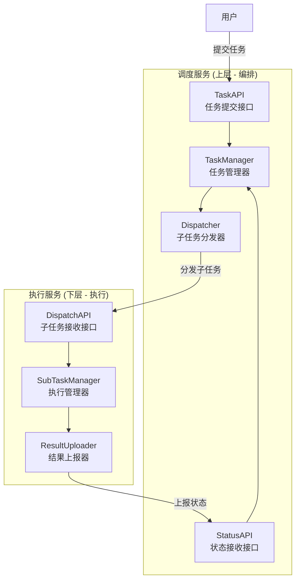
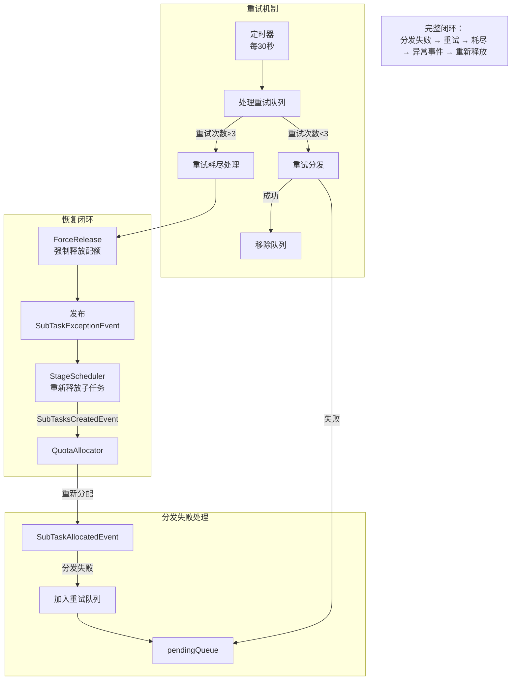
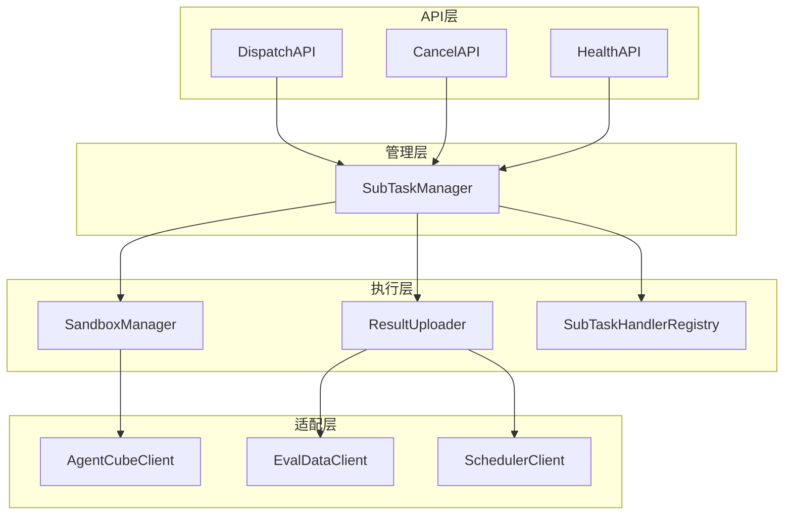
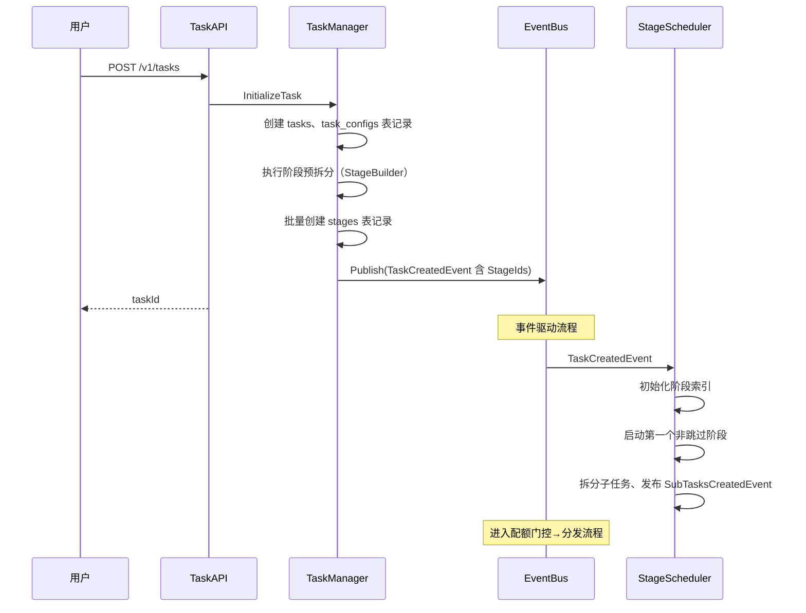
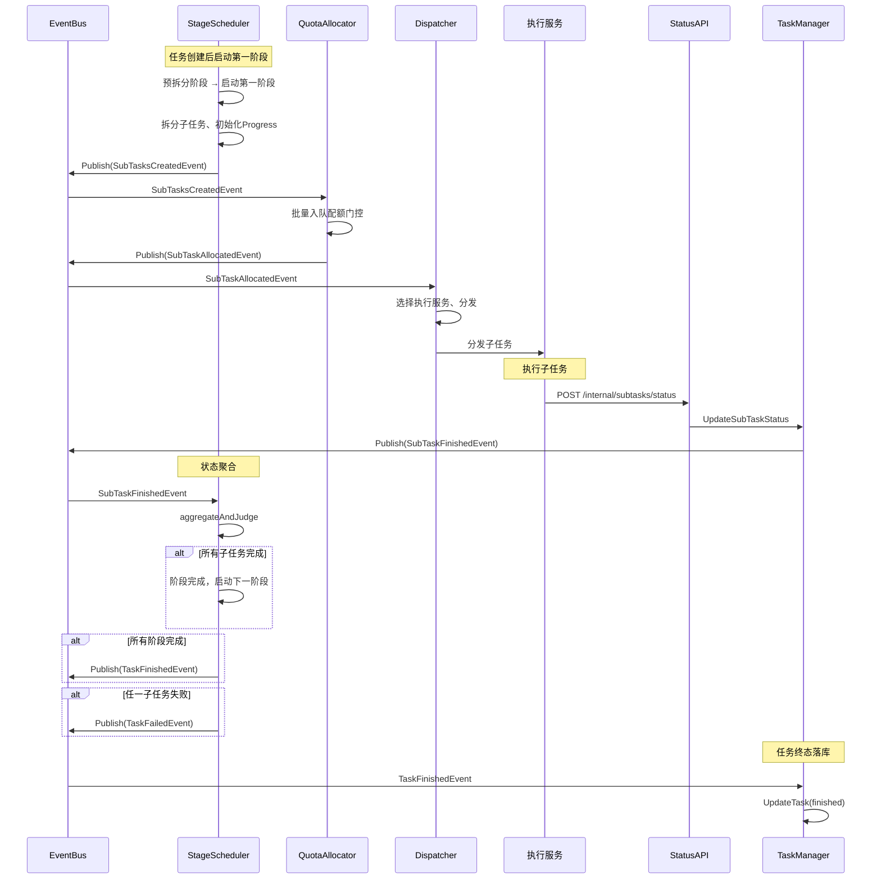
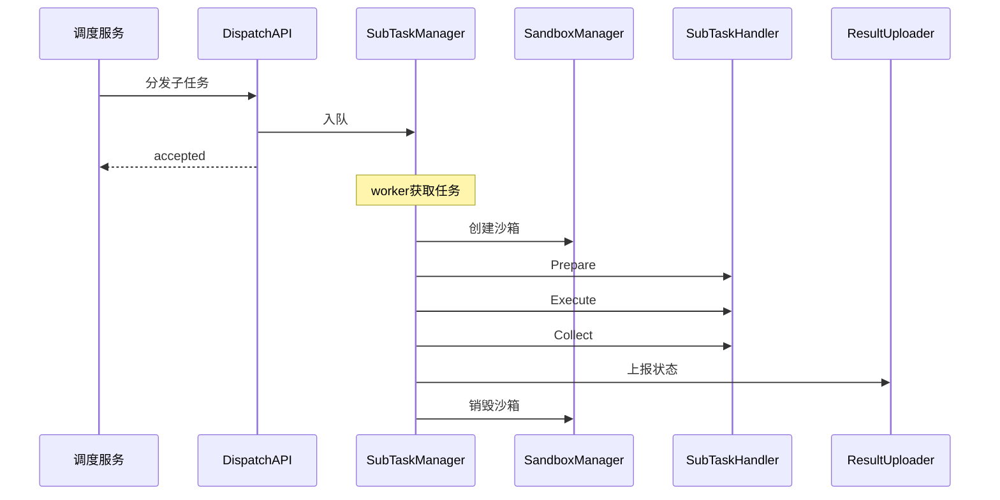
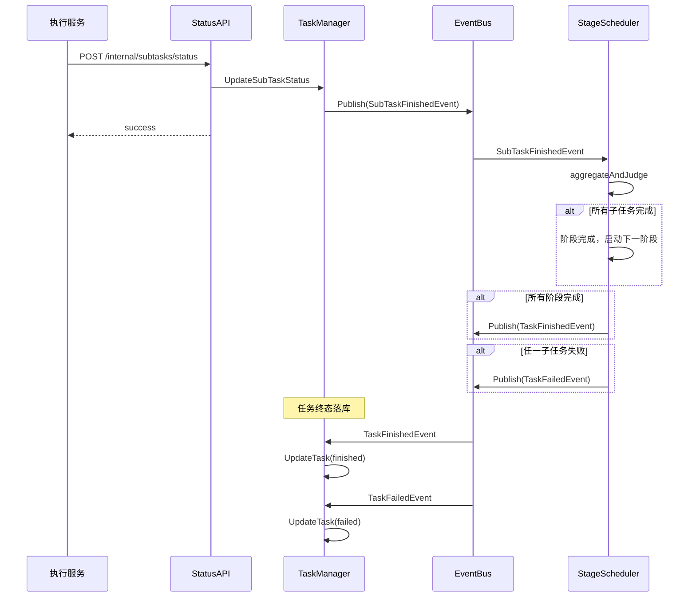
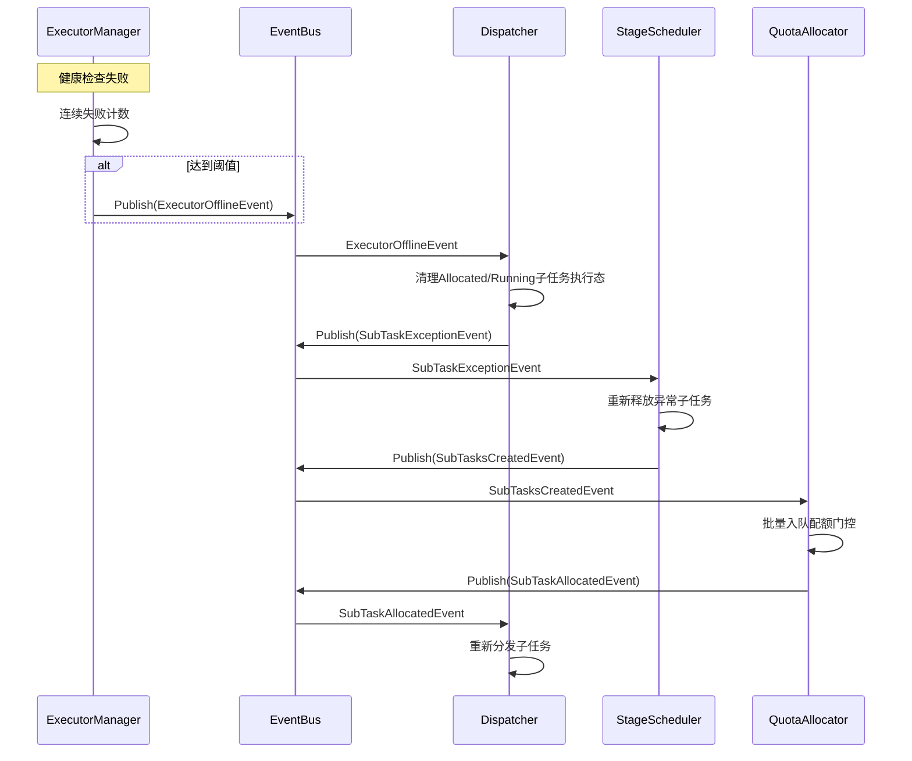

# 模块设计文档

## 一、概述

### 1.1 文档定位

本文档是架构设计文档与详细设计文档之间的桥梁层，定义调度服务和执行服务的模块划分与协作关系。

**文档层次关系**：

| 文档         | 内容                                   | 适用场景           |
| ------------ | -------------------------------------- | ------------------ |
| 架构设计文档 | 系统架构、核心概念、服务组成           | 理解系统整体设计   |
| 模块设计文档 | 模块划分、职责边界、接口契约、协作流程 | 理解模块间如何协作 |
| 详细设计文档 | 单模块内部结构、处理逻辑、扩展方式     | 实现具体模块       |

### 1.2 服务关系

调度服务位于上层负责编排调度，执行服务位于下层负责具体执行：



**核心交互链路**：

| 阶段       | 方向      | 接口                     | 说明                 |
| ---------- | --------- | ------------------------ | -------------------- |
| 任务提交   | 用户→调度 | TaskAPI                  | 用户提交评测任务     |
| 子任务分发 | 调度→执行 | Dispatcher→DispatchAPI   | 分发子任务至执行服务 |
| 状态上报   | 执行→调度 | ResultUploader→StatusAPI | 上报子任务执行状态   |

> 内部模块依赖详见 [2.3 模块依赖关系图](#23-模块依赖关系图) 和 [3.3 模块依赖关系图](#33-模块依赖关系图)

---

## 二、调度服务模块概览

### 2.1 模块架构图

```
调度服务
│
├── 接入层                         // 接收请求、参数校验、响应返回
│   ├── TaskAPI                    // 任务提交/查询/取消接口
│   ├── StatusAPI                  // 状态上报接口（执行服务调用）
│   └── HealthAPI                  // 健康检查接口
│
├── 业务层                         // 核心业务逻辑，依赖基础设施层
│   │                              // 同层模块通过EventBus异步通信，不直接依赖
│   │
│   ├── TaskManager                // 任务初始化、CRUD、终态落库
│   ├── StageScheduler             // 阶段运行时调度、状态聚合、阶段转换
│   ├── QuotaAllocator             // 配额门控（批量入队、单个分配）
│   ├── Dispatcher                 // 分发决策、执行态清理
│   └── ExecutorManager            // 执行服务注册、健康检查、负载选择
│       ├── ExecutorRegistry       // 执行服务注册表（内部组件）
│       └── HealthChecker          // 健康检查器（内部组件）
│
├── 基础设施层                     // 最底层，为业务层提供基础能力
│   ├── EventBus                   // 事件发布/订阅/分发
│   └── Storage                    // 数据持久化
│       ├── TaskStore              // Task记录存储
│       ├── TaskConfigStore        // TaskConfig记录存储
│       ├── StageStore             // Stage记录存储
│       ├── SubTaskStore           // SubTask记录存储
│       └── MasterStateStore       // 主从状态存储
│
└── 系统层                         // 横向覆盖，控制业务层模块启停
    └── MasterSlave                // Master选举、心跳维持、故障切换
```

**层次职责说明**：

| 层次         | 职责                                               | 模块数 | 依赖关系 |
| ------------ | -------------------------------------------------- | ------ | -------- |
| 接入层       | 接收请求、参数校验、响应返回                       | 3      | 调用业务层 |
| 业务层       | 核心业务逻辑处理（任务/阶段生命周期、配额、分发）  | 5      | 依赖基础设施层 |
| 基础设施层   | 事件传递、数据持久化                               | 6      | 无（最底层） |
| 系统层       | 系统级控制（高可用、故障切换）                     | 1      | 控制业务层启停 |

**层次简化理由**：

| 简化项 | 原架构 | 新架构 | 理由 |
| ------ | ------ | ------ | ---- |
| 管理层+阶段管理层 | 2层独立 | 合并为业务层 | TaskManager和StageScheduler都是核心业务逻辑，职责相近 |
| 调度层+执行器管理层 | 2层独立 | 合并为业务层 | QuotaAllocator、Dispatcher、ExecutorManager协作紧密，不应分两层 |
| 事件总线层+存储层 | 2层独立 | 合并为基础设施层 | EventBus和Storage都是底层能力，应为最底层 |
| 高可用层 | 平行于业务层 | 升为系统层 | MasterSlave横向覆盖业务层，而非平行关系 |

> **设计原则**：
> - 上层依赖下层，不反向依赖
> - 同层模块通过EventBus异步通信，不直接依赖
> - 基础设施层为最底层，所有业务层模块依赖它

### 2.2 模块职责表

| 模块              | 职责                                                         | 不负责                 | 依赖模块                             |
| ----------------- | ------------------------------------------------------------ | ---------------------- | ------------------------------------ |
| TaskAPI           | 接收任务请求、参数校验、响应返回                             | 任务创建逻辑           | TaskManager                          |
| StatusAPI         | 接收状态上报、响应返回                                       | 状态更新逻辑           | TaskManager                          |
| HealthAPI         | 健康检查响应                                                 | 无                     | 无                                   |
| TaskManager       | 任务初始化（含阶段预拆分）、CRUD、状态更新、发布TaskCreatedEvent（含StageIds）、SubTaskFinishedEvent | 子任务拆分、运行时调度 | EventBus, TaskStore, TaskConfigStore, StageStore, SubTaskStore |
| StageScheduler    | 阶段启动、子任务拆分与释放、状态聚合、阶段转换、任务终态判定、发布SubTasksCreatedEvent/TaskFinishedEvent/TaskFailedEvent | 阶段预拆分、配额分配、分发执行 | EventBus, TaskStore, TaskConfigStore, StageStore, SubTaskStore |
| QuotaAllocator    | 批量入队配额门控、单个发布SubTaskAllocatedEvent                            | 分发执行               | EventBus, QuotaManager, SubTaskStore               |
| Dispatcher        | 分发决策：接收配额分配事件 → 调用ExecutorManager.SelectExecutor() → 发送分发请求；执行态清理（失联/取消） | 执行服务注册、健康检查、负载计算 | EventBus, ExecutorManager（服务调用） |
| ExecutorManager   | 执行服务状态管理：注册表维护、健康检查、负载计算、提供SelectExecutor()接口 | 分发决策、分发请求发送、执行态清理 | EventBus |

> **Dispatcher与ExecutorManager边界说明**：
>
> | 边界项 | Dispatcher | ExecutorManager |
> | ------ | ---------- | --------------- |
> | **核心职责** | 分发决策：决定"分发给谁" | 执行服务状态管理：维护"可用的执行服务列表" |
> | **不负责** | 执行服务注册、健康检查、负载计算 | 分发决策、分发请求发送、执行态清理 |
> | **提供接口** | 无（被动接收事件） | `SelectExecutor()`：返回负载最低的执行服务 |
> | **调用方式** | 直接调用ExecutorManager.SelectExecutor() | 无（被动提供选择接口） |
> | **事件发布** | SubTaskExceptionEvent（执行态清理后） | ExecutorOfflineEvent（健康检查失联后） |
> | **事件订阅** | SubTaskAllocatedEvent、ExecutorOfflineEvent、TaskCancelEvent | 无 |
>
> **协作方式**：
> - Dispatcher → ExecutorManager：**直接调用**（同步服务调用）
> - ExecutorManager → Dispatcher：**EventBus间接通知**（异步事件通知，避免双向依赖）
>
> ```mermaid
> flowchart LR
>     subgraph 业务层
>         DP[Dispatcher]
>         EM[ExecutorManager]
>     end
>     
>     subgraph 基础设施层
>         EB[EventBus]
>     end
>     
>     DP -->|"SelectExecutor()<br/>直接调用"| EM
>     EM -->|"Publish<br/>ExecutorOfflineEvent"| EB
>     EB -->|"Receive<br/>Dispatcher订阅"| DP
> ```
| EventBus          | 事件发布/订阅/分发                                           | 业务逻辑               | 无                                   |
| Storage           | 数据CRUD                                                     | 业务逻辑               | 无                                   |
| MasterSlave       | Master选举、心跳维持、故障切换                               | 任务调度               | StageScheduler, MasterStateStore     |

### 2.3 模块依赖关系图

```mermaid
flowchart TB
    subgraph Layer4["系统层（横向覆盖）"]
        MS[MasterSlave]
        MSS[MasterStateStore]
    end
    
    subgraph Layer1["接入层"]
        TaskAPI
        StatusAPI
        HealthAPI
    end
    
    subgraph Layer2["业务层"]
        TM[TaskManager]
        SS[StageScheduler]
        QA[QuotaAllocator]
        DP[Dispatcher]
        EM[ExecutorManager]
    end
    
    subgraph Layer3["基础设施层"]
        EB[EventBus]
        subgraph Storage["Storage"]
            TaskStore
            TaskConfigStore
            StageStore
            SubTaskStore
        end
    end
    
    %% 接入层 → 业务层
    TaskAPI --> TM
    StatusAPI --> TM
    HealthAPI --> -.->|"无依赖"| Layer2
    
    %% 业务层 → 基础设施层
    TM --> EB
    TM --> TaskStore
    TM --> TaskConfigStore
    TM --> SubTaskStore
    
    SS --> EB
    SS --> TaskStore
    SS --> TaskConfigStore
    SS --> StageStore
    SS --> SubTaskStore
    
    QA --> EB
    QA --> SubTaskStore
    
    DP --> EB
    DP -->|"服务调用"| EM
    
    EM --> EB
    
    %% 系统层 → 业务层（控制启停）
    MS -->|"控制启停"| SS
    MS --> MSS
```

**依赖规则**：

| 规则 | 说明 |
| ------ | ---- |
| **接入层 → 业务层** | API调用业务模块方法，同步返回 |
| **业务层 → 基础设施层** | 业务模块依赖EventBus发布/订阅事件，依赖Storage读写数据 |
| **业务层内部** | 同层模块通过EventBus异步通信，**不直接依赖**（Dispatcher→ExecutorManager除外，为服务调用而非模块依赖） |
| **系统层 → 业务层** | MasterSlave控制StageScheduler启停，横向覆盖 |

> **Dispatcher与ExecutorManager协作说明**：
> - Dispatcher调用ExecutorManager.SelectExecutor()是**服务调用**（同步接口调用）
> - ExecutorManager通过EventBus发布ExecutorOfflineEvent，Dispatcher订阅接收是**事件通知**（异步）
> - 两者的协作方式避免了双向模块依赖

### 2.4 跨模块接口契约

**Storage接口定义**：

```go
// TaskStore 任务存储接口
type TaskStore interface {
    CreateTask(ctx context.Context, task *Task) error
    GetTask(ctx context.Context, taskId string) (*Task, error)
    UpdateTask(ctx context.Context, task *Task) error
    UpdateTaskStatus(ctx context.Context, taskId string, status int, message string) error
    DeleteTask(ctx context.Context, taskId string) error
    ListTasks(ctx context.Context, appId string, status []int, offset, limit int) ([]*Task, int, error)
}

// StageStore 阶段存储接口
type StageStore interface {
    CreateStage(ctx context.Context, stage *Stage) error
    CreateStages(ctx context.Context, stages []*Stage) error
    GetStage(ctx context.Context, taskId string, stageId int) (*Stage, error)
    UpdateStage(ctx context.Context, stage *Stage) error
    ListByTask(ctx context.Context, taskId string) ([]*Stage, error)
}

// SubTaskStore 子任务存储接口
type SubTaskStore interface {
    CreateSubTask(ctx context.Context, subTask *SubTask) error
    CreateSubTasks(ctx context.Context, subTasks []*SubTask) error
    GetSubTask(ctx context.Context, subTaskId string) (*SubTask, error)
    UpdateSubTask(ctx context.Context, subTask *SubTask) error
    GetSubTasksByStage(ctx context.Context, taskId string, stageId int) ([]*SubTask, error)
    GetSubTasksByTask(ctx context.Context, taskId string) ([]*SubTask, error)
}
```

> 数据结构定义详见 [数据模型设计文档](数据模型设计文档.md)

### 2.5 EventBus集成表

| 模块              | 发布事件                                                                                     | 订阅事件                                                          |
| ----------------- | -------------------------------------------------------------------------------------------- | ----------------------------------------------------------------- |
| TaskManager       | TaskCreatedEvent（含StageIds）, SubTaskFinishedEvent, TaskCancelEvent | TaskFinishedEvent, TaskFailedEvent                                |
| StageScheduler    | SubTasksCreatedEvent, TaskFinishedEvent, TaskFailedEvent | TaskCreatedEvent, SubTaskFinishedEvent, TaskCancelEvent, SubTaskExceptionEvent |
| QuotaAllocator    | SubTaskAllocatedEvent                                                                              | SubTasksCreatedEvent, SubTaskFinishedEvent                             |
| Dispatcher        | SubTaskExceptionEvent                                                                        | SubTaskAllocatedEvent, ExecutorOfflineEvent, TaskCancelEvent            |
| ExecutorManager   | ExecutorOfflineEvent                                                                         | 无（定时健康检查）                                                  |
| 执行服务           | 无（通过HTTP上报）                                                                            | 无（主动上报）                                                      |

> **说明**：
> - TaskCreatedEvent 由 TaskManager 在任务提交成功后发布，包含 TaskId + StageIds（阶段已预拆分）
> - SubTaskFinishedEvent 由 TaskManager 在子任务状态落库后发布（执行服务通过 HTTP 调用 StatusAPI，TaskManager 更新数据库后发布）
> - SubTaskExceptionEvent 由 Dispatcher 在两种场景下发布：
>   1. 执行服务失联后清理子任务执行态
>   2. 分发失败重试次数耗尽后强制释放配额
> - TaskFinishedEvent / TaskFailedEvent 由 StageScheduler 发布，TaskManager 消费
> - ExecutorManager 通过定时健康检查主动发现失联，不订阅事件
> - StageScheduler 订阅 TaskCancelEvent 用于清理内存中的 Progress 缓存和 TaskStageInfo 缓存
> - Dispatcher 内部维护重试队列，分发失败后无需外部事件触发重试

### 2.6 分发失败恢复机制

当 Dispatcher 分发子任务失败时，采用内部重试机制确保闭环：



| 场景 | 处理方式 | 恢复机制 |
|------|----------|---------|
| 无可用执行服务 | 加入重试队列，等待定时重试 | 定时器每 30s 检查 |
| HTTP 分发失败 | 加入重试队列，等待定时重试 | 定时器每 30s 检查 |
| 重试次数耗尽 | 强制释放配额 + 发布 SubTaskExceptionEvent | StageScheduler 重新释放子任务 |
| 执行服务失联 | 清理子任务执行态 + 发布 SubTaskExceptionEvent | StageScheduler 重新释放子任务 |

---

## 三、执行服务模块概览

### 3.1 模块架构图

```
执行服务
├── API层                        // 接口接入
│   ├── DispatchAPI              // 子任务接收接口
│   ├── CancelAPI                // 子任务取消接口
│   └── HealthAPI                // 健康检查接口
│
├── 管理层                       // 子任务生命周期
│   └── SubTaskManager           // 子任务入队、执行调度、取消处理
│       ├── SubTaskQueue         // 本地执行队列（内部）
│       └── ActiveTaskTracker    // 活跃任务追踪（内部）
│
├── 执行层                       // 核心执行逻辑
│   ├── SandboxManager           // 沙箱创建、销毁、TTL计算
│   ├── ExecutionTracker         // 命令执行追踪（内部）
│   ├── ResourceHandler          // 资源上传/下载（内部）
│   └── ResultUploader           // 结果收集、状态上报
│
└── 适配层                       // 外部服务客户端
    ├── AgentCubeClient          // AgentCube SDK封装
    ├── EvalDataClient           // 数据管理服务API客户端
    ├── SchedulerClient          // 调度服务API客户端
    └── StorageClient            // 存储服务客户端
```

**层次职责说明**：

| 层次   | 职责                                     | 模块数 |
| ------ | ---------------------------------------- | ------ |
| API层  | 接收分发/取消请求、响应返回              | 3      |
| 管理层 | 子任务入队、执行调度、取消处理、并发控制 | 1      |
| 执行层 | 沙箱管理、命令执行、资源处理、结果上报   | 4      |
| 适配层 | 外部服务API封装                          | 4      |

### 3.2 模块职责表

| 模块                   | 职责                                     | 不负责             | 依赖模块                                               |
| ---------------------- | ---------------------------------------- | ------------------ | ------------------------------------------------------ |
| DispatchAPI            | 接收分发请求、参数校验、响应返回         | 子任务执行逻辑     | SubTaskManager                                         |
| CancelAPI              | 接收取消请求、调用取消逻辑               | 沙箱销毁细节       | SubTaskManager                                         |
| HealthAPI              | 健康状态计算、响应返回                   | 资源分配           | SubTaskManager                                         |
| SubTaskManager         | 子任务入队、执行调度、取消处理、并发控制 | 沙箱创建细节       | SubTaskHandlerRegistry, SandboxManager, ResultUploader |
| SandboxManager         | 沙箱创建、销毁、TTL计算                  | 命令执行、资源上传 | AgentCubeClient                                        |
| ResultUploader         | 结果收集、状态上报                       | 沙箱操作           | SchedulerClient                                        |
| SubTaskHandlerRegistry | Handler注册与查询                        | 业务逻辑实现       | 无                                                     |
| AgentCubeClient        | AgentCube SDK封装                        | 无                 | 无                                                     |
| EvalDataClient         | 数据管理服务API封装                      | 无                 | 无                                                     |
| SchedulerClient        | 调度服务API封装                          | 无                 | 无                                                     |

### 3.3 模块依赖关系图



### 3.4 跨模块接口契约

**SubTaskHandler接口定义**：

```go
// SubTaskHandler 子任务处理器接口
type SubTaskHandler interface {
    Prepare(ctx context.Context, sandbox *SandboxInstance, subTask *SubTask) error
    Execute(ctx context.Context, sandbox *SandboxInstance, subTask *SubTask) (*ExecutionResult, error)
    Collect(ctx context.Context, sandbox *SandboxInstance, subTask *SubTask) (*SubTaskResult, error)
    GetTimeout() time.Duration
}
```

**内置Handler注册表**：

| 任务类型   | 阶段类型  | Handler                   | 说明          |
| ---------- | --------- | ------------------------- | ------------- |
| agent_eval | synthesis | AgentEvalSynthesisHandler | 评测集合成    |
| agent_eval | inference | AgentEvalInferenceHandler | Agent推理执行 |
| agent_eval | eval      | AgentEvalEvalHandler      | 评测执行      |
| agent_eval | report    | AgentEvalReportHandler    | 报告生成      |

> Handler实现细节详见 [子任务处理器设计](details/executor/子任务处理器设计.md)

### 3.5 与调度服务的交互

| 场景       | 执行服务调用                 | 调度服务响应            |
| ---------- | ---------------------------- | ----------------------- |
| 接收子任务 | 被DispatchAPI调用            | 调度服务主动分发        |
| 上报状态   | SchedulerClient.ReportStatus | StatusAPI接收           |
| 健康检查   | 被HealthAPI调用              | ExecutorManager定时调用 |

---

## 四、核心流程概览

### 4.1 任务初始化流程



**流程说明**：

| 步骤       | 触发事件                | 核心动作                                         |
| ---------- | ----------------------- | ------------------------------------------------ |
| 任务初始化 | -                       | TaskManager创建tasks、task_configs表记录         |
| 阶段预拆分 | -                       | TaskManager执行阶段拆分，批量创建stages表记录     |
| 阶段启动   | TaskCreatedEvent        | StageScheduler初始化索引、启动第一个阶段          |
| 子任务释放 | 内部调用                | StageScheduler发布SubTasksCreatedEvent                |

### 4.2 阶段执行流程



**流程说明**：

| 步骤     | 触发事件              | 核心动作                             |
| -------- | --------------------- | ------------------------------------ |
| 阶段启动 | TaskCreatedEvent      | StageScheduler初始化索引、启动第一阶段 |
| 子任务释放 | 内部调用            | StageScheduler发布SubTasksCreatedEvent    |
| 配额门控 | SubTasksCreatedEvent       | QuotaAllocator批量入队、单个分配       |
| 分发执行 | SubTaskAllocatedEvent | Dispatcher选择执行服务、分发 |
| 子任务执行 | -                   | 执行服务在沙箱中执行评测工具         |
| 状态上报 | HTTP调用              | 执行服务上报→TaskManager发布SubTaskFinishedEvent |
| 状态聚合 | SubTaskFinishedEvent  | StageScheduler聚合阶段状态           |
| 阶段转换 | 内部判定              | StageScheduler判定阶段完成，内部启动下一阶段 |
| 任务终态 | 内部判定              | StageScheduler判定任务完成或失败，发布TaskFinishedEvent/TaskFailedEvent |

> **说明**：执行服务通过 HTTP 调用调度服务的 StatusAPI 上报状态，TaskManager 更新数据库后发布 SubTaskFinishedEvent 到 EventBus（执行服务无法直接访问调度服务内部的 EventBus）。

### 4.3 子任务执行流程



**流程说明**：

| 步骤     | 模块           | 核心动作                  |
| -------- | -------------- | ------------------------- |
| 接收入队 | SubTaskManager | 接收后立即返回，异步执行  |
| 沙箱创建 | SandboxManager | 调用AgentCube创建隔离环境 |
| 资源准备 | SubTaskHandler | 上传skills、配置文件等    |
| 命令执行 | SubTaskHandler | 执行评测工具命令          |
| 结果收集 | SubTaskHandler | 读取输出文件              |
| 状态上报 | ResultUploader | 调用调度服务StatusAPI     |

### 4.4 状态上报与聚合流程



**流程说明**：

| 步骤     | 触发事件             | 核心动作                                |
| -------- | -------------------- | --------------------------------------- |
| 状态更新 | HTTP调用             | TaskManager更新子任务状态、发布SubTaskFinishedEvent |
| 状态聚合 | SubTaskFinishedEvent | StageScheduler统计完成数/失败数         |
| 阶段转换 | 内部判定             | StageScheduler判定阶段完成，内部启动下一阶段 |
| 任务完成 | 内部判定             | StageScheduler判定所有阶段完成，发布TaskFinishedEvent |
| 任务终态 | TaskFinishedEvent    | TaskManager更新任务终态                 |

### 4.5 执行服务失联处理流程



**流程说明**：

| 步骤       | 触发事件             | 核心动作                                |
| ---------- | -------------------- | --------------------------------------- |
| 失联检测   | 健康检查连续失败     | ExecutorManager标记offline并发布ExecutorOfflineEvent |
| 执行态清理 | ExecutorOfflineEvent | Dispatcher清理已分发子任务的执行态，并发布SubTaskExceptionEvent |
| 子任务重释放 | SubTaskExceptionEvent | StageScheduler重新释放异常子任务，发布SubTasksCreatedEvent |
| 恢复调度   | SubTasksCreatedEvent      | 子任务重新进入配额门控与分发链路 |

> **恢复路径说明**：
> - 执行服务失联优先映射为子任务 `exception`，不直接改变任务终态
> - Dispatcher 只负责执行态清理与异常事件发布，不负责重试决策
> - StageScheduler 在收到 `SubTaskExceptionEvent` 后重新释放异常子任务，重新发布 `SubTasksCreatedEvent`

---

## 五、任务拆分与阶段转换

### 5.1 增量式拆分架构

应用评测任务采用增量式拆分方案：

| 拆分时机   | 拆分对象             | 拆分模块                   |
| ---------- | -------------------- | -------------------------- |
| 任务提交时 | 任务+阶段（tasks/task_configs/stages表） | TaskManager.InitializeTask |
| 阶段启动时 | 子任务（subtasks表） | StageScheduler.startStage  |

**核心设计**：

- **任务+阶段记录创建**：任务提交时 TaskManager 同步创建 tasks、task_configs、stages 表记录
- **阶段预拆分同步化**：拆分失败时任务不入库，用户直接收到错误响应
- **阶段顺序执行**：阶段按 stage_id（从1开始的int）顺序依次执行
- **子任务增量拆分**：阶段启动时由 StageScheduler 拆分子任务，写入 subtasks 表
- **数据引用查询获取**：构建子任务时查询任务配置和前序阶段结果，不存储冗余引用

### 5.2 评测场景定义

| 场景      | 配置                    | 目标                      | 拆分因子      |
| --------- | ----------------------- | ------------------------- | ------------- |
| **场景A** | N模型 + 1Agent + 1Skill | 找最佳模型                | N = 模型数量  |
| **场景B** | 1模型 + NAgent + 1Skill | 找最佳Agent               | N = Agent数量 |
| **场景C** | 1模型 + 1Agent + NSkill | 找最佳Skill（含版本迭代） | N = Skill数量 |

### 5.3 子任务数量计算

**子任务数量 = M × N**

其中：
- **M** = 评测集数量（synthesis阶段生成或用户提供）
- **N** = 变化维度数量（根据场景类型确定）

**示例**：
- 场景A，M=100，N=3（模型） → 300个子任务
- 场景B，M=50，N=2（Agent） → 100个子任务
- 场景C，M=80，N=4（Skill） → 320个子任务

### 5.4 阶段定义

| 阶段          | 作用          | 输入                             | 输出                 | 子任务数量 |
| ------------- | ------------- | -------------------------------- | -------------------- | ---------- |
| **synthesis** | 合成评测集    | 场景描述、Skills                 | evalset.jsonl        | 1          |
| **inference** | Agent推理执行 | evalset.jsonl                    | transcript.jsonl     | M × N      |
| **eval**      | 评测执行      | transcript.jsonl + evalset.jsonl | record.json          | M × N      |
| **report**    | 报告生成      | record.json列表                  | conclusion.json/html | 1          |

### 5.5 阶段依赖关系

```
synthesis (1个子任务)
    ↓ 完成后触发
inference (M×N个子任务)
    ↓ 完成后触发
eval (M×N个子任务)
    ↓ 完成后触发
report (1个子任务)
    ↓ 完成后触发
任务完成
```

### 5.6 跳过synthesis场景

当用户已提供评测集（EvalsetID非空）时：
- **跳过synthesis阶段**：stages表中标记 `status = Skipped`
- **直接进入inference阶段**：从数据管理服务读取评测集，获取M值
- 正常执行后续流程

### 5.7 模型评测兼容

模型评测与应用评测共用一套组件。

**差异点**：

| 维度       | 应用评测                              | 模型评测                  |
| ---------- | ------------------------------------- | ------------------------- |
| workflow   | synthesis → inference → eval → report | inference → eval → report |
| 执行环境   | 远程沙箱（AgentCube）                 | 本地执行服务              |
| 变体维度   | model/agent/skill                     | agent                     |
| 子任务数量 | M×N（N=变体数量）                     | M                         |

---

## 六、相关文档

### 设计文档

| 文档                                    | 内容                         | 与本文档关系           |
| --------------------------------------- | ---------------------------- | ---------------------- |
| [架构设计文档](架构设计文档.md)         | 系统架构、核心概念、服务组成 | 上层文档，定义整体架构 |
| [数据模型设计文档](数据模型设计文档.md) | 数据结构、字段、索引定义     | 补充数据结构定义       |
| [API接口设计文档](API接口设计文档.md)   | HTTP API定义                 | 补充接口细节           |

### 详细设计文档

**调度服务**：

| 文档                                                          | 内容                       | 与本文档关系                         |
| ------------------------------------------------------------- | -------------------------- | ------------------------------------ |
| [任务管理器设计](details/scheduler/任务管理器设计.md)         | TaskManager内部实现        | 下层文档，补充任务初始化细节         |
| [阶段调度器设计](details/scheduler/阶段调度器设计.md)         | StageScheduler内部实现     | 下层文档，补充阶段启动、子任务拆分、状态聚合与阶段转换细节 |
| [配额分配器设计](details/scheduler/配额分配器设计.md)         | QuotaAllocator内部实现     | 下层文档，补充批量配额门控细节       |
| [子任务分发器设计](details/scheduler/子任务分发器设计.md)     | Dispatcher内部实现         | 下层文档，补充批量分发策略细节       |
| [执行服务管理器设计](details/scheduler/执行服务管理器设计.md) | ExecutorManager内部实现    | 下层文档，补充执行服务管理细节       |
| [事件总线设计](details/scheduler/事件总线设计.md)             | EventBus实现、事件结构定义 | 下层文档，补充事件类型细节           |
| [主从模式设计](details/scheduler/主从模式设计.md)             | MasterSlave内部实现        | 下层文档，补充主从选举与故障切换细节 |

**执行服务**：

| 文档                                                     | 内容                   | 与本文档关系                       |
| -------------------------------------------------------- | ---------------------- | ---------------------------------- |
| [子任务管理器设计](details/executor/子任务管理器设计.md) | SubTaskManager内部实现 | 下层文档，补充子任务执行调度细节   |
| [沙箱管理器设计](details/executor/沙箱管理器设计.md)     | SandboxManager内部实现 | 下层文档，补充沙箱生命周期管理细节 |
| [结果上报器设计](details/executor/结果上报器设计.md)     | ResultUploader内部实现 | 下层文档，补充结果上报逻辑细节     |
| [子任务处理器设计](details/executor/子任务处理器设计.md) | SubTaskHandler实现     | 下层文档，补充Handler细节          |

### 依赖文档

| 文档                                                            | 内容                   |
| --------------------------------------------------------------- | ---------------------- |
| [AgentCube使用说明](../dependencies/AgentCube使用说明.md)       | 沙箱SDK集成方式        |
| [数据管理服务接口文档](../dependencies/数据管理服务接口文档.md) | EvalDataClient使用说明 |
| [评测工具交互说明](../dependencies/评测工具交互说明.md)         | astron-eval集成方式    |