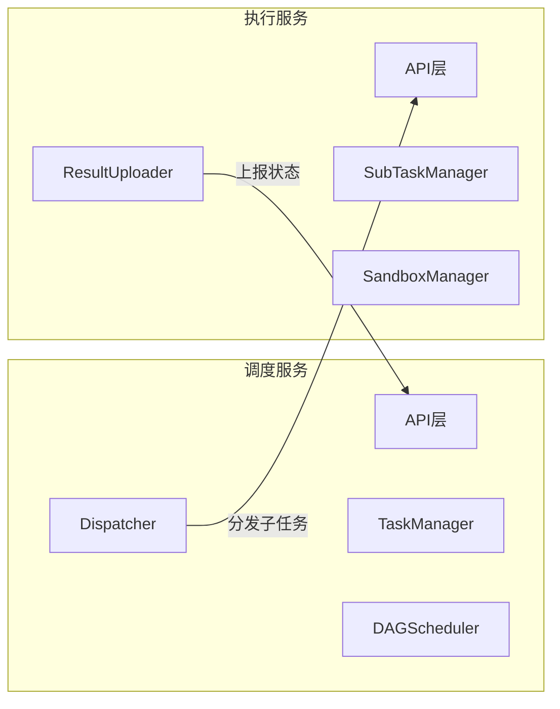
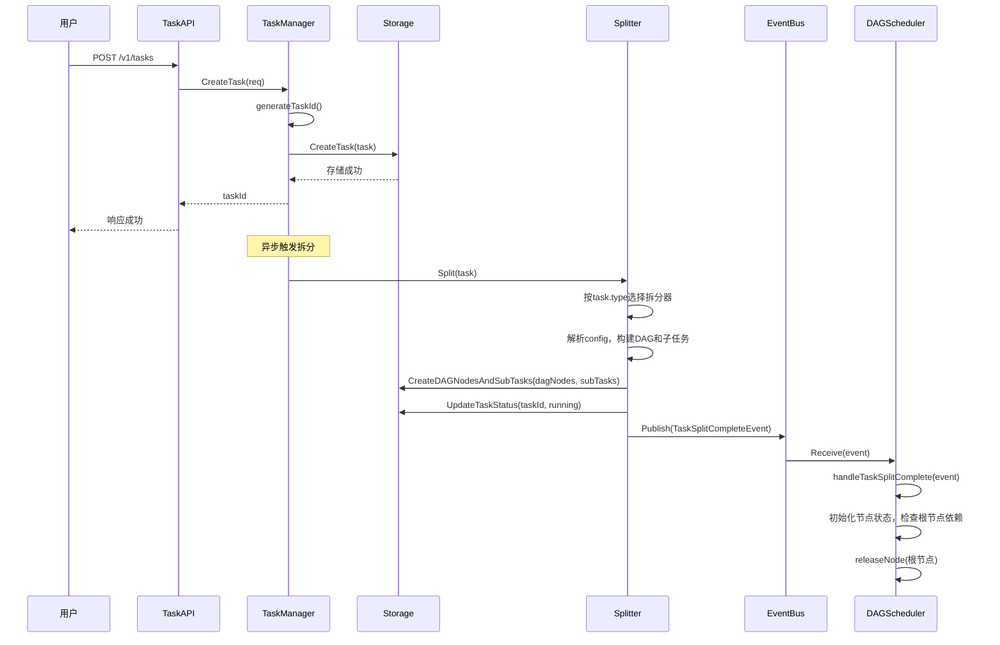
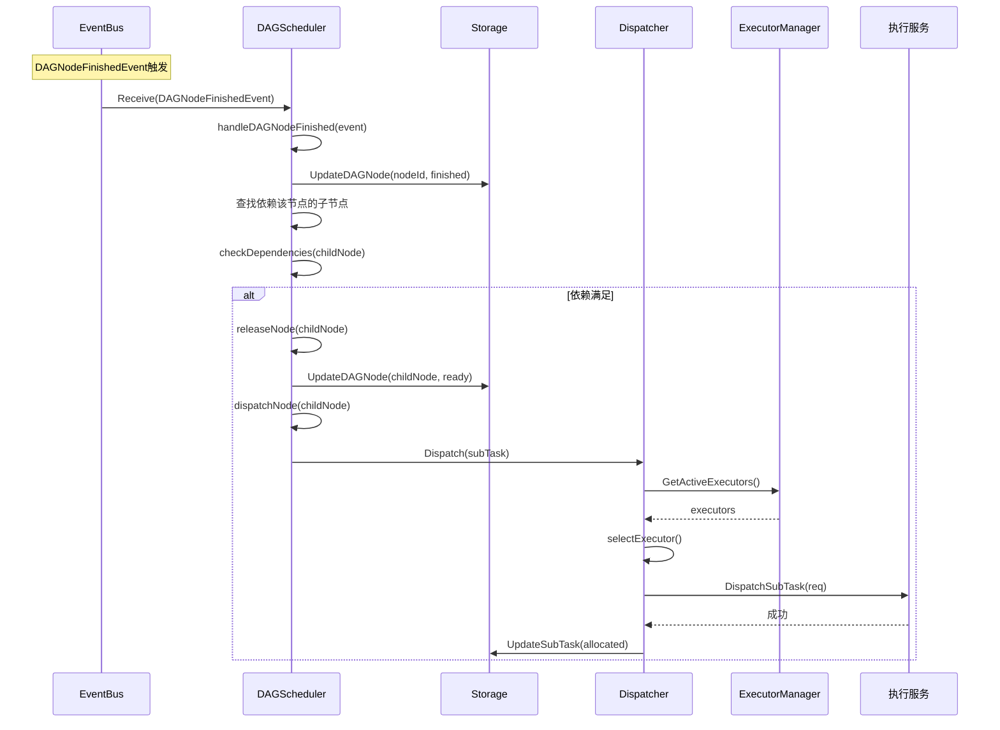
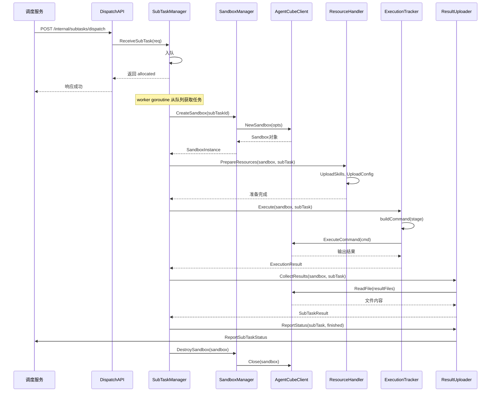
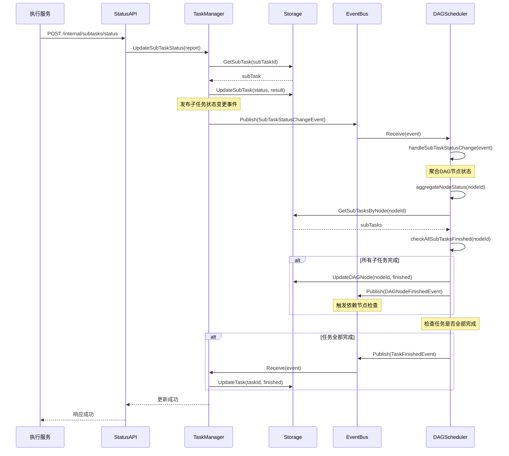
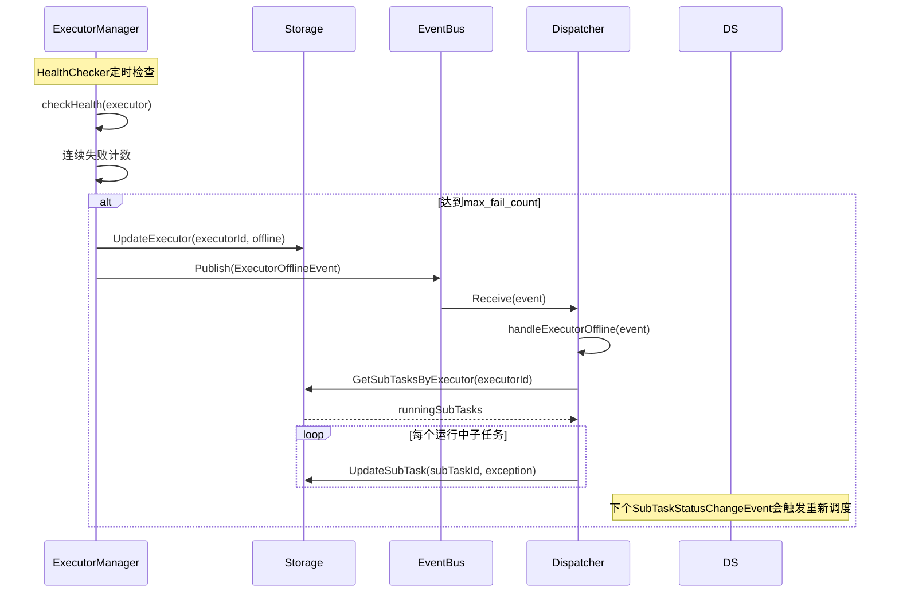

# 模块设计文档

## 一、概述

### 1.1 文档目的

本文档定义调度服务和执行服务的模块设计，包括：
- 模块架构划分
- 核心模块职责
- 方法签名定义
- 关键流程设计

### 1.2 服务关系



---

## 二、调度服务模块设计

### 2.1 模块架构

```
调度服务
├── API层                    // HTTP接口处理
│   ├── TaskAPI              // 任务提交/查询/取消接口
│   ├── StatusAPI            // 状态上报接口（执行服务调用）
│   └── HealthAPI            // 健康检查接口
│
├── 管理层                   // 任务生命周期管理
│   └── TaskManager          // 任务创建、查询、取消、状态更新
│
├── 调度层                   // 任务拆分与调度
│   ├── Splitter             // 任务拆分器（配置解析、DAG构建、子任务创建）
│   ├── DAGScheduler         // DAG调度器（依赖检查、节点释放、状态聚合）
│   └── Dispatcher           // 子任务分发器（执行服务选择、负载均衡）
│
├── 执行器管理层             // 执行服务管理
│   └── ExecutorManager      // 执行服务注册、健康检查、失联处理
│       ├── ExecutorRegistry // 执行服务注册表
│       └── HealthChecker    // 健康检查器
│
├── 事件总线层               // 事件驱动通信
│   └── EventBus             // 事件发布/订阅、事件分发
│
├── 存储层                   // 数据持久化
│   ├── TaskStorage          // Task记录存储
│   ├── SubTaskStorage       // SubTask记录存储
│   ├── DAGNodeStorage       // DAGNode记录存储
│   └── MasterStateStorage   // 主从状态存储
│
└── 高可用层                 // 主从模式管理
    └── MasterSlave          // Master选举、心跳维持、故障切换
```

### 2.1.1 EventBus设计

**设计原则**：
- 调度服务内部采用事件驱动架构，替代定时扫描数据库的轮询模式
- EventBus负责事件的发布、订阅和分发，各模块通过事件异步通信
- 参考模型评测服务(eval-server)的EventBus实现，复用核心机制，适配应用评测特有需求

**核心机制**：
- 事件存储：使用链表存储待分发事件，支持最大积压限制(maxBacklog)
- 事件分发：单goroutine循环分发，保证事件处理顺序
- 处理器模式：EventHandler接口，处理器注册事件类型，收到事件推入本地队列后单线程顺序处理

**事件类型定义**：

| 事件类型 | 常量值 | 说明 | 发布者 | 订阅者 |
|---------|-------|------|--------|--------|
| TaskSplitCompleteEvent | 1 | 任务拆分完成 | Splitter | DAGScheduler |
| DAGNodeFinishedEvent | 2 | DAG节点执行完成 | DAGScheduler | DAGScheduler |
| SubTaskStatusChangeEvent | 3 | 子任务状态变更 | TaskManager | DAGScheduler, Dispatcher |
| ExecutorOfflineEvent | 4 | 执行服务失联 | ExecutorManager | Dispatcher |
| TaskFinishedEvent | 5 | 任务完成 | DAGScheduler | TaskManager |
| TaskFailedEvent | 6 | 任务失败 | DAGScheduler | TaskManager |
| TaskCancelEvent | 7 | 任务取消 | TaskAPI | TaskManager, DAGScheduler, Dispatcher |
| SubTaskCoordAddEvent | 8 | 子任务协调器新增 | TaskManager | DAGScheduler |
| SubTaskCoordDeleteEvent | 9 | 子任务协调器删除 | TaskManager | DAGScheduler |

**事件内容结构**：

```go
// 任务拆分完成事件
type TaskSplitCompleteEventContent struct {
    TaskId    string    // 任务标识
    DAGNodes  []string  // DAG节点ID列表
}

// DAG节点完成事件
type DAGNodeFinishedEventContent struct {
    TaskId   string  // 任务标识
    NodeId   string  // 节点标识
    Status   int     // 完成状态
    Result   *DAGNodeResult  // 执行结果
}

// 子任务状态变更事件
type SubTaskStatusChangeEventContent struct {
    TaskId    string  // 任务标识
    SubTaskId string  // 子任务标识
    NodeId    string  // 所属DAG节点
    Status    int     // 新状态
    Result    *SubTaskResult  // 执行结果
}

// 执行服务失联事件
type ExecutorOfflineEventContent struct {
    ExecutorId  string  // 执行服务标识
    Address     string  // 执行服务地址
}

// 任务完成/失败/取消事件
type TaskStatusEventContent struct {
    TaskId   string  // 任务标识
    ErrCode  int     // 错误码（失败时）
    Message  string  // 消息
}
```

**EventHandler接口**：

```go
type EventHandler interface {
    Receive(event *Event) error               // 接收事件（推入本地队列）
    RegisterEventBus(eventBus EventBus)       // 注册事件总线
    Start(ctx context.Context, wg *sync.WaitGroup)  // 启动处理循环
}

type EventBus interface {
    Publish(event *Event) error               // 发布事件
    RegisterHandler(eventType int, handler EventHandler) error  // 注册处理器
    Start(ctx context.Context, wg *sync.WaitGroup)  // 启动分发循环
}
```

**各模块与EventBus集成**：

| 模块 | 发布事件 | 订阅事件 | 说明 |
|------|---------|---------|------|
| Splitter | TaskSplitCompleteEvent | 无 | 拆分完成后通知DAGScheduler |
| DAGScheduler | DAGNodeFinishedEvent, TaskFinishedEvent, TaskFailedEvent | TaskSplitCompleteEvent, DAGNodeFinishedEvent, SubTaskStatusChangeEvent, SubTaskCoordAddEvent, SubTaskCoordDeleteEvent | 订阅拆分完成、节点完成、子任务状态变更、协调器增删 |
| Dispatcher | 无 | SubTaskStatusChangeEvent, ExecutorOfflineEvent, TaskCancelEvent | 订阅子任务状态变更（重置失联执行服务的子任务）、执行服务失联、任务取消 |
| TaskManager | SubTaskCoordAddEvent, SubTaskCoordDeleteEvent | TaskFinishedEvent, TaskFailedEvent, TaskCancelEvent | 订阅任务终态事件，发布协调器增删事件 |
| ExecutorManager | ExecutorOfflineEvent | 无 | 健康检查发现失联后发布事件 |
| TaskAPI | TaskCancelEvent | 无 | 接收取消请求后发布事件 |

**EventBus vs 定时扫描对比**：

| 场景 | 定时扫描 | EventBus | 优势 |
|------|---------|---------|------|
| 任务拆分完成通知 | DAGScheduler轮询数据库检查任务状态 | Splitter发布事件立即通知 | 响应更快，减少无效轮询 |
| DAG节点依赖检查 | monitorLoop定时扫描Blocked节点 | 父节点完成时发布事件触发子节点检查 | 精确触发，无轮询开销 |
| 子任务状态聚合 | TaskManager直接调用聚合逻辑 | 发布事件，DAGScheduler订阅处理 | 解耦TaskManager和DAGScheduler |
| 执行服务失联处理 | 失联后直接处理 | 发布事件，Dispatcher订阅处理 | 解耦检测和处理逻辑 |

**不使用EventBus的场景**：

| 场景 | 原因 | 处理方式 |
|------|------|---------|
| Master故障切换 | 心跳检测是主动探测，必须周期执行 | 保留定时心跳检查 |
| 执行服务健康检查 | 主动探测执行服务存活状态 | 保留定时HTTP调用 |

### 2.2 核心模块职责

| 模块 | 职责 | 不负责 | 依赖模块 |
|------|------|--------|----------|
| **TaskAPI** | 接收任务请求、参数校验、响应返回 | 任务创建逻辑 | TaskManager |
| **StatusAPI** | 接收状态上报、触发事件发布 | 状态更新细节 | TaskManager |
| **TaskManager** | 任务创建、查询、取消、发布协调器事件 | 任务拆分逻辑、DAG调度 | Splitter, EventBus, Storage |
| **Splitter** | 配置解析、DAG构建、子任务创建、发布拆分完成事件 | 子任务分发 | EventBus, Storage |
| **DAGScheduler** | 订阅事件、依赖检查、节点释放、状态聚合、发布节点/任务终态事件 | 执行服务选择 | EventBus, Dispatcher, Storage |
| **Dispatcher** | 订阅事件、执行服务选择、子任务分发、负载均衡、处理失联子任务 | 健康检查 | EventBus, ExecutorManager, Storage |
| **ExecutorManager** | 执行服务注册、健康检查、发布失联事件 | 子任务重置 | EventBus, Storage |
| **EventBus** | 事件发布、事件订阅、事件分发 | 业务逻辑 | 无 |
| **Storage** | 数据CRUD操作、事务支持 | 业务逻辑 | 无 |
| **MasterSlave** | Master选举、心跳维持、故障切换 | 任务调度 | DAGScheduler, Storage |

### 2.3 TaskManager

**职责**：任务生命周期管理，包括创建、查询、取消、状态更新。

**方法签名**：

```go
type TaskManager struct {
    storage     TaskStorage
    splitter    *Splitter
    dispatcher  *Dispatcher
    logger      *zap.Logger
}

func NewTaskManager(
    storage TaskStorage,
    splitter *Splitter,
    dispatcher *Dispatcher,
    logger *zap.Logger,
) *TaskManager
```

| 方法 | 说明 |
|------|------|
| CreateTask(ctx, req) (string, error) | 创建新任务，返回任务ID |
| GetTask(ctx, taskId, appId) (*Task, error) | 查询任务详情 |
| CancelTask(ctx, taskId, appId) error | 取消任务 |
| ListTasks(ctx, appId, status, offset, limit) ([]*Task, int, error) | 查询任务列表 |
| UpdateTaskStatus(ctx, taskId, status, message) error | 更新任务状态 |
| UpdateSubTaskStatus(ctx, report) error | 更新子任务状态 |

### 2.4 Splitter

**职责**：任务拆分，包括配置解析、DAG构建、子任务创建。

**方法签名**：

```go
type Splitter interface {
    Split(task *Task) ([]*DAGNode, []*SubTask, error)
}

// 按任务类型注册不同的拆分器
type SplitterRegistry struct {
    splitters map[string]Splitter  // type -> splitter
}
```

**拆分器实现**：

| 任务类型 | 拆分器 | 说明 |
|----------|--------|------|
| model_eval | ModelEvalSplitter | 模型评测拆分器 |
| agent_eval | AgentEvalSplitter | 应用评测拆分器 |

**DAG构建规则**：

| 节点类型 | 子任务类型 | 依赖 | 子任务数 |
|----------|------------|------|----------|
| synthesis | synthesis | 无 | 1 |
| case | inference + eval | synthesis | 按case数量 |
| report | report | 所有case | 1 |

### 2.5 DAGScheduler

**职责**：DAG调度，订阅事件、依赖检查、节点释放、状态聚合。

**方法签名**：

```go
type DAGScheduler struct {
    storage        DAGNodeStorage
    subTaskStorage SubTaskStorage
    dispatcher     *Dispatcher
    eventBus       EventBus
    events         *List[*Event]      // 本地事件队列
    nodeStates     *SyncMap[string, *DAGNodeState]  // 节点状态缓存
    logger         *zap.Logger
    stopCh         chan struct{}
}

func NewDAGScheduler(
    storage DAGNodeStorage,
    subTaskStorage SubTaskStorage,
    dispatcher *Dispatcher,
    eventBus EventBus,
    logger *zap.Logger,
) *DAGScheduler

func (s *DAGScheduler) Start()
func (s *DAGScheduler) Stop()
func (s *DAGScheduler) Receive(event *Event) error  // EventHandler接口
func (s *DAGScheduler) RegisterEventBus(eventBus EventBus)
```

| 方法 | 说明 |
|------|------|
| Receive(event) | 接收事件，推入本地队列 |
| handleEvent(event) | 处理事件（单线程顺序处理） |
| handleTaskSplitComplete(event) | 处理任务拆分完成事件，初始化节点状态 |
| handleDAGNodeFinished(event) | 处理节点完成事件，检查依赖节点是否可释放 |
| handleSubTaskStatusChange(event) | 处理子任务状态变更事件，聚合节点状态 |
| handleSubTaskCoordAdd(event) | 处理协调器新增事件，启动调度 |
| handleSubTaskCoordDelete(event) | 处理协调器删除事件，停止调度 |
| checkDependencies(nodeId) bool | 检查节点依赖是否满足 |
| releaseNode(nodeId) error | 释放节点（Blocked→Ready），触发分发 |
| dispatchNode(nodeId) error | 分发节点中的子任务 |
| aggregateNodeStatus(nodeId) (DAGNodeStatus, error) | 聚合节点状态 |
| publishNodeFinishedEvent(nodeId, status) | 发布节点完成事件 |
| publishTaskFinishedEvent(taskId) | 发布任务完成事件 |

**事件订阅**：

| 事件类型 | 处理逻辑 |
|---------|---------|
| TaskSplitCompleteEvent | 加载DAG节点，初始化节点状态缓存，检查并释放无依赖的根节点 |
| DAGNodeFinishedEvent | 更新节点状态为完成，检查依赖该节点的子节点是否可释放 |
| SubTaskStatusChangeEvent | 更新子任务状态，聚合所属节点状态，若节点完成则发布事件 |
| SubTaskCoordAddEvent | 标记任务调度开始，启动事件处理循环 |
| SubTaskCoordDeleteEvent | 标记任务调度结束，清理节点状态缓存 |

**调度流程**（事件驱动）：

```
TaskSplitCompleteEvent → 初始化节点 → 检查根节点依赖 → 释放 → dispatchNode()
DAGNodeFinishedEvent → 更新状态 → 检查子节点依赖 → 释放 → dispatchNode()
SubTaskStatusChangeEvent → 更新子任务 → 聚合节点 → 节点完成 → publishDAGNodeFinishedEvent()
```

### 2.6 Dispatcher

**职责**：子任务分发，包括执行服务选择、负载均衡、分发请求发送。

**方法签名**：

```go
type Dispatcher struct {
    executorManager *ExecutorManager
    subTaskStorage  SubTaskStorage
    logger          *zap.Logger
}

func NewDispatcher(
    executorManager *ExecutorManager,
    subTaskStorage SubTaskStorage,
    logger *zap.Logger,
) *Dispatcher
```

| 方法 | 说明 |
|------|------|
| Dispatch(subTask) error | 分发子任务到执行服务 |
| selectExecutor() (*Executor, error) | 选择最优执行服务 |
| sendToExecutor(subTask, executor) error | 发送子任务到执行服务 |

### 2.7 ExecutorManager

**职责**：执行服务管理，包括注册、健康检查、失联处理。

**方法签名**：

```go
type ExecutorManager struct {
    registry      *ExecutorRegistry
    healthChecker *HealthChecker
    logger        *zap.Logger
    stopCh        chan struct{}
}

func NewExecutorManager(
    registry *ExecutorRegistry,
    healthChecker *HealthChecker,
    logger *zap.Logger,
) *ExecutorManager

func (m *ExecutorManager) Start()
func (m *ExecutorManager) Stop()
```

| 方法 | 说明 |
|------|------|
| GetActiveExecutors() []*Executor | 获取活跃的执行服务列表 |
| RegisterExecutor(executor) error | 注册执行服务 |
| DeregisterExecutor(address) error | 注销执行服务 |

### 2.8 Storage接口

**TaskStorage接口**：

```go
type TaskStorage interface {
    CreateTask(ctx context.Context, task *Task) error
    GetTask(ctx context.Context, taskId string) (*Task, error)
    UpdateTask(ctx context.Context, task *Task) error
    UpdateTaskStatus(ctx context.Context, taskId string, status int, message string) error
    UpdateTaskResult(ctx context.Context, taskId string, result *TaskResult) error
    DeleteTask(ctx context.Context, taskId string) error
    ListTasks(ctx context.Context, appId string, status []int, offset, limit int) ([]*Task, int, error)
}
```

**SubTaskStorage接口**：

```go
type SubTaskStorage interface {
    CreateSubTask(ctx context.Context, subTask *SubTask) error
    CreateSubTasks(ctx context.Context, subTasks []*SubTask) error
    GetSubTask(ctx context.Context, subTaskId string) (*SubTask, error)
    UpdateSubTask(ctx context.Context, subTask *SubTask) error
    UpdateSubTaskStatus(ctx context.Context, subTaskId string, status int, result *SubTaskResult) error
    GetSubTasksByTask(ctx context.Context, taskId string) ([]*SubTask, error)
    GetSubTasksByExecutor(ctx context.Context, executor string) ([]*SubTask, error)
    GetSubTasksByStatus(ctx context.Context, status int) ([]*SubTask, error)
}
```

**DAGNodeStorage接口**：

```go
type DAGNodeStorage interface {
    CreateDAGNode(ctx context.Context, node *DAGNode) error
    CreateDAGNodes(ctx context.Context, nodes []*DAGNode) error
    GetDAGNode(ctx context.Context, nodeId string) (*DAGNode, error)
    UpdateDAGNode(ctx context.Context, node *DAGNode) error
    UpdateDAGNodeStatus(ctx context.Context, nodeId string, status int) error
    GetDAGNodesByTask(ctx context.Context, taskId string) ([]*DAGNode, error)
    GetNodesByStatus(ctx context.Context, status int) ([]*DAGNode, error)
}
```

### 2.9 MasterSlave

**职责**：主从模式管理，包括Master选举、心跳维持、故障切换。

**方法签名**：

```go
type MasterSlave struct {
    nodeId            string
    storage           MasterStateStorage
    scheduler         *DAGScheduler
    heartbeatTTL      time.Duration
    heartbeatInterval time.Duration
    logger            *zap.Logger
    stopCh            chan struct{}
}

func NewMasterSlave(
    nodeId string,
    storage MasterStateStorage,
    scheduler *DAGScheduler,
    heartbeatTTL time.Duration,
    heartbeatInterval time.Duration,
    logger *zap.Logger,
) *MasterSlave

func (m *MasterSlave) Start()
func (m *MasterSlave) Stop()
func (m *MasterSlave) IsMaster() bool
```

| 方法 | 说明 |
|------|------|
| IsMaster() bool | 判断当前节点是否为Master |
| trySwitchToMaster() bool | 尝试切换为Master |
| switchToMaster() | 切换为Master（启动调度器） |
| switchToSlave() | 切换为Slave（停止调度器） |
| updateHeartbeat() | 更新心跳（Master执行） |
| checkMasterHeartbeat() | 检查Master心跳（Slave执行） |

---

## 三、执行服务模块设计

### 3.1 模块架构

```
执行服务
├── API层                        // HTTP接口处理
│   ├── DispatchAPI              // 子任务接收接口
│   ├── CancelAPI                // 子任务取消接口
│   └── HealthAPI                // 健康检查接口
│
├── 管理层                       // 子任务生命周期管理
│   └── SubTaskManager           // 子任务接收、执行、取消、状态追踪
│       ├── SubTaskQueue         // 本地执行队列
│       └── ActiveTaskTracker    // 活跃任务追踪（用于取消）
│
├── 执行层                       // 核心执行逻辑
│   ├── SandboxManager           // 沙箱创建、绑定、销毁
│   ├── ExecutionTracker         // 命令执行、状态轮询、超时处理
│   ├── ResourceHandler          // 资源上传/下载、评测集获取
│   └── ResultUploader           // 结果收集、状态上报
│
└── 适配层                       // 外部服务客户端
    ├── AgentCubeClient          // AgentCube SDK封装
    ├── EvalDataClient           // eval-data API客户端
    ├── SchedulerClient          // 调度服务客户端
    └── StorageClient            // 存储服务客户端
```

### 3.2 核心模块职责

| 模块 | 职责 | 不负责 | 依赖模块 |
|------|------|--------|----------|
| **DispatchAPI** | 接收分发请求、参数校验、响应返回 | 子任务执行逻辑 | SubTaskManager |
| **CancelAPI** | 接收取消请求、调用取消逻辑 | 沙箱销毁细节 | SubTaskManager |
| **HealthAPI** | 健康状态计算、响应返回 | 资源分配 | SubTaskManager |
| **SubTaskManager** | 子任务入队、执行调度、取消处理、并发控制 | 沙箱创建细节、命令执行细节 | SandboxManager, ExecutionTracker, ResourceHandler, ResultUploader |
| **SandboxManager** | 沙箱创建、销毁、TTL计算 | 命令执行、资源上传 | AgentCubeClient |
| **ExecutionTracker** | 命令构建、执行、超时处理、输出解析 | 沙箱生命周期 | AgentCubeClient |
| **ResourceHandler** | 资源上传、评测集下载、结果上传 | 沙箱管理 | AgentCubeClient, EvalDataClient, StorageClient |
| **ResultUploader** | 结果收集、状态上报 | 沙箱操作 | SchedulerClient, EvalDataClient |

### 3.3 SubTaskManager

**职责**：子任务生命周期管理，包括接收、入队、执行调度、取消处理、并发控制。

**方法签名**：

```go
type SubTaskManager struct {
    queue             *SubTaskQueue
    sandboxManager    *SandboxManager
    resourceHandler   *ResourceHandler
    executionTracker  *ExecutionTracker
    resultUploader    *ResultUploader
    schedulerClient   *SchedulerClient
    activeTaskTracker *ActiveTaskTracker

    maxConcurrent   int
    activeCount     int32
    logger          *zap.Logger
    stopCh          chan struct{}
}

func NewSubTaskManager(
    queue *SubTaskQueue,
    sandboxManager *SandboxManager,
    resourceHandler *ResourceHandler,
    executionTracker *ExecutionTracker,
    resultUploader *ResultUploader,
    schedulerClient *SchedulerClient,
    maxConcurrent int,
    logger *zap.Logger,
) *SubTaskManager
```

| 方法 | 说明 |
|------|------|
| ReceiveSubTask(ctx, req) error | 接收子任务入队 |
| Start() | 启动执行循环 |
| Stop() | 停止执行循环 |
| ExecuteSubTask(ctx, subTask) error | 执行单个子任务 |
| CancelSubTask(ctx, subTaskId) error | 取消子任务 |
| GetActiveCount() int | 获取活跃子任务数量 |
| GetMaxConcurrent() int | 获取最大并发数 |

### 3.4 SandboxManager

**职责**：沙箱生命周期管理，包括创建、销毁、TTL计算。

**方法签名**：

```go
type SandboxManager struct {
    client         *AgentCubeClient
    defaultTTL     time.Duration
    createTimeout  time.Duration
    logger         *zap.Logger
}

func NewSandboxManager(
    client *AgentCubeClient,
    defaultTTL time.Duration,
    createTimeout time.Duration,
    logger *zap.Logger,
) *SandboxManager
```

| 方法 | 说明 |
|------|------|
| CreateSandbox(ctx, subTaskId) (*SandboxInstance, error) | 创建沙箱实例 |
| DestroySandbox(ctx, sandbox) error | 销毁沙箱实例 |
| BindSubTask(sandbox, subTaskId) | 绑定子任务到沙箱 |
| calculateTTL(subTaskId) time.Duration | 计算沙箱TTL |

### 3.5 ExecutionTracker

**职责**：命令执行状态追踪，包括命令构建、执行、超时处理、输出解析。

**方法签名**：

```go
type ExecutionTracker struct {
    client         *AgentCubeClient
    defaultTimeout time.Duration
    logger         *zap.Logger
}

func NewExecutionTracker(
    client *AgentCubeClient,
    defaultTimeout time.Duration,
    logger *zap.Logger,
) *ExecutionTracker
```

| 方法 | 说明 |
|------|------|
| Execute(ctx, sandbox, subTask) (*ExecutionResult, error) | 执行命令并追踪状态 |
| buildCommand(subTask) string | 构建执行命令 |
| pollOutput(ctx, sandbox, timeout) (*ExecutionResult, error) | 轮询输出状态 |
| handleTimeout(sandbox) error | 处理执行超时 |
| parseOutput(stdout) (*ExecutionResult, error) | 解析输出 |

**命令构建**：

| Stage | 命令模板 |
|-------|----------|
| synthesis | `astron-eval synthesis --task-id {TaskId}` |
| inference | `astron-eval inference --task-id {TaskId} --case-id {CaseId}` |
| eval | `astron-eval eval --task-id {TaskId} --case-id {CaseId}` |
| report | `astron-eval report --task-id {TaskId}` |

### 3.6 ResourceHandler

**职责**：资源处理，包括上传 skills、上传配置、下载评测集、上传结果到 eval-data。

**方法签名**：

```go
type ResourceHandler struct {
    agentCubeClient *AgentCubeClient
    evalDataClient  *EvalDataClient
    storageClient   *StorageClient
    logger          *zap.Logger
}

func NewResourceHandler(
    agentCubeClient *AgentCubeClient,
    evalDataClient *EvalDataClient,
    storageClient *StorageClient,
    logger *zap.Logger,
) *ResourceHandler
```

| 方法 | 说明 |
|------|------|
| PrepareResources(ctx, sandbox, subTask) error | 准备执行所需资源 |
| UploadSkills(ctx, sandbox, taskId) error | 上传 skills 目录到沙箱 |
| UploadConfig(ctx, sandbox, subTask) error | 上传配置文件到沙箱 |
| FetchEvalset(ctx, sandbox, evalsetRef) error | 从 eval-data 下载评测集到沙箱 |
| UploadToEvalData(ctx, outputs) error | 上传结果到 eval-data |
| DownloadResults(ctx, sandbox, subTask) (map[string][]byte, error) | 从沙箱下载结果 |

### 3.7 ResultUploader

**职责**：结果收集和状态上报。

**方法签名**：

```go
type ResultUploader struct {
    schedulerClient *SchedulerClient
    evalDataClient  *EvalDataClient
    logger          *zap.Logger
}

func NewResultUploader(
    schedulerClient *SchedulerClient,
    evalDataClient *EvalDataClient,
    logger *zap.Logger,
) *ResultUploader
```

| 方法 | 说明 |
|------|------|
| CollectResults(ctx, sandbox, subTask) (*SubTaskResult, error) | 收集执行结果 |
| ReportStatus(ctx, subTask, status, result) error | 上报状态到调度服务 |
| ParseResultFiles(files, stage) (*SubTaskResult, error) | 解析结果文件 |

**结果文件收集**：

| Stage | 收集文件 |
|-------|----------|
| synthesis | dataset.jsonl, evalset.jsonl |
| inference | transcript.jsonl, evalset.jsonl |
| eval | result.json |
| report | conclusion.json, conclusion.html |

### 3.8 外部服务客户端

**AgentCubeClient**：

```go
type AgentCubeClient struct {
    config *AgentCubeConfig
}

func NewAgentCubeClient(config *AgentCubeConfig) *AgentCubeClient
```

| 方法 | 说明 |
|------|------|
| NewSandbox(ctx, opts) (*agentcube.Sandbox, error) | 创建沙箱 |
| ExecuteCommand(ctx, sandbox, cmd, opts) (string, error) | 执行命令 |
| UploadFile(ctx, sandbox, localPath, remotePath) error | 上传文件 |
| DownloadFile(ctx, sandbox, remotePath, localPath) error | 下载文件 |
| WriteFile(ctx, sandbox, content, remotePath) error | 写入文件 |
| ReadFile(ctx, sandbox, remotePath) ([]byte, error) | 读取文件 |
| CreateDir(ctx, sandbox, path, mode) error | 创建目录 |
| Close(ctx, sandbox) error | 关闭沙箱 |

**EvalDataClient**：

```go
type EvalDataClient struct {
    baseURL    string
    httpClient *http.Client
    logger     *zap.Logger
}

func NewEvalDataClient(baseURL string, timeout time.Duration, logger *zap.Logger) *EvalDataClient
```

| 方法 | 说明 |
|------|------|
| DownloadEvalset(ctx, appId, evalsetId) ([]byte, error) | 下载评测集 |
| UploadEvalset(ctx, appId, evalsetId, items) error | 上传评测集 |
| UploadRecord(ctx, appId, taskId, records) error | 上传评测记录 |
| DownloadRecord(ctx, appId, taskId) ([]*RecordItem, error) | 下载评测记录 |

**SchedulerClient**：

```go
type SchedulerClient struct {
    baseURL    string
    httpClient *http.Client
    logger     *zap.Logger
}

func NewSchedulerClient(baseURL string, timeout time.Duration, logger *zap.Logger) *SchedulerClient
```

| 方法 | 说明 |
|------|------|
| ReportSubTaskStatus(ctx, req) error | 上报子任务状态 |

---

## 四、关键流程

### 4.1 任务创建与拆分流程



### 4.2 DAG调度与分发流程（事件驱动）



### 4.3 子任务执行流程



### 4.4 状态上报与聚合流程（事件驱动）



### 4.5 执行服务失联处理流程（事件驱动）



---

## 五、错误处理策略

### 5.1 错误重试策略

| 错误类型 | 重试次数 | 重试间隔 | 说明 |
|----------|----------|----------|------|
| 任务拆分失败 | 3 | 指数退避（1s, 2s, 4s） | 可能是配置解析问题 |
| 子任务分发失败 | 3 | 固定5秒 | 可能是无可用执行服务 |
| 执行服务健康检查失败 | 无限（计数累积） | 固定10秒 | 累积到max_fail_count后标记offline |
| 状态上报处理失败 | 无重试 | 无 | 记录日志，执行服务负责重试 |
| MongoDB操作失败 | 3 | 指数退避（1s, 2s, 4s） | 可能是连接问题 |

### 5.2 故障恢复策略

| 故障场景 | 恢复策略 | 说明 |
|----------|----------|------|
| Master节点故障 | Slave检测心跳超时后切换 | 最多等待heartbeat_ttl时间 |
| 执行服务故障 | 发布ExecutorOfflineEvent，Dispatcher订阅处理，重置子任务为exception | 下个SubTaskStatusChangeEvent会触发重新调度 |
| MongoDB连接失败 | 重连 + 重试 | 所有操作支持重试 |
| 任务拆分失败 | 更新任务状态为failed | 用户重新提交 |

---

## 六、相关文档

- [架构设计文档](架构设计文档.md) - 系统架构、核心概念
- [数据模型设计文档](数据模型设计文档.md) - 数据结构、状态枚举定义
- [API接口设计文档](API接口设计文档.md) - HTTP API定义
- [评测工具交互说明](../dependencies/评测工具交互说明.md) - astron-eval集成方式