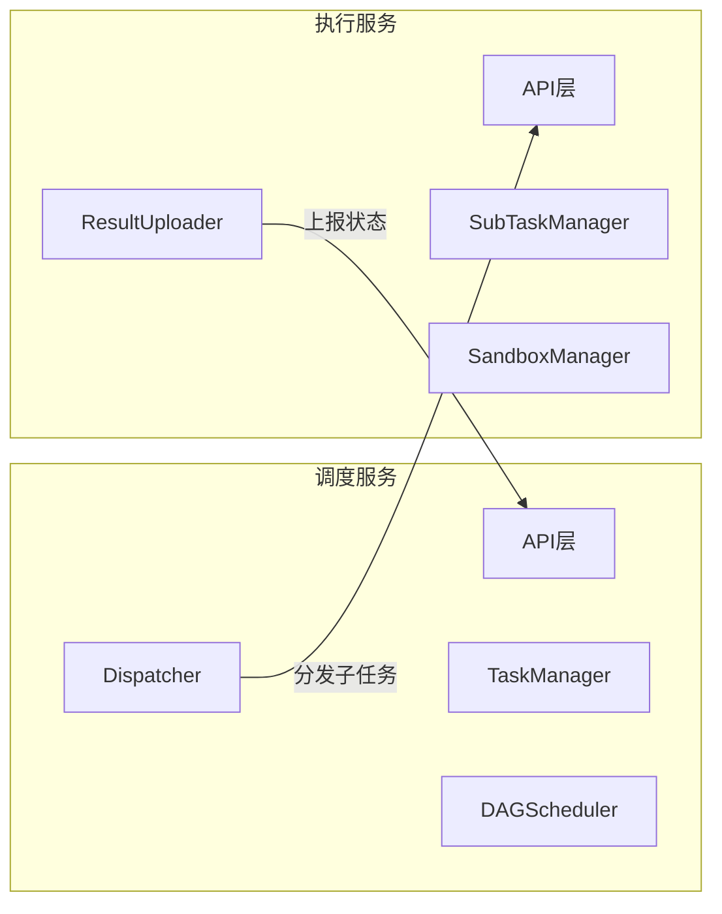
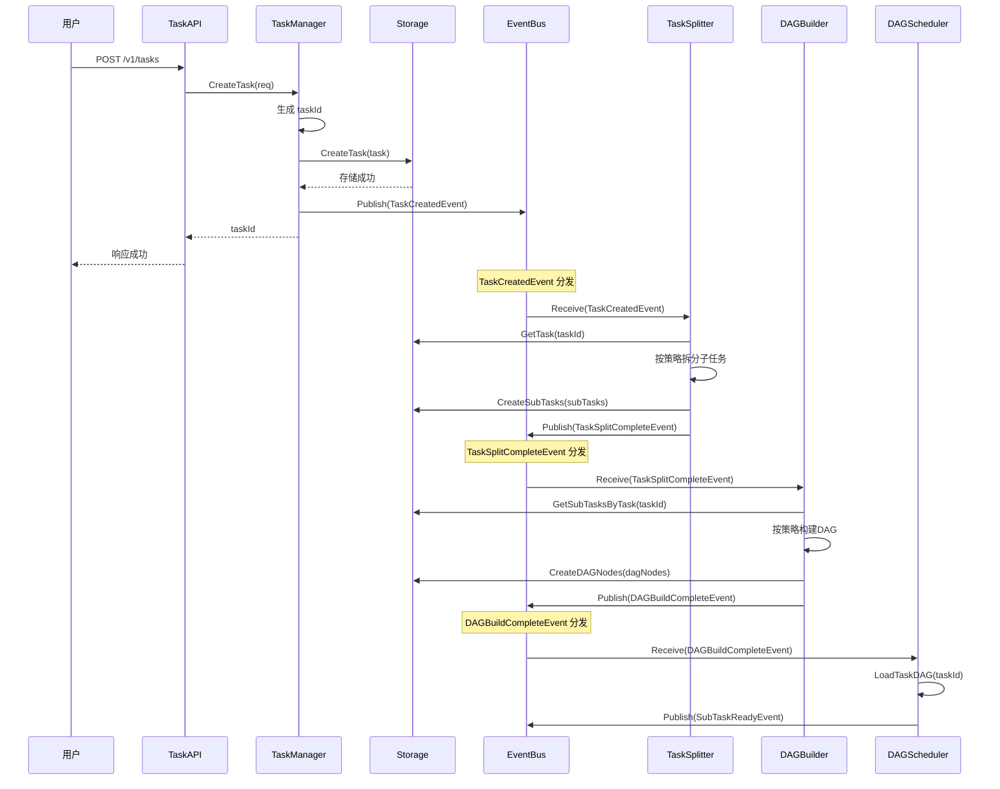
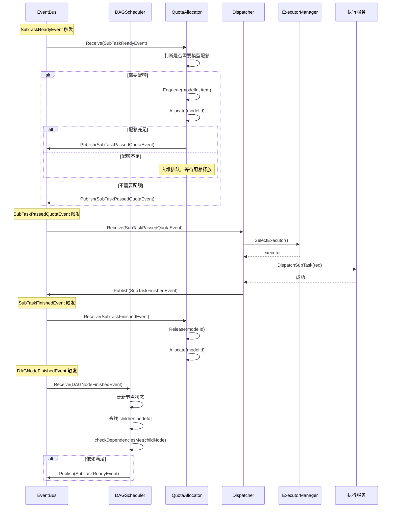
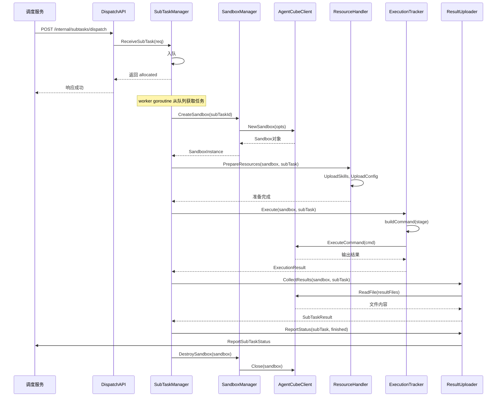
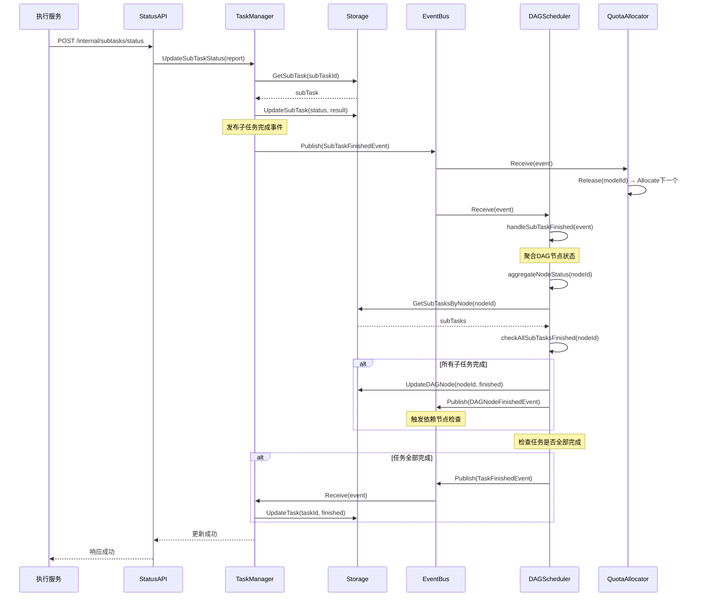
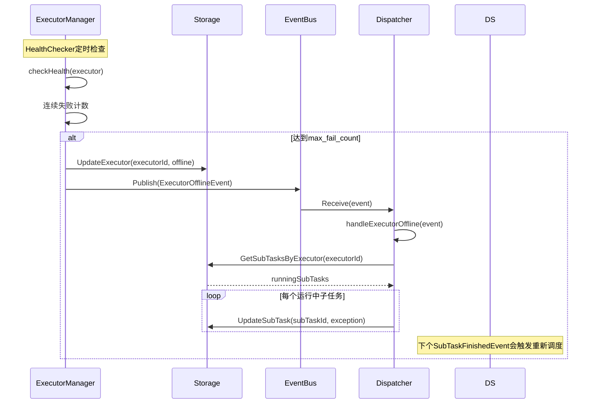

# 模块设计文档

## 一、概述

### 1.1 文档目的

本文档定义调度服务和执行服务的模块设计，包括：
- 模块架构划分
- 核心模块职责
- 方法签名定义
- 关键流程设计

### 1.2 服务关系



---

## 二、调度服务模块设计

### 2.1 模块架构

```
调度服务
├── API层                    // HTTP接口处理
│   ├── TaskAPI              // 任务提交/查询/取消接口
│   ├── StatusAPI            // 状态上报接口（执行服务调用）
│   └── HealthAPI            // 健康检查接口
│
├── 管理层                   // 任务生命周期管理
│   └── TaskManager          // 任务创建、查询、取消、状态更新
│
├── 调度层                   // 任务拆分、DAG构建与调度
│   ├── TaskSplitter         // 任务拆分器（按类型拆分子任务列表）
│   ├── DAGBuilder           // DAG构建器（根据子任务构建DAG图，定义依赖）
│   ├── DAGScheduler         // DAG调度器（依赖检查、节点释放、状态聚合）
│   └── Dispatcher           // 子任务分发协调器（事件驱动，协调分发流程）
│       ├── QuotaAllocator   // 模型配额分配器（最小堆排队 + 配额获取）
│       ├── SubTaskQueue     // 子任务队列（按模型排队）
│       └── ExecutorManager  // 执行服务管理（服务选择）
│
├── 执行器管理层             // 执行服务管理
│   └── ExecutorManager      // 执行服务注册、健康检查、失联处理
│       ├── ExecutorRegistry // 执行服务注册表
│       └── HealthChecker    // 健康检查器
│
├── 事件总线层               // 事件驱动通信
│   └── EventBus             // 事件发布/订阅、事件分发
│
├── 存储层                   // 数据持久化
│   ├── TaskStorage          // Task记录存储
│   ├── SubTaskStorage       // SubTask记录存储
│   ├── DAGNodeStorage       // DAGNode记录存储
│   └── MasterStateStorage   // 主从状态存储
│
└── 高可用层                 // 主从模式管理
    └── MasterSlave          // Master选举、心跳维持、故障切换
```

**任务处理流程（事件驱动）**：

```
任务提交 → TaskManager（落库+发布TaskCreatedEvent）
         → TaskSplitter（拆分+存储+发布TaskSplitCompleteEvent）
         → DAGBuilder（构建+存储+发布DAGBuildCompleteEvent）
         → DAGScheduler（调度+发布SubTaskReadyEvent）
         → Dispatcher（分发协调）
```

**Dispatcher 内部架构**：

```
Dispatcher（协调者）
├── QuotaAllocator    // 配额分配（最小堆排队 + 配额获取）
├── SubTaskQueue      // 队列管理（按模型排队）
└── ExecutorManager   // 服务选择（负载均衡）
```

### 2.1.1 EventBus

**职责**：事件发布/订阅/分发，实现模块间异步解耦通信。

**核心原则**：
- 事件是**状态通知**，不是**命令**
- 发布者只通知"发生了什么"，不关心"谁来处理"

**核心模块集成**：

| 模块 | 发布事件 | 订阅事件 |
|------|---------|---------|
| TaskManager | TaskCreatedEvent | TaskFinishedEvent, TaskFailedEvent, TaskCancelEvent |
| TaskSplitter | TaskSplitCompleteEvent | TaskCreatedEvent |
| DAGBuilder | DAGBuildCompleteEvent | TaskSplitCompleteEvent |
| DAGScheduler | DAGBuildCompleteEvent, DAGNodeFinishedEvent, SubTaskReadyEvent, TaskFinishedEvent, TaskFailedEvent | DAGBuildCompleteEvent, DAGNodeFinishedEvent |
| QuotaAllocator | SubTaskPassedQuotaEvent | SubTaskReadyEvent, SubTaskFinishedEvent |
| Dispatcher | SubTaskFinishedEvent | SubTaskPassedQuotaEvent, ExecutorOfflineEvent, TaskCancelEvent |
| ExecutorManager | ExecutorOfflineEvent | 无（HealthChecker 内部发布） |
| TaskAPI | TaskCancelEvent | 无 |

> 事件类型定义、事件结构、接口签名详见 [事件总线设计](details/事件总线设计.md)

### 2.2 核心模块职责

| 模块 | 职责 | 不负责 | 依赖模块 |
|------|------|--------|----------|
| **TaskAPI** | 接收任务请求、参数校验、响应返回 | 任务创建逻辑 | TaskManager, ConfigParserRegistry |
| **StatusAPI** | 接收状态上报、触发事件发布 | 状态更新细节 | TaskManager |
| **TaskManager** | 任务生命周期管理（落库、查询、取消） + 发布创建事件 | 拆分逻辑、DAG构建细节 | EventBus, Storage |
| **ConfigParserRegistry** | 管理配置解析器注册与查询（供 API 层校验使用） | 业务逻辑实现 | 无 |
| **TaskSplitter** | 订阅创建事件 → 拆分子任务 → 存储 → 发布拆分完成事件 | DAG 构建、依赖定义 | EventBus, Storage |
| **DAGBuilder** | 订阅拆分完成事件 → 构建DAG → 存储 → 发布构建完成事件 | 子任务创建 | EventBus, Storage |
| **DAGScheduler** | 订阅构建完成事件 → DAG调度 → 发布子任务就绪/节点完成/任务终态事件 | 执行服务选择、子任务分发 | EventBus, Storage |
| **Dispatcher** | 订阅配额通过事件 → 执行服务选择 → 分发 → 发布子任务完成事件 | 配额分配、排队调度 | EventBus, ExecutorManager, Storage |
| **QuotaAllocator** | 配额门控（判断是否需配额 → 排队/通过 → 发布配额通过事件） | 执行服务选择、分发发送 | EventBus, QuotaManager, Storage |
| **ExecutorManager** | 执行服务注册、健康检查、服务选择、发布失联事件 | 子任务重置、调度决策 | EventBus, Storage |
| **EventBus** | 事件发布、事件订阅、事件分发 | 业务逻辑 | 无 |
| **Storage** | 数据CRUD操作、事务支持 | 业务逻辑 | 无 |
| **MasterSlave** | Master选举、心跳维持、故障切换 | 任务调度 | DAGScheduler, Storage |

### 2.3 TaskManager

**职责**：任务生命周期管理，包括落库、查询、取消、发布创建/取消事件。

**设计原则**：
- 只负责 Task 记录的 CRUD 操作
- CreateTask 只做落库 + 发布事件，不协调拆分/构建流程
- 拆分和构建由 TaskSplitter/DAGBuilder 通过事件驱动完成

**方法签名**：

```go
type TaskManager struct {
    storage  TaskStorage
    eventBus EventBus
    logger   *zap.Logger
}

func NewTaskManager(
    storage TaskStorage,
    eventBus EventBus,
    logger *zap.Logger,
) *TaskManager
```

| 方法 | 说明 |
|------|------|
| CreateTask(ctx, req) (string, error) | 创建新任务（落库） + 发布 TaskCreatedEvent |
| GetTask(ctx, taskId) (*Task, error) | 查询任务详情 |
| CancelTask(ctx, taskId) error | 取消任务 + 发布 TaskCancelEvent |
| ListTasks(ctx, appId, status, offset, limit) ([]*Task, int, error) | 查询任务列表 |
| UpdateTaskStatus(ctx, taskId, status, message) error | 更新任务状态（由事件处理器调用） |

**CreateTask 流程**：

```go
func (m *TaskManager) CreateTask(ctx context.Context, req *CreateTaskRequest) (string, error) {
    // 1. 创建 Task 记录（落库）
    task := &Task{
        TaskId: generateTaskId(),
        AppId:  req.AppId,
        Type:   req.Type,
        Config: req.Config,
        Status: Waiting,
    }
    if err := m.storage.CreateTask(ctx, task); err != nil {
        return "", err
    }

    // 2. 发布事件（后续由 TaskSplitter 处理）
    m.eventBus.Publish(&Event{
        Type: TaskCreatedEvent,
        Content: &TaskCreatedEventContent{TaskId: task.TaskId},
    })

    return task.TaskId, nil
}
```

### 2.4 ConfigParserRegistry（配置解析器注册表）

**职责**：管理不同任务类型的配置解析器，供 API 层校验使用。

**设计原则**：
- 独立于拆分器，供 TaskAPI 在任务提交时校验配置
- 按 `Task.type` 选择对应的解析器

**Registry 结构**：

```go
type ConfigParserRegistry struct {
    parsers map[string]ConfigParser  // taskType → Parser
    logger  *zap.Logger
}
```

| 方法 | 说明 |
|------|------|
| Register(taskType, parser) error | 注册配置解析器 |
| GetParser(taskType) (ConfigParser, error) | 获取解析器 |
| ListTypes() []string | 获取已注册的任务类型列表 |

**ConfigParser 接口**：

```go
type ConfigParser interface {
    Parse(rawConfig map[string]interface{}) (TaskConfig, error)
    Validate(config TaskConfig) error
}
```

**内置实现**：

| taskType | Parser | 说明 |
|----------|--------|------|
| agent_eval | AgentEvalConfigParser | 解析 workflow、models、阶段配置 |
| model_eval | ModelEvalConfigParser | 解析 dataset、agents、models 配置 |

### 2.5 TaskSplitter（任务拆分器）

**职责**：订阅 TaskCreatedEvent → 拆分子任务 → 存储 → 发布 TaskSplitCompleteEvent。

**设计原则**：
- 事件驱动：订阅 TaskCreatedEvent，自主决定响应
- 只关注子任务创建，不关注依赖关系（依赖由 DAGBuilder 处理）
- 拆分后持久化子任务，发布事件触发后续流程

**结构定义**：

```go
type TaskSplitter struct {
    strategies map[string]SplitStrategy  // taskType → 策略
    storage    SubTaskStorage
    eventBus   EventBus
    logger     *zap.Logger
}
```

| 方法 | 说明 |
|------|------|
| Receive(event) error | 接收事件（EventHandler接口） |
| handleTaskCreated(event) | 处理 TaskCreatedEvent → 拆分 → 存储 → 发布 |

**处理流程**：

```go
func (s *TaskSplitter) handleTaskCreated(event *Event) error {
    task := s.storage.GetTask(event.TaskId)
    
    // 1. 拆分子任务
    subTasks := s.strategies[task.Type].Split(task)
    
    // 2. 持久化子任务
    s.storage.CreateSubTasks(subTasks)
    
    // 3. 发布事件
    s.eventBus.Publish(&Event{
        Type: TaskSplitCompleteEvent,
        Content: &TaskSplitCompleteEventContent{
            TaskId:     task.TaskId,
            SubTaskIds: getSubTaskIds(subTasks),
        },
    })
    return nil
}
```

**SplitStrategy 接口**：

```go
type SplitStrategy interface {
    Split(task *Task) ([]*SubTask, error)
}
```

> 实现细节详见 [任务拆分器设计](details/任务拆分器设计.md)

### 2.6 DAGBuilder（DAG 构建器）

**职责**：订阅 TaskSplitCompleteEvent → 构建DAG → 存储 → 发布 DAGBuildCompleteEvent。

**设计原则**：
- 事件驱动：订阅 TaskSplitCompleteEvent，自主决定响应
- 只关注依赖定义，不关注子任务创建
- 构建后持久化DAG节点，发布事件触发后续流程

**结构定义**：

```go
type DAGBuilder struct {
    strategies map[string]BuildStrategy  // taskType → 策略
    storage    DAGNodeStorage
    eventBus   EventBus
    logger     *zap.Logger
}
```

| 方法 | 说明 |
|------|------|
| Receive(event) error | 接收事件（EventHandler接口） |
| handleTaskSplitComplete(event) | 处理 TaskSplitCompleteEvent → 构建 → 存储 → 发布 |

**处理流程**：

```go
func (b *DAGBuilder) handleTaskSplitComplete(event *Event) error {
    task := b.storage.GetTask(event.TaskId)
    subTasks := b.storage.GetSubTasksByTask(event.TaskId)
    
    // 1. 构建DAG节点
    dagNodes := b.strategies[task.Type].Build(task, subTasks)
    
    // 2. 持久化DAG节点
    b.storage.CreateDAGNodes(dagNodes)
    
    // 3. 发布事件
    b.eventBus.Publish(&Event{
        Type: DAGBuildCompleteEvent,
        Content: &DAGBuildCompleteEventContent{
            TaskId:     task.TaskId,
            DAGNodeIds: getDAGNodeIds(dagNodes),
        },
    })
    return nil
}
```

**BuildStrategy 接口**：

```go
type BuildStrategy interface {
    Build(task *Task, subTasks []*SubTask) ([]*DAGNode, error)
}
```

**内置策略与 DAG 结构**：

| taskType | Strategy | DAG 结构 |
|----------|----------|---------|
| agent_eval | AgentEvalBuildStrategy | synthesis → case₁...caseₙ → report |
| model_eval | ModelEvalBuildStrategy | case₁...caseₙ（并行） → report |

**DAG 对比**：

```
agent_eval:    synthesis ──┬── case_1 ──┬── report
                          ├── case_2 ──┤
                          └── case_3 ──┘

model_eval:    case_1 ──┬── report
               case_2 ──┤
               case_3 ──┘（无 synthesis，并行）
```

> 实现细节详见 [DAG构建器设计](details/DAG构建器设计.md)

### 2.7 DAGScheduler

**职责**：管理所有执行中任务的 DAG 图调度，订阅事件、依赖检查、节点释放、状态聚合、任务完成后清理内存数据。

**设计原则**：
- 按 taskId 组织 TaskDAG，支持多任务并发调度
- TaskDAG 采用双向图结构（parents/children），实现 O(1) 查询上下游关系
- 依赖关系在 LoadTaskDAG 时从 Storage 加载构建，之后不再查询数据库
- 任务完成后立即清理 TaskDAG，释放内存

**核心结构**：

```go
// TaskDAG 内存中的 DAG 图结构（面向查询）
type TaskDAG struct {
    taskId     string

    // 双向图结构（O(1) 查询上下游）
    parents    map[string][]string              // nodeId → 父节点列表（此节点依赖谁）
    children   map[string][]string              // nodeId → 子节点列表（谁依赖此节点）

    // 节点状态
    nodes      map[string]*DAGNodeState         // nodeId → 节点状态

    // 根节点列表（无依赖的节点）
    roots      []string
}

// DAGNodeState 节点状态
type DAGNodeState struct {
    NodeId        string
    NodeType      string
    Status        DAGNodeStatus
    SubTaskIds    []string
    LastUpdated   time.Time
}

// DAGScheduler 调度器
type DAGScheduler struct {
    storage        DAGNodeStorage
    subTaskStorage SubTaskStorage
    eventBus       EventBus

    // 多任务 DAG 管理
    taskDAGs       map[string]*TaskDAG           // taskId → TaskDAG

    // 事件处理
    events         chan *Event
    logger         *zap.Logger
    stopCh         chan struct{}
}

func NewDAGScheduler(
    storage DAGNodeStorage,
    subTaskStorage SubTaskStorage,
    eventBus EventBus,
    logger *zap.Logger,
) *DAGScheduler

func (s *DAGScheduler) Start()
func (s *DAGScheduler) Stop()
func (s *DAGScheduler) Receive(event *Event) error      // EventHandler接口
func (s *DAGScheduler) LoadTaskDAG(taskId string) (*TaskDAG, error)  // 从 Storage 加载构建 TaskDAG
```

| 方法 | 说明 |
|------|------|
| Start() | 启动调度器（事件处理循环） |
| Stop() | 停止调度器 |
| Receive(event) | 接收事件（订阅 DAGBuildCompleteEvent, DAGNodeFinishedEvent） |
| LoadTaskDAG(taskId) | 从 Storage 加载 DAGNode，构建 TaskDAG 双向图结构 |
| handleDAGBuildComplete(event) | 处理 DAG 构建完成事件 → 加载 TaskDAG → 释放根节点 |
| releaseNode(taskDAG, nodeId) | 释放节点（Blocked→Ready）→ 发布 SubTaskReadyEvent |
| handleDAGNodeFinished(event) | 处理节点完成事件 → 检查子节点依赖 → 释放满足依赖的节点 |

**关键设计**：
- DAGScheduler 不依赖 Dispatcher，通过 EventBus 发布 SubTaskReadyEvent
- Dispatcher 订阅 SubTaskReadyEvent，执行分发流程
- 调度层与分发层完全解耦

> TaskDAG 构建、双向图结构、调度算法详见 [DAG调度器设计](details/DAG调度器设计.md)

### 2.8 Dispatcher

**职责**：订阅 SubTaskPassedQuotaEvent → 执行服务选择 → 分发 → 发布 SubTaskFinishedEvent。

**核心职责**：
- 订阅子任务通过配额门控事件，执行分发
- 选择合适的执行服务（负载均衡）
- 分发子任务到执行服务
- 发布子任务完成事件

**设计原则**：
- 只关注分发执行，不关注配额分配（配额由 QuotaAllocator 处理）
- 从 QuotaAllocator 通过的子任务直接进入分发流程

**结构定义**：

```go
type Dispatcher struct {
    executorManager *ExecutorManager     // 执行服务管理

    // 存储与事件
    eventBus        EventBus
    storage         SubTaskStorage
    logger          *zap.Logger
}
```

| 方法 | 说明 |
|------|------|
| Start(ctx) | 启动事件处理循环 |
| Receive(event) | 接收事件（订阅 SubTaskPassedQuotaEvent, ExecutorOfflineEvent） |
| handleSubTaskPassedQuota(event) | 处理配额通过事件 → ExecutorManager.SelectExecutor → 分发 |
| handleExecutorOffline(event) | 处理执行服务失联 → 重置分发中的子任务 |
| dispatch(subTask) | 分发子任务到执行服务 |

> 详细设计见 [子任务分发器设计](details/子任务分发器设计.md)

### 2.9 QuotaAllocator

**职责**：配额门控，判断子任务是否需要模型配额，排队或直接通过，发布 SubTaskPassedQuotaEvent。

**核心职责**：
- 订阅子任务就绪事件，判断是否需要模型配额
- 需要配额：入堆排队 → 配额获取 → 发布配额通过事件
- 不需要配额：直接发布配额通过事件
- 订阅子任务完成事件，释放配额并触发下一个分配

**设计原则**：
- 作为配额门控（Quota Gate），在子任务进入分发前进行配额控制
- Dispatcher 只接收已通过配额门控的子任务
- 某些子任务（如汇总任务）可能不需要模型配额，直接通过

**结构定义**：

```go
type QuotaAllocator struct {
    queues         map[string]*MinHeap[*QueueItem]  // modelId → 最小堆
    quotaManager   QuotaManager                     // 配额管理器
    eventBus       EventBus
    storage        SubTaskStorage
    rwLock         sync.RWMutex
    logger         *zap.Logger
}

type QueueItem struct {
    SubTaskId   string    // 子任务ID
    TaskId      string    // 任务ID
    ModelId     string    // 所需模型
    SubmitTime  int64     // 任务提交时间（优先级）
    RetryCount  int       // 重试次数
}
```

| 方法 | 说明 |
|------|------|
| Receive(event) | 接收事件（订阅 SubTaskReadyEvent, SubTaskFinishedEvent） |
| handleSubTaskReady(event) | 处理子任务就绪 → 判断是否需配额 → 排队/直接通过 → 发布 SubTaskPassedQuotaEvent |
| handleSubTaskFinished(event) | 处理子任务完成 → 释放配额 → 触发下一个分配 |
| Enqueue(modelId, item) | 子任务入堆排队 |
| Allocate(modelId) | 尝试分配配额（堆顶 → 获取配额 → 出堆 → 发布事件） |
| Release(modelId) | 释放配额 |
| SyncUsage() | 同步配额使用量 |
| HasModel(modelId) bool | 判断是否需要该模型的配额控制 |

> 详细设计见 [配额分配器设计](details/配额分配器设计.md)

### 2.10 ExecutorManager

**职责**：执行服务管理，包括注册、健康检查、失联处理。

**方法签名**：

```go
type ExecutorManager struct {
    registry      *ExecutorRegistry
    healthChecker *HealthChecker
    logger        *zap.Logger
    stopCh        chan struct{}
}

func NewExecutorManager(
    registry *ExecutorRegistry,
    healthChecker *HealthChecker,
    logger *zap.Logger,
) *ExecutorManager

func (m *ExecutorManager) Start()
func (m *ExecutorManager) Stop()
```

| 方法 | 说明 |
|------|------|
| GetActiveExecutors() []*Executor | 获取活跃的执行服务列表 |
| RegisterExecutor(executor) error | 注册执行服务 |
| DeregisterExecutor(address) error | 注销执行服务 |

### 2.11 Storage接口

**TaskStorage接口**：

```go
type TaskStorage interface {
    CreateTask(ctx context.Context, task *Task) error
    GetTask(ctx context.Context, taskId string) (*Task, error)
    UpdateTask(ctx context.Context, task *Task) error
    UpdateTaskStatus(ctx context.Context, taskId string, status int, message string) error
    UpdateTaskResult(ctx context.Context, taskId string, result *TaskResult) error
    DeleteTask(ctx context.Context, taskId string) error
    ListTasks(ctx context.Context, appId string, status []int, offset, limit int) ([]*Task, int, error)
}
```

**SubTaskStorage接口**：

```go
type SubTaskStorage interface {
    CreateSubTask(ctx context.Context, subTask *SubTask) error
    CreateSubTasks(ctx context.Context, subTasks []*SubTask) error
    GetSubTask(ctx context.Context, subTaskId string) (*SubTask, error)
    UpdateSubTask(ctx context.Context, subTask *SubTask) error
    UpdateSubTaskStatus(ctx context.Context, subTaskId string, status int, result *SubTaskResult) error
    GetSubTasksByTask(ctx context.Context, taskId string) ([]*SubTask, error)
    GetSubTasksByExecutor(ctx context.Context, executor string) ([]*SubTask, error)
    GetSubTasksByStatus(ctx context.Context, status int) ([]*SubTask, error)
}
```

**DAGNodeStorage接口**：

```go
type DAGNodeStorage interface {
    CreateDAGNode(ctx context.Context, node *DAGNode) error
    CreateDAGNodes(ctx context.Context, nodes []*DAGNode) error
    GetDAGNode(ctx context.Context, nodeId string) (*DAGNode, error)
    UpdateDAGNode(ctx context.Context, node *DAGNode) error
    UpdateDAGNodeStatus(ctx context.Context, nodeId string, status int) error
    GetDAGNodesByTask(ctx context.Context, taskId string) ([]*DAGNode, error)
    GetNodesByStatus(ctx context.Context, status int) ([]*DAGNode, error)
}
```

### 2.12 MasterSlave

**职责**：主从模式管理，包括Master选举、心跳维持、故障切换。

**方法签名**：

```go
type MasterSlave struct {
    nodeId            string
    storage           MasterStateStorage
    scheduler         *DAGScheduler
    heartbeatTTL      time.Duration
    heartbeatInterval time.Duration
    logger            *zap.Logger
    stopCh            chan struct{}
}

func NewMasterSlave(
    nodeId string,
    storage MasterStateStorage,
    scheduler *DAGScheduler,
    heartbeatTTL time.Duration,
    heartbeatInterval time.Duration,
    logger *zap.Logger,
) *MasterSlave

func (m *MasterSlave) Start()
func (m *MasterSlave) Stop()
func (m *MasterSlave) IsMaster() bool
```

| 方法 | 说明 |
|------|------|
| IsMaster() bool | 判断当前节点是否为Master |
| trySwitchToMaster() bool | 尝试切换为Master |
| switchToMaster() | 切换为Master（启动调度器） |
| switchToSlave() | 切换为Slave（停止调度器） |
| updateHeartbeat() | 更新心跳（Master执行） |
| checkMasterHeartbeat() | 检查Master心跳（Slave执行） |

---

## 三、执行服务模块设计

### 3.1 模块架构

```
执行服务
├── API层                        // HTTP接口处理
│   ├── DispatchAPI              // 子任务接收接口
│   ├── CancelAPI                // 子任务取消接口
│   └── HealthAPI                // 健康检查接口
│
├── 管理层                       // 子任务生命周期管理
│   └── SubTaskManager           // 子任务接收、执行、取消、状态追踪
│       ├── SubTaskQueue         // 本地执行队列
│       └── ActiveTaskTracker    // 活跃任务追踪（用于取消）
│
├── 执行层                       // 核心执行逻辑
│   ├── SandboxManager           // 沙箱创建、绑定、销毁
│   ├── ExecutionTracker         // 命令执行、状态轮询、超时处理
│   ├── ResourceHandler          // 资源上传/下载、评测集获取
│   └── ResultUploader           // 结果收集、状态上报
│
└── 适配层                       // 外部服务客户端
    ├── AgentCubeClient          // AgentCube SDK封装
    ├── EvalDataClient           // 数据管理服务API客户端
    ├── SchedulerClient          // 调度服务客户端
    └── StorageClient            // 存储服务客户端
```

### 3.2 核心模块职责

| 模块 | 职责 | 不负责 | 依赖模块 |
|------|------|--------|----------|
| **DispatchAPI** | 接收分发请求、参数校验、响应返回 | 子任务执行逻辑 | SubTaskManager |
| **CancelAPI** | 接收取消请求、调用取消逻辑 | 沙箱销毁细节 | SubTaskManager |
| **HealthAPI** | 健康状态计算、响应返回 | 资源分配 | SubTaskManager |
| **SubTaskManager** | 子任务入队、执行调度、取消处理、并发控制 | 沙箱创建细节、命令执行细节 | SubTaskHandlerRegistry, EventBus |
| **SubTaskHandlerRegistry** | 管理(任务类型,子任务类型)组合键的处理器注册与查询 | 业务逻辑实现 | 无 |
| **SandboxManager** | 沙箱创建、销毁、TTL计算 | 命令执行、资源上传 | AgentCubeClient |
| **SubTaskHandler** | 资源准备、命令执行、结果收集（按类型实现） | 沙箱生命周期管理 | AgentCubeClient, EvalDataClient, SchedulerClient |
| **ResultUploader** | 状态上报（通过 Handler 收集结果） | 沙箱操作 | SchedulerClient |

### 3.3 SubTaskManager

**职责**：子任务生命周期管理，包括接收、入队、执行调度、取消处理、并发控制。

**方法签名**：

```go
type SubTaskManager struct {
    queue             *SubTaskQueue
    registry          *SubTaskHandlerRegistry
    sandboxManager    *SandboxManager
    resultUploader    *ResultUploader
    schedulerClient   *SchedulerClient
    activeTaskTracker *ActiveTaskTracker

    maxConcurrent   int
    activeCount     int32
    logger          *zap.Logger
    stopCh          chan struct{}
}

func NewSubTaskManager(
    queue *SubTaskQueue,
    registry *SubTaskHandlerRegistry,
    sandboxManager *SandboxManager,
    resultUploader *ResultUploader,
    schedulerClient *SchedulerClient,
    maxConcurrent int,
    logger *zap.Logger,
) *SubTaskManager
```

| 方法 | 说明 |
|------|------|
| ReceiveSubTask(ctx, req) error | 接收子任务入队 |
| Start() | 启动执行循环 |
| Stop() | 停止执行循环 |
| ExecuteSubTask(ctx, subTask) error | 执行单个子任务，通过 Registry 获取 Handler |
| CancelSubTask(ctx, subTaskId) error | 取消子任务 |
| GetActiveCount() int | 获取活跃子任务数量 |
| GetMaxConcurrent() int | 获取最大并发数 |

### 3.4 SandboxManager

**职责**：沙箱生命周期管理，包括创建、销毁、TTL计算。

**方法签名**：

```go
type SandboxManager struct {
    client         *AgentCubeClient
    defaultTTL     time.Duration
    createTimeout  time.Duration
    logger         *zap.Logger
}

func NewSandboxManager(
    client *AgentCubeClient,
    defaultTTL time.Duration,
    createTimeout time.Duration,
    logger *zap.Logger,
) *SandboxManager
```

| 方法 | 说明 |
|------|------|
| CreateSandbox(ctx, subTaskId) (*SandboxInstance, error) | 创建沙箱实例 |
| DestroySandbox(ctx, sandbox) error | 销毁沙箱实例 |
| BindSubTask(sandbox, subTaskId) | 绑定子任务到沙箱 |
| calculateTTL(subTaskId) time.Duration | 计算沙箱TTL |

### 3.5 SubTaskHandlerRegistry（子任务处理器注册表）

**职责**：管理不同（任务类型，子任务阶段类型）组合的处理器，提供统一的注册和查询接口。

**设计原则**：
- 采用分层 Registry 模式，执行服务侧按 `(SubTask.type, SubTask.sub_type)` 组合键选择处理器
- SubTask.type 表示任务类型（agent_eval/model_eval）
- SubTask.sub_type 表示子任务阶段类型（synthesis/inference/eval/report）
- 新增任务类型只需实现 Handler 接口并注册

**Registry 结构**：

```go
type SubTaskHandlerRegistry struct {
    handlers map[string]map[string]SubTaskHandler  // type → sub_type → Handler
    logger   *zap.Logger
}

func NewSubTaskHandlerRegistry(logger *zap.Logger) *SubTaskHandlerRegistry
```

| 方法 | 说明 |
|------|------|
| Register(type, subType, handler) error | 注册子任务处理器 |
| GetHandler(type, subType) (SubTaskHandler, error) | 获取处理器（组合键查询） |
| GetHandlersByType(type) map[string]SubTaskHandler | 获取某任务类型的所有处理器 |

### 3.6 SubTaskHandler（子任务处理器接口）

**职责**：定义子任务处理的统一接口，不同类型实现具体的资源准备、命令执行、结果收集逻辑。

**接口定义**：

```go
type SubTaskHandler interface {
    // Prepare 准备执行所需资源（上传文件、下载评测集等）
    Prepare(ctx context.Context, sandbox *SandboxInstance, subTask *SubTask) error
    // Execute 执行命令并追踪状态
    Execute(ctx context.Context, sandbox *SandboxInstance, subTask *SubTask) (*ExecutionResult, error)
    // Collect 收集并解析执行结果
    Collect(ctx context.Context, sandbox *SandboxInstance, subTask *SubTask) (*SubTaskResult, error)
    // GetTimeout 获取该类型子任务的默认超时时间
    GetTimeout() time.Duration
}
```

**内置实现示例**：

| type | sub_type | Handler | 说明 |
|------|----------|---------|------|
| `agent_eval` | `synthesis` | AgentEvalSynthesisHandler | 评测集合成 |
| `agent_eval` | `inference` | AgentEvalInferenceHandler | Agent推理执行 |
| `agent_eval` | `eval` | AgentEvalEvalHandler | 评测执行 |
| `agent_eval` | `report` | AgentEvalReportHandler | 报告生成 |
| `model_eval` | `inference` | ModelEvalInferenceHandler | 模型调用执行 |
| `model_eval` | `eval` | ModelEvalEvalHandler | 评测执行 |
| `model_eval` | `report` | ModelEvalReportHandler | 报告生成 |

> 命令构建规则、结果文件收集规则详见 [子任务处理器设计](details/子任务处理器设计.md)

### 3.7 ResultUploader

**职责**：结果收集和状态上报。

**方法签名**：

```go
type ResultUploader struct {
    schedulerClient *SchedulerClient
    evalDataClient  *EvalDataClient
    logger          *zap.Logger
}

func NewResultUploader(
    schedulerClient *SchedulerClient,
    evalDataClient *EvalDataClient,
    logger *zap.Logger,
) *ResultUploader
```

| 方法 | 说明 |
|------|------|
| CollectResults(ctx, sandbox, subTask) (*SubTaskResult, error) | 收集执行结果 |
| ReportStatus(ctx, subTask, status, result) error | 上报状态到调度服务 |
| ParseResultFiles(files, stage) (*SubTaskResult, error) | 解析结果文件 |

**结果文件收集**：

| Stage | 收集文件 |
|-------|----------|
| synthesis | dataset.jsonl, evalset.jsonl |
| inference | transcript.jsonl, evalset.jsonl |
| eval | result.json |
| report | conclusion.json, conclusion.html |

### 3.8 外部服务客户端

**AgentCubeClient**：

```go
type AgentCubeClient struct {
    config *AgentCubeConfig
}

func NewAgentCubeClient(config *AgentCubeConfig) *AgentCubeClient
```

| 方法 | 说明 |
|------|------|
| NewSandbox(ctx, opts) (*agentcube.Sandbox, error) | 创建沙箱 |
| ExecuteCommand(ctx, sandbox, cmd, opts) (string, error) | 执行命令 |
| UploadFile(ctx, sandbox, localPath, remotePath) error | 上传文件 |
| DownloadFile(ctx, sandbox, remotePath, localPath) error | 下载文件 |
| WriteFile(ctx, sandbox, content, remotePath) error | 写入文件 |
| ReadFile(ctx, sandbox, remotePath) ([]byte, error) | 读取文件 |
| CreateDir(ctx, sandbox, path, mode) error | 创建目录 |
| Close(ctx, sandbox) error | 关闭沙箱 |

**EvalDataClient**：

```go
type EvalDataClient struct {
    baseURL    string
    httpClient *http.Client
    logger     *zap.Logger
}

func NewEvalDataClient(baseURL string, timeout time.Duration, logger *zap.Logger) *EvalDataClient
```

| 方法 | 说明 |
|------|------|
| DownloadEvalset(ctx, appId, evalsetId) ([]byte, error) | 下载评测集 |
| UploadEvalset(ctx, appId, evalsetId, items) error | 上传评测集 |
| UploadRecord(ctx, appId, taskId, records) error | 上传评测记录 |
| DownloadRecord(ctx, appId, taskId) ([]*RecordItem, error) | 下载评测记录 |

**SchedulerClient**：

```go
type SchedulerClient struct {
    baseURL    string
    httpClient *http.Client
    logger     *zap.Logger
}

func NewSchedulerClient(baseURL string, timeout time.Duration, logger *zap.Logger) *SchedulerClient
```

| 方法 | 说明 |
|------|------|
| ReportSubTaskStatus(ctx, req) error | 上报子任务状态 |

---

## 四、关键流程

### 4.1 任务创建流程（事件驱动）



### 4.2 DAG调度与分发流程（事件驱动）



### 4.3 子任务执行流程



### 4.4 状态上报与聚合流程（事件驱动）



### 4.5 执行服务失联处理流程（事件驱动）



---

## 五、错误处理策略

### 5.1 错误重试策略

| 错误类型 | 重试次数 | 重试间隔 | 说明 |
|----------|----------|----------|------|
| 任务拆分失败 | 3 | 指数退避（1s, 2s, 4s） | 可能是配置解析问题 |
| 子任务分发失败 | 3 | 固定5秒 | 可能是无可用执行服务 |
| 执行服务健康检查失败 | 无限（计数累积） | 固定10秒 | 累积到max_fail_count后标记offline |
| 状态上报处理失败 | 无重试 | 无 | 记录日志，执行服务负责重试 |
| MongoDB操作失败 | 3 | 指数退避（1s, 2s, 4s） | 可能是连接问题 |

### 5.2 故障恢复策略

| 故障场景 | 恢复策略 | 说明 |
|----------|----------|------|
| Master节点故障 | Slave检测心跳超时后切换 | 最多等待heartbeat_ttl时间 |
| 执行服务故障 | 发布ExecutorOfflineEvent，Dispatcher订阅处理，重置子任务为exception | 下个SubTaskFinishedEvent会触发重新调度 |
| MongoDB连接失败 | 重连 + 重试 | 所有操作支持重试 |
| 任务拆分失败 | 更新任务状态为failed | 用户重新提交 |

---

## 六、相关文档

### 设计文档

- [架构设计文档](架构设计文档.md) - 系统架构、核心概念
- [数据模型设计文档](数据模型设计文档.md) - 数据结构、状态枚举定义
- [API接口设计文档](API接口设计文档.md) - HTTP API定义

### 实现细节

- [任务拆分器设计](details/任务拆分器设计.md) - TaskSplitter + SplitStrategy 实现细节
- [DAG构建器设计](details/DAG构建器设计.md) - DAGBuilder + BuildStrategy 实现细节
- [事件总线设计](details/事件总线设计.md) - EventBus + EventHandler 实现细节
- [DAG调度器设计](details/DAG调度器设计.md) - DAGScheduler 调度算法实现细节
- [配额分配器设计](details/配额分配器设计.md) - QuotaAllocator 配额门控逻辑
- [子任务分发器设计](details/子任务分发器设计.md) - Dispatcher 分发执行逻辑
- [子任务处理器设计](details/子任务处理器设计.md) - SubTaskHandlerRegistry + Handler 实现细节

### 依赖文档

- [评测工具交互说明](../dependencies/评测工具交互说明.md) - astron-eval集成方式