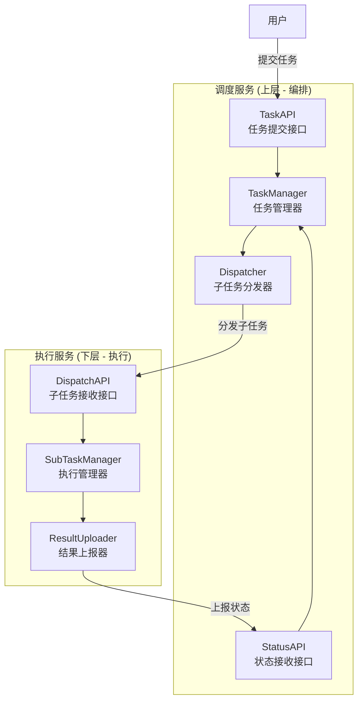
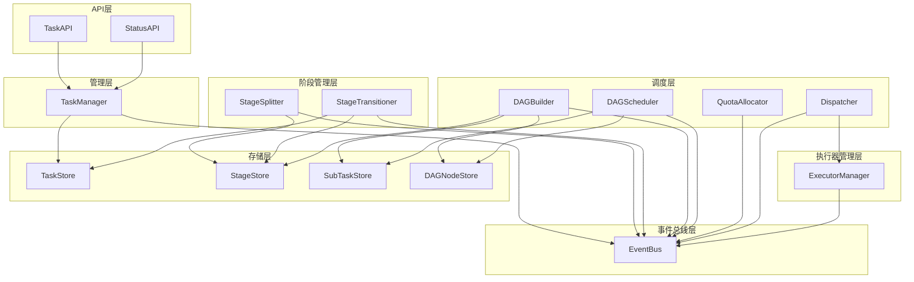
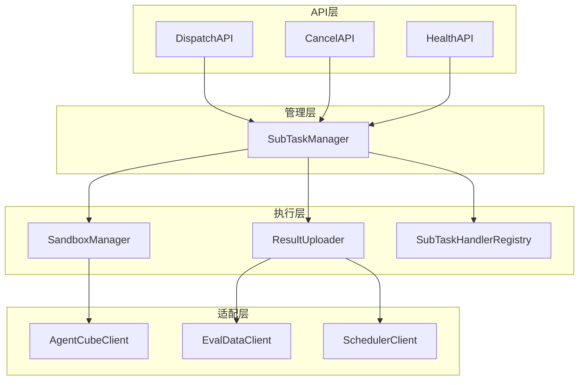
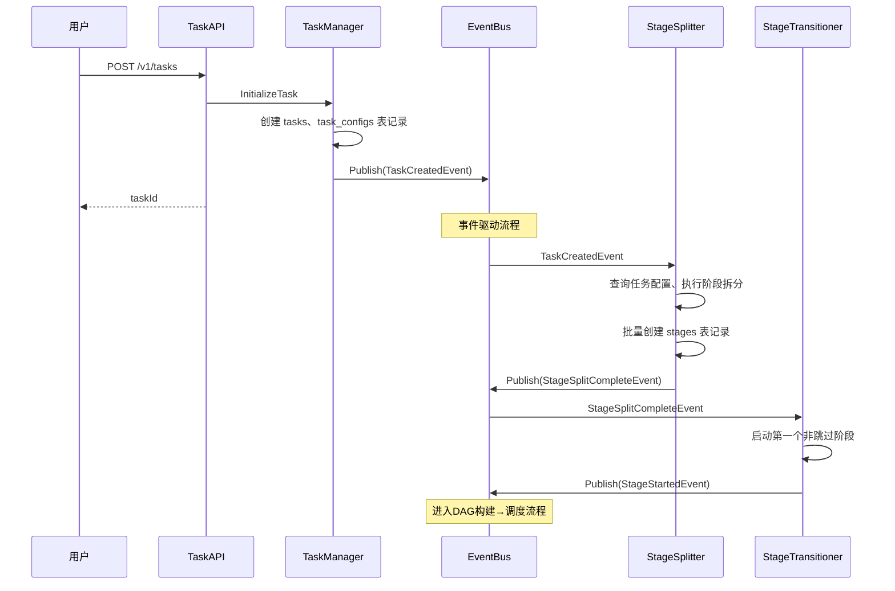
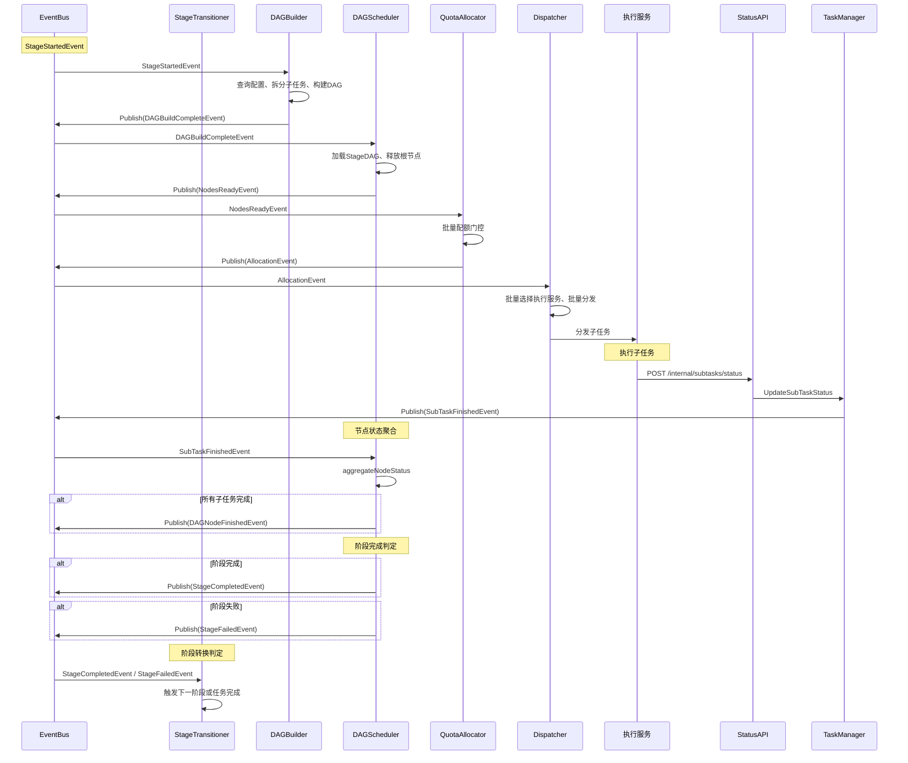
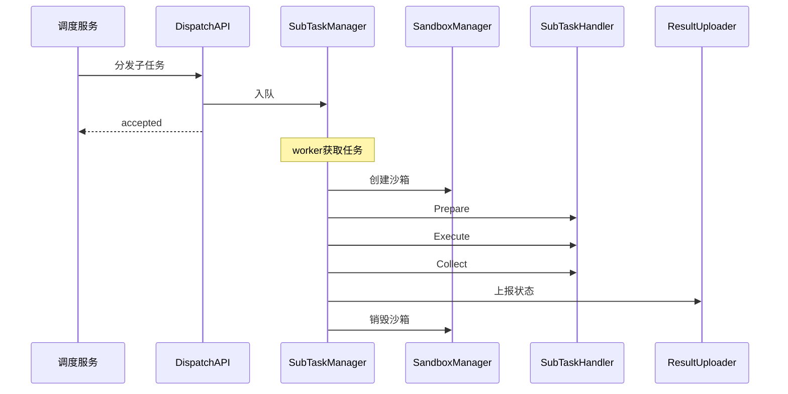
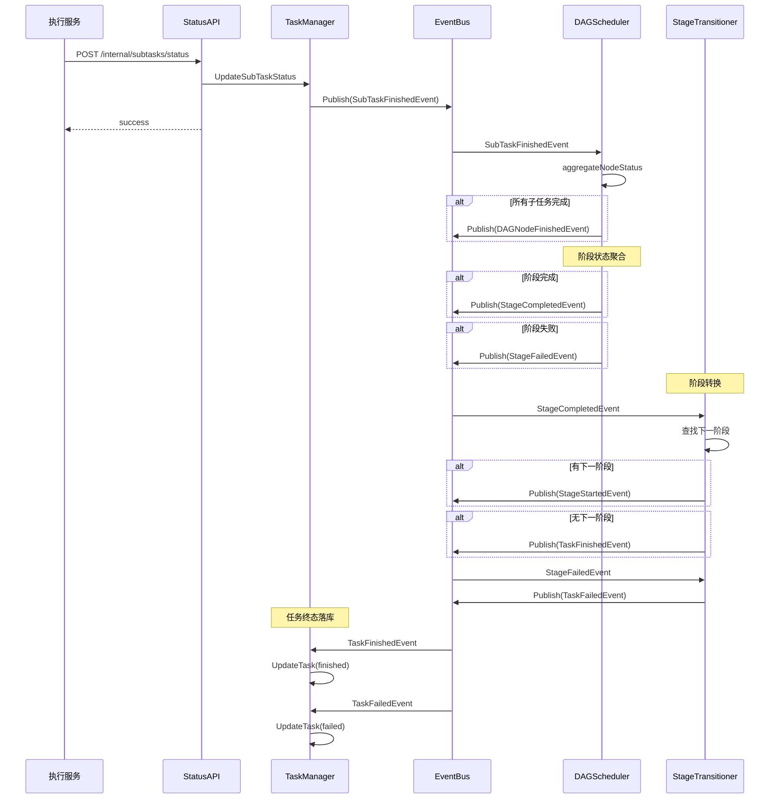
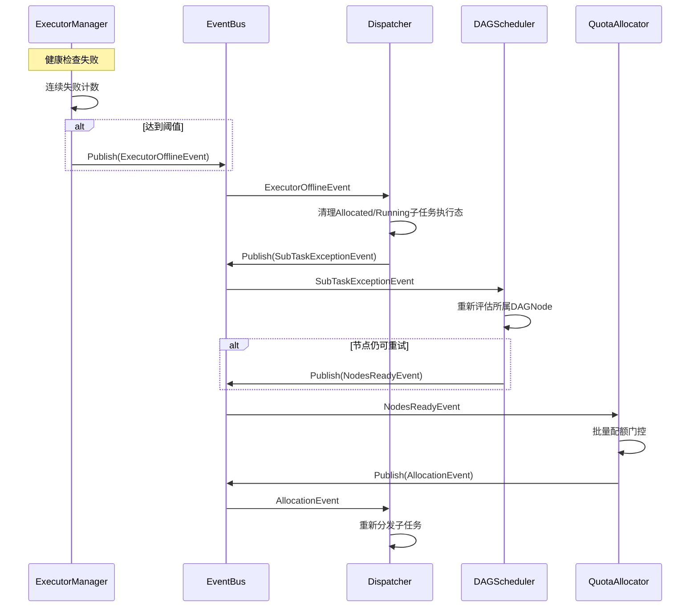

# 模块设计文档

## 一、概述

### 1.1 文档定位

本文档是架构设计文档与详细设计文档之间的桥梁层，定义调度服务和执行服务的模块划分与协作关系。

**文档层次关系**：

| 文档         | 内容                                   | 适用场景           |
| ------------ | -------------------------------------- | ------------------ |
| 架构设计文档 | 系统架构、核心概念、服务组成           | 理解系统整体设计   |
| 模块设计文档 | 模块划分、职责边界、接口契约、协作流程 | 理解模块间如何协作 |
| 详细设计文档 | 单模块内部结构、处理逻辑、扩展方式     | 实现具体模块       |

### 1.2 服务关系

调度服务位于上层负责编排调度，执行服务位于下层负责具体执行：



**核心交互链路**：

| 阶段       | 方向      | 接口                     | 说明                 |
| ---------- | --------- | ------------------------ | -------------------- |
| 任务提交   | 用户→调度 | TaskAPI                  | 用户提交评测任务     |
| 子任务分发 | 调度→执行 | Dispatcher→DispatchAPI   | 分发子任务至执行服务 |
| 状态上报   | 执行→调度 | ResultUploader→StatusAPI | 上报子任务执行状态   |

> 内部模块依赖详见 [2.3 模块依赖关系图](#23-模块依赖关系图) 和 [3.3 模块依赖关系图](#33-模块依赖关系图)

---

## 二、调度服务模块概览

### 2.1 模块架构图

```
调度服务
├── API层                    // 接口接入
│   ├── TaskAPI              // 任务提交/查询/取消接口
│   ├── StatusAPI            // 状态上报接口（执行服务调用）
│   └── HealthAPI            // 健康检查接口
│
├── 管理层                   // 任务生命周期
│   └── TaskManager          // 任务初始化、CRUD、状态更新、事件发布
│
├── 阶段管理层               // 阶段预拆分与转换
│   ├── StageSplitter        // 阶段拆分器（确认阶段预创建结果）
│   └── StageTransitioner    // 阶段转换器（启动阶段、触发下一阶段）
│
├── 调度层                   // DAG构建、调度、配额、分发
│   ├── DAGBuilder           // DAG构建器 + 子任务拆分
│   ├── DAGScheduler         // DAG调度器（阶段级）
│   ├── QuotaAllocator       // 配额分配器（批量处理）
│   └── Dispatcher           // 子任务分发器（批量分发）
│       └── ExecutorManager  // 执行服务管理（内部依赖）
│
├── 执行器管理层             // 执行服务注册与健康检查
│   └── ExecutorManager      // 执行服务注册、健康检查、负载选择
│       ├── ExecutorRegistry // 执行服务注册表（内部）
│       └── HealthChecker    // 健康检查器（内部）
│
├── 事件总线层               // 模块间异步通信
│   └── EventBus             // 事件发布/订阅/分发
│
├── 存储层                   // 数据持久化
│   ├── TaskStore            // Task记录存储
│   ├── TaskConfigStore      // TaskConfig记录存储
│   ├── StageStore           // Stage记录存储
│   ├── SubTaskStore         // SubTask记录存储
│   ├── DAGNodeStore         // DAGNode记录存储
│   └── MasterStateStore     // 主从状态存储
│
└── 高可用层                 // 主从模式管理
    └── MasterSlave          // Master选举、心跳维持、故障切换
```

**层次职责说明**：

| 层次         | 职责                                               | 模块数 |
| ------------ | -------------------------------------------------- | ------ |
| API层        | 接收请求、参数校验、响应返回                       | 3      |
| 管理层       | 任务初始化、CRUD、状态更新、事件发布               | 1      |
| 阶段管理层   | 阶段预拆分确认、阶段转换触发                       | 2      |
| 调度层       | DAG构建+子任务拆分、阶段级调度、配额门控、批量分发 | 4      |
| 执行器管理层 | 执行服务注册、健康检查、负载选择                   | 1      |
| 事件总线层   | 事件发布/订阅/分发                                 | 1      |
| 存储层       | 数据持久化操作                                     | 6      |
| 高可用层     | Master选举、心跳维持、故障切换                     | 1      |

### 2.2 模块职责表

| 模块              | 职责                                                         | 不负责                 | 依赖模块                             |
| ----------------- | ------------------------------------------------------------ | ---------------------- | ------------------------------------ |
| TaskAPI           | 接收任务请求、参数校验、响应返回                             | 任务创建逻辑           | TaskManager                          |
| StatusAPI         | 接收状态上报、响应返回                                       | 状态更新逻辑           | TaskManager                          |
| HealthAPI         | 健康检查响应                                                 | 无                     | 无                                   |
| TaskManager       | 任务初始化、CRUD、状态更新、发布TaskCreatedEvent、SubTaskFinishedEvent | 子任务拆分、DAG构建、阶段创建    | EventBus, TaskStore, TaskConfigStore, SubTaskStore      |
| StageSplitter     | 批量创建stages表记录、发布StageSplitCompleteEvent              | 子任务拆分             | EventBus, StageStore                 |
| StageTransitioner | 启动阶段、监听阶段完成/失败、触发下一阶段、任务终态判定       | 子任务拆分、DAG调度、发布阶段终态事件 | EventBus, TaskManager, StageStore      |
| DAGBuilder        | 阶段启动时拆分子任务、构建阶段DAG、发布DAGBuildCompleteEvent | 阶段转换               | EventBus, SubTaskStore, DAGNodeStore |
| DAGScheduler      | 管理StageDAG、依赖检查、批量释放节点、状态聚合、发布StageCompletedEvent/StageFailedEvent，并在子任务进入可恢复异常态后重新评估节点与重新释放 | 执行服务选择、阶段转换 | EventBus, DAGNodeStore, SubTaskStore |
| QuotaAllocator    | 批量配额门控、发布AllocationEvent                            | 分发执行               | EventBus, QuotaManager               |
| Dispatcher        | 批量选择执行服务、批量分发子任务，并处理已分发子任务的执行态清理（执行服务失联、任务取消） | 配额分配、DAG重试决策 | EventBus, ExecutorManager            |
| ExecutorManager   | 执行服务注册、健康检查、负载选择                             | 子任务重置             | EventBus                             |
| EventBus          | 事件发布/订阅/分发                                           | 业务逻辑               | 无                                   |
| Storage           | 数据CRUD                                                     | 业务逻辑               | 无                                   |
| MasterSlave       | Master选举、心跳维持、故障切换                               | 任务调度               | DAGScheduler, MasterStateStore     |

### 2.3 模块依赖关系图



### 2.4 跨模块接口契约

**Storage接口定义**：

```go
// TaskStore 任务存储接口
type TaskStore interface {
    CreateTask(ctx context.Context, task *Task) error
    GetTask(ctx context.Context, taskId string) (*Task, error)
    UpdateTask(ctx context.Context, task *Task) error
    UpdateTaskStatus(ctx context.Context, taskId string, status int, message string) error
    DeleteTask(ctx context.Context, taskId string) error
    ListTasks(ctx context.Context, appId string, status []int, offset, limit int) ([]*Task, int, error)
}

// StageStore 阶段存储接口
type StageStore interface {
    CreateStage(ctx context.Context, stage *Stage) error
    CreateStages(ctx context.Context, stages []*Stage) error
    GetStage(ctx context.Context, taskId string, stageId int) (*Stage, error)
    UpdateStage(ctx context.Context, stage *Stage) error
    ListByTask(ctx context.Context, taskId string) ([]*Stage, error)
}

// SubTaskStore 子任务存储接口
type SubTaskStore interface {
    CreateSubTask(ctx context.Context, subTask *SubTask) error
    CreateSubTasks(ctx context.Context, subTasks []*SubTask) error
    GetSubTask(ctx context.Context, subTaskId string) (*SubTask, error)
    UpdateSubTask(ctx context.Context, subTask *SubTask) error
    GetSubTasksByStage(ctx context.Context, taskId string, stageId int) ([]*SubTask, error)
    GetSubTasksByTask(ctx context.Context, taskId string) ([]*SubTask, error)
}

// DAGNodeStore DAG节点存储接口
type DAGNodeStore interface {
    CreateDAGNodes(ctx context.Context, nodes []*DAGNode) error
    GetDAGNode(ctx context.Context, nodeId string) (*DAGNode, error)
    UpdateDAGNodeStatus(ctx context.Context, nodeId string, status int) error
    GetDAGNodesByStage(ctx context.Context, taskId string, stageId int) ([]*DAGNode, error)
}
```

> 数据结构定义详见 [数据模型设计文档](数据模型设计文档.md)

### 2.5 EventBus集成表

| 模块              | 发布事件                                                                                     | 订阅事件                                                          |
| ----------------- | -------------------------------------------------------------------------------------------- | ----------------------------------------------------------------- |
| TaskManager       | TaskCreatedEvent, SubTaskFinishedEvent, TaskCancelEvent                                      | TaskFinishedEvent, TaskFailedEvent                                |
| StageSplitter     | StageSplitCompleteEvent                                                                      | TaskCreatedEvent                                                  |
| StageTransitioner | StageStartedEvent, TaskFinishedEvent, TaskFailedEvent                                        | StageSplitCompleteEvent, StageCompletedEvent, StageFailedEvent    |
| DAGBuilder        | DAGBuildCompleteEvent                                                                        | StageStartedEvent                                                 |
| DAGScheduler      | NodesReadyEvent, DAGNodeFinishedEvent, StageCompletedEvent, StageFailedEvent                 | DAGBuildCompleteEvent, DAGNodeFinishedEvent, SubTaskFinishedEvent, TaskCancelEvent, SubTaskExceptionEvent |
| QuotaAllocator    | AllocationEvent                                                                              | NodesReadyEvent, SubTaskFinishedEvent                             |
| Dispatcher        | SubTaskExceptionEvent                                                                        | AllocationEvent, ExecutorOfflineEvent, TaskCancelEvent            |
| ExecutorManager   | ExecutorOfflineEvent                                                                         | 无（定时健康检查）                                                  |
| 执行服务           | 无（通过HTTP上报）                                                                            | 无（主动上报）                                                      |

> **说明**：
> - SubTaskFinishedEvent 由 TaskManager 在子任务状态落库后发布（执行服务通过 HTTP 调用 StatusAPI，TaskManager 更新数据库后发布）
> - SubTaskExceptionEvent 由 Dispatcher 在执行服务失联后清理子任务执行态时发布，DAGScheduler 收到后重新评估节点并决定是否重新释放
> - StageCompletedEvent / StageFailedEvent 由 DAGScheduler 发布，StageTransitioner 消费
> - ExecutorManager 通过定时健康检查主动发现失联，不订阅事件
> - DAGScheduler 订阅 TaskCancelEvent 用于清理内存中的 StageDAG

---

## 三、执行服务模块概览

### 3.1 模块架构图

```
执行服务
├── API层                        // 接口接入
│   ├── DispatchAPI              // 子任务接收接口
│   ├── CancelAPI                // 子任务取消接口
│   └── HealthAPI                // 健康检查接口
│
├── 管理层                       // 子任务生命周期
│   └── SubTaskManager           // 子任务入队、执行调度、取消处理
│       ├── SubTaskQueue         // 本地执行队列（内部）
│       └── ActiveTaskTracker    // 活跃任务追踪（内部）
│
├── 执行层                       // 核心执行逻辑
│   ├── SandboxManager           // 沙箱创建、销毁、TTL计算
│   ├── ExecutionTracker         // 命令执行追踪（内部）
│   ├── ResourceHandler          // 资源上传/下载（内部）
│   └── ResultUploader           // 结果收集、状态上报
│
└── 适配层                       // 外部服务客户端
    ├── AgentCubeClient          // AgentCube SDK封装
    ├── EvalDataClient           // 数据管理服务API客户端
    ├── SchedulerClient          // 调度服务API客户端
    └── StorageClient            // 存储服务客户端
```

**层次职责说明**：

| 层次   | 职责                                     | 模块数 |
| ------ | ---------------------------------------- | ------ |
| API层  | 接收分发/取消请求、响应返回              | 3      |
| 管理层 | 子任务入队、执行调度、取消处理、并发控制 | 1      |
| 执行层 | 沙箱管理、命令执行、资源处理、结果上报   | 4      |
| 适配层 | 外部服务API封装                          | 4      |

### 3.2 模块职责表

| 模块                   | 职责                                     | 不负责             | 依赖模块                                               |
| ---------------------- | ---------------------------------------- | ------------------ | ------------------------------------------------------ |
| DispatchAPI            | 接收分发请求、参数校验、响应返回         | 子任务执行逻辑     | SubTaskManager                                         |
| CancelAPI              | 接收取消请求、调用取消逻辑               | 沙箱销毁细节       | SubTaskManager                                         |
| HealthAPI              | 健康状态计算、响应返回                   | 资源分配           | SubTaskManager                                         |
| SubTaskManager         | 子任务入队、执行调度、取消处理、并发控制 | 沙箱创建细节       | SubTaskHandlerRegistry, SandboxManager, ResultUploader |
| SandboxManager         | 沙箱创建、销毁、TTL计算                  | 命令执行、资源上传 | AgentCubeClient                                        |
| ResultUploader         | 结果收集、状态上报                       | 沙箱操作           | SchedulerClient                                        |
| SubTaskHandlerRegistry | Handler注册与查询                        | 业务逻辑实现       | 无                                                     |
| AgentCubeClient        | AgentCube SDK封装                        | 无                 | 无                                                     |
| EvalDataClient         | 数据管理服务API封装                      | 无                 | 无                                                     |
| SchedulerClient        | 调度服务API封装                          | 无                 | 无                                                     |

### 3.3 模块依赖关系图



### 3.4 跨模块接口契约

**SubTaskHandler接口定义**：

```go
// SubTaskHandler 子任务处理器接口
type SubTaskHandler interface {
    Prepare(ctx context.Context, sandbox *SandboxInstance, subTask *SubTask) error
    Execute(ctx context.Context, sandbox *SandboxInstance, subTask *SubTask) (*ExecutionResult, error)
    Collect(ctx context.Context, sandbox *SandboxInstance, subTask *SubTask) (*SubTaskResult, error)
    GetTimeout() time.Duration
}
```

**内置Handler注册表**：

| 任务类型   | 阶段类型  | Handler                   | 说明          |
| ---------- | --------- | ------------------------- | ------------- |
| agent_eval | synthesis | AgentEvalSynthesisHandler | 评测集合成    |
| agent_eval | inference | AgentEvalInferenceHandler | Agent推理执行 |
| agent_eval | eval      | AgentEvalEvalHandler      | 评测执行      |
| agent_eval | report    | AgentEvalReportHandler    | 报告生成      |

> Handler实现细节详见 [子任务处理器设计](details/executor/子任务处理器设计.md)

### 3.5 与调度服务的交互

| 场景       | 执行服务调用                 | 调度服务响应            |
| ---------- | ---------------------------- | ----------------------- |
| 接收子任务 | 被DispatchAPI调用            | 调度服务主动分发        |
| 上报状态   | SchedulerClient.ReportStatus | StatusAPI接收           |
| 健康检查   | 被HealthAPI调用              | ExecutorManager定时调用 |

---

## 四、核心流程概览

### 4.1 任务初始化流程



**流程说明**：

| 步骤       | 触发事件                | 核心动作                                         |
| ---------- | ----------------------- | ------------------------------------------------ |
| 任务初始化 | -                       | TaskManager创建tasks、task_configs表记录         |
| 阶段拆分   | TaskCreatedEvent        | StageSplitter查询配置、批量创建stages表记录      |
| 阶段启动   | StageSplitCompleteEvent | StageTransitioner启动第一个阶段                  |

### 4.2 阶段执行流程



**流程说明**：

| 步骤     | 触发事件              | 核心动作                             |
| -------- | --------------------- | ------------------------------------ |
| DAG构建  | StageStartedEvent     | DAGBuilder拆分子任务、构建阶段DAG    |
| DAG调度  | DAGBuildCompleteEvent | DAGScheduler加载StageDAG、释放根节点 |
| 配额门控 | NodesReadyEvent       | QuotaAllocator批量判断配额需求       |
| 分发执行 | AllocationEvent       | Dispatcher批量选择执行服务、批量分发 |
| 子任务执行 | -                   | 执行服务在沙箱中执行评测工具         |
| 状态上报 | HTTP调用              | 执行服务上报→TaskManager发布SubTaskFinishedEvent |
| 节点聚合 | SubTaskFinishedEvent  | DAGScheduler聚合节点状态             |
| 阶段终态 | DAGNodeFinishedEvent  | DAGScheduler判定阶段完成/失败，发布StageCompletedEvent/StageFailedEvent |
| 阶段转换 | StageCompletedEvent   | StageTransitioner触发下一阶段        |

> **说明**：执行服务通过 HTTP 调用调度服务的 StatusAPI 上报状态，TaskManager 更新数据库后发布 SubTaskFinishedEvent 到 EventBus（执行服务无法直接访问调度服务内部的 EventBus）。

### 4.3 子任务执行流程



**流程说明**：

| 步骤     | 模块           | 核心动作                  |
| -------- | -------------- | ------------------------- |
| 接收入队 | SubTaskManager | 接收后立即返回，异步执行  |
| 沙箱创建 | SandboxManager | 调用AgentCube创建隔离环境 |
| 资源准备 | SubTaskHandler | 上传skills、配置文件等    |
| 命令执行 | SubTaskHandler | 执行评测工具命令          |
| 结果收集 | SubTaskHandler | 读取输出文件              |
| 状态上报 | ResultUploader | 调用调度服务StatusAPI     |

### 4.4 状态上报与聚合流程



**流程说明**：

| 步骤     | 触发事件             | 核心动作                                |
| -------- | -------------------- | --------------------------------------- |
| 状态更新 | HTTP调用             | TaskManager更新子任务状态、发布SubTaskFinishedEvent |
| 节点聚合 | SubTaskFinishedEvent | DAGScheduler聚合DAGNode状态             |
| 阶段终态 | DAGNodeFinishedEvent | DAGScheduler判定阶段完成/失败，发布StageCompletedEvent/StageFailedEvent |
| 阶段转换 | StageCompletedEvent  | StageTransitioner触发下一阶段           |
| 任务完成 | TaskFinishedEvent    | TaskManager更新任务终态                 |

### 4.5 执行服务失联处理流程



**流程说明**：

| 步骤       | 触发事件             | 核心动作                                |
| ---------- | -------------------- | --------------------------------------- |
| 失联检测   | 健康检查连续失败     | ExecutorManager标记offline并发布ExecutorOfflineEvent |
| 执行态清理 | ExecutorOfflineEvent | Dispatcher清理已分发子任务的执行态，并发布SubTaskExceptionEvent |
| 节点重评估 | SubTaskExceptionEvent | DAGScheduler重新评估异常子任务所属节点，判定是否可重试 |
| 恢复调度   | NodesReadyEvent      | 可重试节点重新进入配额门控与分发链路 |

> **恢复路径说明**：
> - 执行服务失联优先映射为子任务 `exception`，不直接改变任务终态
> - Dispatcher 只负责执行态清理与异常事件发布，不负责 DAG 重试决策
> - DAGScheduler 在收到 `SubTaskExceptionEvent` 后立即重评估节点，若仍可重试则重新发布 `NodesReadyEvent`

---

## 五、任务拆分与阶段转换

### 5.1 增量式拆分架构

应用评测任务采用增量式拆分方案：

| 拆分时机   | 拆分对象             | 拆分模块                   |
| ---------- | -------------------- | -------------------------- |
| 任务提交时 | 任务（tasks/task_configs表） | TaskManager.InitializeTask |
| 任务提交后 | 阶段（stages表）     | StageSplitter.handleTaskCreated |
| 阶段启动时 | 子任务（subtasks表） | DAGBuilder.Build           |

**核心设计**：

- **任务记录创建**：任务提交时 TaskManager 创建 tasks、task_configs 表记录，发布 TaskCreatedEvent
- **阶段记录创建**：StageSplitter 订阅 TaskCreatedEvent，根据 workflow 配置批量创建 stages 表记录
- **阶段顺序执行**：阶段按 stage_id（从1开始的int）顺序依次执行
- **子任务增量拆分**：阶段启动时由 DAGBuilder 拆分子任务，写入 subtasks 表
- **数据引用查询获取**：构建子任务时查询任务配置和前序阶段结果，不存储冗余引用

### 5.2 评测场景定义

| 场景      | 配置                    | 目标                      | 拆分因子      |
| --------- | ----------------------- | ------------------------- | ------------- |
| **场景A** | N模型 + 1Agent + 1Skill | 找最佳模型                | N = 模型数量  |
| **场景B** | 1模型 + NAgent + 1Skill | 找最佳Agent               | N = Agent数量 |
| **场景C** | 1模型 + 1Agent + NSkill | 找最佳Skill（含版本迭代） | N = Skill数量 |

### 5.3 子任务数量计算

**子任务数量 = M × N**

其中：
- **M** = 评测集数量（synthesis阶段生成或用户提供）
- **N** = 变化维度数量（根据场景类型确定）

**示例**：
- 场景A，M=100，N=3（模型） → 300个子任务
- 场景B，M=50，N=2（Agent） → 100个子任务
- 场景C，M=80，N=4（Skill） → 320个子任务

### 5.4 阶段定义

| 阶段          | 作用          | 输入                             | 输出                 | 子任务数量 |
| ------------- | ------------- | -------------------------------- | -------------------- | ---------- |
| **synthesis** | 合成评测集    | 场景描述、Skills                 | evalset.jsonl        | 1          |
| **inference** | Agent推理执行 | evalset.jsonl                    | transcript.jsonl     | M × N      |
| **eval**      | 评测执行      | transcript.jsonl + evalset.jsonl | record.json          | M × N      |
| **report**    | 报告生成      | record.json列表                  | conclusion.json/html | 1          |

### 5.5 阶段依赖关系

```
synthesis (1个子任务)
    ↓ 完成后触发
inference (M×N个子任务)
    ↓ 完成后触发
eval (M×N个子任务)
    ↓ 完成后触发
report (1个子任务)
    ↓ 完成后触发
任务完成
```

### 5.6 跳过synthesis场景

当用户已提供评测集（EvalsetID非空）时：
- **跳过synthesis阶段**：stages表中标记 `status = Skipped`
- **直接进入inference阶段**：从数据管理服务读取评测集，获取M值
- 正常执行后续流程

### 5.7 模型评测兼容

模型评测与应用评测共用一套组件。

**差异点**：

| 维度       | 应用评测                              | 模型评测                  |
| ---------- | ------------------------------------- | ------------------------- |
| workflow   | synthesis → inference → eval → report | inference → eval → report |
| 执行环境   | 远程沙箱（AgentCube）                 | 本地执行服务              |
| 变体维度   | model/agent/skill                     | agent                     |
| 子任务数量 | M×N（N=变体数量）                     | M                         |

---

## 六、相关文档

### 设计文档

| 文档                                    | 内容                         | 与本文档关系           |
| --------------------------------------- | ---------------------------- | ---------------------- |
| [架构设计文档](架构设计文档.md)         | 系统架构、核心概念、服务组成 | 上层文档，定义整体架构 |
| [数据模型设计文档](数据模型设计文档.md) | 数据结构、字段、索引定义     | 补充数据结构定义       |
| [API接口设计文档](API接口设计文档.md)   | HTTP API定义                 | 补充接口细节           |

### 详细设计文档

**调度服务**：

| 文档                                                          | 内容                       | 与本文档关系                         |
| ------------------------------------------------------------- | -------------------------- | ------------------------------------ |
| [任务管理器设计](details/scheduler/任务管理器设计.md)         | TaskManager内部实现        | 下层文档，补充任务初始化细节         |
| [阶段拆分器设计](details/scheduler/阶段拆分器设计.md)         | StageSplitter内部实现      | 下层文档，补充阶段拆分确认逻辑       |
| [阶段转换器设计](details/scheduler/阶段转换器设计.md)         | StageTransitioner内部实现  | 下层文档，补充阶段转换逻辑           |
| [DAG构建器设计](details/scheduler/DAG构建器设计.md)           | DAGBuilder内部实现         | 下层文档，补充构建+拆分策略细节      |
| [DAG调度器设计](details/scheduler/DAG调度器设计.md)           | DAGScheduler内部实现       | 下层文档，补充阶段级调度算法细节     |
| [配额分配器设计](details/scheduler/配额分配器设计.md)         | QuotaAllocator内部实现     | 下层文档，补充批量配额门控细节       |
| [子任务分发器设计](details/scheduler/子任务分发器设计.md)     | Dispatcher内部实现         | 下层文档，补充批量分发策略细节       |
| [执行服务管理器设计](details/scheduler/执行服务管理器设计.md) | ExecutorManager内部实现    | 下层文档，补充执行服务管理细节       |
| [事件总线设计](details/scheduler/事件总线设计.md)             | EventBus实现、事件结构定义 | 下层文档，补充事件类型细节           |
| [主从模式设计](details/scheduler/主从模式设计.md)             | MasterSlave内部实现        | 下层文档，补充主从选举与故障切换细节 |

**执行服务**：

| 文档                                                     | 内容                   | 与本文档关系                       |
| -------------------------------------------------------- | ---------------------- | ---------------------------------- |
| [子任务管理器设计](details/executor/子任务管理器设计.md) | SubTaskManager内部实现 | 下层文档，补充子任务执行调度细节   |
| [沙箱管理器设计](details/executor/沙箱管理器设计.md)     | SandboxManager内部实现 | 下层文档，补充沙箱生命周期管理细节 |
| [结果上报器设计](details/executor/结果上报器设计.md)     | ResultUploader内部实现 | 下层文档，补充结果上报逻辑细节     |
| [子任务处理器设计](details/executor/子任务处理器设计.md) | SubTaskHandler实现     | 下层文档，补充Handler细节          |

### 依赖文档

| 文档                                                            | 内容                   |
| --------------------------------------------------------------- | ---------------------- |
| [AgentCube使用说明](../dependencies/AgentCube使用说明.md)       | 沙箱SDK集成方式        |
| [数据管理服务接口文档](../dependencies/数据管理服务接口文档.md) | EvalDataClient使用说明 |
| [评测工具交互说明](../dependencies/评测工具交互说明.md)         | astron-eval集成方式    |