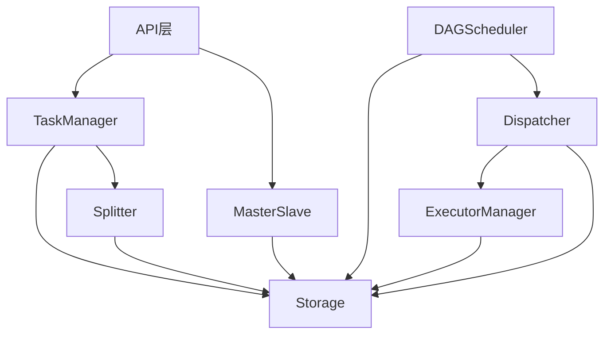

# 调度服务模块详细设计文档

## 一、概述

### 1.1 文档目的

本文档详细定义调度服务（Scheduler Service）的模块设计，包括：
- 模块接口定义
- 数据结构定义
- 方法签名设计
- 模块依赖关系
- 关键流程实现

### 1.2 模块架构

```
调度服务
├── API层                    // HTTP接口处理
│   ├── TaskAPI              // 任务提交/查询/取消接口
│   ├── StatusAPI            // 状态上报接口（执行服务调用）
│   └── HealthAPI            // 健康检查接口
│
├── TaskManager              // 任务生命周期管理
│   ├── TaskCreator          // 任务创建
│   ├── TaskQuerier          // 任务查询
│   ├── TaskCanceler         // 任务取消
│   └── TaskUpdater          // 任务状态更新
│
├── Splitter                 // 任务拆分器
│   ├── ConfigParser         // 配置解析
│   ├── DAGBuilder           // DAG构建
│   └── SubTaskCreator       // 子任务创建
│
├── DAGScheduler             // DAG调度器
│   ├── NodeMonitor          // 节点状态监控
│   ├── DependencyChecker    // 依赖检查
│   ├── NodeReleaser         // 节点释放
│   └── StatusAggregator     // 状态聚合
│
├── Dispatcher               // 子任务分发器
│   ├── ExecutorSelector     // 执行服务选择
│   ├── LoadBalancer         // 负载均衡
│   └── SubTaskDispatcher    // 子任务分发
│
├── ExecutorManager          // 执行服务管理器
│   ├── ExecutorRegistry     // 执行服务注册
│   ├── HealthChecker        // 健康检查
│   ├── LoadCollector        // 负载收集
│   └── FailureHandler       // 失联处理
│
├── Storage                  // 数据存储层
│   ├── TaskStorage          // Task记录存储
│   ├── SubTaskStorage       // SubTask记录存储
│   ├── DAGNodeStorage       // DAGNode记录存储
│   └── ResourceStorage      // 资源文件存储
│
└── MasterSlave              // 主从模式管理
    ├── MasterController     // Master节点控制
    ├── SlaveController      // Slave节点备用
    └── Switcher             // 主从切换
```

### 1.3 模块依赖关系



---

## 二、API层设计

### 2.1 TaskAPI（任务API）

#### 接口定义

```go
// TaskAPI 处理任务相关的HTTP请求
type TaskAPI struct {
    taskManager *TaskManager
    logger      *zap.Logger
}

// NewTaskAPI 创建TaskAPI实例
func NewTaskAPI(taskManager *TaskManager, logger *zap.Logger) *TaskAPI

// RegisterRoutes 注册路由到Gin引擎
func (api *TaskAPI) RegisterRoutes(r *gin.Engine)
```

#### 方法签名

```go
// HandleCreateTask 处理任务创建请求
// POST /v1/tasks
func (api *TaskAPI) HandleCreateTask(c *gin.Context)

// HandleGetTask 处理任务查询请求
// GET /v1/tasks/:task_id
func (api *TaskAPI) HandleGetTask(c *gin.Context)

// HandleCancelTask 处理任务取消请求
// PATCH /v1/tasks/:task_id
func (api *TaskAPI) HandleCancelTask(c *gin.Context)

// HandleListTasks 处理任务列表查询请求
// GET /v1/tasks
func (api *TaskAPI) HandleListTasks(c *gin.Context)
```

#### 实现示例

```go
func (api *TaskAPI) HandleCreateTask(c *gin.Context) {
    ctx := c.Request.Context()
    
    // 1. 解析请求体
    var req TaskCreateRequest
    if err := c.ShouldBindJSON(&req); err != nil {
        api.respondError(c, errors.ErrRequestBodyDecode, err.Error())
        return
    }
    
    // 2. 校验请求参数
    if err := api.validateCreateRequest(&req); err != nil {
        api.respondError(c, errors.ErrRequestParamInvalid, err.Error())
        return
    }
    
    // 3. 调用TaskManager创建任务
    taskId, err := api.taskManager.CreateTask(ctx, &req)
    if err != nil {
        api.respondError(c, err)
        return
    }
    
    // 4. 返回成功响应
    api.respondSuccess(c, gin.H{
        "task_id":    taskId,
        "status":     "waiting",
        "created_at": time.Now().Unix(),
    })
}
```

### 2.2 StatusAPI（状态上报API）

#### 接口定义

```go
// StatusAPI 处理执行服务的状态上报请求
type StatusAPI struct {
    taskManager *TaskManager
    logger      *zap.Logger
}

// NewStatusAPI 创建StatusAPI实例
func NewStatusAPI(taskManager *TaskManager, logger *zap.Logger) *StatusAPI

// RegisterRoutes 注册路由到Gin引擎
func (api *StatusAPI) RegisterRoutes(r *gin.Engine)
```

#### 方法签名

```go
// HandleReportStatus 处理子任务状态上报
// POST /internal/subtasks/status
func (api *StatusAPI) HandleReportStatus(c *gin.Context)
```

#### 实现示例

```go
func (api *StatusAPI) HandleReportStatus(c *gin.Context) {
    ctx := c.Request.Context()
    
    var req SubTaskStatusReport
    if err := c.ShouldBindJSON(&req); err != nil {
        api.respondError(c, errors.ErrRequestBodyDecode, err.Error())
        return
    }
    
    // 更新子任务状态
    err := api.taskManager.UpdateSubTaskStatus(ctx, &req)
    if err != nil {
        api.respondError(c, err)
        return
    }
    
    api.respondSuccess(c, nil)
}
```

### 2.3 HealthAPI（健康检查API）

#### 接口定义

```go
// HealthAPI 处理健康检查请求
type HealthAPI struct {
    masterSlave *MasterSlave
}

// NewHealthAPI 创建HealthAPI实例
func NewHealthAPI(masterSlave *MasterSlave) *HealthAPI

// RegisterRoutes 注册路由
func (api *HealthAPI) RegisterRoutes(r *gin.Engine)
```

#### 方法签名

```go
// HandleHealth 处理健康检查请求
// GET /health
func (api *HealthAPI) HandleHealth(c *gin.Context)

// HandleReady 处理就绪检查请求
// GET /ready
func (api *HealthAPI) HandleReady(c *gin.Context)
```

---

## 三、TaskManager设计

### 3.1 接口定义

```go
// TaskManager 任务生命周期管理器
type TaskManager struct {
    storage     TaskStorage
    splitter    *Splitter
    dispatcher  *Dispatcher
    logger      *zap.Logger
}

// NewTaskManager 创建TaskManager实例
func NewTaskManager(
    storage TaskStorage,
    splitter *Splitter,
    dispatcher *Dispatcher,
    logger *zap.Logger,
) *TaskManager
```

### 3.2 方法签名

```go
// CreateTask 创建新任务
// 返回任务ID和错误信息
func (m *TaskManager) CreateTask(ctx context.Context, req *TaskCreateRequest) (string, error)

// GetTask 查询任务详情
func (m *TaskManager) GetTask(ctx context.Context, taskId string, appId string) (*Task, error)

// CancelTask 取消任务
func (m *TaskManager) CancelTask(ctx context.Context, taskId string, appId string) error

// ListTasks 查询任务列表
func (m *TaskManager) ListTasks(ctx context.Context, appId string, status string, offset, limit int) ([]*Task, int, error)

// UpdateTaskStatus 更新任务状态
func (m *TaskManager) UpdateTaskStatus(ctx context.Context, taskId string, status TaskStatus, message string) error

// UpdateSubTaskStatus 更新子任务状态（由StatusAPI调用）
func (m *TaskManager) UpdateSubTaskStatus(ctx context.Context, report *SubTaskStatusReport) error

// CalculateProgress 计算任务进度
func (m *TaskManager) CalculateProgress(ctx context.Context, taskId string) (int, error)
```

### 3.3 数据结构

```go
// TaskCreateRequest 任务创建请求
type TaskCreateRequest struct {
    AppId       string                 `json:"app_id"`
    Description string                 `json:"description"`
    Config      *TaskConfig            `json:"config"`
    Resources   *TaskResourcesRequest  `json:"resources"`
}

// TaskResourcesRequest 资源请求
type TaskResourcesRequest struct {
    Skills string            `json:"skills"` // Base64编码的skills目录
    Files  map[string]string `json:"files"`  // 文件名 -> Base64编码内容
}

// SubTaskStatusReport 子任务状态上报
type SubTaskStatusReport struct {
    TaskId    string            `json:"task_id"`
    SubTaskId string            `json:"sub_task_id"`
    Status    string            `json:"status"` // running/finished/failed/exception
    Result    *SubTaskResult    `json:"result"`
}
```

### 3.4 实现示例

```go
func (m *TaskManager) CreateTask(ctx context.Context, req *TaskCreateRequest) (string, error) {
    // 1. 生成任务ID
    taskId := generateTaskId()
    
    // 2. 解码并存储资源
    skillsData, err := base64.StdEncoding.DecodeString(req.Resources.Skills)
    if err != nil {
        return "", errors.Wrap(err, "skills decode failed")
    }
    
    filesData := make(map[string][]byte)
    for filename, content := range req.Resources.Files {
        data, err := base64.StdEncoding.DecodeString(content)
        if err != nil {
            return "", errors.Wrap(err, fmt.Sprintf("file %s decode failed", filename))
        }
        filesData[filename] = data
    }
    
    // 3. 构建Task记录
    task := &Task{
        TaskId:      taskId,
        AppId:       req.AppId,
        Description: req.Description,
        Config:      req.Config,
        Status:      TaskStatusWaiting,
        Progress:    0,
        Message:     "任务已创建，等待拆分",
        CreatedAt:   time.Now().Unix(),
        UpdatedAt:   time.Now().Unix(),
    }
    
    // 4. 存储资源和任务（事务）
    err = m.storage.CreateTaskWithResources(ctx, task, skillsData, filesData)
    if err != nil {
        return "", err
    }
    
    // 5. 触发任务拆分（异步）
    go m.splitter.Split(taskId)
    
    m.logger.Info("task created",
        zap.String("task_id", taskId),
        zap.String("app_id", req.AppId),
    )
    
    return taskId, nil
}
```

---

## 四、Splitter设计

### 4.1 接口定义

```go
// Splitter 任务拆分器
type Splitter struct {
    storage         TaskStorage
    dagNodeStorage  DAGNodeStorage
    subTaskStorage  SubTaskStorage
    logger          *zap.Logger
}

// NewSplitter 创建Splitter实例
func NewSplitter(
    storage TaskStorage,
    dagNodeStorage DAGNodeStorage,
    subTaskStorage SubTaskStorage,
    logger *zap.Logger,
) *Splitter
```

### 4.2 方法签名

```go
// Split 拆分任务，构建DAG，创建子任务
func (s *Splitter) Split(taskId string) error

// parseConfig 解析任务配置
func (s *Splitter) parseConfig(config *TaskConfig) (*ParsedConfig, error)

// buildDAG 构建DAG节点
func (s *Splitter) buildDAG(taskId string, parsedConfig *ParsedConfig) ([]*DAGNode, error)

// createSubTasks 创建子任务
func (s *Splitter) createSubTasks(taskId string, dagNodes []*DAGNode, parsedConfig *ParsedConfig) ([]*SubTask, error)
```

### 4.3 数据结构

```go
// ParsedConfig 解析后的配置
type ParsedConfig struct {
    Workflow       []string
    CaseCount      int           // case数量（synthesis阶段生成）
    MergeMode      bool          // inference+eval是否合并
    ModelConfigs   map[string]*ModelConfig // model_id -> ModelConfig
    StageConfigs   map[string]interface{}  // stage -> StageConfig
}

// DAGBuildRule DAG构建规则
type DAGBuildRule struct {
    NodeType       string   // synthesis/case/report
    Stage          string   // 阶段类型
    Dependencies   []string // 依赖的节点类型
    SubTaskCount   int      // 包含的子任务数量
}
```

### 4.4 DAG构建规则

```go
// DAG构建规则表
var dagBuildRules = map[string]*DAGBuildRule{
    "synthesis": {
        NodeType:     "synthesis",
        Stage:        "synthesis",
        Dependencies: []string{}, // 无依赖
        SubTaskCount: 1,
    },
    "case": {
        NodeType:     "case",
        Stage:        "inference+eval", // 可能合并
        Dependencies: []string{"synthesis"}, // 依赖synthesis
        SubTaskCount: 2, // 分离模式：inference + eval
    },
    "report": {
        NodeType:     "report",
        Stage:        "report",
        Dependencies: []string{"case"}, // 依赖所有case节点
        SubTaskCount: 1,
    },
}
```

### 4.5 实现示例

```go
func (s *Splitter) Split(taskId string) error {
    ctx := context.Background()
    
    // 1. 获取任务配置
    task, err := s.storage.GetTask(ctx, taskId)
    if err != nil {
        return err
    }
    
    // 2. 解析配置
    parsedConfig, err := s.parseConfig(task.Config)
    if err != nil {
        return err
    }
    
    // 3. 构建DAG节点
    dagNodes, err := s.buildDAG(taskId, parsedConfig)
    if err != nil {
        return err
    }
    
    // 4. 创建子任务
    subTasks, err := s.createSubTasks(taskId, dagNodes, parsedConfig)
    if err != nil {
        return err
    }
    
    // 5. 事务存储DAG节点和子任务
    err = s.storage.CreateDAGNodesAndSubTasks(ctx, dagNodes, subTasks)
    if err != nil {
        return err
    }
    
    // 6. 更新任务状态
    err = s.storage.UpdateTaskStatus(ctx, taskId, TaskStatusRunning, "任务拆分完成，开始执行")
    if err != nil {
        return err
    }
    
    s.logger.Info("task split completed",
        zap.String("task_id", taskId),
        zap.Int("dag_nodes", len(dagNodes)),
        zap.Int("subtasks", len(subTasks)),
    )
    
    return nil
}

func (s *Splitter) buildDAG(taskId string, config *ParsedConfig) ([]*DAGNode, error) {
    var nodes []*DAGNode
    var synthesisNodeId string
    var caseNodeIds []string
    
    // 创建synthesis节点（如果workflow包含synthesis）
    if contains(config.Workflow, "synthesis") {
        node := &DAGNode{
            NodeId:      generateNodeId(),
            TaskId:      taskId,
            NodeType:    "synthesis",
            SubTaskIds:  []string{}, // 稍后填充
            Dependencies: []string{},
            Status:      DAGNodeStatusReady, // synthesis无依赖，直接就绪
            CreatedAt:   time.Now().Unix(),
            UpdatedAt:   time.Now().Unix(),
        }
        nodes = append(nodes, node)
        synthesisNodeId = node.NodeId
    }
    
    // 创建case节点（数量取决于synthesis输出，初始为0，等待synthesis完成后动态创建）
    // 这里先预留逻辑，实际case数量在synthesis完成后才知道
    
    // 创建report节点（如果workflow包含report）
    if contains(config.Workflow, "report") {
        node := &DAGNode{
            NodeId:       generateNodeId(),
            TaskId:       taskId,
            NodeType:     "report",
            SubTaskIds:   []string{},
            Dependencies: caseNodeIds, // 依赖所有case节点
            Status:       DAGNodeStatusBlocked,
            CreatedAt:    time.Now().Unix(),
            UpdatedAt:    time.Now().Unix(),
        }
        nodes = append(nodes, node)
    }
    
    return nodes, nil
}
```

---

## 五、DAGScheduler设计

### 5.1 接口定义

```go
// DAGScheduler DAG调度器
type DAGScheduler struct {
    storage        DAGNodeStorage
    subTaskStorage SubTaskStorage
    dispatcher     *Dispatcher
    nodeQueue      chan *DAGNode // 就绪节点队列
    logger         *zap.Logger
    stopCh         chan struct{}
}

// NewDAGScheduler 创建DAGScheduler实例
func NewDAGScheduler(
    storage DAGNodeStorage,
    subTaskStorage SubTaskStorage,
    dispatcher *Dispatcher,
    logger *zap.Logger,
) *DAGScheduler

// Start 启动调度循环
func (s *DAGScheduler) Start()

// Stop 停止调度循环
func (s *DAGScheduler) Stop()
```

### 5.2 方法签名

```go
// monitorLoop 节点监控循环
func (s *DAGScheduler) monitorLoop()

// checkDependencies 检查节点依赖是否满足
func (s *DAGScheduler) checkDependencies(node *DAGNode) bool

// releaseNode 释放节点（状态从Blocked更新为Ready）
func (s *DAGScheduler) releaseNode(node *DAGNode) error

// dispatchLoop 分发循环
func (s *DAGScheduler) dispatchLoop()

// dispatchNode 分发节点中的子任务
func (s *DAGScheduler) dispatchNode(node *DAGNode) error

// aggregateStatus 聚合节点状态
func (s *DAGScheduler) aggregateStatus(node *DAGNode) (DAGNodeStatus, error)
```

### 5.3 实现示例

```go
func (s *DAGScheduler) Start() {
    // 启动监控循环
    go s.monitorLoop()
    // 启动分发循环
    go s.dispatchLoop()
    
    s.logger.Info("DAG scheduler started")
}

func (s *DAGScheduler) monitorLoop() {
    ticker := time.NewTicker(5 * time.Second)
    defer ticker.Stop()
    
    for {
        select {
        case <-ticker.C:
            s.scanBlockedNodes()
        case <-s.stopCh:
            return
        }
    }
}

func (s *DAGScheduler) scanBlockedNodes() {
    ctx := context.Background()
    
    // 查询所有Blocked状态的节点
    nodes, err := s.storage.GetNodesByStatus(ctx, DAGNodeStatusBlocked)
    if err != nil {
        s.logger.Error("failed to get blocked nodes", zap.Error(err))
        return
    }
    
    for _, node := range nodes {
        // 检查依赖是否满足
        if s.checkDependencies(node) {
            err := s.releaseNode(node)
            if err != nil {
                s.logger.Error("failed to release node",
                    zap.String("node_id", node.NodeId),
                    zap.Error(err),
                )
            }
        }
    }
}

func (s *DAGScheduler) checkDependencies(node *DAGNode) bool {
    ctx := context.Background()
    
    for _, depNodeId := range node.Dependencies {
        depNode, err := s.storage.GetDAGNode(ctx, depNodeId)
        if err != nil {
            s.logger.Warn("failed to get dependency node",
                zap.String("dep_node_id", depNodeId),
                zap.Error(err),
            )
            return false
        }
        
        if depNode.Status != DAGNodeStatusFinished {
            return false
        }
    }
    
    return true
}

func (s *DAGScheduler) releaseNode(node *DAGNode) error {
    ctx := context.Background()
    
    // 更新节点状态为Ready
    node.Status = DAGNodeStatusReady
    node.UpdatedAt = time.Now().Unix()
    
    err := s.storage.UpdateDAGNode(ctx, node)
    if err != nil {
        return err
    }
    
    // 加入就绪队列
    s.nodeQueue <- node
    
    s.logger.Info("node released",
        zap.String("node_id", node.NodeId),
        zap.String("task_id", node.TaskId),
    )
    
    return nil
}

func (s *DAGScheduler) dispatchLoop() {
    for {
        select {
        case node := <-s.nodeQueue:
            err := s.dispatchNode(node)
            if err != nil {
                s.logger.Error("failed to dispatch node",
                    zap.String("node_id", node.NodeId),
                    zap.Error(err),
                )
                // 放回队列稍后重试
                go func(n *DAGNode) {
                    time.Sleep(5 * time.Second)
                    s.nodeQueue <- n
                }(node)
            }
        case <-s.stopCh:
            return
        }
    }
}

func (s *DAGScheduler) dispatchNode(node *DAGNode) error {
    ctx := context.Background()
    
    // 更新节点状态为Running
    node.Status = DAGNodeStatusRunning
    node.UpdatedAt = time.Now().Unix()
    s.storage.UpdateDAGNode(ctx, node)
    
    // 分发节点中的所有子任务
    for _, subTaskId := range node.SubTaskIds {
        subTask, err := s.subTaskStorage.GetSubTask(ctx, subTaskId)
        if err != nil {
            return err
        }
        
        err = s.dispatcher.Dispatch(subTask)
        if err != nil {
            return err
        }
    }
    
    return nil
}
```

---

## 六、Dispatcher设计

### 6.1 接口定义

```go
// Dispatcher 子任务分发器
type Dispatcher struct {
    executorManager *ExecutorManager
    subTaskStorage  SubTaskStorage
    logger          *zap.Logger
}

// NewDispatcher 创建Dispatcher实例
func NewDispatcher(
    executorManager *ExecutorManager,
    subTaskStorage SubTaskStorage,
    logger *zap.Logger,
) *Dispatcher
```

### 6.2 方法签名

```go
// Dispatch 分发子任务到执行服务
func (d *Dispatcher) Dispatch(subTask *SubTask) error

// selectExecutor 选择最优执行服务
func (d *Dispatcher) selectExecutor() (*Executor, error)

// sendToExecutor 发送子任务到执行服务
func (d *Dispatcher) sendToExecutor(subTask *SubTask, executor *Executor) error
```

### 6.3 实现示例

```go
func (d *Dispatcher) Dispatch(subTask *SubTask) error {
    // 1. 选择执行服务
    executor, err := d.selectExecutor()
    if err != nil {
        return err
    }
    
    // 2. 发送到执行服务
    err = d.sendToExecutor(subTask, executor)
    if err != nil {
        return err
    }
    
    // 3. 更新子任务状态
    ctx := context.Background()
    subTask.Status = SubTaskStatusAllocated
    subTask.Executor = executor.Address
    subTask.UpdatedAt = time.Now().Unix()
    
    err = d.subTaskStorage.UpdateSubTask(ctx, subTask)
    if err != nil {
        return err
    }
    
    d.logger.Info("subtask dispatched",
        zap.String("subtask_id", subTask.SubTaskId),
        zap.String("executor", executor.Address),
    )
    
    return nil
}

func (d *Dispatcher) selectExecutor() (*Executor, error) {
    executors := d.executorManager.GetActiveExecutors()
    if len(executors) == 0 {
        return nil, errors.ErrNoAvailableExecutor
    }
    
    // 选择负载最低的执行服务
    var best *Executor
    minLoad := int(math.MaxInt32)
    
    for _, exec := range executors {
        load := exec.ActiveSubTaskCount
        if load < minLoad {
            minLoad = load
            best = exec
        }
    }
    
    return best, nil
}

func (d *Dispatcher) sendToExecutor(subTask *SubTask, executor *Executor) error {
    ctx, cancel := context.WithTimeout(context.Background(), 10*time.Second)
    defer cancel()
    
    req := &DispatchRequest{
        SubTaskId:    subTask.SubTaskId,
        TaskId:       subTask.TaskId,
        Stage:        subTask.Stage,
        CaseId:       subTask.CaseId,
        MergeMode:    subTask.MergeMode,
        Config:       subTask.Config,
        ResourcesRef: &ResourcesRef{TaskId: subTask.TaskId},
    }
    
    return executor.Client.DispatchSubTask(ctx, req)
}
```

---

## 七、ExecutorManager设计

### 7.1 接口定义

```go
// ExecutorManager 执行服务管理器
type ExecutorManager struct {
    registry      *ExecutorRegistry
    healthChecker *HealthChecker
    logger        *zap.Logger
    stopCh        chan struct{}
}

// NewExecutorManager 创建ExecutorManager实例
func NewExecutorManager(
    registry *ExecutorRegistry,
    healthChecker *HealthChecker,
    logger *zap.Logger,
) *ExecutorManager

// Start 启动健康检查
func (m *ExecutorManager) Start()

// Stop 停止健康检查
func (m *ExecutorManager) Stop()
```

### 7.2 方法签名

```go
// GetActiveExecutors 获取活跃的执行服务列表
func (m *ExecutorManager) GetActiveExecutors() []*Executor

// RegisterExecutor 注册执行服务
func (m *ExecutorManager) RegisterExecutor(executor *Executor) error

// DeregisterExecutor 注销执行服务
func (m *ExecutorManager) DeregisterExecutor(address string) error
```

### 7.3 数据结构

```go
// Executor 执行服务信息
type Executor struct {
    Address             string    // 执行服务地址
    Status              string    // online/offline
    ActiveSubTaskCount  int       // 活跃子任务数量
    MaxSubTaskCount     int       // 最大子任务数量
    FailCount           int       // 连续失败次数
    LastHealthCheckTime int64     // 最后健康检查时间
    Client              ExecutorClient // 执行服务客户端
}

// ExecutorClient 执行服务客户端接口
type ExecutorClient interface {
    DispatchSubTask(ctx context.Context, req *DispatchRequest) error
    CancelSubTask(ctx context.Context, subTaskId string) error
    HealthCheck(ctx context.Context) (*HealthCheckResponse, error)
}

// HealthCheckResponse 健康检查响应
type HealthCheckResponse struct {
    Healthy          bool
    ActiveSubTasks   int
    MaxSubTasks      int
}
```

### 7.4 HealthChecker设计

```go
// HealthChecker 健康检查器
type HealthChecker struct {
    registry       *ExecutorRegistry
    failureHandler *FailureHandler
    interval       time.Duration
    timeout        time.Duration
    maxFailCount   int
    logger         *zap.Logger
}

// NewHealthChecker 创建HealthChecker实例
func NewHealthChecker(
    registry *ExecutorRegistry,
    failureHandler *FailureHandler,
    interval time.Duration,
    timeout time.Duration,
    maxFailCount int,
    logger *zap.Logger,
) *HealthChecker

// CheckLoop 健康检查循环
func (h *HealthChecker) CheckLoop()

// checkExecutor 检查单个执行服务健康状态
func (h *HealthChecker) checkExecutor(executor *Executor) bool
```

### 7.5 实现示例

```go
func (h *HealthChecker) CheckLoop() {
    ticker := time.NewTicker(h.interval)
    defer ticker.Stop()
    
    for {
        select {
        case <-ticker.C:
            executors := h.registry.GetAll()
            for _, exec := range executors {
                healthy := h.checkExecutor(exec)
                if !healthy {
                    h.failureHandler.HandleFailure(exec)
                }
            }
        case <-h.stopCh:
            return
        }
    }
}

func (h *HealthChecker) checkExecutor(executor *Executor) bool {
    ctx, cancel := context.WithTimeout(context.Background(), h.timeout)
    defer cancel()
    
    resp, err := executor.Client.HealthCheck(ctx)
    if err != nil || !resp.Healthy {
        executor.FailCount++
        
        h.logger.Warn("executor health check failed",
            zap.String("executor", executor.Address),
            zap.Int("fail_count", executor.FailCount),
            zap.Error(err),
        )
        
        return executor.FailCount < h.maxFailCount
    }
    
    // 重置失败计数
    executor.FailCount = 0
    executor.ActiveSubTaskCount = resp.ActiveSubTasks
    executor.LastHealthCheckTime = time.Now().Unix()
    
    return true
}
```

### 7.6 FailureHandler设计

```go
// FailureHandler 失联处理器
type FailureHandler struct {
    registry   *ExecutorRegistry
    storage    SubTaskStorage
    logger     *zap.Logger
}

// HandleFailure 处理执行服务失联
func (h *FailureHandler) HandleFailure(executor *Executor) {
    ctx := context.Background()
    
    h.logger.Error("executor offline",
        zap.String("executor", executor.Address),
    )
    
    // 1. 标记执行服务离线
    executor.Status = "offline"
    h.registry.Update(executor)
    
    // 2. 获取该执行服务的活跃子任务
    subTasks, err := h.storage.GetSubTasksByExecutor(ctx, executor.Address)
    if err != nil {
        h.logger.Error("failed to get subtasks by executor",
            zap.String("executor", executor.Address),
            zap.Error(err),
        )
        return
    }
    
    // 3. 重置子任务状态为Exception，等待重新分发
    for _, st := range subTasks {
        if st.Status == SubTaskStatusAllocated || st.Status == SubTaskStatusRunning {
            st.Status = SubTaskStatusException
            st.Executor = ""
            st.UpdatedAt = time.Now().Unix()
            
            err := h.storage.UpdateSubTask(ctx, st)
            if err != nil {
                h.logger.Error("failed to update subtask status",
                    zap.String("subtask_id", st.SubTaskId),
                    zap.Error(err),
                )
            }
            
            h.logger.Warn("subtask reset due to executor offline",
                zap.String("subtask_id", st.SubTaskId),
                zap.String("executor", executor.Address),
            )
        }
    }
}
```

---

## 八、Storage设计

### 8.1 TaskStorage接口

```go
// TaskStorage 任务存储接口
type TaskStorage interface {
    // CreateTask 创建任务
    CreateTask(ctx context.Context, task *Task) error
    
    // GetTask 获取任务
    GetTask(ctx context.Context, taskId string) (*Task, error)
    
    // UpdateTask 更新任务
    UpdateTask(ctx context.Context, task *Task) error
    
    // UpdateTaskStatus 更新任务状态
    UpdateTaskStatus(ctx context.Context, taskId string, status TaskStatus, message string) error
    
    // DeleteTask 删除任务
    DeleteTask(ctx context.Context, taskId string) error
    
    // ListTasks 查询任务列表
    ListTasks(ctx context.Context, appId string, status string, offset, limit int) ([]*Task, int, error)
    
    // CreateTaskWithResources 创建任务并存储资源（事务）
    CreateTaskWithResources(ctx context.Context, task *Task, skills []byte, files map[string][]byte) error
}
```

### 8.2 SubTaskStorage接口

```go
// SubTaskStorage 子任务存储接口
type SubTaskStorage interface {
    // CreateSubTask 创建子任务
    CreateSubTask(ctx context.Context, subTask *SubTask) error
    
    // CreateSubTasks 批量创建子任务
    CreateSubTasks(ctx context.Context, subTasks []*SubTask) error
    
    // GetSubTask 获取子任务
    GetSubTask(ctx context.Context, subTaskId string) (*SubTask, error)
    
    // UpdateSubTask 更新子任务
    UpdateSubTask(ctx context.Context, subTask *SubTask) error
    
    // GetSubTasksByTask 获取任务的所有子任务
    GetSubTasksByTask(ctx context.Context, taskId string) ([]*SubTask, error)
    
    // GetSubTasksByExecutor 获取执行服务的活跃子任务
    GetSubTasksByExecutor(ctx context.Context, executor string) ([]*SubTask, error)
    
    // GetSubTasksByStatus 按状态获取子任务
    GetSubTasksByStatus(ctx context.Context, status SubTaskStatus) ([]*SubTask, error)
}
```

### 8.3 DAGNodeStorage接口

```go
// DAGNodeStorage DAG节点存储接口
type DAGNodeStorage interface {
    // CreateDAGNode 创建DAG节点
    CreateDAGNode(ctx context.Context, node *DAGNode) error
    
    // CreateDAGNodes 批量创建DAG节点
    CreateDAGNodes(ctx context.Context, nodes []*DAGNode) error
    
    // GetDAGNode 获取DAG节点
    GetDAGNode(ctx context.Context, nodeId string) (*DAGNode, error)
    
    // UpdateDAGNode 更新DAG节点
    UpdateDAGNode(ctx context.Context, node *DAGNode) error
    
    // GetDAGNodesByTask 获取任务的所有DAG节点
    GetDAGNodesByTask(ctx context.Context, taskId string) ([]*DAGNode, error)
    
    // GetNodesByStatus 按状态获取DAG节点
    GetNodesByStatus(ctx context.Context, status DAGNodeStatus) ([]*DAGNode, error)
}
```

### 8.4 MongoTaskStorage实现示例

```go
// MongoTaskStorage MongoDB任务存储实现
type MongoTaskStorage struct {
    client     *mongo.Client
    database   *mongo.Database
    collection *mongo.Collection
}

// NewMongoTaskStorage 创建MongoTaskStorage实例
func NewMongoTaskStorage(client *mongo.Client, dbName string) *MongoTaskStorage {
    return &MongoTaskStorage{
        client:     client,
        database:   client.Database(dbName),
        collection: client.Database(dbName).Collection("tasks"),
    }
}

func (s *MongoTaskStorage) CreateTask(ctx context.Context, task *Task) error {
    _, err := s.collection.InsertOne(ctx, task)
    return err
}

func (s *MongoTaskStorage) GetTask(ctx context.Context, taskId string) (*Task, error) {
    filter := bson.M{"task_id": taskId}
    
    var task Task
    err := s.collection.FindOne(ctx, filter).Decode(&task)
    if err != nil {
        if err == mongo.ErrNoDocuments {
            return nil, errors.ErrTaskNotFound
        }
        return nil, err
    }
    
    return &task, nil
}

func (s *MongoTaskStorage) UpdateTaskStatus(ctx context.Context, taskId string, status TaskStatus, message string) error {
    filter := bson.M{"task_id": taskId}
    update := bson.M{
        "$set": bson.M{
            "status":     status,
            "message":    message,
            "updated_at": time.Now().Unix(),
        },
    }
    
    result, err := s.collection.UpdateOne(ctx, filter, update)
    if err != nil {
        return err
    }
    
    if result.MatchedCount == 0 {
        return errors.ErrTaskNotFound
    }
    
    return nil
}
```

---

## 九、MasterSlave设计

### 9.1 接口定义

```go
// MasterSlave 主从模式管理器
type MasterSlave struct {
    nodeId     string
    storage    MasterStateStorage
    scheduler  *DAGScheduler
    logger     *zap.Logger
    
    heartbeatTTL      time.Duration
    heartbeatInterval time.Duration
    
    stopCh chan struct{}
}

// NewMasterSlave 创建MasterSlave实例
func NewMasterSlave(
    nodeId string,
    storage MasterStateStorage,
    scheduler *DAGScheduler,
    heartbeatTTL time.Duration,
    heartbeatInterval time.Duration,
    logger *zap.Logger,
) *MasterSlave
```

### 9.2 方法签名

```go
// Start 启动主从管理
func (m *MasterSlave) Start()

// Stop 停止主从管理
func (m *MasterSlave) Stop()

// IsMaster 判断当前节点是否为Master
func (m *MasterSlave) IsMaster() bool

// getRole 获取当前角色
func (m *MasterSlave) getRole() string

// heartbeatLoop 心跳更新循环（Master节点执行）
func (m *MasterSlave) heartbeatLoop()

// checkLoop 角色检查循环（Slave节点执行）
func (m *MasterSlave) checkLoop()

// trySwitchToMaster 尝试切换为Master
func (m *MasterSlave) trySwitchToMaster() bool

// switchToMaster 切换为Master
func (m *MasterSlave) switchToMaster()

// switchToSlave 切换为Slave
func (m *MasterSlave) switchToSlave()
```

### 9.3 实现示例

```go
func (m *MasterSlave) Start() {
    // 初始化角色
    m.trySwitchToMaster()
    
    // 启动角色管理循环
    go m.roleLoop()
}

func (m *MasterSlave) roleLoop() {
    ticker := time.NewTicker(m.heartbeatInterval)
    defer ticker.Stop()
    
    for {
        select {
        case <-ticker.C:
            if m.IsMaster() {
                // Master更新心跳
                m.updateHeartbeat()
            } else {
                // Slave检查Master心跳
                m.checkMasterHeartbeat()
            }
        case <-m.stopCh:
            return
        }
    }
}

func (m *MasterSlave) updateHeartbeat() {
    ctx := context.Background()
    
    err := m.storage.UpdateHeartbeat(ctx, m.nodeId)
    if err != nil {
        m.logger.Error("failed to update heartbeat", zap.Error(err))
    }
}

func (m *MasterSlave) checkMasterHeartbeat() {
    ctx := context.Background()
    
    // 获取当前Master状态
    master, err := m.storage.GetMaster(ctx)
    if err != nil {
        m.logger.Warn("failed to get master state", zap.Error(err))
        return
    }
    
    // 检查Master心跳是否超时
    now := time.Now().Unix()
    if now-master.LastHeartbeat > int64(m.heartbeatTTL.Seconds()) {
        m.logger.Warn("master heartbeat timeout, trying to switch",
            zap.String("master_node", master.NodeId),
            zap.Int64("last_heartbeat", master.LastHeartbeat),
        )
        
        // 尝试切换为Master
        if m.trySwitchToMaster() {
            m.switchToMaster()
        }
    }
}

func (m *MasterSlave) trySwitchToMaster() bool {
    ctx := context.Background()
    
    // 使用MongoDB原子操作尝试切换
    filter := bson.M{
        "node_id": m.nodeId,
        "role":    "slave",
    }
    update := bson.M{
        "$set": bson.M{
            "role":           "master",
            "last_heartbeat": time.Now().Unix(),
            "updated_at":     time.Now().Unix(),
        },
    }
    
    result, err := m.storage.Collection().UpdateOne(ctx, filter, update)
    if err != nil {
        return false
    }
    
    return result.ModifiedCount > 0
}

func (m *MasterSlave) switchToMaster() {
    m.logger.Info("switched to master role")
    
    // 启动调度器
    m.scheduler.Start()
}

func (m *MasterSlave) switchToSlave() {
    m.logger.Info("switched to slave role")
    
    // 停止调度器
    m.scheduler.Stop()
}
```

---

## 十、主程序设计

### 10.1 main.go

```go
package main

import (
    "context"
    "log"
    "os"
    "os/signal"
    "syscall"
    
    "github.com/gin-gonic/gin"
    "go.uber.org/zap"
    
    "github.com/example/agent-eval-server/internal/scheduler/api"
    "github.com/example/agent-eval-server/internal/scheduler/manager"
    "github.com/example/agent-eval-server/internal/scheduler/storage"
    "github.com/example/agent-eval-server/internal/pkg/config"
    "github.com/example/agent-eval-server/internal/pkg/logger"
)

func main() {
    // 1. 加载配置
    cfg, err := config.Load("configs/scheduler.yaml")
    if err != nil {
        log.Fatalf("failed to load config: %v", err)
    }
    
    // 2. 初始化日志
    logger.Init(cfg.Logging)
    
    // 3. 连接MongoDB
    mongoClient, err := storage.NewMongoClient(cfg.MongoDB)
    if err != nil {
        logger.Log.Fatal("failed to connect mongodb", zap.Error(err))
    }
    defer mongoClient.Disconnect(context.Background())
    
    // 4. 初始化存储层
    taskStorage := storage.NewMongoTaskStorage(mongoClient, cfg.MongoDB.Database)
    subTaskStorage := storage.NewMongoSubTaskStorage(mongoClient, cfg.MongoDB.Database)
    dagNodeStorage := storage.NewMongoDAGNodeStorage(mongoClient, cfg.MongoDB.Database)
    masterStateStorage := storage.NewMongoMasterStateStorage(mongoClient, cfg.MongoDB.Database)
    
    // 5. 初始化执行服务管理器
    executorRegistry := manager.NewExecutorRegistry()
    failureHandler := manager.NewFailureHandler(executorRegistry, subTaskStorage, logger.Log)
    healthChecker := manager.NewHealthChecker(
        executorRegistry,
        failureHandler,
        cfg.Executor.HealthCheckInterval,
        cfg.Executor.HealthCheckTimeout,
        cfg.Executor.MaxFailCount,
        logger.Log,
    )
    executorManager := manager.NewExecutorManager(executorRegistry, healthChecker, logger.Log)
    
    // 6. 初始化分发器
    dispatcher := manager.NewDispatcher(executorManager, subTaskStorage, logger.Log)
    
    // 7. 初始化DAG调度器
    dagScheduler := manager.NewDAGScheduler(dagNodeStorage, subTaskStorage, dispatcher, logger.Log)
    
    // 8. 初始化拆分器
    splitter := manager.NewSplitter(taskStorage, dagNodeStorage, subTaskStorage, logger.Log)
    
    // 9. 初始化TaskManager
    taskManager := manager.NewTaskManager(taskStorage, splitter, dispatcher, logger.Log)
    
    // 10. 初始化主从管理
    masterSlave := manager.NewMasterSlave(
        cfg.NodeId,
        masterStateStorage,
        dagScheduler,
        cfg.MasterSlave.HeartbeatTTL,
        cfg.MasterSlave.HeartbeatInterval,
        logger.Log,
    )
    
    // 11. 启动服务
    executorManager.Start()
    masterSlave.Start()
    
    // 12. 初始化API
    router := gin.New()
    router.Use(gin.Recovery())
    
    taskAPI := api.NewTaskAPI(taskManager, logger.Log)
    statusAPI := api.NewStatusAPI(taskManager, logger.Log)
    healthAPI := api.NewHealthAPI(masterSlave)
    
    taskAPI.RegisterRoutes(router)
    statusAPI.RegisterRoutes(router)
    healthAPI.RegisterRoutes(router)
    
    // 13. 启动HTTP服务
    go func() {
        if err := router.Run(cfg.Server.Address()); err != nil {
            logger.Log.Fatal("failed to start server", zap.Error(err))
        }
    }()
    
    logger.Log.Info("scheduler service started",
        zap.String("address", cfg.Server.Address()),
    )
    
    // 14. 等待退出信号
    quit := make(chan os.Signal, 1)
    signal.Notify(quit, syscall.SIGINT, syscall.SIGTERM)
    <-quit
    
    // 15. 优雅关闭
    logger.Log.Info("shutting down scheduler service...")
    masterSlave.Stop()
    executorManager.Stop()
    dagScheduler.Stop()
    
    logger.Log.Info("scheduler service stopped")
}
```

---

## 十一、配置文件设计

### 11.1 scheduler.yaml

```yaml
server:
  port: 8080
  mode: release

node_id: "scheduler-node-01"

mongodb:
  url: mongodb://localhost:27017
  database: agent_eval

executor:
  health_check_interval: 10s
  health_check_timeout: 5s
  max_fail_count: 3

scheduler:
  dag_scan_interval: 5s
  max_retry_count: 3
  
master_slave:
  heartbeat_ttl: 30s
  heartbeat_interval: 10s

logging:
  level: info
  format: json
  
otlp:
  endpoint: 172.30.209.28:4317
```

---

## 十二、模块测试要点

### 12.1 TaskManager测试

| 测试场景 | 验证点 |
|----------|--------|
| 正常创建任务 | TaskId生成、资源存储、触发拆分 |
| 创建任务-资源解码失败 | 返回错误、不存储任务 |
| 查询任务-存在 | 返回正确数据 |
| 查询任务-不存在 | 返回错误 |
| 取消任务-运行中 | 状态更新、通知执行服务 |
| 取消任务-已完成 | 返回错误 |

### 12.2 Splitter测试

| 测试场景 | 验证点 |
|----------|--------|
| 完整workflow拆分 | synthesis→case→report节点正确 |
| 部分workflow拆分 | 只创建指定阶段的节点 |
| DAG依赖关系正确 | 依赖节点ID正确 |
| 子任务创建正确 | stage、case_id、config正确 |

### 12.3 DAGScheduler测试

| 测试场景 | 验证点 |
|----------|--------|
| 节点释放 | Blocked→Ready，依赖满足时触发 |
| 节点分发 | Ready→Running，子任务分发成功 |
| 状态聚合 | 子任务完成→节点完成 |
| 失败处理 | 子任务失败→节点失败 |

### 12.4 Dispatcher测试

| 测试场景 | 验证点 |
|----------|--------|
| 选择执行服务 | 选择负载最低的 |
| 无可用执行服务 | 返回错误 |
| 分发成功 | 状态更新为Allocated |
| 分发失败 | 放回队列重试 |

### 12.5 MasterSlave测试

| 测试场景 | 验证点 |
|----------|--------|
| 启动时竞争Master | 只有一个节点成为Master |
| Master心跳更新 | 心跳时间正确更新 |
| Master故障切换 | Slave检测超时后切换 |
| 同时切换冲突 | 只有一个切换成功 |